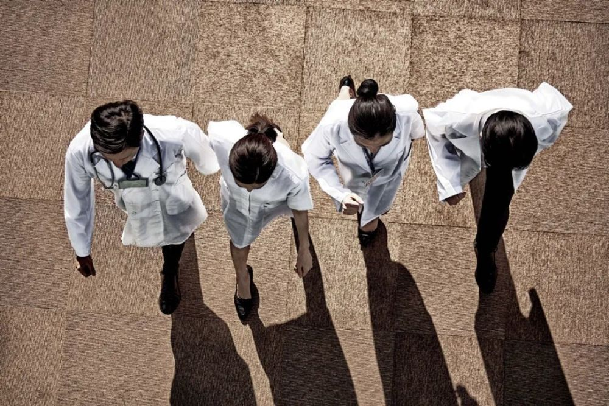

# 医疗反腐来了：39天内26名医院领导落马，院长成腐败高发群体

2月17日，四川省德阳市纪委监委官网发布消息称，绵竹市中医医院党委书记李锐被查。履历显示，李锐现年55岁，在该医院做过11年院长。同日，该官网还称，德阳市第二人民医院党委副书记、院长张德军被查。

近年来，医院领导被查的新闻屡见不鲜。如收受100套楼房、100个车位，总受贿超1.1亿元的云南省第一人民医院原院长王天朝；妄图通过“政治骗子”疏通关系逃避调查，医商勾结的江西省赣南医学院第三临床医学院（第三附属医院）原院长廖敏等。

多个案例显示，医疗系统腐败问题主要集中在药品配送、设备采购、耗材供应、工程建设等方面，医院多付出的成本会转嫁到患者和财政身上。

中国医学基金会医学临床专科发展委员会主任委员、中国卫生监督协会医疗卫生机构监管委员会副主任委员赵淳，上世纪90年代在原卫生部医院评审委员会工作过。在接受《中国新闻周刊》采访时，他表示，医疗腐败由来已久，各地也出台了一些规定，取得了一定成效，但至今屡禁不止，且腐败行为也变得越来越隐蔽，查处起来有一定难度，“近年来，被查的一些医院院长等该系统人员，多是药商或器械商捅出去的，或是因医院内部拉帮结派等原因内部举报的”。

高压震慑下，医疗系统的腐败问题因何如此顽固？

_图/视觉中国_

院长成腐败高发群体

据《中国新闻周刊》不完全统计，今年
1月9日至2月17日，在39天内，至少有26名医院领导落马，或被双开、开除党籍、批捕。他们中有19人担任过院长，7人担任过副院长。

上述26人中，有18人被查，包括山东省乐陵市人民医院原院长马润洲、湖南省桂阳县第一人民医院副院长肖军兵等；5人被双开，包括山东省滨州市第二人民医院原党委书记、原院长侯月智，四川省资阳市人民医院原副院长卿松，江西省赣南医学院第三临床医学院（第三附属医院）原院长廖敏，贵州省大方县人民医院原院长吴光明，广东省汕尾市海丰县彭湃纪念医院原院长陈文楷；2人被批捕，即贵州省印江自治县人民医院原院长冯勇、贵州省兴义市人民医院原院长杨玉林；1人被开除党籍，取消其退休待遇，涉嫌犯罪问题移送检察机关依法审查起诉，即德宏州人民医院原党委书记、原院长赵文胜。

从相关通报看，他们多涉及医商勾结问题。如“插手工程建设、医疗设备采购项目招投标活动”的侯月智、“在药品采购、资金拨付等方面谋取利益并收受财物，数额特别巨大”的卿松等。

近年来，医院中以院长为代表的领导成为腐败高发群体。据《人民日报》健康客户端不完全统计，2022年前11个月，各地共有55位医院院长、书记被查。包括首都医科大学附属北京安贞医院原院长魏永祥、山西医科大学第一医院原院长王斌全等人。

2022年，反腐片《零容忍》提到了以院长为代表的医疗系统腐败问题。片中介绍，云南省昆明医科大学第二附属医院原院长马林昆收受30多名商人财物，折合3000多万元。在该院采购大型医疗设备过程中，马向经销商收受巨额钱财。

“比较典型的一台设备是数字血管造影系统，代理商从生产商处拿到的价格是579万元，卖给医院的合同价是1170万元，相当于翻了一倍。”云南省纪委监委工作人员杨新宇说。

2021年7月，马林昆被立案审查调查。通报称其对不法药商的前呼后拥、阿谀奉承享受至极，利用手中职权，拿医疗设备、药品、耗材采购准入资格作为筹码，长期与不法药商结成利益同盟。

2018年7月13日，云南省第一人民医院原院长王天朝因受贿罪案被判处无期徒刑。经审理查明，他在医院工程建设、药品和医疗设备采购、人事任免等方面提供帮助，收受公司和个人贿赂的财物共计折合人民币1.16亿余元及美元8万元。

王天朝称，他曾收受房企老板贿赂房子100套、车位100个，价值8000多万。他还有收受医院职工贿赂20多万元，多次收受礼品、礼金150万元等违纪违法问题。

山东省医院协会原秘书长王秀华的文章《该如何从“王天朝现象”吸取教训？》称，医院院长一“长”独大，不仅医院内领导班子集体决策机制难以落实，甚至党委、纪委的监督也被严重弱化，有的甚至形同虚设。

2020年6月22日，云南省纪委监委发布的视频教育片《清风云南》提到，楚雄州中医医院原党委书记、原院长杨本雷，将巨额贿金藏匿于城郊几个大酒罐内，打开后钱款已经发霉，散发出难闻的气味。办案人员称，杨本雷在药品采购、器械采购等方面都拥有最终决定权，给谁份额多一点，设备交给哪一家来做，都由他最终拍板。

山东省一名三甲医院医生告诉《中国新闻周刊》，医疗系统门槛很高，专业性很强，院长通常是行政领导，也是业内权威专家，有很大的话语权。在缺少监督的背景下，很容易出现腐败现象。

赵淳表示，尽管有的公立医院有医疗器械委员会、药事委员会等，但书记或院长对他人的晋升提拔有重要的发言权，所以当其坚持要购入某种器械时，很少有人会提出反对意见。

王秀华表示，从短期看，必须为医院院长列出权力清单、真正实行政务公开和加强职代会等相关渠道的监督，以此来压缩甚至取消黑箱操作的空间。

贪腐手段日趋隐蔽化

多个涉及回扣的医疗腐败案例显示，这条腐败链条涉及医药公司、医药代表、医院的负责人等。

2022年3月，在中央纪委国家监委网站刊发的一个案例中，某药企驻甲县医药代表唐某为把濒临过期的药品卖出，与药企商量后，行贿医院副院长、处方医生、药房工作人员。唐某每月到甲县中心医院药房的胡某、陈某、王某处，收集每个医生所开其所销售的药品处方量，汇总后录入到EXCEL表格中，计算出给相关副院长的回扣、给开方医生的临床费和给胡某、陈某、王某等人员的统方费，然后再到药品公司财务报账。报账后他把装好钱的信封，送给相关副院长、医生和药房工作人员。

2月6日，中央纪委国家监委网站发表《严查医疗领域隐蔽利益输送》一文，提到了贺宪伟医疗腐败案的细节。贺曾任黑龙江省大兴安岭地区呼中区人民医院院长，平日里穿戴普通、开二手车、生活节俭，但大肆收受药品回扣。2014年6月，任院长半年多的贺主动联系某药企董事长何某某，双方约定在一条僻静胡同见面。贺以“不给回扣不用药”相要挟，最终商定何自当年8月起，按呼中医院在该公司采购药品总额的15％给贺回扣。贺还提出两个条件：必须是现金，必须保密，否则就不再合作。

据专案组介绍，贺案涉及十余家医药、医疗器械公司。由于犯罪行为隐蔽性强，增加了查处难度。2021年7月，当地纪委监委在查办另一起案件时，一名行贿人主动交代了向贺行贿的问题，贺的受贿网络才被捅破。

上文还提到了其他隐蔽的行贿方式。浙江省玉环市委常委，市纪委书记、监委主任黄先锋介绍，有四类隐蔽的方式，比如“定制式”招投标，指利用医学专业性强的壁垒，在医药用品、医疗仪器等招投标上，加码“定制”招投标筛选规则，变相达到与“指定”医药公司长期合作、双向受益的目的；再如“规避式”委托采购，指通过私下“合计”、幕后操控，把采购“公权”变成第三方采购代理公司的私有经营行为，既能在管理上规避违规违纪风险，又能利用委托代理费、物品差价、资金周转率等做文章；还有“供股式”入股分红，指医药企业通过隐形“供”股、研讨培训变相补贴、礼品药品无偿或低价兑现等方式，促使双方协商达成医药推销“高价协议”，形成医药回扣利益链；另有“福利式”研讨培训，指医药公司为维系利益同盟关系，变相回馈“讨好”医疗机构管理人员及医疗职工的“普惠式”“疗休养式”“感情联系式”福利。

赵淳告诉《中国新闻周刊》，一些药商在医疗行业摸爬滚打多年，深谙行贿套路。以前很多医院都贴有“禁止药商进入”的标语，但随着科技手段的升级，联系方式灵活多样，他们根本无需去医院，就能联系到医院领导。行贿方式也变得千奇百怪。

“比如，很多人当院长时都在50岁左右，这意味着再干10年左右就退休了。当药商想腐蚀院长时，在其任上不行贿，等到其退休后再行贿。这种‘期权式腐败’，也导致了查处难度。还有的对医院领导的近亲属行贿不会留下痕迹。”他说。

赵淳表示，目前，我国医疗器材的市场竞争非常激烈，重复性生产众多。比如国内彩超生产厂家就有数十家，质量相似，一些厂家就会靠行贿等手段打开市场，“哪怕是一个血压计、几块钱一包的医用纱布块等耗材进入医院，并达到一定量时，都会为暗箱提供操作空间。”

_医疗系统腐败问题主要集中在药品配送、设备采购、耗材供应、工程建设等方面。图/视觉中国_

如何破解医疗腐败难题？

改革开放以来，我国公立医院的管理制度经历了三个阶段。1982年1月，原卫生部发布《全国医院工作条例》，明确医院实行党委领导下的院长负责制。这被业内认为是改变医疗机构内党政不分现象的重要尝试。

2000年3月，中组部、原人事部、原卫生部印发《关于深化卫生事业单位人事制度改革的实施意见》，提出“卫生事业单位实行并完善院（所、站）长负责制”“要建立和完善任期目标责任制，明确院（所、站）长的责、权、利”。此后，院长处于医院的主导地位。

直到2018年6月，中共中央办公厅印发《关于加强公立医院党的建设工作的意见》，明确提出公立医院实行党委领导下的院长负责制。

强调公立医院实行党委领导下的院长负责制，赵淳表示，主因之一可能是近年来多位院长出现腐败问题，需要制约他们的权力。“值得注意的是，医疗行业的专业性非常强，腐败又具有很强的隐蔽性，会造成党委监督院长存在一定的难度。比如，医院采购器械时，如果没有十多年的临床经验，很难了解其中的门道。在这种背景下，如果党委书记医学背景偏弱，就难以有效监督院长。”

他还表示，现在还存在一个普遍现象是，院长是业务型专家，其在从医过程中，积累了丰富的人脉，这种人脉成为隐性财富，可能会导致实际权力超越党委书记。

湖南省廉政智库首席专家王明高曾在湖南省委组织部任职约20年，参与过大量干部选拔工作。他告诉《中国新闻周刊》，现在公立医院再次实行党委领导下的院长负责制是正确的，但这项制度没有很好地执行，特别是在人员选拔上，很多地方没有把最优秀的业务型专家选拔为党委书记。

他说，“比如，有的卫生局副局长，不懂业务，也缺少威信。组织部门安排其去医院做党委书记只是出于职级安排的需要（副处级晋升为正处级），类似这种人事安排变成了安置性措施，没有让党委发挥战斗堡垒的作用。”

近年来，国家和地方层面持续加大对医药购销领域和医疗服务中不正之风的整顿力度。

2020年5月，国家卫健委同公安部等八部门发布《2020年纠正医药购销领域和医疗服务中不正之风工作要点的通知》，明确严肃查处收取医药耗材企业回扣行为，制定医务人员对外交往行为规范等。

2021年11月，国家卫健委等多部门发布《医疗机构工作人员廉洁从业九项准则》，包括合法按劳取酬，不接受商业提成；恪守交往底线，不收受企业回扣等。

2022年6月，国家卫健委、工信部等九部委印发《2022年纠正医药购销领域和医疗服务中不正之风工作要点》，要求进一步加强对院内“商业贿赂”“耗材回扣”等违规行为的监管，深入开展医疗领域乱象治理，惩治“红包”、回扣等行风问题等。同月，青海启动医疗乱象专项整治行动，要求严厉打击各类违法违规执业行为。2022年8月，广西纪检监察网报道，当年以来，南宁市纪委监委从严纠治和查处违反诊疗规范、不合理用药等腐败和作风问题，共督促整改问题1100多个，清退红包、回扣等款物共60多万元。

赵淳告诉《中国新闻周刊》，要进一步治理医疗系统的腐败问题，应从多方面着手。首先，应去行政化，这有利于医院内部的公平竞争；其次，审计、纪委监委等部门要提高专业知识，行使好相关权力；再次，还要加大对院长权力的制约；最后，要提高药品、器械等价格的透明度。

“价格不透明等于信息不对称，医院就有可能投机取巧。医院采购后，要及时在网上公布品类和价格，这便于让百姓对不同医院采购的药品器材等进行对比。”他说。

发于2023.3.6总第1082期《中国新闻周刊》杂志

杂志标题：医院院长为何成为腐败高发群体

记者：周群峰

