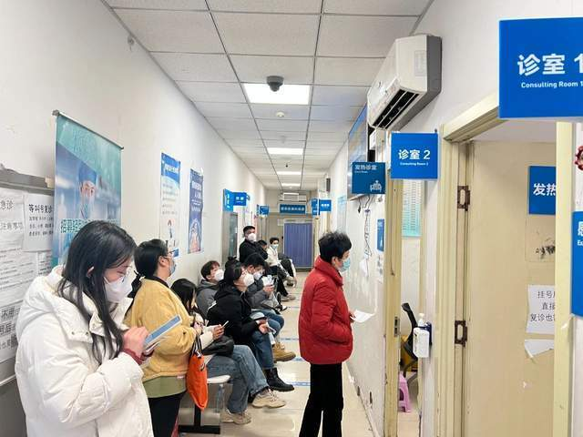
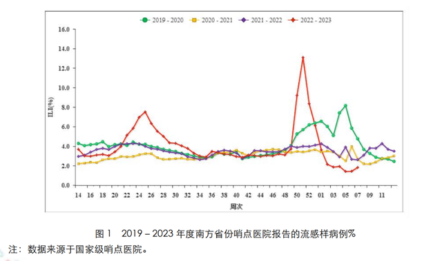
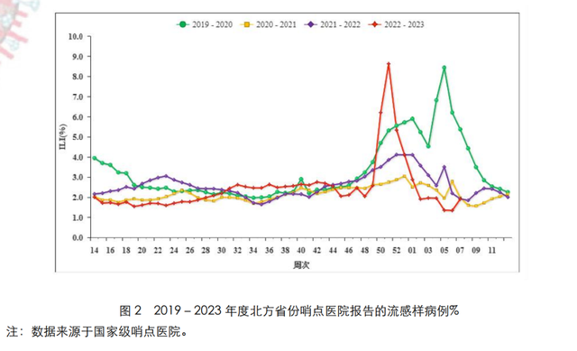

# 发烧、抢药、回到发热门诊……甲流来袭，中国流感监控欠账再暴露

北京市朝阳区一家三甲医院的发热门诊里，挂号缴费的窗口又排起了长队，还有一撮人围在分诊台附近，台子上贴着一张“甲流乙流流感检测”的告示。候诊的座位坐得满满当当，也有人在候诊室蜷缩成一团，发出持续的呻吟。

半晌，一个年轻女孩探头向发热门诊药房询问，“还有奥司他韦吗？”对面药师隔着玻璃喊到，“这儿没有了，让大夫把处方转去急诊，去急诊拿。”

医院急诊的医务人员告诉八点健闻，发热门诊的奥司他韦开得很快，没货以后只能把处方转到同为24小时开设的急诊，急诊药房还有一些备货。

不过，当急诊药房的药师听到有人询问“有没有奥司他韦”时，他头也没抬说，“赶紧去开吧，没几盒了。”这句话，他重复了两遍。

这只是当下全国甲流肆虐的一个切面，这两周来，更多城市正在或即将经历甲流高峰。

伴随着全面放开，今年冬春的流感高峰，稍稍推后出现，有别于往年。

面对大量人群甲流感染，抗病毒药物的紧缺，流感疫苗接种的挤兑，中国流感监控与预防的沉疴不得不再被提起。

两周内的猛增

仅仅两周，甲流快速席卷多地。

多地停课停学，北京、上海、浙江、四川等地均出现不同程度的群体性感染。人们挤进了医院，打光了疫苗，抢空了药房。

早上九点半，杭州市儿童医院发热门诊已挂出200多个号；晚上九点，杭州市人民医院感染科的医生还在开会，讨论如何应对这波流感。

“新冠后，儿科的接诊人数一直很少。”浙江某三甲医生说，“直到两天前，儿科的接诊人数突然增多，几乎都是来看甲流的。”

杭州市儿童医院门诊副主任赵伟告诉八点健闻，医院半个月以来每天接诊上千例发热患儿，其中约700例属于甲流。

有媒体报道，2月份以来，浙大儿院湖滨、滨江两个院区接诊甲流患儿数量呈明显上升趋势，是1月份的80倍。

在多地的社区中心，流感疫苗接种的人数都增多了，这不同往年。

“正常来说，现在流感接种时间已经结束了，我们该退苗了。但今年流感又起来了，本来流感疫苗就没剩多少，这两天打疫苗的人又突然变多。明天如果人多，疫苗就打完了。”一位社区工作人员透露。

很多社区的流感疫苗已经打完，“下周要进货，再来问问看吧。”

为缓解流感焦虑，人群再次开始囤药。一家药店的老板昨天刚进了一批货，二三十盒奥司他韦——当天到货，当天销售一空。

恐慌并非空穴来风。多位流行病学专家向八点健闻表示，当下已进入流感流行季，流感开始呈上升趋势。

据中国疾控中心发布最新《流感监测周报》显示，截至2月19日，南、北省份流感病毒检测阳性率继续上升，以H1N1为主、H3N2亚型流感病毒共同流行。南、北方省份流感样病例百分比略有上升。2023年第7周（2月13日-2月19日）共报告108起流感暴发疫情。

本周，地方疾控亦陆续公布流感流行情况。

2月27日，北京市疾控中心通报称，目前北京市季节性流感疫情活动强度呈现明显上升趋势，上周流感样病例数量较2019年同期水平上升78%，在流行的流感病毒，中甲型流感病毒占绝对优势，占比99%；2月28日，浙江省疾控中心发文称，省内多地出现学校流感暴发疫情，哨点医院流感监测结果显示流感流行强度呈现上升态势。甲流近三年未在浙江省流行，人群普遍易感。

一位中疾控人士向八点健闻透露，今日（3月2日）上午，国家流感中心将会发布最新流感周报，能看出流感样病例的数据确实开始升高。

上述中疾控人士亦表示，总体来说，近期的流感仍属于季节性流感，相比往年推迟了一些。

疫情后“报复性反弹”

新冠疫情三年后，被压制的甲流重新夺回了主权。此次来势汹汹，但相比以往又有所不同。

根据最新《流感监测周报》显示，2019年~2022年，每年的冬春季都会连续出现两个流感小高峰；在去年年底的高峰过后，从上周开始，北方省份和南方省份流感病例占门急诊病例总数都出现了回升——这意味着，第二个甲流小高峰正在路上。

中疾控原公卫专家向八点健闻表示，自疫情以来，近三年流感流行模式，都出现了“高峰后移”的情况。

不过八点健闻注意到，最近这次流感流行季（2022年~2023年）的第一个小高峰同比前两年来得更早；而第二个小高峰到来的时间，同比前两年似乎则要略晚一些。

_△
图：国家流感中心2023年第7周第740期中国流感监测周报_

_△ 图：国家流感中心2023年第7周第740期中国流感监测周报_

上述中疾控原公卫专家强调，这是一种“不寻常的流感流行模式”。由于应对新冠疫情所采取的公共卫生防护措施，导致人口流动性下降；加上新冠病毒依靠极强的感染性占据了主要的“生态位”，曾竞争性地压制了流感的传播……种种因素叠加干扰了流感的季节流行模式。

在南方科技大学公共卫生及应急管理学院流行病学教授魏晟看来，“不寻常”还体现在感染人群范围的变化上。例如，由于近几年孕妇抗体水平的降低，出生婴儿母传抗体水平下降，会导致半岁之前的婴儿感染率的上升。

他认为，流行模式的异常无需引起恐慌，因为这只是一时的，会逐渐恢复正常。“当然，重新建立起人群免疫水平和各类病原体传播之间的动态平衡需要时间，可能需要经历1-2个流行周期，但不同的疾病的情况肯定存在差异。”

但是，流感年年都来，为何今年体感尤其强烈？

病毒学专家常荣山告诉八点健闻，由于过去三年，人群普遍戴口罩，社交隔离，间断性居家隔离，导致正常状态下经常被空气中各种微生物攻击而处于警戒状态的粘膜免疫系统处于"关机″状态，可以形象的称之为“群体免疫抑制”，人群免疫力普遍下降。一名医生同样表示，虽然儿童和老人是流感的易感人群，但本次感染中成人的感染率或许不会少。“因为大家现在都没有免疫力。”

在“免疫欠债”的情况下，防控措施放开、人口流动性猛升，这使得被新冠病毒“压制”已久的流感病毒逐渐流行开来，甚至开始有超过新冠及其他流行病的趋势。

“这是这几年防控措施放开后的反弹，除了流感，还有一系列的传染病都可能出现这种反弹。”魏晟说。

新冠大流行后的甲流爆发，不只出现在中国。根据英国卫生安全局和美国疾病控制与预防中心的数据，2022年底，英美单周流感住院率即已超过新冠感染住院率。同样在新加坡，2022年9月1日~10月15日新冠感染死亡率显示，新冠XBB病死率为流感的21%~62%。

综合判断，常荣山认为，2023年流感威胁不小，需引起重视，公众应接种流感疫苗。“不然2023-2024年的季节性流感引起的公共卫生损失，程度将不会亚于上一个流行季同期的新冠。”

在常荣山看来，H1N1的“胜出”和流行只是一个开始。综合已知信息，他认为，虽然相比最近一次由甲型H1N1流感病毒引起的大流行（2009年）而言，目前的感染率不算高；但受群体免疫力下降的影响，本次流感的死亡人数或许会超过2009年的29万人(据当时美国CDC根据模型计算出的数据)，达到30-60万。不排除，未来H1N1毒株将会占据全球流行株中的90%，“这个趋势已经形成了，部分国家或地区己占到了七成以上。”

而更大的背景是：受访专家一致提及，本次的流感流行可能本身就属于全球大流行的一部分。

“2022年以来，全球的流感发病率都在上升。这个上升的过程还在持续，暂时还看不出下降的趋势。”魏晟表示。常荣山同样认为本次流感疫情处于上升期，但他预判近期的总人数峰会出现在4月中旬之前，而后回落。

多名流行病学专家认为，在全球严格防控新冠病毒时，冬季流感的活动非常弱。放开后，全球人口流动剧烈，这为全球范围内流感的大流行创造了条件。

根据WHO最新的统计数据，截至2023年2月5日，甲型流感病毒占全球主导地位，在检测到的亚型流感病毒中，甲型H1N1流感病毒的比例略高。在这些甲型流感病毒的亚型中，57.9%为H1N1毒株，42.1%为H3N2毒株。

总体而言，H1N1是目前全球主要的流行毒株，这与中国本轮流行的情况一致。

流感监控的欠账

“这是一笔糊涂账。”多名受访专家这样评价我国的流感监测工作。

据国家疾控局数据显示，2010年~2022年，我国每年流感死亡人数从个位数到百位数不等，最高是2019年的269例。

虽然我国会定期公布流感发病数及死亡人数，但专家们普遍认为，这个数据并不足够全面准确。而且学者与官方对死亡数统计口径不同，结果更是差异巨大。

复旦大学公共卫生学院余宏杰教授团队发表在《柳叶刀公共健康》杂志的文章提到，在2010年~2015年，全国平均每年有8.8万例流感相关的超额呼吸死亡，占所有呼吸死亡的8.2%。目前正流行的H1N1甲流的超额呼吸死亡率是1.6/100000人，而乙型流感是2.3/100000人，H3N2甲流则有2.6/100000人。

2019年，时任中国疾病预防控制中心传染病处呼吸道传染病室主任的冯录召曾向新华网表示，目前统计的发病和死亡人数不能完全反映流感的真实水平，获得诊断的流感患者要少于实际发病人数。同时，还涉及到流感致亡的死因归因问题。

“准确的结果需要加强对呼吸道疾病就诊病人的流感病毒检测，但当前各地检测能力和范围仍有待提高。”魏晟告诉八点健闻。

我国目前针对流感有两套监测系统，一是2003年SARS之后建立起来的全国传染病信息直报系统，二是2004年正式创建的中国流感监测网络。前者是全国通用，后者则覆盖至408家网络实验室和554家哨点医院。

一位中疾控内部人士向八点健闻透露，早在新冠之前，中疾控就开始对内建数据系统自查自清，发现很多严重问题。两套流感系统自上而下互相独立，数据不共通，互相打架，造成极大浪费。

魏晟也表示，我国现有的流感监测受监测范围和检测能力的限制，对估计流感的疾病负担仍与国际前沿存在差距。

而对两套系统的一线使用者——医生而言，流感数据需要严格上报，落实起来比较麻烦。

“和新冠相比，流感只是季节性流行病，医生不是很当回事。上报没有意义，向疾控上报任何数据都很麻烦，增加无谓的工作量。”一位来自南方沿海省份的医院大夫告诉八点健闻。

徐州医科大学附属医院呼吸科主任季磊表示，在2019年之前，流感患者大部分在门诊治疗，上报系统的不是很多。新冠疫情后，医院管理非常严格，门诊、病房都有传染病强制上报的双系统，有流感相关诊断如果不上报，页面填写便无法结束。

上述中疾控专家指出，二十年来，国家投资近10亿打造传染病检测系统。但上报系统确实有很多短板，很难说能支撑起流感防控的任务。

漏报严重，很多医院的数据报送很主观、很随意，“医生很忙、或者觉得不像是流感，就不做检验核实，或者由于患者的依从性等问题，检测出来也会有假阳性的结果，种种问题导致数据质量较低。”

监测系统的规模、准确性和灵敏度，决定着对某种传染病的认识，也极大影响着疫情预警与公卫政策的制定。这也导致虽然致死率差不多，但我国对流感的重视程度难以和新冠相提并论。

这样的认知层层传递下去，大多数民众也认为流感就是一场“感冒”而已。

接种疫苗、使用特效药，是抵抗流感病毒的公认武器。但“感冒”自然没必要接种疫苗。在我国，流感疫苗接种率常年低迷。

据中检院的公开信息，2020年度，我国流感疫苗批签发量为0.58亿剂，总体接种率不足4.2%。部分欧美国家接种率可达60%以上。

“民众有疫苗犹豫，担心副作用等问题。同时，流感疫苗属于二类疫苗，在大部分城市都需要自费，国产流感疫苗价格在100元左右，进口流感疫苗价格则是200元左右，对老百姓是一个不小的费用。”

常荣山表示，流感疫苗季节性强，每年的接种必须在流行季节之前，保护期也只有半年左右。这些都影响了我国流感疫苗的接种率；最重要的影响是，公众对每年流感疫情的了解很少，每年公布的流感死亡数据语焉不详。”

一面是疾控中心的大力宣传，一面是民众低迷的接种意愿，疫苗的供给偏差由此产生。

宏观上看，新冠疫情发生以来，我国流感疫苗接种工作的确受到了影响。中疾控传染病管理处赵宏婷等于2022年发表在《中华预防医学杂志》上的一篇论文显示，2021—2022年度，我国流感疫苗接种率由2020—2021年度的3.16%下降至2.47%，同比下降0.69%。此外，2021—2022年度，我国绝大多数人群接种率下降，下降较多的依次为医务人员等其他人群、学龄前儿童、老年人。

魏晟表示，业内专家一直呼吁，在强化新冠疫苗接种的同时，要同时加强流感疫苗接种。“能威胁老人健康的不仅仅是新冠，还有流感等呼吸道传染病。”

（史晨瑾对本文亦有贡献）

唐卓雅、张晓艺、宋昕泽丨撰稿

严雨程丨责编

**本文首发于微信公众号「八点健闻」，未经授权不得转载**

