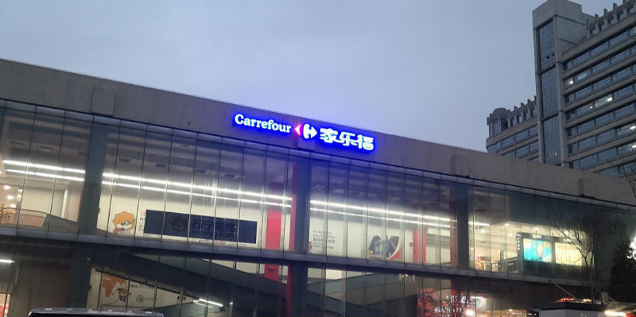
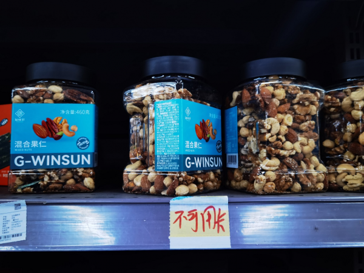
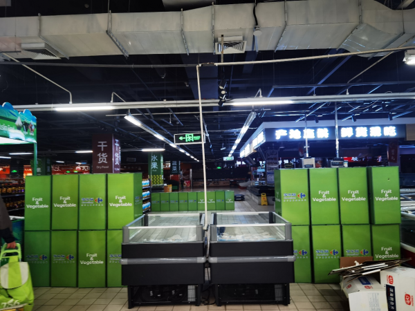
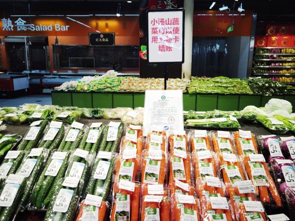
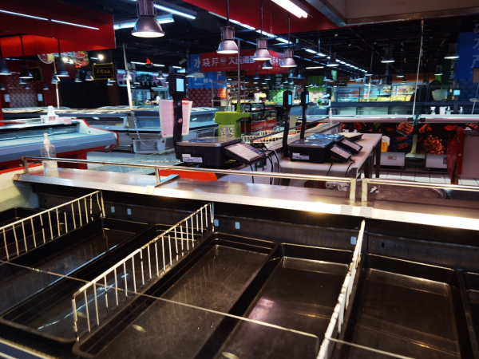
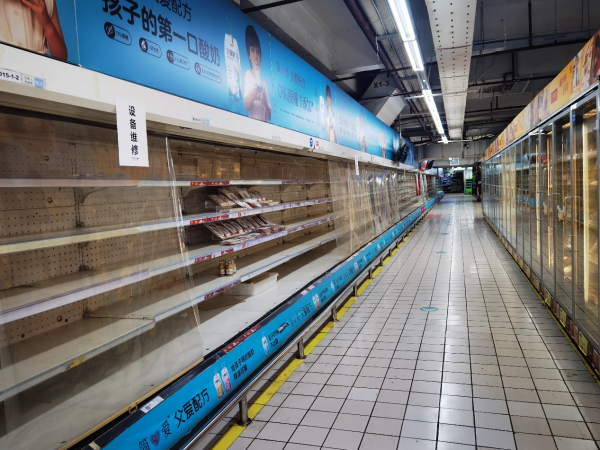

# 家乐福怎么样了？北京部分门店仍无法用购物卡，货架也已空置

**经济观察网 记者田国宝 郑淯心**

2月28日上午，在家乐福北京四元桥店收银台前，一位顾客在结账时，因无法使用购物卡与工作人员发生争执。

工作人员称，顾客购买的商品，目前无法使用购物卡，只能用现金、微信或支付宝结账。顾客坚持要用购物卡结账，双方陷入僵局。不一会儿，门店负责人出来解释，由于家乐福和供应商的系统升级无法衔接，大部分商品暂时无法使用购物卡。

这个解释没有说服顾客，激动的顾客选择了报警。

2022年10月以来，类似的场景在多个城市的家乐福重复上演，但多数无果。2月底3月初，经济观察网记者走访了北京四家家乐福门店，除极少数商品外，目前均无法使用购物卡。

限制使用购物卡背后，是家乐福中国与供应商关系的持续恶化。一位家乐福门店负责人告诉经济观察网，因为供应商调整及供应商应付账款结算不及时等原因，部分供应商和厂家停止供货，继续供货的供应商和厂家，开始限制使用购物卡。

_家乐福门店很多商品无法使用购物卡 田国宝/摄_

对于限制使用购物卡及供应商应付账款等问题，家乐福中国并没有正面回应，仅在回复中称“因挤兑导致抢购造成的供应链压力，需要一个缓冲调整的窗口期”，目前正在努力恢复供应及扩大购物卡使用范围。

**购物卡风波**

2月27日上午，在家乐福北京双井店，约一半区域处于停止运营状态，生鲜、肉类、熟食等区域完全封闭、灭灯。仍在运营的区域中，多数商品货架也已空置。

_双井店部分区域被封闭，停止销售商品
田国宝/摄_

在红酒和洋酒区，一个白纸做成的牌子上标明，进口洋酒和红酒可以使用购物卡，但超市内多数品类，导购人员会明确告诉顾客，目前不支持购物卡结账。

接近中午，购物的人并不多，部分推着购物车的顾客，在结账时听说无法使用购物卡，选择放弃购物，也有不少顾客专门过来打听什么时候恢复使用购物卡，并找工作人员理论。

一位牙膏品牌的导购人员表示，她负责销售的牙膏在处理库存，不会再新进货了，剩余的货物按原价三折销售，“比较划算，除了不能用购物卡，其他的支付方式都可以”。

同一天，在家乐福北京首体店，一对夫妇在用购物卡结账时遇到同样的阻碍，收银员称，系统升级暂时无法使用，但很快会恢复。旁边一位顾客反驳说，两个月前就没法用购物卡了，“那个时候就说很快恢复，到现在还用不了”。

家乐福首体店的客服人员告诉几位顾客，因为调整供应商，家乐福的系统在升级，供应商的系统也在升级，导致商品信息无法接入而不能使用购物卡，但顾客不太信任这个解释，要求退卡。

同四元桥店那位报警的顾客经历的一样，首体店同样无法退卡。“我们也是普通老百姓，公司上层有什么事我们也不清楚，但我得到信息就是这些”，客服人员建议顾客再等等，3月中旬或月底左右会有新的消息。

类似的情况不仅仅发生在北京门店，据上述家乐福门店负责人透露，全国门店的购物卡在使用上都存在不同程度的限制，家乐福中国使用受限制的购物卡金额有“十几亿元”，由于多是几百元到几千元的小额，牵涉的消费者数量较大，“肯定不会不管的，像石家庄完全撤出后，购物卡都给退了”。

_2月27日起，部分供应商开始恢复供货 田国宝/摄_

3月1日，在家乐福四元桥店，北京天安农业发展有限公司生产的“小汤山蔬菜”，已经有少量黄瓜、胡萝卜、菜花、芹菜、洋葱和上海青恢复供应，也可以使用购物卡。超市工作人员表示，已经恢复供应三天了，将陆续有更多商品恢复供货。

**供应链冲击**

经济观察网走访北京双井、首体、创益佳和四元桥等四家家乐福门店，情况相差无几，除了部分方便食品、饮料、白酒、牛奶、调味品、卷纸等品类外，大部分食用类商品处于停止运营或无货状态。

以水果和蔬菜为例，四元桥店除了小汤山蔬菜外，还有橙子、梨、橘子、柚子和香蕉等少量水果，但多数时候没有工作人员称斤；其他三家门店只有零星易存放的余货。

_首体店水果和蔬菜区域大部分处于空置状态 田国宝/摄_

一位低温食品供应商告诉经济观察网，从2022年6月开始，家乐福超市就完全停付了货款，导致他所在企业接近破产，无法给员工发工资，“很多人都走了，不走的，暂时也拿不到工资，都拖大半年了”。

虽然拖欠供货款长达9个月了，但该供应商仍在持续供货，只是在数量上减少了很多。

一位新消费品牌供应商表示，家乐福付款周期一般为60天，但已经有大半年没有付款了，他们已经停止给家乐福供货，目前正在想办法将剩余的货款结算完。

另一位品牌商表示也已经停供，是否恢复供应还需要进行风险评估。

_创益佳店低温奶区域大部分已经空置 田国宝/摄1_

对于为何拖欠供应商货款，前述门店负责人及多位供应商均表示，家乐福门店收银款项被大股东苏宁易购划走，导致家乐福没有钱为供应商结账，也导致购物卡无法使用。

对此，家乐福中国方面表示收银资金被大股东挪用说法不实，但并没有解释拖欠供应商货款的原因。

上述家乐福门店负责人告诉经济观察网，2022年上半年，北京多数门店陆续停发员工工资，并暂停为员工缴纳社保，家乐福多个门店的员工证实了这一说法，有的员工社保断缴近一年。

该负责人透露，目前家乐福中国方面还在和部分供应商沟通，初步解决措施是，供应商先恢复供货，家乐福为恢复供货的供应商按比例结算拖欠的货款，但最终比例暂未确定。

目前，家乐福门店正在做进一步调整，调整完成后，供应商也将完成一次洗牌，一位家乐福人士表示，最快将在3月中旬出来结果。

一些被拖欠货款的供应商和厂家，已经将家乐福推上了被告席，涉及旺旺、好丽友、高露洁、老才臣、尤妮佳、洁柔、班尼路等多个品牌，旺旺食品等厂家已经申请对家乐福进行财产保全。

**背水一战**

从家乐福创益佳店一楼，顺着已经停运的电梯到二楼非食品区，映入眼帘的是一片狼藉，十几名工人正将货架拆开，并运至一旁整齐码好，还没来得及拆掉的货架上依稀可见“卷纸”、“洗衣液”等字样。

_正在改造的创益佳店二楼
田国宝/摄_

偌大的二层空间，除了一小块地方还有苏宁易购电器品牌在运营，90%的区域已经成为施工区。据工作人员介绍，未来这里重新改造后，将变成苏宁易购融合家乐福中国所形成的的2.0版店面。

2019年苏宁易购以48亿元收购家乐福中国80%股权后，两家定位、业态和客群不同的公司开始探索业务上的协同和融合，主要形式是在家乐福开设苏宁易购店，即苏宁易购所称的店中店。

彼时，无论是苏宁和国美为首的家电卖场，还是物美、家乐福、永辉、沃尔玛为首的大型超市，抑或是新世界为首的传统百货，都受到了电商和新型商业形态的严重冲击。

从2019年至2022年三季度末，家乐福中国门店数量从233家减少至151家，其中仅2022年前三季度闭店数量就达到54家；同期，永辉关闭了近400家店，物美大卖场数量有少量增加，但便利店关店数量超过百家。

上述家乐福门店负责人表示，大型超市卖场崛起的过程中，参与竞争的商家优先考虑的是以门店数量和门店面积为代表的规模，而忽视门店坪效和单店盈利能力，加上新业态出现带来冲击，传统超市已经走到拐点。

而且，在房地产蓬勃发展的年代，一些商业地产的业主方也给超市这一“流量明星”开出优厚的招商条件，“起码有三年到五年的免租期，还有五到十年的减租期，装修也是业主方负责，所以那个时候怎么都能赚钱”，该人士表示。

彼时，北京一个家乐福门店店长的月薪可以超过5万元，成为人人艳羡的职业；供应商和厂家更是将打入家乐福供应链视为企业品牌成功的标志。

但时过境迁，当业主方的红利吃尽后，店面租金是商超巨大的成本压力，提高店面的使用效率成为各家商超降低成本的重要途径，包括物美等大型超市在内，都陆续将店面面积缩小至2000-3000平方米左右。

_有家乐福的地方，多数有苏宁易购作为店中店
田国宝/摄_

家乐福也在寻找出路，在2023年春季部署会上，家乐福明确了“近场零售服务商”的定位，以及基于“家庭场景解决方案”的线上线下多业态融合模式，并计划推出“社区品质生活中心2.0”门店。

2.0门店将在超市业态的基础上，进一步拓展家电、百货、儿童、酒水、餐饮等业态，并将苏宁易购业态和家乐福业态融合到其中，目前部分店面已经开始改造，预计最早3月底可以开业第一家2.0门店。

按照上述家乐福人士描述，原来模式下，超市是流量主体，其他诸如理发、培训、儿童游乐等主要利用超市流量，这也超市招商的主要筹码；2.0版本门店下，各业态之间是一个相互引流的关系，甚至是其他业态为超市引流。

此外，在原有4家位于上海的会员店基础上，家乐福中国还计划进一步拓展会员店。2021年10月，时任家乐福中国CEO田睿曾告诉经济观察网，计划在三年内将会员店做到100家。

无论是正在改造的2.0版本店面，还是会员店，这些调整和改变是否能解决供应商的欠款，能否让家乐福中国重新恢复生机，还有待时间进一步验证。

