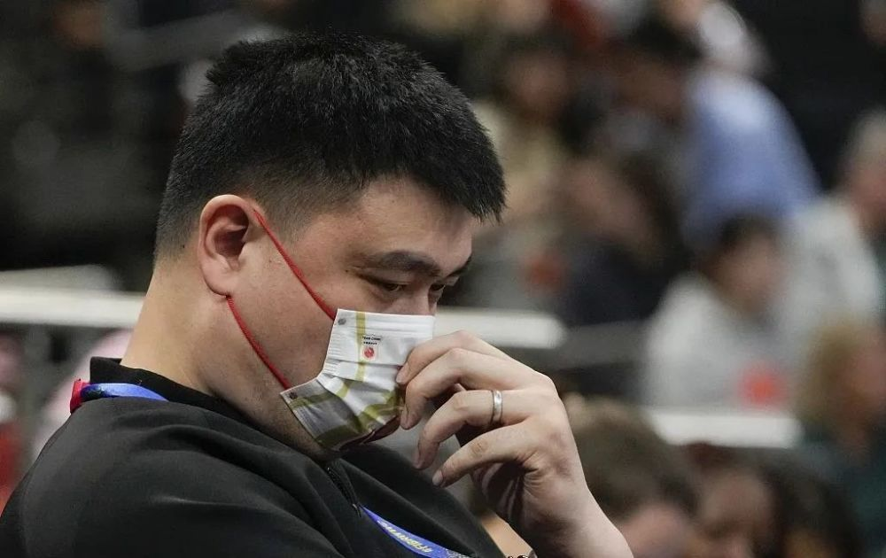

# 新疆男篮退赛折射联赛困局：“单给周琦的钱，够小俱乐部一两年运营”

_来源：视觉中国_

作者 | 郭菲菲

编辑 | 杨布丁

出品 | 棱镜·腾讯小满工作室

在中国男篮锁定世界杯参赛资格，20支CBA俱乐部时隔三年开放现场观赛的前夜，围绕周琦这位男篮头牌球员的转会纷争，新疆广汇男篮俱乐部突然宣布退出本赛季比赛，以及CBA联盟，并直接将矛头对准了中国篮协主席姚明。

2月28日深夜，新疆男篮公开发文，针对篮协认定违规注册的处罚决定，俱乐部认为处罚违背事实，毫无依据，并强调自身资金往来合法合规，按时足额向教练及球员付薪。与此同时，其还直指处罚祸根在于篮协“管办不分离”，并暗指姚明与某家体育公司关系过密。

对于与周琦的合同纠纷，新疆男篮则称，联盟限薪前，两个赛季合计支付予周琦约4951万元，绝不存在“阴阳合同”问题，周琦执着离开，“完全是巨大的利益驱使”。

随后，事件当事人周琦发微博长文，首次解释“违规注册”原委。周琦称，新疆男篮利用注册在霍尔果斯的俱乐部关联公司，蒙混过关，违规获取CBA公司准入，并拖欠自己部分胜场费用。

双方各执一词之际，作为CBA联赛的主办方，也是此次纷争的核心一方，中国篮球协会至今尚未公开发声。

3月1日上午，身为篮协主席的姚明，如约出席了在北京举行的篮协技战术服务平台发布会。

对于新疆男篮退出CBA一事，在会后接受央广网采访时，姚明表示，“老实说，新疆俱乐部其实对中国篮球的过去20年作出巨大的贡献，我们尊重他的决定，而且表示遗憾。我们现在的工作是全力以赴打联赛，把比赛带回到球迷的身边，这是我们第一要务。同时我们也会在现有的程序条件下，去解决好一切后续的工作。”

此番言辞，意味着新疆男篮退出联赛一事并未有太多缓和的余地。

“最难的三年都过去了，百废待兴，联赛马上迎来春天了，却闹出这样的事。”一位CBA俱乐部负责人对作者感慨称，姚明自己在内部经常说，要建立符合国情的职业联赛体系，在改革过程中，我们要摸着石头过河，允许试错。“那既然协会都可以试错，为什么不允许俱乐部试错，没必要像现在这样搞得你死我活。”

3月1日晚间，新疆男篮对阵北京首钢，这原本是他们时隔三年首次回归主场参赛。但这场比赛最终没有如期上演，他们甚至没来得及在新主场奥体中心亮相。

**周琦合同引发注册违规争议**

这件震惊体育圈的纷争，最早始于六年前。彼时，辽宁青训出身、时年18岁的周琦，在重金吸引下，转头与新疆男篮签下一份“4+2”的合同，即4年合约到期后，新疆拥有2年的优先签约权。

在帮助新疆队拿到2016-2017赛季总冠军后，2017年，篮协为周琦开具澄清信，证明他与新疆队并无雇佣合同关系，周琦得以远赴NBA休斯顿火箭队，但其在美国赛场表现不佳，2018年被球队裁掉。

2019年回国时，周琦不愿为新疆队效力，但最终经中篮联（北京）有限公司（即CBA公司）确认，新疆队拥有对周琦的优先续约权，周琦与俱乐部签约两年。双方合约在2021年7月到期后，按照新修订的联赛合同，新疆队拥有对周琦的D类顶薪合同的独家签约权。

但周琦一方并不认同，希望恢复自由身，并向CBA公司上诉，申请仲裁，同时举报了新疆队存在参赛单位主体混同、违反工资帽规定的问题，但最终无果。无奈之下，周琦宣布退出CBA联赛，远赴澳大利亚篮球联赛打球。征战一个半赛季后，2022年12月，东南墨尔本凤凰队宣布，周琦因家庭因素返回中国。

2023年2月17日，篮协下发处罚通知，就周琦提出新疆广汇涉及违规情况，认定俱乐部未经注册机构批准，将其实际运营、管理等核心业务转由非注册主体之关联公司开展；在组织机构、财务管理、业务经营、俱乐部注册和准入等方面，俱乐部与其关联公司存在人格混同；提交的准入评估文件（2019-2020、2020-2021和2021-2022赛季）中，混入具名为其关联公司文件等，处罚为限制其一年内注册新运动员。

关于此事，周琦一方解释更为详细——2019年8月，广汇俱乐部用一家名为“新疆广汇职业篮球俱乐部有限公司”作为主体，与包括他在内的球员签订球员合同，这家公司在霍尔果斯注册，其名称与广汇俱乐部参赛主体“新疆广汇篮球俱乐部有限公司”仅有两字之差。前者可以享受到企业所得税减免和个人所得税补贴政策。

周琦称，俱乐部拿着两家公司主体盖章的两份合同，一份用于办理在中国篮协办理CBA球员注册，另一份用于与CBA公司签署参赛协议、发劳务报酬、享受税收优惠，办理纳税登记等等。“由于广汇俱乐部的蒙混过关，在新疆广汇没有产生实际经营，违规的情况下，仍然获得了CBA公司的准入。”

对此，新疆男篮声明中解释称，2019年7月，为支持新疆文体事业发展，应赞助商所在地可克达拉市要求，经报CBA联盟知情无异议，其在当地注册成立了新公司（2019年至今累计缴纳税费9605.82万元），并授权委托其开展发放薪酬等工作。此后，CBA联盟与该公司签订了参赛协议，并向其支付了参赛费用。2019年8月，俱乐部申请变更参赛主体，后因疫情原因流程中断，继续以原主体参加比赛。自始至终，俱乐部参赛主体只有新疆广汇篮球俱乐部，没有任何违法违规行为。

新疆男篮称，篮协作为监督方、CBA联盟作为主办方均在严格准入审核后对我俱乐部的参赛资格予以确认。在连续3个赛季完成注册准入并完赛的情况下，篮协竟以“注册违规”为由对我俱乐部实施处罚，让人匪夷所思。

**处罚落地在世界杯前夜**

对于此次篮协依据的《中国篮球协会纪律准则和处罚规定》第7条、第59条和第69条，以及《篮协注册管理办法》第165条处罚规定，新疆男篮也质疑称，“毫无依据”，仅为模糊、没有明确限定的“兜底条款、口袋条款”。

作者查询发现，上述165条规定，“对职业俱乐部、专业运动队、教练员和运动员违反本办法的其他行为,篮协给予取消注册资格、禁止参赛等处罚”，这其中并未明确提及“注册违规”的行为。

不过，根据纪律准则和处罚规定第59条规定，“注册单位如违反《注册管理办法》有关规
定，提供注册信息不一致、不真实、不完整、不准确，出现虚报年龄、阴阳合同、瞒报变更注册申请等，视情况给予违规注册单位警告、通报批评、核减竞赛经费、取消注册资格直至限制转会和引进外籍运动员的处罚。”

多位熟悉CBA联赛的业内人士告诉作者，类似新疆男篮的这种情况在联赛并不少见，也很难评价对与错，毕竟没有出现阴阳合同、欠薪之类，只不过这一次，周琦的经纪团队挑明了联赛俱乐部潜规则漏洞，打破了江湖规矩，并举报给篮协，篮协不管不行了，也希望借此让其他俱乐部收敛。

选择此时处罚的时机点也颇为微妙。上述多位人士认为，周琦2019年从NBA回国时，没赶上CBA联赛，导致其在当年的本土世界杯上状态一般，其后男篮也首次缺席了奥运会。2023年世界杯即将在今年8月开战，现在这个节骨眼下，作为国家队头牌球员，背负巨大压力的篮协也在帮助周琦恢复自由身、打得上比赛，所以动作难免有点“变形”。

篮球评论员苏群也撰文指出，体育总局新任局长高志丹，把任内的努力目标对准三大球，振兴篮足排，今年的篮球世界杯是重中之重，世界杯小组出线成为必须完成的任务，而偏偏在这关键时刻，中国男篮的顶梁柱周琦没球可打。

在篮协处罚下发的同时，新华社援引篮协相关人士解读称，处罚决定意味着新疆广汇在处罚期内失去了行使对周琦的独家签约权的资格，因此周琦将能够以“自由身”加盟其他CBA俱乐部。

与此同时，《人民日报》报道称，中篮联公司与新疆广汇及其关联公司发生资金往来，双方均违反中国篮协注册、赛事准入等管理制度及《CBA联赛办赛权授权协议》，违反相关财务、税收等管理规定。中国篮协将对中篮联公司作进一步处理。

**新疆队矛头对准姚明**

除了质疑此次处罚外，新疆男篮还将矛盾指向篮协，称篮协“管办不分”也是目前中国篮球各种乱象的根源。

“篮协主席和CBA联盟董事长均由姚明1人担任。篮协的管理职能与CBA联盟的办赛业务交叉混同。CBA联盟的中间业务高度集中，包括教练员资格培训、经纪人资质认定、青少年篮球赛事、经纪人、赞助商业务，均由某家体育管理公司大量承揽，甚至独家承办。”新疆男篮指出。

作者了解到，新疆广汇暗指的公司，应为众辉国际体育管理有限公司，这是以姚明个人的经纪管理团队
——“姚之队”为底蕴的国际体育营销管理公司，曾先后代理包括姚明、丁俊晖、易建联、林丹等顶级运动员。

此前《中国新闻周刊》报道也称，向业内多番确认，这家公司名为众辉体育，成立于2004年，姚明本人就是创始人。

天眼查显示，姚明曾为公司股东及董事，在2017年2月当选中国篮协主席后，他退出公司。“姚之队”的创始成员之一、姚明的中方经纪人陆浩，随即成为公司实控人，目前持股57.5%。

公司官网显示，众辉体育的商业案例包括，中国人寿成为CBA联赛官方主赞助商、中国人寿赞助男篮国家队和2019年篮球世界杯；2017年获得体育总局授权，成为体育经纪人等级培训授权机构；2018年、2020年获得中国篮协授权，分别开展E级教练员培训、D级教练员培训业务；在体育总局青少司、篮协等支持下，创办NYBO青少年篮球公开赛等。

对于新疆广汇一方的说法，众辉体育董事长陆浩暂未回复作者的问询。

篮球解说员杨毅此前曾透露，“姚明做篮协主席做出了巨大牺牲。中国人寿本来是姚明自己个人的赞助商，他把个人的赞助商挪到了CBA。”

2016年，作为牵头人，时任上海东方俱乐部投资人的姚明，筹备成立中职联篮球公司，希望接手CBA联赛，20家俱乐部中有18家参与其中。这一“揭竿而起”的举动，还一度与篮协闹得不可开交。

与此同时，中篮联（北京）体育有限公司（即CBA公司）也随后成立。这其中，篮协占股30%，其余20家CBA俱乐部各占股3.5%，时任体育总局篮管中心副主任李金生担任董事长。

转折点发生在2017年。在姚明获任篮协主席后，篮协从CBA公司撤资，全部交由20家俱乐部持股，每家持股5%，姚明也兼任公司董事长。

作为管办分离的重要一步，篮协随即将CBA联赛的竞赛权和商务权均授予CBA公司，后者将独立运营CBA联赛的竞赛和商务两大职权，篮协履行监管、指导和服务职责。

**俱乐部常年亏损怪圈难解**

新疆广汇男篮退出CBA，背后也折射出疫情冲击下，联赛影响力和商业价值回落的困境。与中超联赛类似，20支联赛俱乐部也常年亏损，多依赖背后的母公司日常输血维系运营。

新疆男篮背后的投资者为新疆广汇实业投资集团，也是当地最大的民营企业。

根据全国工商联发布的2022年500强民企榜单统计，广汇集团营收达到2032亿元，排名29位。官网资料显示，集团拥有广汇能源、广汇汽车、广汇宝信、广汇物流、合金投资5家上市公司，实控人为孙广信。在《2022年胡润百富榜》中，60岁的孙广信以430亿元的身价排名第110名。

此前，为了冲刺冠军，新疆重金挖来了包括蒋兴权、阿的江、李秋平等教练，以及巴特尔、唐正东、张庆鹏等国手，一度引领联赛重金引援的风潮。

为避免金元篮球，引导俱乐部可持续发展，在姚明2017年上任篮协主席后，出台了限薪令，俱乐部还享有球员的顶薪续约权。比如2022-2023赛季，俱乐部本土球员整体工资帽上限为4400万元，下限则下调至1400万元，单个本土球员顶薪从最初的税前800万元，下降至600万元。

相比于动辄数千万的薪资，600万元的顶薪，对于周琦这类顶尖球员来说降幅巨大。

按照新疆男篮说法，俱乐部成立24年来，累计投入23.1亿元，累计赢得CBA总冠军1次、亚军5次。以球员周琦为例，2019-2020、2020-2021两个赛季（即CBA联盟限薪之前），俱乐部合计为周琦支付各项费用4951万元，其中包括固定薪酬3988万元，以及胜场费、购买营养品等个人开销费用合计962万元。

“周琦如此执着离开我俱乐部，完全是巨大的利益驱使。如其成为自由球员，签字费等个人收入将十分惊人。”新疆男篮表示。

一位CBA俱乐部负责人告诉作者，广汇的投入在联赛中已算头部，单支付给周琦近5000万元的钱，已经够小俱乐部一两年的运营费用。更重要的是，联赛成立运营那么多年，依然没有改变俱乐部常年亏损的怪圈，疫情三年又没了门票收入，亏损更多。

以仅有的两家在新三板上市的CBA俱乐部举例，2021年，江苏同曦篮球和广州龙狮篮球的亏损分别为2433万元、1605万元。在营收占比中，门票收入几乎归零的情况下，来自CBA公司的分红分别达到2286万元、2527万元，分别占比67%、35%。

相比于新疆、上海、辽宁等联赛头部球队，上述两家俱乐部均为中小球会，每年投入并不大。即便如此，教练员、球员被欠薪的情况也开始出现，这其中就包括广州龙狮、四川金强、山东西王男篮等俱乐部。

