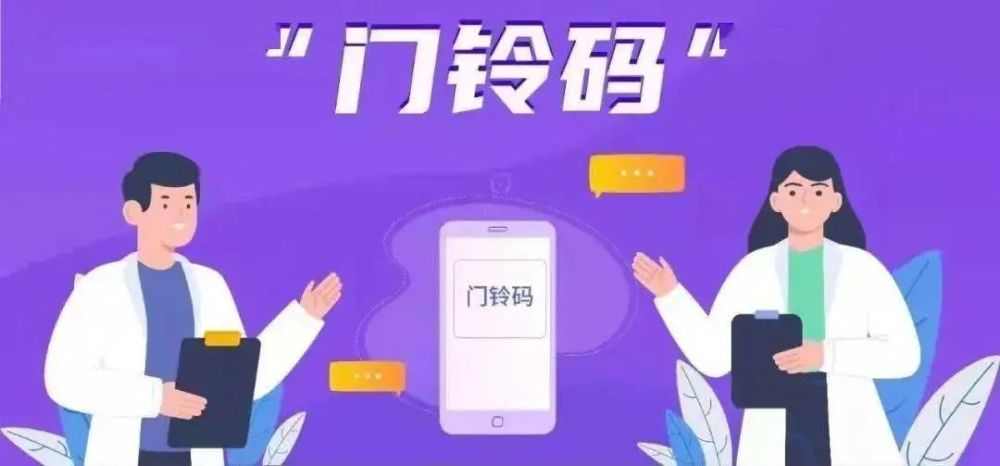
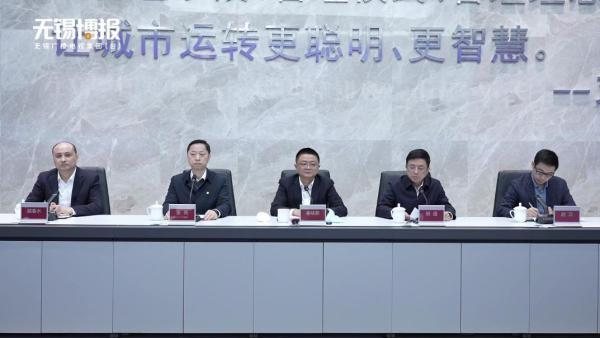
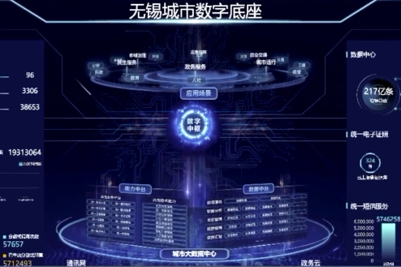

# 无锡下线门铃码等“数字防疫”应用，首批10亿条涉疫个人数据全部销毁

如今，疫情防控已平稳进入“乙类乙管”常态化防控阶段。

3月2日，无锡市举行涉疫个人数据销毁仪式。首批销毁数据10亿条，为确保数据彻底销毁、无法还原，邀请了第三方审计和公证处参与工作。

至此，无锡市第一批涉疫个人数据实现成功销毁，全力保障了公民个人数据安全。

同时，门铃码、疫查通、货运通行证等“数字防疫”40多项应用，今天功成身退，陆续下线。

**“数字防疫”**

无锡市“数字防疫”服务上线以来，始终坚持以人民为中心，发挥数据在科学决策、精准施策中的重要作用。共搜集了10亿条个人数据，主要用于核酸筛查、流调溯源、外防输入性疫情、重点人群核酸检测等用途，通过不断创新数字防疫战法，推动疫情数据共享、开放利用，为确保疫情防控顺利进行提供坚实的数据支撑。

同时，采取有效的技术和管理措施，依法依规保障了个人信息安全，未发生任何数据泄露事件，获评省委网信办“2022年个人信息保护优秀实践案例”。

此次，无锡在全国地级市中率先销毁涉疫公民个人数据，体现了“以人民为中心”的治数理念。

“此次销毁涉疫个人数据，一是体现了依法执政理念，依法依规删除目的已经实现的数据；二是保护了公民隐私，防止数字时代公民个人信息被盗用或滥用；三是防止了数据泄露，通过数据彻底销毁减少数据泄露的可能性；四是节约了存储空间，进一步提高存储效率。”

下一步，城市大数据中心将进一步加强数据分类分级管理，数据安全风险评估、监测预警、数据安全审查等制度建设，确保数据无法被恢复。同时持续加强对技术运维人员的安全教育，加强数据安全合规理念，提升全员数据安全意识，严格禁止私下留存、转移涉疫数据等行为，全力保障公民个人隐私。

数据要素是数字经济深化发展的核心引擎，保护个人数据安全是维护社会稳定和人民幸福的必然要求。无锡市将继续坚持数据安全和隐私保护原则，加强数据资源整合、安全保护、开发利用，利用数据快速应对处置，有效提升社会治理能力现代化水平，守护城市安宁、保障人民幸福。

（平安无锡）

