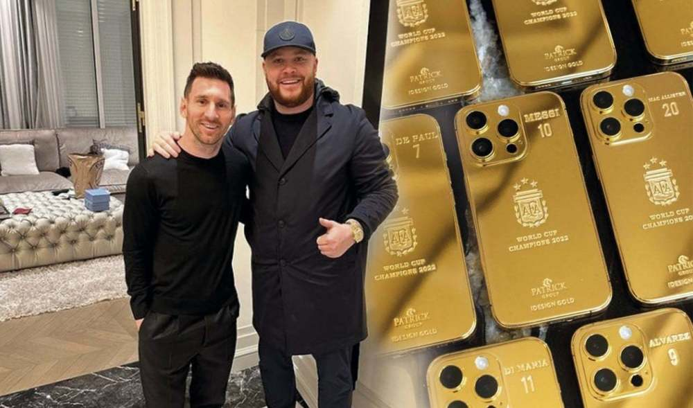
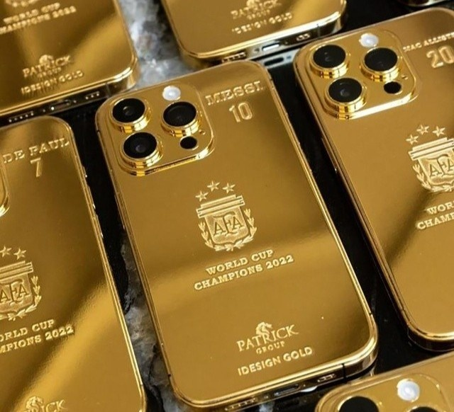
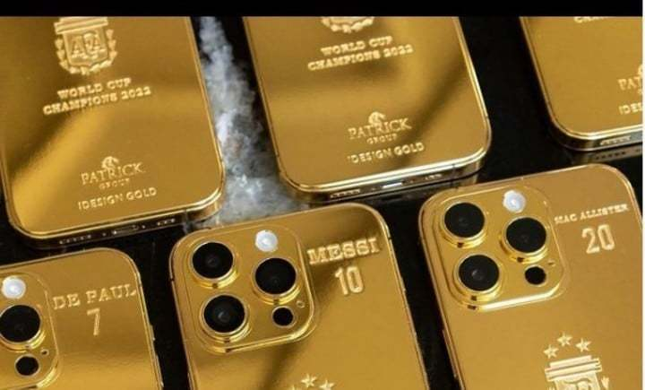
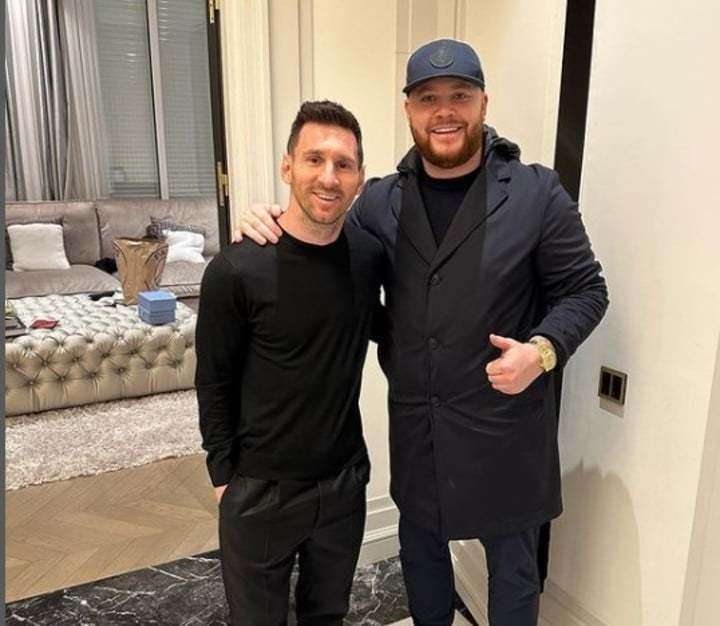
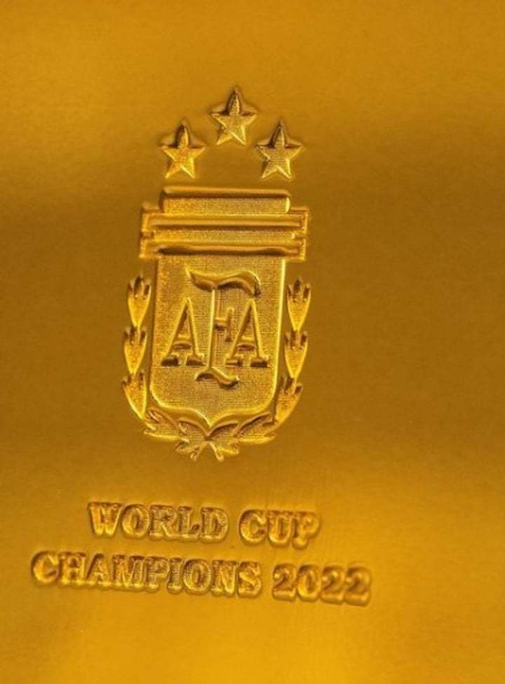
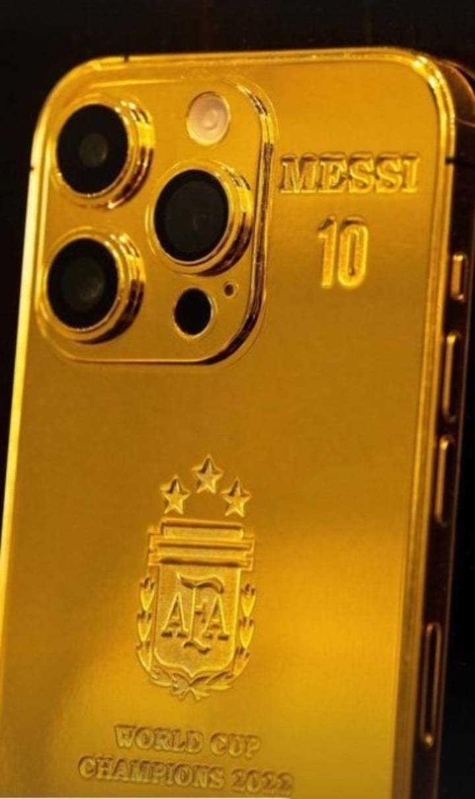
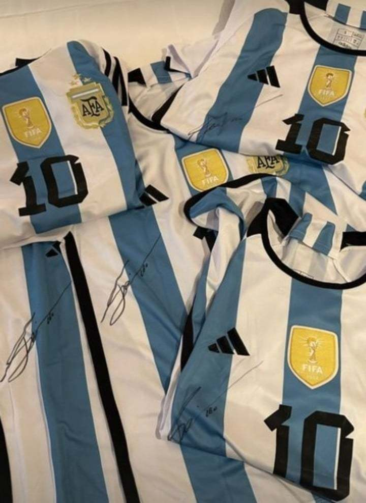

# 梅西送队友黄金手机？真相来了：赞助商转赠，单价3000欧元

周四，多家媒体透露梅西购买了35部金色手机送给自己的阿根廷队友和工作人员。随后，《奥莱报》以及阿根廷跟队记者埃杜都进行了辟谣，本杰明-
莱昂斯拥有的手机定制公司制作了这批手机，并且委托梅西将手机赠送给阿根廷球员。

包括《太阳报》在内的众多媒体透露，梅西耗资17.5万英镑定制了35部金色手机，送给国家队队友以及工作人员，每一部手机上都印有名字、号码和阿根廷国家队的标志。

埃杜透露，“为阿根廷国家队购买金色手机的是一位商人。不是梅西，他也没有花这么多钱。”

《奥莱报》详细透露，本杰明-莱昂斯是是一家手机定制公司的老板，而且经常与球星合作。2022年7月，他曾经展示过梅西订做的金色手机。

在阿根廷夺冠之后，莱昂斯特意订做了35部金色手机，并且前往巴黎将这批手机送给梅西，然后让梅西转赠给他的国家队队友。该公司网站的页面显示，手机的定制价格为3000欧元。

阿根廷将在3月迎来两场热身赛，分别对阵巴拿马、库拉索，梅西届时将把这批手机送给队友。

