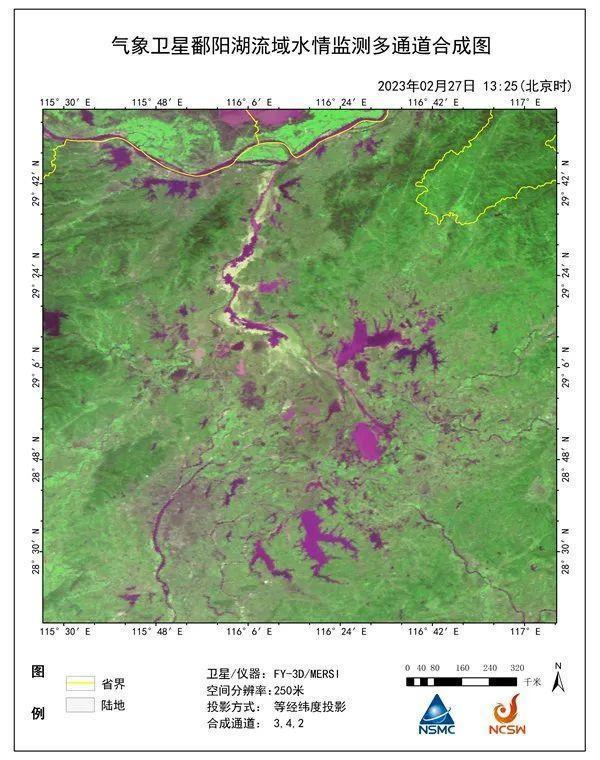
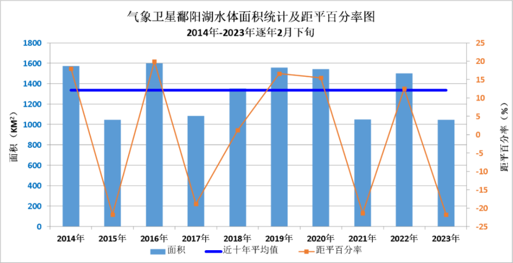
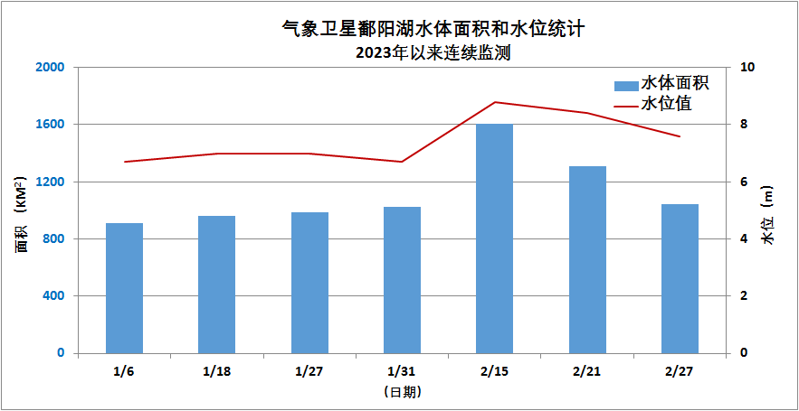
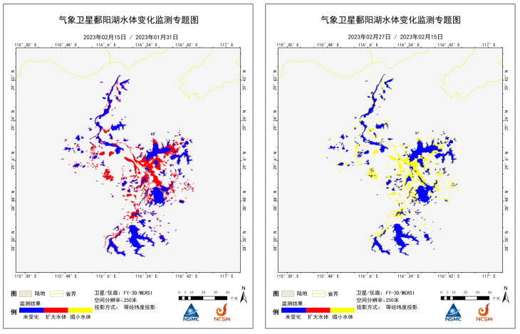

# 水体面积“缩水”至近10年同期最小 鄱阳湖怎么又“枯”了？

鄱阳湖又枯了？作为中国最大淡水湖，鄱阳湖水位波动引发热议。继去年9月后，星子站等站点水位近期再度跌破8米极枯线，枯水蓝色预警启动。然而，今年2月初南方雨水几乎天天“打卡”，为何鄱阳湖又枯了？近年来，鄱阳湖水体面积发生了什么变化？

**鄱阳湖再度“瘦身”**

**水体面积缩小至近十年来最小**

2月下旬以来，鄱阳湖水位持续走低。据江西省水文监测中心消息，2月27日8时，鄱阳湖星子站水位跌至7.9米，低于8米极枯水位线，发布枯水蓝色预警。

卫星鄱阳湖监测图（来源：国家卫星气象中心）

从卫星图上看，鄱阳湖近期“瘦身”明显，水体面积达到了近10年来同期面积最小值。国家卫星气象中心FY-3D气象卫星监测显示，
**2月27日，鄱阳湖水体面积约1044平方公里，鄱阳湖水体面积较近十年同期平均值相比减小了约21.8%，与去年同期相比，水体面积缩小了约30.5%，达到近10年来同期面积最小值。**

气象卫星鄱阳湖水体面积逐年同期统计及距平百分率图（2014年-2023年逐年2月下旬）

今年1月以来，鄱阳湖水体面积和水位持续在低位徘徊，但2月15日监测到其水体面积明显变大，较1月31日水体面积增大了约57%；不过进入2月中下旬之后，鄱阳湖水位出现持续下降，水体面积“缩水”明显，2月27日水体面积较2月15日水体面积缩小了约35%。

气象卫星鄱阳湖水体面积统计（来源：国家卫星气象中心）

气象卫星鄱阳湖水体变化监测专题图，左：2023年02月15日对比2023年01月31日），右：2023年02月27日对比2023年02月15日（来源：国家卫星气象中心）

**2月降水难缓鄱阳湖水位走低**

**未来一周江西降水依然偏少**

去年夏季，长江流域遭遇高温干旱，9月份我国第一大淡水湖鄱阳湖的水域面积创下了历史新低，“缩水”了8成左右，部分河段甚至干涸，水位一度跌破7.1米，为70余年来最低。

今年2月上旬，我国雨雪天气频繁，江南、华南等地几乎阴雨天天见，2月3日至13日，江西全省遭遇持续降雨过程，受降雨影响，鄱阳湖水位11日突破8米极枯水位线。在此期间，鄱阳湖星子站水位上涨约2.5米，江西省水文干旱基本解除。

“虽然今年2月份降水较1月明显增多，但是降水量跟汛期比还是有限，加上鄱阳湖的来水除了受降水影响，还会受到上游来水等因素影响。”中国天气网气象分析师石妍解释，鄱阳湖在2月下旬出现水位持续走低现象，也跟江西五河来水减少及长江干流水位转退有一定关系。

根据预报，未来一周，江西仍以晴或多云的天气为主，气温持续偏高，降水相比常年同期明显偏少。水文部门分析，鄱阳湖水位还将持续走低，沿岸相关单位和公众需继续做好各项低水位应对工作。

来源：央视新闻

