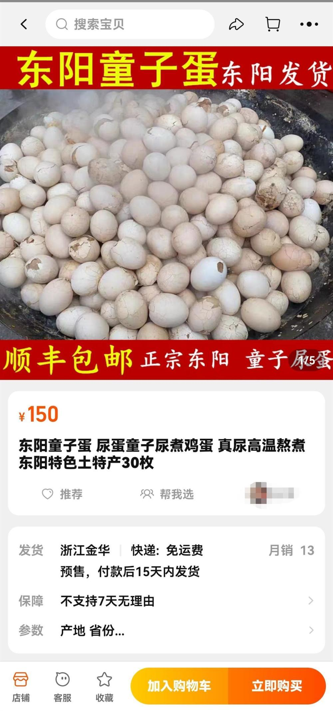

# 浙江东阳“童子尿煮蛋”公开网售：当地人称能防中暑，有幼儿园特意存尿

极目新闻记者 肖名远 张奇

从幼儿园收集男童尿液，煮鸡蛋在网上出售几元钱一个，还说能预防中暑，近日，浙江东阳市一女子发布的视频引发关注。在评论区，有网友描述这种“童子蛋”的味道，也有网友表示无法接受。

极目新闻记者从东阳当地了解到，当地确有春季用童子尿煮鸡蛋的习俗，有人在街边或店里售卖，为此还有人专门从幼儿园收集男童尿液。“童子蛋”早在2008年就被列入东阳市非物质文化遗产名录，当地非遗保护中心相关负责人表示，这是东阳人传统的生活习俗，并不是蒙昧落后现象。但多名医生分析称，无论童子尿还是成人尿液都只是排泄物，没有什么营养成分和药效成分，长期食用可能对人体有害。

_东阳女子用童子尿煮鸡蛋（网络视频截图）_

**东阳女子网售“童子尿煮鸡蛋”**

近日，金华东阳市一女子发布了用童子尿煮鸡蛋的视频，她称这种煮好的“童子蛋”可以直接吃，这是东阳当地的一个传统。相关视频经媒体转发后引发热议，多数网友称没有见过这一吃法，并表示绝不会吃这种用尿液煮成的鸡蛋。

极目新闻记者注意到，该女子早在2021年就发布过“童子蛋”的制作视频，并通过社交账号宣传售卖。视频显示，制作者将一桶黄色液体倒入装好鸡蛋的锅中，液体表面明显可见泡沫。其视频下的留言中，不少人表达了想要购买之意，还有人分享自己吃这种鸡蛋的经历和感受；但也有大量网友表示无法接受。

3月2日，该女子告诉极目新闻记者，她家的“童子蛋”售价3.5元一个。用童子尿煮好的鸡蛋中含有人中白，人吃过以后夏天不会中暑，当地人都知道。

在另一网络平台上，记者发现一家金华东阳土特产店铺在售“童子蛋”，30枚150元，月销量有13单。

_网上出售的童子尿煮鸡蛋（网络截图）_

**当地人认为吃“童子蛋”能预防中暑**

一些东阳市民告诉记者，当地确有这样的吃法，是一种民间传统。其制作方法与普通的水煮鸡蛋差不多，一般用的都是10岁以下男童的尿液，将洗净的鸡蛋放进尿液中，煮上一天一夜将尿液煮干就能吃。如果鸡蛋放久了凉了，还能放在火上烤、用空气炸锅炸之后再吃。

有吃过的人表示，这样煮好的鸡蛋带有咸味，表面是黄色的，有的人煮鸡蛋还会加生姜等作料。这种食物就和臭豆腐一样，爱吃的人就吃，不爱吃的人也难以接受。

在东阳当地人看来，“童子蛋”含有人中白，食用对身体有好处。人们一般在春季吃，能预防夏季中暑，还能治疗肌肉损伤，进入夏天就不会再吃了。

他们称，一般都是上了年纪的人会做“童子蛋”，也有不少人做了就在街边或店里售卖。当地一家食品销售商表示，他们家的“童子蛋”售价4元一个，100个以上包邮，邮寄会用真空包装。

_有商家4元一个出售“童子蛋”（图源：受访者）_

**有人专门从幼儿园收集男童尿液**

制作“童子蛋”使用的尿液从哪里来？该女子和上述食品销售商都表示，他们是从幼儿园收集到的。

3月2日，极目新闻记者咨询了东阳市多家幼儿园，其中一家幼儿园的工作人员表示，园方确实会收集男童的尿液，当男孩上厕所时他们就用桶接尿，接到的尿液当天就有人拿走。一般从春节后就会开始收集，他们园里的童子尿早已被熟人预订一空，要等到清明节之后才会有。

东阳市教育局相关部门工作人员也向极目新闻记者证实称，当地确实有幼儿园会收集小男孩尿液，不过公办幼儿园几乎没有，一般出现在乡下的民办幼儿园。这种行为难以制止，教育部门只能提醒涉及的园方务必做好卫生工作，保障儿童的身体健康。

**属于当地非物质文化遗产**

接受采访的东阳市民多提到，“童子蛋”是东阳的非物质文化遗产。

极目新闻记者从东阳市非物质文化遗产保护中心了解到，2008年6月公布的东阳市非物质文化遗产名录中，“童便（biao）鸡子”正是“童子蛋”。

_“童子蛋”已在2008年列入东阳市非物质文化遗产名录（图源：东阳市政府官网）_

东阳市非物质文化遗产保护中心主任吴海刚告诉极目新闻记者，用童子尿煮鸡蛋是东阳民间的习俗，受到东阳人的认可，2008年入选非物质文化遗产名录后进行公示期间，没有人反对。在2012年前后，外界对这一项目提出质疑，认为做法本身是糟粕，要求取缔。近些年外界对这一习俗的争议一直存在，不过上级单位没有要求取缔，东阳当地也决定将其保留下来。

2011年，时任东阳市非物质文化遗产中心负责人龚明伟曾解释“童子蛋”的来由：旧时东阳人多地少，加上南北两江旱涝迭起，百姓生活颠簸清苦，饱受四季的风雨摧残。人们要滋补疲惫的身体，就靠家养老母鸡所下的蛋；劳作所留下的腰肌劳损，靠祖传下“童便能治损伤”的秘方。童便和蛋的巧妙结合，是东阳先民智慧的结晶。

龚明伟认为，“童子蛋”历史悠久，在东阳当地分布广泛，且与民俗文化紧密相连，将其列入东阳市级非遗名录是有其道理的。煮吃“童子蛋”是东阳人的生活习俗及先民积累下的养生知识体现，绝非蒙昧落后现象。

**医生称“童子尿”无营养和药效**

武汉大学中南医院消化内科主任医师施先艳分析称，无论是童子尿还是成人的尿液，都只是人体的排泄物，其成分主要是人体代谢产物，包括毒素和药物的代谢物，如果不经过处理是不能食用的，长期食用可能对人体有害，用童子尿煮成的鸡蛋也是不能食用的。

施医生认为，童子尿煮鸡蛋的噱头就是童子尿，鸡蛋的营养成分和价值已经很清楚了，童子尿除了水分和人体的代谢产物外，没有什么有价值的营养成分，更没有药效成分。

东阳当地人认为，“童子蛋”中含有人中白，对人体有益处。资料显示，人中白是将凝结在尿桶或尿缸中的灰白色结晶体洗净干燥制成，《本草纲目》称其可清热解毒、祛瘀止血，“童子尿”据称有治疗热病咽痛功效。但极目新闻记者注意到，不少医药学家曾指出《本草纲目》中存在一些瑕疵和错误，在湖北本土专家对《本草纲目》进行全面修订时，担任主编的专家詹亚华教授介绍，除家蚕的排泄物“蚕砂”、野兔的排泄物“望月砂”等以外，已经很少将人或动物的粪便入药，中医界也不提倡将人的便溺入药。

对于吃“童子蛋”能预防中暑的观点，杭州市中医院的中医博士何迎春接受浙江媒体采访时曾表示，古书上确有记载，当人突然昏迷时，可用尿液和其他中药一起煎煮服用。但仅仅用尿液煮蛋，并没有营养价值；至于能防中暑，更没有科学依据，毕竟小便经尿道出来，带有病菌不卫生。

（来源：极目新闻）

