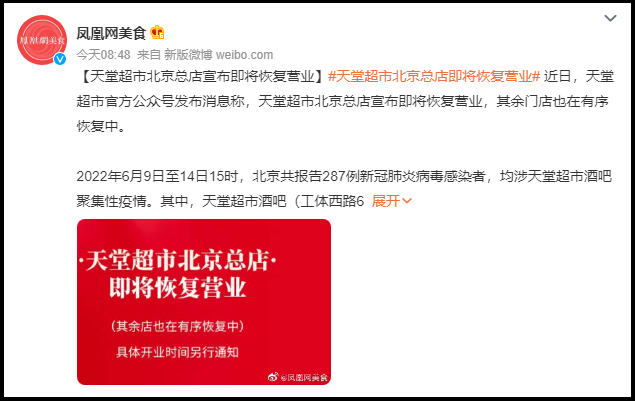

# 胡锡进：我们对夜总会经济的态度不能过于严厉，要给它适度的空间

去年因发生疫情已被吊销执照的北京天堂超市酒吧竟然要恢复营业了，老胡为它高兴。我想扩大一下话题，说说笼统的“夜间经济”。

很多城市在过去几年都想把夜间经济活跃起来，但扣除疫情因素，实际效果往往也不是很好。什么原因呢？其中很重要的一条是夜总会经济冷清了，而它是夜间经济的重要动力之一。

在绝大多数国家和地区，夜总会经济无论占比大小，都在夜间经济中扮演了催化剂的作用。它不仅带来了直接消费，促进了泛夜总会一类场所的就业，而且还极大拉动了出租、代驾、夜宵等连带服务的繁荣，扩大了城市夜晚的消费总量。在中国这样的超大社会，有人估计，夜总会经济直接吸纳和间接带动就业的规模应该在上千万人，但现在它的规模小多了。而一旦夜总会经济萧条了，夜间经济也会跟着萎靡不振，城市仍会霓虹灯闪烁，但是纯逛的人多了，不带来消费的夜间活动多了，就业量难以增加。

在我们国家，夜总会经济长期受到争议，主要是一些歌厅、洗浴场所搞进了色情的东西，发生了卖淫嫖娼行为，使得人们对夜总会经济整体上形成了偏见，相关场所也成为重点整治目标。有的歌厅本来挺规范的，但偶尔出了事情，会被处罚得很重。总体看，夜总会经济形成了“资产阶级生活方式”的印象，而且被视为低俗中的低俗。由于夜总会经济名声不好，越来越多的人避而远之，朋友聚会也就不怎么去那样的场所了。

另外，更大的冲击是疫情，它打击了整个服务业，夜总会经济首当其冲。现在疫情的封控已经远去，服务业志在大规模反弹。但是夜总会经济能否重新繁荣起来，对整个夜间经济的后劲将有不小影响。

老胡个人认为，我们对夜总会经济的态度不能过于严厉，还是要给它适度的运营和发展空间，不应在意识形态层面歧视它，把打压它当成我们维护社会道德高水平的一个方向。重要的是，要管理好夜总会经济，防止社会道德反对的现象在那些场所滋生并失控，尤其要防止那里成为腐败场所，官员应该禁入，也绝不能让它成为黑恶势力横行霸道的地方。总之，不能让那里成为“法外之地”。我认为，只要认真管理，保持泛夜总会场所的秩序就是不难做到的。

对夜总会经济管理得严一些，允许它合法经营，稳定存在，出了具体问题就事论事依法处理，不一棍子打死，应是我们对夜总会经济的一种折衷态度。由于它带动了夜间经济的其他方面，促进了旅游和周边行业，给很多人提供了谋生机会，它值得我们在加强管理的同时予以包容。

老胡之所以主张我们适当放松一些对夜总会经济的限制，是因为它的确能对繁荣服务业弥补上一个缺陷性的动力，拉动许多就业，促进收入的再分配，它为我们社会能带来的好处将大于它可能带来的问题。适当放松些不意味着放任不管，我们应不断鼓励泛夜总会场所的合法经营，扩大它们的积极面，同时抑制其消极面，在不断摸索中实现趋利避害。适当放松夜总会经济，有利于在我们社会营造相对自由、宽松的氛围。我们的社会整体来说是有些偏紧偏严的，包括夜总会经济在内的娱乐业繁荣会产生一点有益平衡，有助于我们社会更好地实现综合治理，发展社会主义市场经济。

老胡的上述个人建议未必是对的，但我写此帖的善意希望得到理解。欢迎大家批评。

