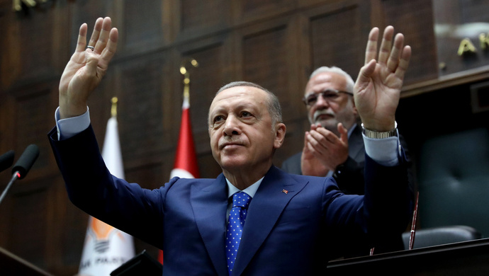

# 避免更多变数？土耳其总统埃尔多安明确：大选将于5月如期举行

据外媒报道，土耳其总统埃尔多安3月1日称，土耳其大选将于5月14日如期举行。这打消了今年2月土耳其大地震后，外界有关大选是否可能推迟的疑虑。分析认为，受通胀高企、货币贬值等经济因素影响，埃尔多安本就面临执政20年来最艰难的大选，造成逾4.5万人死亡的强震则给大选再添变数。在这一背景下，推迟大选或许只会让埃尔多安的处境更加艰难。

**埃尔多安明确：如期举行**

当地时间3月1日，埃尔多安明确表明，他不打算推迟将于5月14日举行的总统和议会选举。

在对执政党正义与发展党议员发表讲话时，埃尔多安表示，如果一切顺利的话，“这个国家将在5月14日采取必要行动”。

据悉，埃尔多安2003年起担任土耳其总理，2014年以来一直担任总统。新一届大选中，埃尔多安计划竞选连任。

埃尔多安当天还为土耳其政府的应灾表现进行辩护。他表示，土耳其遭遇了一场“地震风暴”，但政府将建造更牢固的建筑取代倒塌建筑，将赢得民心，向民众呈现出一个崭新的未来。

这是自2月6日土耳其叙利亚边境发生强震以来，埃尔多安首次公开提及大选日程。近日，有关土耳其大选可能推迟的猜测甚嚣尘上。

土耳其Habertürk电视台此前援引消息人士称，地震后，土耳其大选可能延期6个月至1年。还有人质疑，在地震3个月后，政府届时是否有能力为地震受灾群众做好后勤工作，确保他们能够进行投票。

据悉，土耳其受灾地区总人口大约有1400万，目前相关地区在震后修复方面正面临巨大挑战。受灾人群可能仍需数月时间才能恢复正常生活，而不是住在帐篷和集装箱中，排队领取食物。

今年1月，埃尔多安曾将大选日期从6月18日提前到5月14日。如果当天没有候选人获得过半选票，第二轮投票将于5月28日举行。

**地震给大选前景带来变数**

分析认为，突如其来的地震给埃尔多安在大选中的胜算增添变数。

地震发生前，受通胀高企、里拉贬值等经济因素影响，埃尔多安的支持率已被大幅削弱。当时，外界就将此次大选视为其执政20年来最艰难的一次。

不少选民抨击埃尔多安政府的货币政策，认为这加剧了土耳其严重的通胀问题。

去年10月，土耳其居民消费价格指数（CPI）同比上涨85%，创24年新高。然而，不同于其他国家央行加息以遏制通胀，土耳其央行却连续四次大幅降息，被视为“非主流”。

受经济因素影响，土耳其执政党的支持率在2021年和2022年的民调中持续走低。2022年年末，埃尔多安推出一系列缓解生活成本危机的措施，包括提高最低工资标准等。此后，民众情绪有所缓解，埃尔多安支持率也出现回升迹象。

然而，地震再次给大选前景带来不确定性。

一些受灾者批评土耳其政府震后救援不够及时，组织不力。还有人将土耳其人员伤亡惨重的原因归咎于“豆腐渣”工程，认为土耳其国内的建筑质量规范执行不到位。

此外，地震灾区曾是埃尔多安及其领导的正义与发展党的传统“票仓”。有分析认为，地震后一些当地选民很可能改变投票意向，一些相对摇摆的选民也可能抛弃埃尔多安。

不过，也有分析指出，地震对埃尔多安选情的影响可能有限。

伊斯坦布尔比尔基大学政治学教授埃姆雷·艾尔多安（Emre
Erdogan）表示，他不认为地震会对支持正义与发展党的约40%选民造成严重影响。他认为，这些保守派选民可能会抱有宿命论，认为灾难是不可避免的，而不是将其归咎于执政党。

**推迟大选将付出更高代价**

在地震、经济等多重危机下，分析人士认为，埃尔多安排除推迟大选，是为了避免在选举中付出更高代价。

首先，此举能够避免反对党借机发难。

土耳其宪法规定，当国家处于“战争状态”不能进行选举的情况下，土耳其议会才有权决定是否推迟大选。当前的地震并不构成推迟大选的理由。

此前，反对党共和人民党主席、最有可能在大选中挑战埃尔多安的凯末尔·科勒驰达奥卢已表示，因地震推迟大选将是“违宪”。

其次，民调也显示，大多数民众反对推迟大选。

土耳其民调机构Turkiye
Raporu今年2月进行的一项民调显示，大约71%的受访者反对推迟选举。受灾地区的受访者中，也有64.3%的人希望大选能够如期举行。

此外，有分析称，大选的拖延对埃尔多安并不利，推迟投票只会让他的处境更加艰难。

华盛顿近东政策研究所研究员索纳·卡加普泰(Soner Cagaptay)表示：“埃尔多安已意识到，在愤怒的抗议浪潮取代悲伤之前，最好尽快举行选举。”

私人民调公司Panoramart的研究主管奥斯曼·塞特(Osman Sert)则指出，除了社会因素，埃尔多安在地震后等待的时间越久，也越难以应付经济后果。

另据外媒报道，就在埃尔多安宣布如期举行大选的几小时前，土耳其议会批准了执政党提出的一项法案，将让220万土耳其人享受提前退休。分析认为，该法案是在为5月的大选“铺路”。

