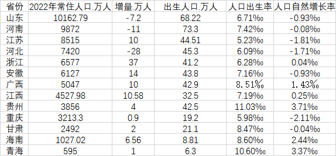

# 13省份2022年人口数据出炉：多省份人口自然增长率转负

近期，各省份正陆续发布2022年的人口数据。目前已有13省份公布了2022年的人口数据。在13个省份中，有10个省份实现常住人口正增长，多省人口自然增长率是近几十年来首次转负。

3月3日，江苏省统计局发布的《2022年江苏省国民经济和社会发展统计公报》显示，2022年末全省常住人口8515万人，比上年末增加10万人，增长0.1%。男性人口4320万人，女性人口4195万人；0－14岁人口1205万人，15－64岁人口5788万人，65岁及以上人口1522万人。全年人口出生率5.23‰，人口死亡率7.04‰，人口自然增长率-1.81‰。

第一财经记者据此计算，2022年江苏出生人口为44.51万人，比上一年下降7.23%。

此前的2021年，江苏常住人口出生率为5.65‰，人口死亡率为6.77‰，人口自然增长率为-1.12‰。这是新中国成立以来，江苏年度人口自然增长率首次转负。因此，2022年，江苏连续两年人口自然增长率告负。

在第三经济大省山东，山东省统计局3月2日发布的《2022年山东省国民经济和社会发展统计公报》显示，人口总量稳中略降。年末常住人口10162.79万人。其中，0-14岁人口占总人口的17.86%，15-64岁人口占65.42%,65岁及以上人口占16.72%。常住人口城镇化率为64.54%，比上年末提高0.60个百分点。全年出生人口68.22万人，出生率6.71‰;死亡人口77.67万人，死亡率7.64‰；人口自然增长率-0.93‰。

数据显示，2021年末，山东常住人口规模为10169.99万人。也就是说，2022年，山东常住人口减少7.2万人。对一个省份来说，人口增长包括自然增长和机械增长（即“人口净流入”）。去年山东常住人口减少，主要是人口自然负增长所致。去年山东在人口自然增长方面，减少了9.45万人。也就是说，去年山东新增省外净流入人口约为2.25万人。

在出生人口方面，在2016年“全面二孩”政策实施后，山东出生人口数量曾连续两年位居全国榜首，其中2016年，山东出生人口数量高达177万人。2017年，山东继续保持175万人的高峰。不过，随着“二孩生育势能基本释放”，到2018年，山东的全面二孩效应明显减弱，出生人口为133万人，降至第二；2019年，出生人口数量退居第三。到2020年，山东出生人口跌破了100万。2022年出生人口跌破了70万大关，同时，山东人口自然增长率也是近几十年来首次告负。

_数据来源：第一财经记者根据各地统计局数据整理_

截至目前，已有13个省份公布了2022年的人口数据。在13个省份中，有10个省份实现常住人口正增长。浙江、安徽、江西、广西、江苏人口增量均达到或超过了10万人。其中，浙江增加37万人，在已公布的省份中增量位居第一。

相较于上一年，已公布数据的13个省份2022年人口出生率全部下滑，人口死亡率普遍略有上升。其中，江西、甘肃、广西、海南、贵州、河北出生率降幅均超过1个千分点。在出生率普遍下滑、死亡率上升的同时，有多个省份人口自然增长率近几十年来首现负增长。其中，河南人口自然增长率62年来（自1961年开始）首次出现负增长。山东、安徽和甘肃的人口自然增长率也是多年来首次转负。

