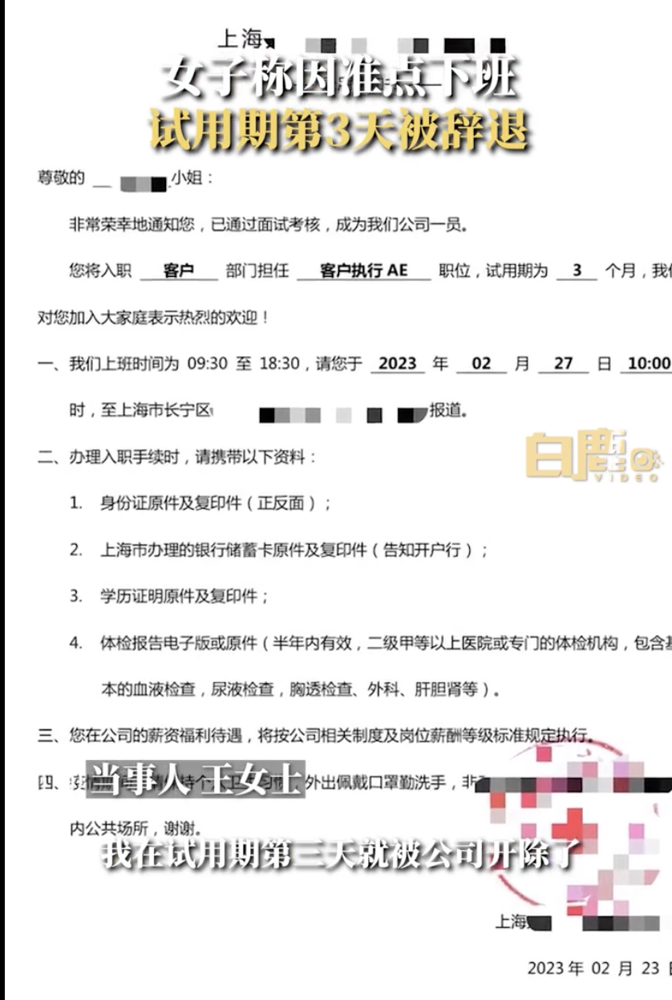
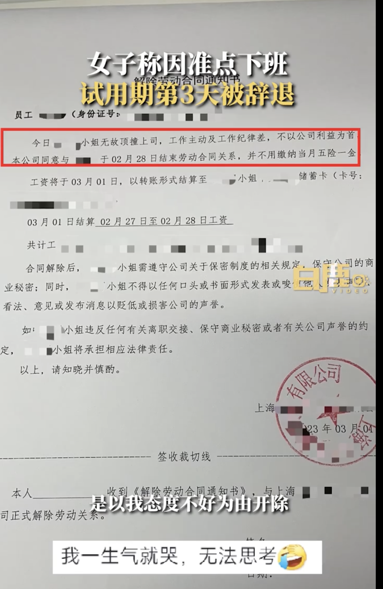
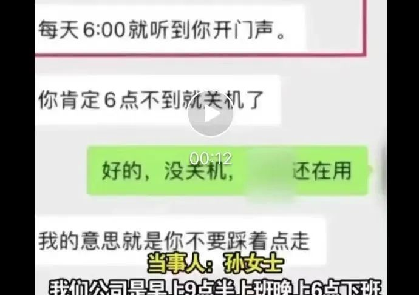
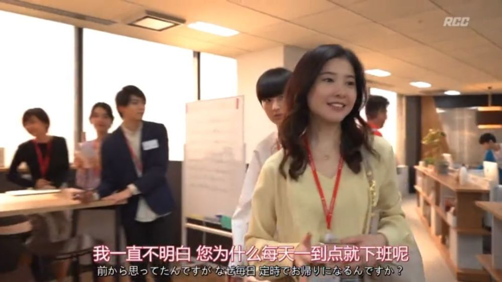

# 18：33下班，新人试用期第三天被辞退！准点下班有错吗？

准点下班也能成为被辞退的理由？

试用期准点下班到底是理所应

当还是 **“工作纪律差”** ？

今天，你实现 **“准点下班”** 自由了吗？

近日，一则有关 **“准点下班”** 的短视频引发众议。

3月2日，上海王女士称自己在试用期第三天就被辞退，老板给出的原因是前一天下班时间太早。

明明公司规定上班时间是 **上午9点半到下午18点半** 。

试用期第二天，王女士于18点33分在公司用电脑给领导发了消息，领导没有回复，于是决定下班。次日早上被领导叫进办公室一顿痛骂，并出了一个解除劳动合同的通知，以
**“无故顶撞上司，工作主动及工作纪律差，不以公司利益为首”** 的理由开除了她。

面对试用期3天就被开除的局面，王女士认为试用期第一天上班的时候她给老板发消息下班老板没回，所以自己准时下班，所以之后也当如此。

王女士表示，“我跟领导说，你没回我呀，他说我必须要秒回你吗？ **我没回消息你就可以走了吗？** ”

她认为既然老板没回复，正点下班理所当然，并不是自己的问题，希望公司按法律规定给予经济补偿。

此视频一出便引发网友讨论

多数网友认为，准点下班天经地义

公司格局太小

并质疑公司是否遵循《劳动法》

但也有网友认为，

**试用期还是要尽量表现自己**

**网友力挺“准点下班”，**

**是反感职场“内卷”**

无独有偶，山海视频发布一则“女生准时下班被批踩点走”的新闻冲上热搜。当事人孙女士称，其在一家公司做内勤文员，公司的工作时间是上午9点半上班，下午6点下班。当天，其完成工作准备关电脑下班时，领导给其发了消息，大意是，
**对其每天准时下班很不满意，让其不要六点整踩着点走，可以六点零几分再走。孙女士不解，按时下班有什么不对？**

事实上，类似的新闻不是第一次被爆出，此前，员工因为“准点下班”被公司领导提醒、警告甚至全公司通报批评的情况都曾发生。

相关社交媒体平台上，上述新闻的阅读量达到了4亿，网友评论达数万条。龚先生认为，不是大家非要给这几分钟讨个说法，而是在通过力挺“准点下班”表达一些潜台词：无谓的加班、“内卷”能不能少些？职场中的存在感能不能不靠工作时长来刷？员工准点下班、拥有“下班自由”能否成为常态，而非“想为又不敢为”之事？

有观点认为，准点下班其实是一种能力。意思是，能准点下班意味着能科学、合理地规划工作内容和时间，能保质保量、高效地完成工作任务和预期，有执行力、不拖延，能处理好工作和生活之间的关系，等等。

说到底，老板也好，员工也罢，都应该向工作效率、工作质量努力，而不是把太多的精力放在工作时长和表面功夫上——这，才是更科学更可持续的工作方式。这样的企业文化带给公司的收益会更大。

不仅在我国，是否应该 **准点下班** 其实也在其他国家被讨论。

2019年，日剧 **《我，准点下班》** 中，剧中角色就通过一句又一句的硬核台词表达了对准点下班，回到各自生活的殷切期望。

近日，全国政协委员蒋胜男就表示加强对“8小时工作制”的监督管理，她提到：“8小时工作制是国家法律规定的每日工作时间。然而近年来，一些行业和企业存在违反8小时工作制度的情况，甚至部分企业‘996’成为常态，广大劳动者的权益并未得到充分保障。”

“许多员工每天要工作超过12小时，甚至达到16小时以上。”她认为，超时工作、无偿加班、“996”等问题，对于劳动者的身体健康和家庭生活造成了极大的影响，严重违背了劳动法规的规定。

对此，她建议，充分落实8小时工作制，保护劳动者休息权、健康权。加强劳动法对劳动者的休息权保护，对企事业单位8小时工作制的执行情况加强监督管理。

留下加班的人各有各的理由，

那么准点下班就有错了吗？

你怎么看？

**来源** ：新闻晨报综合白鹿视频、人民政协网、九派新闻、工人日报客户端、网友评论

