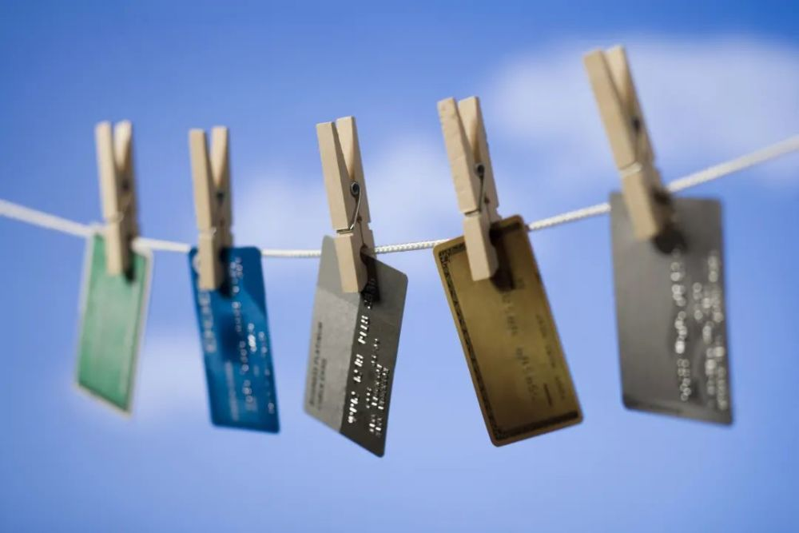

# “围剿”4亿张睡眠信用卡：20多家银行下“战书”，降额、停用或销卡

信用卡存量时代，一场对“睡眠”信用卡的围剿行动，正紧锣密鼓地展开。

近期，中国银行、浦发银行、恒丰银行等20多家银行立下“战书”，将对长期睡眠的信用卡开展降额、停用或销卡手续。

实际上，早在2022年7月，央行就联合银保监会发布了《关于进一步促进信用卡业务规范健康发展的通知》（下称《通知》），要求连续18个月以上无客户主动交易且当前透支余额、溢缴款为零的长期睡眠信用卡数量，占本机构总发卡量的比例在任何时点均不得超过20%。

正是在“长期睡眠信用卡占比不得超20%”这一要求下，各家机构开展了此次围剿行动。

当前，业内普遍认为，信用卡市场已告别“跑马圈地”的高增长时代，如何实现高质量精细化发展成为银行面临的新课题。

20家银行集体“围剿”睡眠卡

2月10日，恒丰银行发布公告称，3月31日起将陆续对睡眠信用卡停止服务并办理注销手续，这些信用卡包括：发卡满18个月以上仍未激活，或已激活却连续满18个月及以上未发生主动交易，且当前透支余额、溢缴款为零的长期睡眠信用卡。

在此前一天，平安银行也发布了对长期睡眠卡的处理公告。“自2023年4月1日起，对连续24个月未发生交易的信用卡账户，且账户‘无欠款、无溢缴款’的长期睡眠状态账户，会进行通知，若客户未在规定期限内根据通知要求对卡片进行操作的，我行将对其采取销卡或销户措施。”

在此之前，中国银行、光大银行、浦发银行等银行皆发布了对睡眠卡的管控措施，其中中国银行对睡眠卡的管理定义也是18个月以上无任何交易且无欠款的账户，自3月20日起，将对上述信用卡账户或卡片纳入账户安全管理范围，分阶段进行信用卡降额、停用或销卡等相关处理。

除了进行销卡、降额等管控措施外，也有银行做出不发新卡的处理，光大银行表示，对连续24个月以上无客户主动交易的信用卡客户，将被纳入安全管理范围，分阶段做卡片到期不续发新卡处理。

事实上，信用卡睡眠的问题由来已久。中国银行业协会统计数据就显示，早在2020年末，信用卡（包括贷记卡和准贷记卡）的累计发卡量为11.3亿张，其中6个月内有过使用记录的累计活卡量为7.4亿张。这意味着，近4亿张信用卡处于“睡眠”或者未被激活。

到了2021年，睡眠卡的问题愈发严重，据《中国银行卡产业发展蓝皮书2022》中显示，2021年信用卡活卡率仅为55%，同比下降10.8个百分点。

可以说，长期睡眠卡问题已到了不得不整治的阶段。

过度营销后遗症

近些年来，各家银行都在大力发展零售业务。招商银行凭借零售业务，多年来稳坐商业银行头把交椅；宁波银行也在2022年中报中称，将继续推进大零售战略实施，聚焦大零售和轻资本业务的拓展；浦发银行则直言，将零售业务作为重点发展的领域，不断完善业务管理体系、产品体系等，推动财富管理、信用卡等业务保持较快发展。

在当前零售为王的时代，信用卡业务作为零售业务中的重要一环，成为银行业务发展的重点，其中发卡量成为银行间比拼信用卡业务规模的重要指标。

信用卡资深人士董峥告诉市界，“此前银行信用卡业务蓬勃发展，发卡量得以迅速增长并成为拉动消费的重要武器。但是长期以来，发卡银行多以扩大市场份额的‘重拉新、轻留存’的经营思想指导业务发展，包括送礼品、送积分等方式进行客户拉新，导致信用卡发卡量持续不断增长。”

当前，银行信用卡业务在拉新层面，从未停止过脚步，在北京各大商场、地铁站口，经常可以看到部分银行利用礼品、减券等活动进行拉新。“办了不激活也没事，可以免费拿礼品”，这是银行信用卡推销人员拉新时常用的话术。很多小伙伴会由于礼品的诱惑，进而选择办理多张卡而导致部分卡闲置。

“各家银行之前对于信用卡的过度营销致使许多客户多方办卡，导致了睡眠卡的泛滥。”中国企业资本联盟副理事长柏文喜表示。

当前业内达成的一个共识是，2019年是信用卡行业的分界线，在此之前的十多年里，中国信用卡市场保持了高速增长状态，2019年之后，信用卡规模增速降至个位数，2022年上半年信用卡用卡量增长仅0.88%，创下三年同期最低增长率。

很明显，当前信用卡市场已趋于饱和，“市场中适合办卡的绝大部分用户中，如果没有特别的需求很难激发他们办卡和用卡欲望，从而导致大量发卡成为睡眠卡。”董峥说。

在此情形下，中国的信用卡市场进入存量竞争时代，早已成为业内共识。

向精细化、高质量迈进

对于银行而言，大量睡眠信用卡的存在，对其并没有实质性作用。

把信用卡发出去只是为银行带来实际效益的一个前提条件，持卡用户把卡“刷”起来才是为发卡银行带来效益的唯一途径。“睡眠卡对银行来说有害无益，一方面会低效占用系统资源，因为卡量的增长需要扩大后台包括系统、客服等相关配置；另一方面也会加大银行潜在风险，对于长期睡眠卡来说，发卡银行难以进行必要的风控监测，一旦出现突发风险交易时，监控难度比较大。”董峥说。

柏文喜表示，“清理睡眠卡，可以有效降低银行卡的维护成本，提高活跃卡占比，实现降本增效。”

在《通知》中，除了对长期睡眠卡率做出了不得超过20%的规定外，还要求银行业金融机构不得直接或间接以发卡量、客户数量、市场占有率或市场排名等作为单一或主要考核指标。

董峥直言，“《通知》的出台，‘倒逼’信用卡业务经营从粗放式向精细化转变，这也有利于信用卡业务回归本源，形成良性竞争的环境。”

易观分析金融行业高级咨询顾问苏筱芮也表达了同样的观点，“在当前信用卡发展新时代，精耕细作的用户体验将逐步超越粗放的流量获客思维，成为商业银行打造市场竞争力的关键。”

如何向精细化方向发展，董峥给出自己的建议，“信用卡产品能否做好，核心在于产品经理们是否能跳出固有的信用卡产品思维，以互联网逻辑开拓视野，借鉴某些好的思路与意识，最重要的是站在市场的角度，站在消费者的角度，来策划设计信用卡产品。只有这样，在未来信用卡市场竞争中，才有更大发展空间。”

柏文喜则表示，银行要保证信用卡业务高质量发展，首先要保证发卡的精准度，并根据卡种定位赋予更丰富的功能与用卡便利以提升用卡频次与额度，其次要不断优化持卡人结构和促进卡的活跃度来提升信用卡存量的质量。

提高用户体验水平，进而增加客户粘性，是苏筱芮给出的建议，“信用卡机构可从操作体验、性能安全、用户黏性等维度全面检视用户体验水平，挖掘体验中的痛点并及时跟进优化，不断推动信用卡业务产品及服务迭代更新，用口碑和服务稳步落实对用户的留存。”

随着信用卡行业步入存量时代，如何在日趋白热化的行业竞争和逐渐趋严的行业监管中脱颖而出，一些银行也提出了新的思路。

招商银行信用卡中心相关负责人坦言，当前信用卡行业环境对从业机构的精细化管理和合规经营提出了更高的要求。“从源头保障客群质量，提升风险管控能力，并不断强化审慎合规经营，做好消费者权益保护，是信用卡业务高质量发展的基础。”

南京银行信用卡相关负责人则指出，2023年，南京银行会从不同客群不同阶段的需求，进行差异化经营核心亮点权益，打造不同支付场景的客户首选卡。同时，将持续完善获客渠道建设，引入更多有场景有流量的平台，开放思维，推动线上线下一体化场景生态闭环建设。

总而言之，当精细化时代来临，留住存量客户是银行从信用卡业务脱颖而出的关键，以人为本，重视客户需求，提高用户体验水平，是信用卡业务冲刺的下一个目标。

**作者 |** 周梦婷

**编辑 |** 韩忠强

