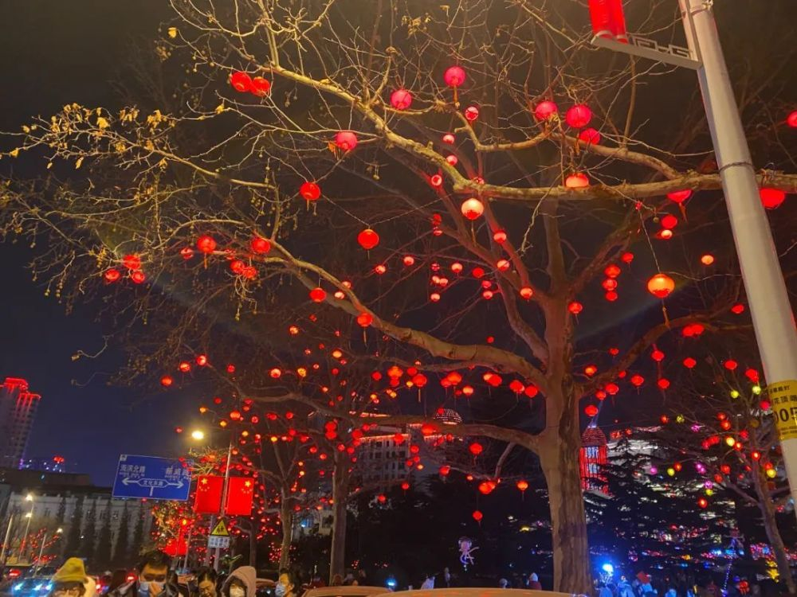
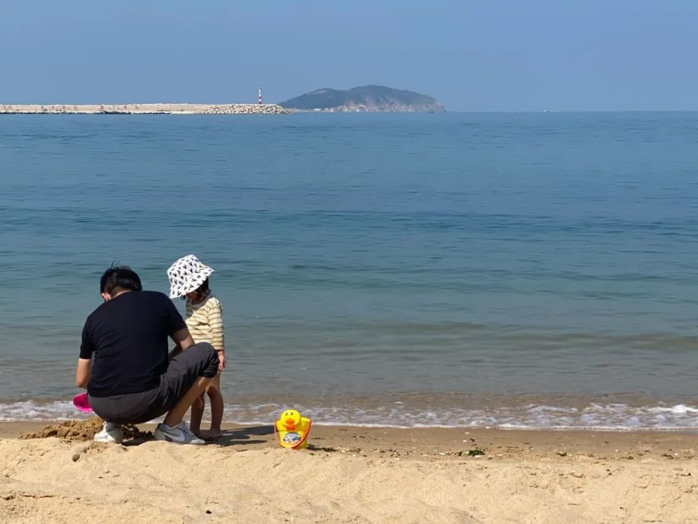
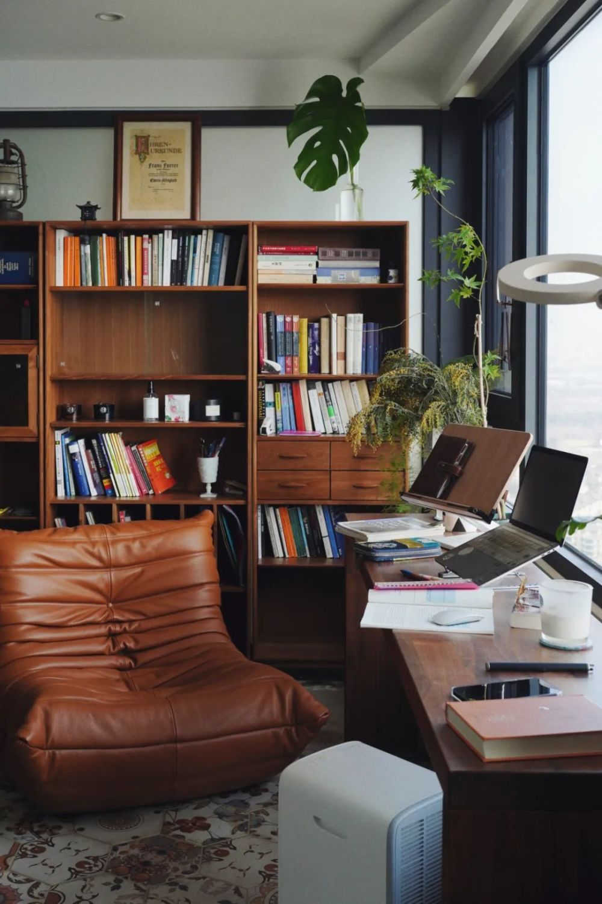
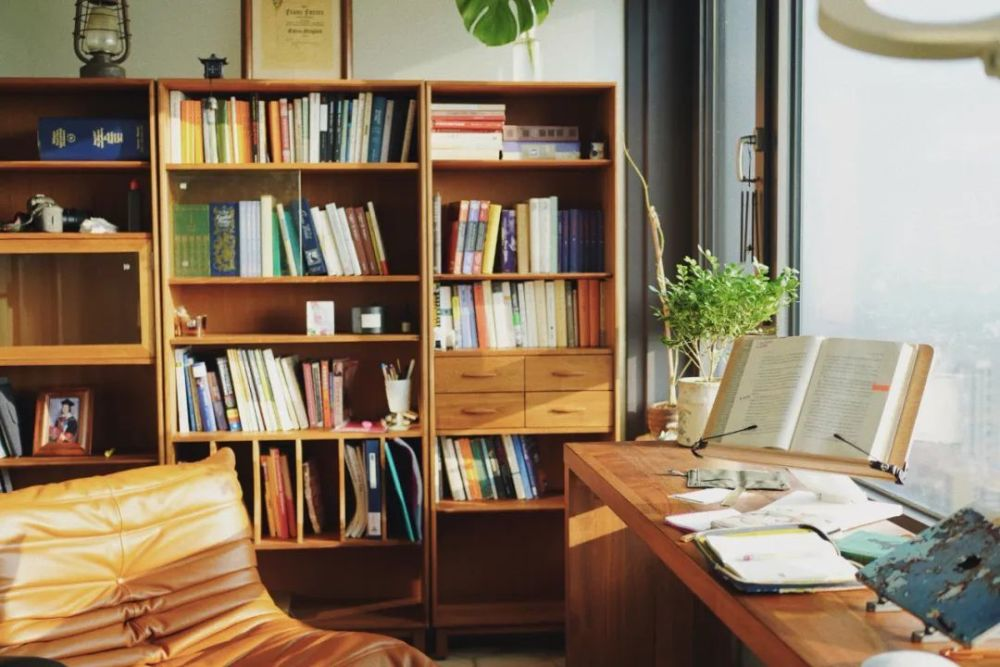

# 中产回到二线：来大城市追求生活，却发现依然生活在城门之外

近来，社交媒体上，越来越多人发帖讲述自己的困惑——30岁之后，当职业发展、孩子求学、老人看病等现实问题一一浮现，他们对一线城市的生活感到倦怠，开始犹豫要不要离开。

和几年前一度流行的「逃离北上广」不同，那时，想要离开的往往是在一线城市没有置业的年轻人，但如今，一些中产有了同样的念头，即使要付出比年轻人更重的代价，他们仍然渴望回到二线安置未来，以此获得生活中的「呼吸感」。

一些人在彷徨后做出了决定。上周六，一位30岁的二胎妈妈收拾完所有家当，正在从北京搬到威海，她同时在观望房价市场，等到一个回暖的时机，就卖掉北京一套价值300万的「老破小」，去威海置换200多平方的大房子。一对年龄超过35岁的夫妻离开北京快一年了，他们把全家的户口迁往了海口，在那里重新找工作和买房，希望尽快与城市适配。还有一位37岁的妈妈，留下了北京户口和一套房产，带着老人和孩子转移到武汉，两个孩子已经开始在武汉上学。

根据2020年《中国人口大迁移的新趋势》报告和人口统计局数据，近年北京和上海两个超一线城市人口增速明显放缓，北京近四年常住人口净流出达40万，而在2021年一年，北京常住人口数量减少了0.4万，上海人口仅增长1.07万，人口吸引力远远不及成都、杭州、武汉等城市。这些都说明，人们对于如何安置自己的生活，已经做出了一些新的思考。

《人物》找到了四位从北京、上海退回二三线城市生活的人，和她们聊了聊曾经在一线城市的生活状态，以及想要离开的具体原因。有人感慨说，自己卷不动了，「来大城市追求生活，来了之后却发现生活在城门之外」；有人在经历老人生病之后，开始思考自己和父母的连接是什么，并想在接下来的日子里给父母多一些陪伴；有人带着孩子长期生活在20多平米的狭窄空间，对生活的需要变成了拥有「一间属于自己的屋子」。

而当离开的原因和新需要都变得如此具体，在退回二线城市之后，她们是否就能获得内心的渴求？以下根据她们的讲述整理——

**文｜** 程静之

**编辑｜** 槐杨

**图｜** 受访者提供

**「来大城市追求生活，来了之后发现生活在城门之外」**

@心凌 北京——威海

我是这个星期六（2月25日）彻底告别北京的。我把所有行李打包好，提前装上一辆大货车运走，之后跟老公带着两个孩子走高速，往山东的方向开，到了威海的地界，打开车窗换换风，能感觉到空气里有一种清甜的味道。

选择离开的原因很简单，就是在北京卷不动了。离职之前，我是一家顶级4A广告代理商制片，负责公司所有客户的视频广告制作，客户涵盖品类比较广，包括汽车、快销品、互联网。这份工作的不可控性很高，基本要求一天24小时待命。每天一睁眼，我会先拿起手机，处理上千条未读的群消息，之后忍受一小时的通勤，到公司跟同事和客户频繁开会，沟通片子质量、修改意见、追加报价等问题。晚上七八点下班后，我赶回家，扒拉两口饭，又继续工作，这种状态要一直持续到闭眼睛睡觉。

最忙的时候，我同时推进3-4个项目，为了赶进度，熬夜或者通宵也是家常便饭。这还不是最头疼的，涉及到外景拍摄的时候，我需要应对各种临时出现的bug，比如有一次在新疆，我们早上四五点起来赶日出，结果等来的是冰雹；还有一次在高原，要拍SUV汽车的越野性能，没想到产品突然出现故障，我就要思考如何拖着这个坏掉的车，去弥补脚本里的镜头。

因为工作的强度太高，广告代理商都自称「广告狗」。我在这个行业干了8年多，好像已经习惯了紧张的熬夜、加班和出差模式，接受了这就是自己的生活。

但到了2019年，我意外怀孕，生了老大，就有点想改变这种生活状态了。

休完产假之后，孩子依靠母乳喂养，我半夜要起来吸奶，睡眠质量很不好，早上起来再应对工作，必须先来一杯咖啡，才能支撑新的一天。在那个阶段，我过得挺辛苦的，但总感觉有个盼头，撑过一年半年，等孩子断了奶，痛苦就会过去的。但没想到，随着孩子慢慢长大，跟父母有了情感交流的需求，占据我的时间反而变得越来越多。

我记得在孩子有了记忆以后，有一次对我说，妈妈，你上次带我去的那个公园，周末可不可以再去一次？我就发现，自己周末的时间是不固定的，连这个都没办法承诺给她。还有一次，孩子睡前，我想表达对她的爱，说以后不管妈妈去哪里，都会把你带在身边。没想到孩子说，妈妈，你上班能带着我吗？这句话一下子戳到我的痛点，我当时忍不住哭了，好像在孩子眼中，妈妈就是一直在上班的。

到了2021年，我又一次意外怀孕，老二的到来加剧了孩子和工作之间的矛盾，特别是到了周末，我一边陪不好孩子，一边又处理不好工作，搞得两边都很愧疚。有时候，手机里的工作信息在吵，孩子也在吵，我就特别想放空自己，哪怕安静待一会儿，但现实是没有自我喘气的空间。

当这个矛盾成为常态，我开始思考自己在北京的定位和这样熬下去的意义是什么。

一方面，我们在北京算是小中产，有房产，是一套五十多平的老破小，总价大概300万，满足不了一家四口的住房需求，但如果再存一笔巨额的首付去换房，压力会很大；另一方面，我们没有北京户口，孩子未来没办法在这里高考，上学也会是一个大问题。两方面加在一起，我就觉得对未来的生活简直不敢去规划，好像对我来说，北京的一切都变得好遥远。

我老公跟我是同行，从大学毕业，到工作、创业，在北京一共待了18年。平时，他工作也非常忙，感到卷不动的时候，就开玩笑跟我说，去威海吧，把房子卖了，换成一笔现金，可以在威海全款买200多平的大房子，完全不用背房贷，可以彻底实现躺平。以前，这只是我们一个美好的假想，但在我二次意外怀孕的时候，老公认真考虑到北京的生活和住房情况，光养一个孩子已经很不如意，重提了离开北京去威海的事情。

老公是威海人，每年春节或者五一、十一，我就要回去跟他家人相处，所以威海我去过蛮多次了。我很喜欢那里，三面环海，过几个街道就能到海边。冬天最冷的时候差不多0度，供暖却有6个月的时间，比北京还要长十几天。那里的消费也让我觉得坦然，打开打车软件，快车和拼车，就是8块跟6块的区别，吃一碗海鲜面，小鱿鱼、虾、花蛤的浇头全部铺满，才20几块钱。

生二胎的节点上，我对去威海的提议一下子感到心动了。考虑到目前这个阶段，我在北京的工作也遇到了瓶颈期，一些优秀的孩子杀上来，我也不想跟他们斗智斗勇去卷了。总的来说，对事业上的追求就是0，完全没有了。

最后，我跟老公达成一致意见，他是自主创业，办公地点比较自由，工作就可以先不放，之后在北京、威海两地跑一跑，而我的打算是彻底放手，在哺乳期一年左右，把离职的事情提上日程。一直到今年过完春节，我做完手上最后一个项目，去公司办理了离职，之后开始收拾行李，该扔的扔，该卖的卖，该送的送，每处理一样东西，都像是跟这一段生活模式的告别，感觉到一种完全的解脱。现在，我们正在观望北京的房价，等到一个回暖的时机，就卖掉那套「老破小」，在威海置换一套房子。

今年春节，我在威海的婆婆家住过一段时间，能感觉到那边生活里的声音跟北京完全不一样。一大早，年纪大的爷爷奶奶们站在窗户下聊天，我被他们的声音吵醒，突然感到很接地气，一阵惬意。走出家门，能看到威海有很多山，鸟也特别多，去包子铺买早餐，伴随的都是小鸟的叫声。到了马路上，四处在播报今天什么菜价便宜，哪个超市在打折，都是一些细碎的生活日常。

_今年元宵，心凌在威海感受到了节日气氛_

我发现，在北京将近10年的时间，忽略了很多类似的生活气息。不像在威海，朋友们可以随意邀约吃饭，马路上的陌生老人会逗你的孩子玩，路上碰到老邻居了，会先聊两句再接着走路。好像生活的节奏一慢，人与人之间的沟通和相处就都回来了。

最近，我把「裸辞、卖房、离京」的经历写在网络上，收到了很多留言，感觉在这个时代下，其实有很多人厌倦了一线城市的生活，但没有逃离的客观条件，或者没有离开的勇气。他们有的离不开国企的工作，有的放不下北京的户口，有的舍不得高薪的收入，有的想为孩子争取优质的教育。而我算是迈得开腿的，毕竟除了一套计划出售的房子，在北京也不剩什么。

所以，也有一些人很羡慕我，可以在现阶段去追求一种坦然的生活。我印象最深的评论是「来大城市追求生活，来了之后发现生活在城门之外」。这也是我的感受，我可能已经过了为事业拼搏或者说为自我成就感拼搏的一个阶段了，现在更在意的就是过平淡的生活。

_心凌回到威海，和老公孩子在海边。_

**我觉得离开北京、回到武汉是一个特别正确的决定——可以更多地陪伴老人。**

@特雷西 北京——武汉

2019到2020年，我们家遇到了三个意外。

一个是我在工作上遇到了歧视，二胎怀孕期间，公司考虑到我即将有两个孩子，可能没有精力再投入工作，招了新人代替我的岗位，等我休完产假回去，公司已经没有我的位置了；二是老公突然生病，血管方面检查出问题，幸好及时送医救治，不然这个人可能就没了；三是我公公也出现身体不舒服，带他去医院挂号，一检查，发现是膀胱癌。

在这之前，我们家其实过得蛮顺的。我2003年来北京读大学，2007年认识了老公，两人都是湖北小镇出来的，家庭条件不是很好。毕业后，我去了一家外企工作，老公本来是保送中科院硕博连读，但他想赶紧挣钱，读满三年硕士就直接出来了。

2011年，我看到天通苑有一块地方出了新楼盘，都是小户型，2万块钱一平，就跟老公说，100万就可以买下五六十平的房子。当时我们手里连20万都没有，赶紧各自去借钱，把首付凑起来，第一套房子就这样买了。后面这些年，有了孩子，老人自然而然地过来帮忙照顾，房子变得拥挤，我们就卖了第一套房，在望京换成了一个80多平的两居室。日子这么过下来，在北京，我们有看起来像光环一样的东西，房子，车子，户口，都有了。

但到了中年，上面所说的那三个意外，把生活完全打乱了。这让我感觉到，一个家庭其实是非常脆弱的，我们虽然算得上中产，但在北京也没有太多抗风险的能力。

其实，2019年生了老二之后，我们在武汉也买了房，只是没有决定说要回去。这一次公公生病，成了一个契机，他的癌症是早期，治愈率很高，但如果在北京治疗，我们还是会遇到一些无解的问题：首先是要找一家离家近点的好医院，并不容易挂号；其次，老人去了医院，老公要上班，也没人能看孩子了；最后，即使公公在北京治好了，家里地方太小，也没有一个安静的角落可以给他休养。

考虑到这些，我决定带着公公和孩子回武汉——医院很容易挂号，老人治好之后就在老家休养，我妈还可以过来帮忙看孩子，一切问题都解决了。到武汉之后，老人住院就是我来照顾，记得那个夏天，公公做完手术，不知道为什么一直发烧，我租了一个轮椅，推着他去做各种检查项目，从一个科室到另一个科室，所有东西搞完下来，一天就过去了，真的是很疲惫的。

在那段日子里，我逐渐意识到，老人越来越老，陪伴他们的机会越来越少。我就在想，父母跟我们的连接是什么？他们把我带来这个世界，又把我挡在死亡的后面，就像是我跟死亡中间隔着的那堵墙。有他们在的时候，我会看不到那个东西，但他们一走，我直接地看到，未来的生命就是走向死亡这个终点。

每次想到这一点，我就会觉得离开北京、回武汉是一个特别正确的决定——我可以更多地陪伴老人。

一直以来，老公对我回武汉的态度是，只要我和孩子过得开心，他就支持。平时，他的重心都在事业发展上，自从那次生病之后，他也非常害怕，一下子强烈意识到身体健康很重要。我过来武汉之后，他两个星期回来一次，感到武汉的自然环境和生活气息确实会让人放松，他打算过两年之后，凑够工作年限，拿到公司股权，就立马回武汉。

现在，我的两个孩子都已经在武汉这边上学了，等老公一回来，在北京就留下了户口和一套房产。也有很多人对我的选择表示不理解，说一个北京户口就成了多少人的向往，为什么还要回武汉？但真的在北京生活过，我们才体会到，即使有户口，也不代表车牌能摇到号，孩子上学就有学区房，老人就医就能更方便。从各个层面来讲，我们在北京的生活质量并不高，这个城市没有想象得那么美好。

当然，每个城市有优点，就有缺点。武汉虽然发展还不错，但最大的问题就是工作机会不多，薪资待遇低。回来之后，我没有再去投工作，也知道年龄过了35岁，又是两个孩子的妈妈，剩下的面试机会会更少。其实，我在2019年离职之后，曾经跟朋友尝试过创业，想做一个亲子类的公众号和线上商城，我们做好了方案，也拿到了投资，结果疫情来了，所有线下活动的规划都打了水漂。那次创业失败后，我回来就一边帮本地公司做自媒体运营获得收入，一边探寻更多的创业机会。

这也让我有了更多时间去陪老人。以前，孩子总是看不到外婆，这次回来之后，遇上清明节，我可以带着孩子回老家，跟着大家庭的人一起去扫墓，正是四月，老家的油菜花全都开了，春风吹得特别舒服。结束之后，家里十几个人再一块吃个饭，聊一聊，能感受到妈妈很开心。这两年，我带她第一次去坐飞机，第一次看大海，还有第一次化妆。那天是她生日，在照相馆里，我让化妆师给她化妆，之后拍了一组写真照，这组照片最后弄成了相册，厚厚的一本，我妈把它带回了老家，收藏在她的衣柜里。

_特雷西和妈妈拍的写真照_

跟妈妈的这种相处是我现在最大的收获。我14岁读高中就离开了家，在一个离学校更近的亲戚家里寄宿，大学又直接去了北京，一直到35岁回来，等于将近有20年时间没有跟妈妈生活在一起。以前，我会觉得她既当爸，又当妈，是一个完全来照顾我的人，现在，妈妈大到去医院看病，小到手机下载一个东西，都需要我来照顾她。

我们这一代人，跟家族的亲情关系都是靠父母在连接。在北京的那些年，我除了家里的6口人，没有别的亲人，总会觉得人情关系淡漠，有那种漂泊感。特别高兴的是，回来之后，我能经常带妈妈去散心，陪她说话，而且有她在身边，亲戚之间的来往也变多了，我才重新找到了跟人情更多的连接。

_特雷西在武汉长江边上野餐_

**「一线城市卷有卷的代价，二线城市躺平也有躺平的代价」**

@小包 北京——海口

无论海口的白天有多热，到了晚上9点多，都会起一阵凉凉的风，空气带着一种湿润又温热的味道，清新得像是刚下过一场雨，呼吸起来非常顺畅。

这时候，我会去小区楼下跑个步。跑道上没有太多人，也听不到任何车辆的喧嚣，只看到旁边一些高高的椰子树，在干净又清亮的夜色下，我可以完全放空，享受一个属于自己的自由时刻。

我是2022年7月23日从北京到海口来的，离京最核心的一个原因是没有北京户口，两个孩子将来没办法在北京高考。我原本计划，等孩子小升初再做离开的打算，但在2022年，我和老公的职业生涯遇上滑铁卢，就想干脆带着孩子早一点走，尽快去二线城市找位置。

原本，老公在部队做计算机信息技术相关的工作，我在一家公司做公关，服务的是互联网企业。2013年，我们结婚，生了老大，因为老公一个月才能回一次家，我又要上班，只能请老人过来帮忙带孩子。家里人多了，我们在昌平买了一套房子，由家人帮忙付首付，我跟老公还月供。

那时候，我要养孩子，又要养房子，就感受到在北京生活确实压力很大。随着孩子越长越大，老大开始上私立小学，一年学费15万，老二在2019年也出生了，我肩上的担子越来越重。包括这两年，我父母年纪也大了，身体出现一些问题，他们没有北京医保，看病需要买一些商业保险。这些问题加在一起，我意识到了什么叫「中年危机」。

这些年，因为互联网行业的发展，我的工作一直非常顺利，跟着公司总监出来创业，开过一个小型公关公司。我更加拼命去工作，想办法赚更多钱，基本上全年无休，把时间都花在工作上，晚上加班到一两点。做公关这份活儿，精神压力蛮大的，经常被客户pua得很惨。偶尔，我也觉得窒息，感觉完全没有了自己的生活，不知道这种状态什么时候才能结束。但每次跟客户做业务结算，又觉得一切都值了，我重新回到打满鸡血的状态，好像只要是为了家人，做什么都变得很有动力。

但到了去年，互联网经济走下坡路，一边疯狂裁人，一边砍预算，我们的业务量跟着跳崖式下降，最后公司开不下去，只能把员工都辞退了。

那时候，我老公已经退伍，做了一个海南的外包项目，了解到海口市2025年自贸港要封关，这两年有人才引进政策，很多外地人会赶在封关之前迁往海口。我们就想，当年没赶上70后、80初在北京落户的机会，现在是不是赌一把，把户口落过来，看自贸港以后的发展会不会好。

对全家而言，这的确是一个重大的决定，我们是把一家的户口都迁到了海口，两个老人也跟着过来了。在这里，我们又买了一套小房子落脚，北京的房子就留在那里，作为两个孩子以后的保障。

来海口之前，我虽然知道这边的工作机会比较少，薪资也低，但没想到落差居然这么大。刚到海口的时候，我相中了几个有意向的单位，后来这边疫情爆发，没有及时去聊，人家很快招到了别的人选，机会一下子都没有了。我就有点慌，临时又联系了一波，很多是在本地做得很大的企业，但聊过之后，我发现他们着眼的是本地市场，赚的是眼下的钱，而我此前一直关注的是全国市场，彼此的思维不在一条线上，就不是特别满意。

那会儿，我才意识到，在一线城市卷有卷的代价，来二线城市躺平也有躺平的代价。从某种程度上来说，一线城市可能是相对公平的，职场上主要靠能力，而二线城市还要靠一点关系，我所有的资源都在北京，想在海口有发展，就会遇到一个无法改变的瓶颈和限制。

到海口好几个月之后，我还是没找到满意的工作，断了收入来源，身边又找不到一个可以宣泄的朋友，变得非常焦虑，只好自己躲起来偷偷地哭。我甚至考虑过，是不是自己选错了，要不一个人回北京，或者去近一点的广州、深圳再继续卷。但老公安慰我说，到了这个年纪，完全换一个地方重新开始，肯定会有一段艰难期，再给自己一点时间去适应。

我继续找工作，一直到两个月前，才在海口找到一家面向全国市场的公司，很多同事也是外地人，所以工作内容和环境没有太大变化，只不过薪水降到了原来的三分之一。海口作为一个旅游城市，日常消费比较高，甚至点一个外卖都比北京贵。我看不到薪资未来增长的空间，压力也挺大。以前，我赚钱能力还不错，给孩子花钱都是大手大脚的，但现在，孩子再要买一个东西，我会考虑是不是必需，可不可以换成档次差一点的，其实心里挺心酸，自己不能再像以前那样去完全满足他们了。

你会感觉到，要在一个新城市扎根，并不会从压迫完全走向轻松。退回两个月之前，我其实对海口是不满意的，但当一切慢慢走向了正轨，我会觉得海口还不错，这边的人过得不急不躁，坦坦荡荡的大马路，就用30-40码的速度慢慢开；说话也是轻声细语的，很少有人因为插队这类事情吵起来。

工作确定下来之后，我也在尽力适应海口的节奏，比如公司早上9点开始上班，中间有两个半小时的午休，下午再工作3个小时，就可以下班了。刚来的时候，我非常不适应午休，觉得这不把时间都浪费了吗？待了一段时间，我融入进去之后，会发现午睡真香。

到目前为止，我们在海口算是安定了下来，最大的感受是生活确实变松弛了。这边离海岸很近，孩子出门可以随意去海边玩沙子。我自己最喜欢的是海口的傍晚，每天下班的时候，抬头就能看到特别漂亮的晚霞。

_海口的晚霞_

**回到成都，我有了「一间属于自己的屋子」**

@雨丝 上海——成都

我现在越来越认同作家伍尔夫说的，女性想要创作，必须要有 「一间属于自己的屋子」。但在很长一段时间里，我都没办法拥有这样一间屋子。

我的城市选择路径比较曲折。我从四川小地方的机关幼儿园读上来，大学考进了上海同济，研究生毕业后，很快结了婚，生了一个女儿。虽然当了妈妈，但我在择业上完全不成熟，先在上海外企干了一年，之后拽着老公非要回成都，想寻求进媒体的机会，面试失败后，阴差阳错去了政府搞招商引资。5年里，我换了两座城市，三份工作，一直到30岁，才最终确定那份工作不是自己想要的，于是决定从成都回到上海，开始读博。

我老公虽然是上海本地人，但在我做读博决定的时候，他已经在成都扎根，事业和房子都安置在成都这边。我选择去上海读书之后，夫妻不得不分居两地，我们就商议说，由我把女儿带在身边，老公每个月飞一次上海去看我们。

读博的五年时间非常折腾。前两年孩子上幼儿园，住在宝山，第三年在英国，后两年，为了方便女儿上小学，住在黄浦。黄浦的房子是公婆家等着动迁的老房子，面积很小，只有二十多个平方，我们搬进去之前重新装过，内部打了一层阁楼，楼下是客厅、厨房和卫生间，楼上就是卧室。在局限的空间里，我跟女儿没办法拥有独立的书房，只能保证我有一张大书桌，她有一张小书桌。平时，我们两个人背对背坐着，她写作文，我就写论文。

一边读博一边带孩子确实很辛苦。尤其上小学之后，孩子放学回到家，会不断向我发问，妈妈这个怎么做，那个怎么做，始终没办法安静下来。到了晚上，我很希望孩子先睡觉，让我一个人在楼下待一会儿，但阁楼上会一直回荡她呼唤的声音，我就必须上去陪在她身边。等把孩子哄睡着，我自己也累了，没精力再写论文，又焦虑得睡不着，就觉得过得非常吃力。

生活在这么一个小小的房子里，我每天忙于接孩子，送孩子，写论文，就感觉自己在物理和精神上的独立空间都被剥夺了。尽管老房子挨着外滩，但我都顾不上去逛一逛。我记得外滩有一块地方经常种郁金香，有一年春天，等到最后一批花凋谢了，我才想起来去拍一张照片留念。那时候，我就感觉到，当没有自洽的时候，好的环境也是没法从外面去寻找的。

到了2020年，因为长期睡眠不好，我去医院开了处方药，药物有一定副作用，吃完之后会有些神经衰弱，控制不好自己的情绪。有一次，小朋友看到我身体异样，说了一些取笑我的话。那一瞬间，我不知道为什么觉得自己被伤害了，忍不住大发雷霆，开始砸东西，有一样东西意外砸到小朋友的肚子上。我就吓惨了，一边哭，一边问她有没有痛，要不要上医院，没想到孩子跟我说，妈妈没事，你不哭。

那次砸东西以后，我开始意识到，把情绪消耗在孩子身上是不行的，但我也特别需要一个独立的空间，来消化自己的情绪。

2022年是我读博最后一年，
3月份，我一边写答辩论文，一边照顾孩子，还要准备毕业后的工作面试，觉得一个人弄不过来，就让老公到上海帮忙。结果，疫情升级，我们一家三口都被封在老房子里，老公工作要打电话，孩子要上网课，我怕他们的声音影响到我，最后是躲在厕所里，完成了答辩和网络面试。

读博前，我对上海这座城市是有迷恋的。这两年，我看到媒体讨论比较多的一个词是「小镇做题家」，才意识到自己就是其中的一个典型，长期受到这种文化的引导，就是要去繁华的大城市，在世界500强里争一张办公桌，寻找更高的社会位置。我的人生似乎就应该走上这样一条轨道：买学区房，送孩子进一梯队的学校，穿梭于各种兴趣班，拼命工作，周游世界......这是上海标准中产阶级的生活，也一度是我努力的目标。

但经过读博这五年，又在上海的老房子生活过，我的观点发生了很大变化。我们一家三口虽然都是上海户籍，但这份「荣耀」可能也是一份枷锁。老房子的走道里，我能经常听到一些老邻居讨论，不知道哪一天能轮到我们这幢楼动迁。稍微听到一点风吹草动，他们会聚在一起兴高采烈地商量，拆了能有多少钱，以后应该要搬到哪儿，想象住大房子的画面。在没动静的时候，他们会失望，会发生争执，我就感觉到，他们一辈子的人生，好像都在等待拆迁这件事。我老公也说，在这个毗邻外滩的小弄堂里，他经常碰到小学同学，还是在重复上一辈的脚步，等待在拆迁的这个循环中。

那我如果选择继续留在上海，是不是也会重复那样的人生？我需要面对的现实是，老公长期在成都工作，父母不会来上海定居，我们在沪不是学区房，尤其经历了五年独自带娃读博的经历，我知道再不寻求另一个空间，对我和孩子都是很大的消耗。

所以，与其留在上海，每天折腾怎么换大房子，孩子要去什么学校，夫妻怎么团聚，老人怎么平衡……我更愿意回到二线，在一个自己够得着的位置，看看书，写写论文。

博士毕业后，我很快面上了成都一所高校，现在就是一名普通的大学老师。在成都，我跟老公很早就买了一套200多平的房子，光阳台就有20多个平方。回来之前，我就想好了，要把它打造成一个属于我的书房，书房跟客厅连通的地方要安装一道玻璃门，在我想一个人待着的时候，就可以把玻璃门拉上。

_雨丝的书房_

从去年10月开始，我就在倒腾这个书房，弄了三个月才完工。我对书房的要求是通透，因此装了几块大玻璃窗，一抬眼就能看到外面的世界。我在这里摆上了一张长条桌，三个书柜，还有一张醒目的黄色沙发，来点缀颜色比较单调的地板，为书房增添一点色彩。

等一切布置好之后，我就感觉到这个空间充满了自己的味道。我一次次光顾这里，在这里工作，享受这里带给我的安全感和呼吸感。有了这个空间之后，有一次，我刚准备坐下来工作，天上就出了太阳，阳光一下子铺满书桌。那一瞬间，我突然感觉到，自己努力了这么些年，绕了一大圈，其实最想拥有的，就是这么「一间属于自己的屋子」。

_阳光洒在书桌上_

