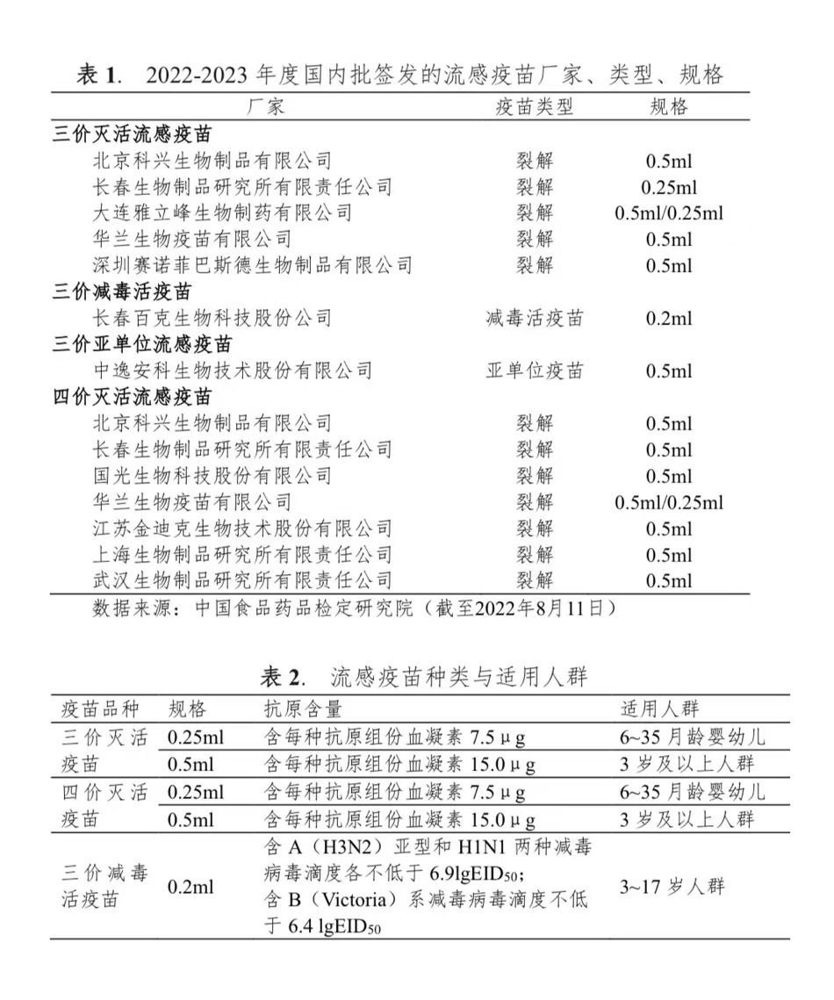

# 传染病专家：本轮甲流或将在3月下旬进入尾声，流感也会有重症的风险

近日，重庆、广东、江苏南通等地疾控部门陆续发布了甲流的科普预防信息，对于甲流的预防措施，多地均有推荐接种流感疫苗。

中国国家流感中心3月2日发布的2023年第8周流感检测周报称：本周南、北方省份流感病毒检测阳性率继续上升，A(H1N1)pdm09为主、A(H3N2)亚型流感病毒共同流行。南、北方省份流感样病例百分比继续上升。本周共报告390起流感样病例暴发疫情。

“三年来，由于新冠病毒‘压制性’的大流行，甲流、乙流等流感均处于低水平流行状态；随着春节后人口流动加剧及各地学生陆续开学，以甲流为主的流感也进一步形成小高峰。”一位传染病学家告诉第一财经，根据《中国流感疫苗预防接种技术指南（2022-2023）》（下称《技术指南》）来看，由于不同人群感染流感后的临床严重程度不同，有7类重点人群应该优先接种流感疫苗。

该传染病学家参与了我国流感病毒诊疗方案的撰写，他表示，7类重点人群分别是：2至23月龄的婴幼儿，2至5岁儿童，60岁及以上老人，特定慢性病患者（心脑血管、肾功能不全、代谢性疾病等），医务人员，6月龄以下婴儿的家庭成员和看护人员以及孕妇等，“与新冠不同的是，流感重点人群增加了5岁以下儿童部分，和6月龄以下婴儿的看护人部分。”

目前，我国现已批准上市的流感疫苗有三价灭活流感疫苗(IIV3)、四价灭活流感疫苗(IIV4)、三价减毒活流感疫苗(LAIV3)。其中，IIV3包括裂解疫苗和亚单位疫苗，IIV4为裂解疫苗，LAIV3为减毒疫苗；厂家涵盖科兴生物、长春生物、华兰生物等多家企业。

_（图为2022-2023年度国内批签发的流感疫苗厂家、类型、规格。来源：《中国流感疫苗预防接种技术指南（2022-2023）》）_

“由于流感疫苗在我国属于第二类疫苗（居民自愿、自费接种），因此，按照世界卫生组织和我国流行病学检测情况，接种三价疫苗足以有效应对包括甲流2个毒株H1N1、H3N2，以及乙流1个毒株Victoria在内的三种不同毒株了。”该传染病学家说，从接种保护期来看，疫苗保护时间在8至10个月；而从接种时间来看，通常以每年11月至12月流感流行的趋势来看，建议在10月份进行接种；此外，每年流感的流行期在1个多月左右的时间。

“从近2周的线上咨询情况来看，儿科咨询甲流问题的人数较之前有攀升。”微医全科杭州中心副主任医师刘勇进告诉记者，从甲流每年的流行季节看来，多为冬春交替时期，比如北方一般是11月至12月；南方一般是4至5月，中间可能也有一些小高峰如6至8月份，“由于前期已经流行了2周多时间，这一轮的甲流或将在3月下旬进入尾声。”

对于选择何种疫苗种类，刘勇进称，国内现有流感疫苗在安全性、有效性上都经过多年验证了，“如果是对蛋白质过敏的人群，则不适合接种经鸡胚培养的疫苗，接种前最好询问医生建议。”

上述传染病学家也表示，流感在一定程度上也会有重症的风险，这也是我国每年都会编撰流感《技术指南》和相关诊疗方案的原因，“除了上述几类重点人群外，学校、养老院等场所还是要做好通风，做好个人防护，以应对可能发生的甲流传播。”

