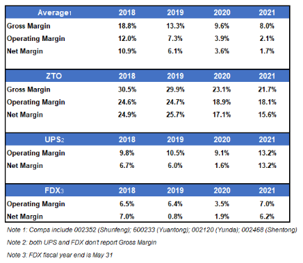
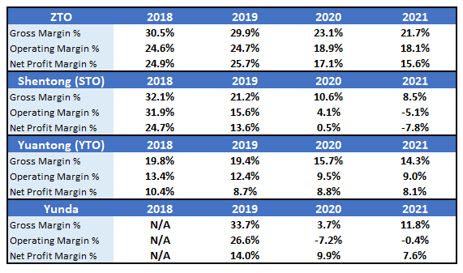
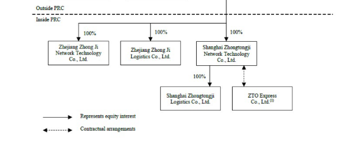
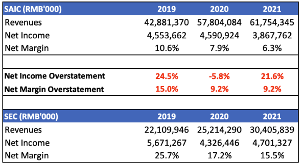
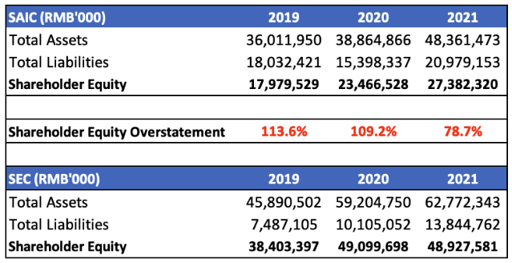
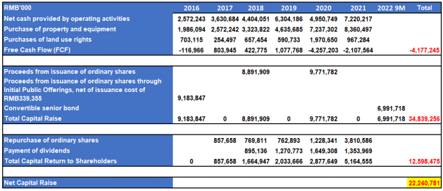
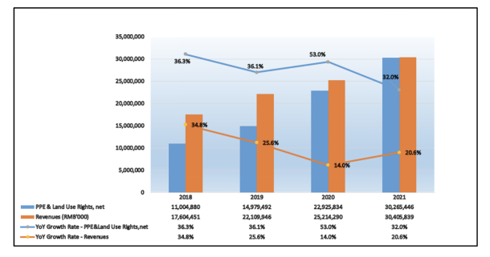
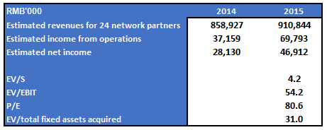
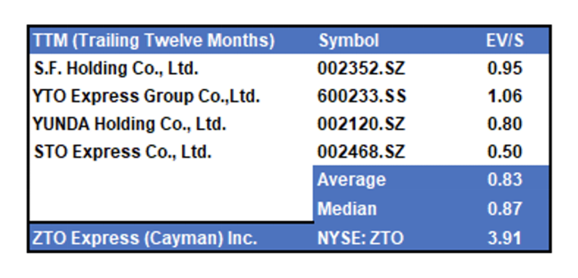
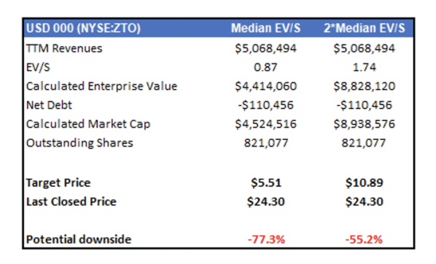

# 做空机构直指中通快递“五宗罪” 称股价至少有50％下跌空间

划重点

  * _1_ 报告指出，中通快递递交给美国证交会（SEC）的财报数据，与其在国内向工商总局提交的报告数字之间存在差异。
  * _2_ 除了收入和利润数字不一致之外，做空机构还发现，在资产负债表中也存在着显著的差异。
  * _3_ 报告认为，中通快递通过无法验证的资本支出数字调控利润数字，用高利润率在资本市场中吸引投资者，获得融资。
  * _4_ 另外做空机构认为，在“新冠”措施下，中通依然有巨大的资本扩张，与大环境大趋势不相符。

腾讯新闻《潜望》 纪振宇 3月2日发自硅谷

曾经针对蔚来汽车发布做空报告的美国做空机构“灰熊研究”（Grizzly Research），如今又有了新的目标。

美国当地时间3月2日，这家机构发布了一份做空报告，称中通快递超高的盈利能力引起了这家机构的怀疑，经过细致尽调后，这家机构认为，中通快递存在着提交给美国证券交易委员会（SEC）财报和中国工商局的数据不一致、未纳入外包人员成本、通过关联交易令内部人士获利等几大疑点，并指出，中通快递提交给美国证交会的财务数据不可靠，股价存在显著高估，目前该公司的市场价格，相比其真实价值，在中长期存在50-70%的下跌空间。

在该做空报告发布后，中通快递一度在当天的美股市场盘中下跌超3%，但随后股价出现一定程度反弹，维持小幅震荡，截至收盘，中通快递小幅下跌0.25%。

截至发稿，中通方面未对该做空报告所指问题做出回应。

**一个“疑点”：盈利水平远超同行**

灰熊的这份做空报告首先将中通快递的盈利能力与国内主要大型快递公司，以及美国的大型快递公司UPS和联邦速递（FedEX）进行对比，发现中通快递的毛利率、运营利润率和净利润率这几大反映企业盈利能力的关键指标，均远超国内快递行业平均水平，也大大高于美国的UPS和FedEX。

例如在2021年，包含顺丰、圆通、韵达、申通在内的中国快递业平均毛利率为8.0%，运营利润率为2.1%，净利润率为1.7%，而相应的中通快递的这三项指标分别高达21.7%，18.1%和15.6%。

_中通快递盈利能力显著高于同行业对手_

_近年快递业下滑，中通盈利能力继续保持领先_

过去几年，虽然中通快递与全行业一样经历了业绩下滑，但即便如此，各项盈利指标依然在全行业独占鳌头。

报告称，中通的盈利能力一度能够与大蓝筹公司苹果相提并论。

报告称，为了对比更加公平，需要考虑到圆通、申通、韵达速递的财报中包含了“最后一公里”递运服务的相应业绩，而中通的财报中不包含这一部分，但即便将这块因素剔除后，中通快递的盈利表现，依然远高于同行业其他竞争对手。

_剔除“最后一公里”业务的行业横向对比_

基于此，报告认为，中通的业务一定很“特别”（Special），能够取得这样卓越的盈利能力表现，要么是这家公司有着非常卓越优秀的管理团队，要么是它的财务数据太好而不真实（too
good too be true）.

“虽然我们希望相信ZTO的管理团队是非凡的，但我们的尽调却将我们引向了投资者被欺骗了这样的方向。”报告称。

**提交给美国证交会和工商总局的财报数据不一致**

在提出了“盈利能力异乎寻常地高”这样的疑点后，报告展开了论证。首先指出，中通快递递交给美国证交会（SEC）的财报数据，与其在国内向工商总局提交的报告数字之间存在差异。

具体来看，首先报告引用了中通快递在年报中披露的公司架构，中通在中国境内共有五家关联实体。

_中通披露的公司境内架构_

该做空机构获得了这5家实体在2019年至2021年向工商总局提交的报告，将其中的数据汇总后与中通快递向SEC递交的财报进行对比。

_提交给工商总局的汇总数据与SEC文件数据不一致_

比较后发现，中通快递在两边提交的数据存在显著差异，例如2021年，向工商总局提交的报告中，总收入为617.5亿元，而向SEC提交的财报中，总收入为304亿元，少了一半。而净利润在这两份报告中的数字分别为38.67亿元和47.01亿元，净利润相差21.6%。

这样的差异，使得中通向工商总局提交的业绩净利润率为6.3%，而向SEC提交的报告净利润率为15.5%，高出了9.2%。

收入和利润数字不一致的情况同样也发生在2019和2020年的报告中。

除了收入和利润数字不一致之外，该做空机构还发现，在资产负债表中也存在着显著的差异。

_未纳入外包人员成本_

根据以上该报告揭示出的财报数据不一致的情况，该做空机构又引出新的论点，认为造成财报数据不一致，中通快递在向SEC提交的财报中盈利能力特别高的原因是：中通快递进行了“有选择性的筛选”（cherry
pick），即有意将旗下盈利能力好的实体的财报数据，纳入到总的财报业绩中，具体是通过旗下“合作者网络”（network
partners）模式，以及已披露和未披露的关联方交易来实现。

对于报告所提到的“合作者网络”模式，在中通2016年上市招股书中，对此也有详细解释，指的是中通集中于建立核心的分拣中心和长途运输网路，并依赖于“合作者网络”来实施最后一公里的运送服务。

基于这样的商业模式，中通是专注于核心业务，同时将“最后一公里”递送服务外包出去。

但报告指出，这样的模式恰恰给了中通操控财务数据的空间。

根据中通的财报，从2016年至2021年，其直属网络合作方从3500增长至5700，非直属网络合作方2016年至2018年从4200增长至5200，从2019年起，中通不再披露非直属网络合作方的数字。

尽管中通在向SEC提交的文件中披露，与外包公司签订协议，但与外包工作人员并没有直接的合同关系，也不对外包人员承担任何义务，但做空机构发现2021年8月中通董事长赖梅松的一段采访成，目前中通自有员工和外包员工的社保都已经100%缴纳。

因此做空机构认为，中通未能将这部分员工的成本纳入进来，导致利润虚高。

_利润率奇高
但却一直缺钱 通过资本市场“输血”_

尽管中通快递的利润率奇高，但运营现金流却一直紧张，需要通过不断地对外融资输血，这也是做空机构提出的另一个明显矛盾的地方。

**运营资金连年失血 依靠资本市场“输血”**

从2016年至2021年，中通快递的自由现金流为-41.77亿元，同期通过上市、发股发债等方式融资总额348.39亿元，支付股息、回购股票等动用125.98亿元，这期间净融资222.41亿元。

由上可见，中通从2016年至2021年之间的业务，实际上是通过对外融资来为业务“输血”。

该报告进一步研究发现，2019年至2021年，中通快递的资本支出分别为52亿元、92亿元和93亿元，做空机构认为，在“新冠”措施下，中通依然有如此巨大的资本扩张，与大环境大趋势不相符。

_资本开支增幅显著高于收入增幅_

从以上图表可以看出，从2018年至2021年，中通快递的收入增幅在每一年都显著低于资本开支相关的增幅。

做空报告称，通过查看中通快递在港交所上市提交的招股文件显示，公司未能取得一些用于包裹分拣和办公用途的土地的使用资格证，缺乏这些土地和办公楼的详细信息的情况下，投资者无法评估中通快递购置土地、办公用地等资本支出的真实价值。

因此，做空报告认为，中通快递通过无法验证的资本支出数字调控利润数字，用高利润率在资本市场中吸引投资者，获得融资，至今为止这套策略十分奏效，从2016年上市以来，中通已经从资本市场融资348亿元。

**通过并购交易和关联交易 令内部人士获利**

做空报告指出，从2014年至2015年，中通支付了1.22亿现金和36.6亿价值的股票收购了24家网络合作者。但这些网络合作者的固定资产总值仅为1.22亿元，正好等于中通所支付的全部收购现金总额。

做空机构认为，根据中通所提交的公开数据，中通对于这些收购对象支付了过高的收购费。按照收购价格和这些被收购对象的运营、财务计算，2015年收购的企业价值和息税利息前利润比例高达54.2倍，市盈率高达80.6倍，企业价值和固定资产比率高达31倍。

_高价收购关联方交易_

另一个计算收购价格高估的指标是通过目前的加盟成本来计算，根据中通的收购价格，这24家被收购实体平均加盟费高达1.6亿元，而根据目前中通公布的即便是在省会城市，加盟投资费用也仅为32.2万元。

更离奇的是，报告指出，根据企查查数据，2014年进行的8起收购中，3起并没有发生所有权变更，2015年进行的16起收购中，有6起未发生所有权变更。这些被收购公司，在8年后，并没有体现出中通是它们的股东。

在可疑的关联交易方面，做空报告指出，桐庐通泽物流公司和上海铭育条码技术公司有重大嫌疑。

做空机构认为，桐庐通泽物流公司与中通快递的关系已经超越了关联方，而应该算作子公司，根据公开资料显示，该公司40%股东实控人王芳，同时也是中通集团服务质量中心总监。

从2014年至2021年，中通每年向桐庐通泽物流公司支付交通服务费，但同期该公司缴纳社保员工数从1380名减少至2020年的17名，但中通支付的缴费服务费并没有相应显著减少。

对于另一家公司上海铭育，做空机构称该公司的实控人赖铭松为中通董事长赖梅松的兄弟。2017年至2021年，中通向上海铭育支付的货款连年上升，2021年达到2.35亿元，但同期公司的员工仅从41人增加至53人。

做空机构还发现，上海铭育的财务总监同样也担任中通快递的会计，这给财务操纵也带来了便利。

**更多“可疑”的关联方交易**

做空报告称，截至2021年12月31日，中快桐庐和浙江通誉合计欠中通快递6.11亿元。

做空机构发现，中通快递的首席运营官胡红群，同时也是浙江通誉的主要持股人，浙江通誉的法人代表赖建昌，也是中通快递的关联方。

报告认为，中通快递向由内部人士实控的房地产项目提供贷款，将投资者暴露在近年来显著下行的房地产行业的风险下。

除了向上述两个实体提供贷款外，做空机构还发现，中通快递还通过不同渠道，向员工提供了总额3亿元的贷款。

报告认为，中通快递被公司内部人士滥用，成为他们私人的“存钱罐”。

此外，该报告还通过实地调研，披露了一系列中通快递未公开披露的关联方交易，这些关联方的实控人为中通董事长赖梅松和他的兄弟赖铭松。

报告还指出，至少有4家未公开披露的关联方，用于将中通快递的成本移至表外。

**总结：股价高估55%至77%**

做空机构认为，中国有许多家大型快递公司，根据同行业横向估值对比，考虑到用企业价值与销售比这样的比值（EV/S）来做估值的基准更加公允。

由上表可见，中国除中通快递的4大快递公司的平均EV/S为0.83倍，中位数为0.87倍，目前中通快递的EV/S高达3.91倍。

如果按照全行业的EV/S中位数进行估值，中通的股价应为每股5.51美元，相比2023年3月1日中通快递在美股的收盘价每股24.30美元要低77.3%，如果根据2倍EV/S进行估值，应为每股10.89美元，较每股24.30美元要低55.2%。

这份报告最后总结道：“尽管我们相信中通快递有一些基本面的价值并且尊重该公司在快递行业所取得的成就，但对于他们向SEC提交的报告有着非常重大的担忧。”

报告指出，已经披露和未经披露的众多关联交易应该引起投资者警惕，特别是这些关联交易与中通快递的核心业务并不直接相关。更进一步，我们相信，我们已经展示了众多的以牺牲股东利益作为代价的、令内部人士获利的利益冲突的情况。

“我们相信中通快递提交的SEC财务报告不可信，并且股价在短期和中期至少有50%的下跌空间。”

**中通快递概况：**

根据中通快递官网信息显示，创建于2002年5月8日，是一家以快递为核心业务，集跨境、快运、商业、云仓、航空、冷链、金融、智能、兔喜社区生活服务、中快数字营销等生态版块于一体的综合物流服务企业。

2021年，中通快递全网服务网点30,400+个，转运中心99个，直接网络合作伙伴5700+个，自有干线运输车辆10,900辆（其中超9000辆为高运力甩挂车），干线运输线路约3700条，网络通达99%以上的区县，乡镇覆盖率超过93%。2021年，中通快递全年业务量达到223亿件，同比增长31.1%。

中通快递于2016年在美国纽约证券交易所上市，融资14疑美元，是当年美股市场最大规模的IPO。2020年9月29日在香港实现二次上市，成为首家同时在美国、中国香港两地上市的快递企业。

根据前瞻产业研究院的研究报告显示，2021年，中国快递行业上市企业中，中通快递业务量市场份额最高，超过了20%，其次是韵达股份和圆通速递，市场份额均超过15%;上述三家头部企业市场份额合计超过50%。

截至2023年3月2日，中通快递市值约为200亿美元。

**关于做空机构灰熊研究：**

灰熊研究（Grizzly Research）是一家专注于通过对上市公司的尽职调查，提供研究观点的研究机构，由Siegfried G.
Eggert创办，该机构在美国的团队由会计师、经济学家、工程师等组成，灰熊研究在中国有一支调查团队，从事实地调研工作。

该机构通过研究和实地尽调，对并购交易、结构化投资交易等提供咨询服务，主要客户包括家族办公室、对冲基金、投行和企业等。

