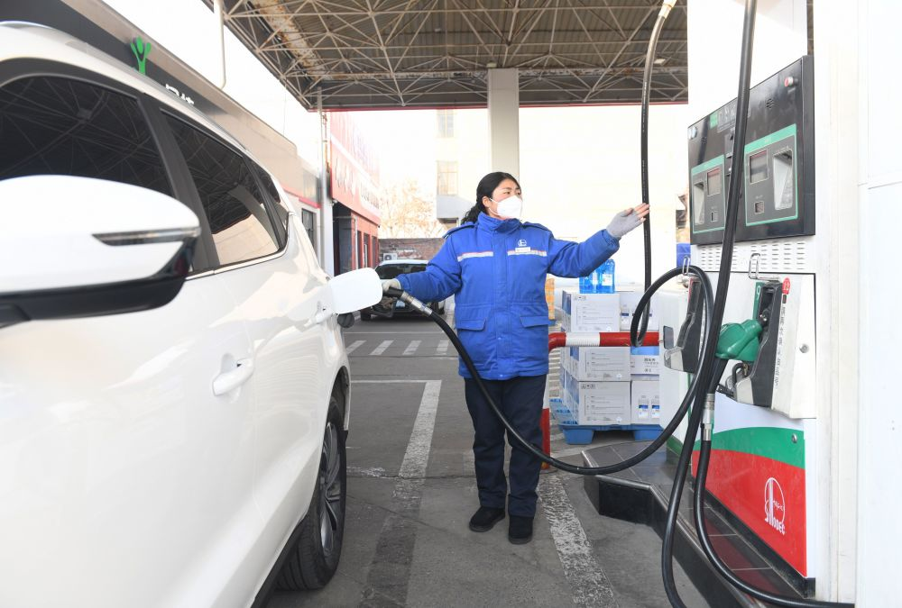

# 国内成品油调价再度搁浅，短期油价仍难有趋势性方向

_资料图/IC_

国内成品油价格调整迎来年内再次搁浅。

据国家发改委网站3月3日披露，自2月17日以来，国际市场油价震荡运行，按现行国内成品油价格机制测算，3月3日的前10个工作日平均价格与2月17日前10个工作日平均价格相比，同时考虑2月17日未调价金额，累计调价金额每吨不足50元。根据《石油价格管理办法》第七条规定，本次汽、柴油价格不作调整，未调金额纳入下次调价时累加或冲抵。

卓创资讯成品油分析师许磊表示，本计价周期，原油变化率继续以负值开端。周期内，国际原油窄幅区间震荡，市场预期美联储继续加息担忧石油需求下滑，但是东欧削减供应以及中国经济前景改善对油价带来支撑，多空因素交织令原油窄幅波动。

2023年至今，国内成品油市场历经5次调价窗口，为2次上调，1次下调，2次搁浅。标准汽、柴油分别累计上调255元/吨和245元/吨，折合升价为92#汽油，95#汽油，0#柴油分别上调0.20元，0.21元和0.21元。

**短期汽油需求坚挺，柴油价格预计震荡偏强**

国投安信期货分析师王盈敏对贝壳财经记者表示，汽油需求方面，近期暂无节假日利好，但气温回升、居民短途出行及以商务出行为主的长途出行频率增加，对汽油需求有一定拉动。所以，短期汽油终端需求虽无较大增量，但整体需求表现较为坚挺。

柴油需求方面，截至2月21日全国工程项目开工率达86.1%(环比+9.6%），户外工矿基建开工率提升明显，加上春耕陆续启动农业用油增加，柴油需求向好预期不改。

最近一周汽油库存呈现出社会库存、地炼库存下降，主营炼厂库存上涨情况；柴油库存则呈现出主营炼厂、地炼库存均涨，社会库存下降的情况，主因近期部分炼厂减少汽油调和量，业者逢低入市采购汽油操作增多，且前期业者已阶段性集中备货柴油，后续入市采购较为有限。截至3月2日，山东独立炼厂汽油总库容率为20%(环比-2%)﹔柴油库容率为23%(环比-1%)。

价格方面，3月成品油出口计划环比2月出现大幅下滑，其中汽油计划出口环比2月微升，柴油计划出口环比下滑80%左右。炼厂装置检修计划表显示3-4月主营及地炼陆续有炼厂检修，开工率预计有所下滑，当前汽油需求维持平稳情况下供应边际收紧或对汽油价格形成一定提振。

柴油方面，近期京津冀地区工矿基建开工率或将有所下滑，一定程度减少柴油需求。此后，随着需求持续好转叠加炼厂检修增加，导致供应出现减量供需边际好转情况下柴油价格或将迎来反弹。同时，要考虑柴油计划出口量大幅下滑转内销带来的利空影响。

**短期原油价格仍难有趋势性方向**

原油方面，受美国需求和中国经济数据改善的迹象支撑，欧美原油期货价格录得两周以来的最高。许磊认为，下一轮成品油调价窗口有望正值开场，零售价格呈现上涨预期。

中信期货商品研究部副总监桂晨曦对贝壳财经表示，短期沙特和俄罗斯减产，从供应端为油价提供支撑。但由于库存积累现状，上方空间暂时有限。短期关注通胀高位使美联储可能改变加息节奏，对金融情绪影响程度。上半年基本面驱动先弱后强。若需求预期兑现，油品由累库转为去库，原油价格中枢有望抬升。

从中期来看，国际油价继续围绕85美元附近震荡，振幅持续收窄，均线逐渐走平。年初以来布伦特原油价格在80-90美元/桶区间已经历四轮震荡波段。

从原油供需结构来看，需求端上，主要边际变化在于国内防疫政策的全面放松，国内出行数据已经验证了需求端复苏的推测，国内经济活动恢复活力，旅客出行活动增多，成品油消费恢复增长，国内原油消费有望全面复苏。

供应端上，土耳其大地震一度破坏该国原油出口设施，造成短期内市场做多情绪升温，叠加挪威和俄罗斯减产，强化了原油供应端偏紧的预期。

另一方面，美国为了遏制高通胀，美联储依然维持鹰派信号，预计今年上半年加息周期还将持续。同时美国也将会采取逢高抛售储备原油库存的措施，来遏制通胀反弹，潜在利空开始浮现。叠加近几周美国商业原油库存持续增加，以及全球原油需求前景依然存在不确定性，弱需求对于原油的负面干扰始终存在。

市场人士预计，今年在原油供给趋紧、需求相对韧性的情况下，供需维持紧平衡。后市油价还将维持箱体宽幅区间震荡走势。预计今年布伦特原油价格以85美元/桶为中枢，维持高位震荡。

光大证券宏观团队指出，上半年需求抬升叠加供给受限，油价易涨难跌，仍存在上行空间。需求方面，国内疫后复苏红利释放、欧美经济相对韧性，以及后续季节性需求抬升，将推动原油需求上行。供给方面，欧盟对俄成品油出口制裁落地后，短期内俄罗斯部分成品油出口受限，开启主动减产，对油价形成支撑。

未来油价会否进一步上涨，要等待国内经济的进一步修复的情况；另外需要观察俄原油实际减产是否超预期；若后续紧缩预期弱化，美元指数回落将进一步支撑油价。

新京报贝壳财经记者 张晓翀 编辑 王进雨 校对 王心

