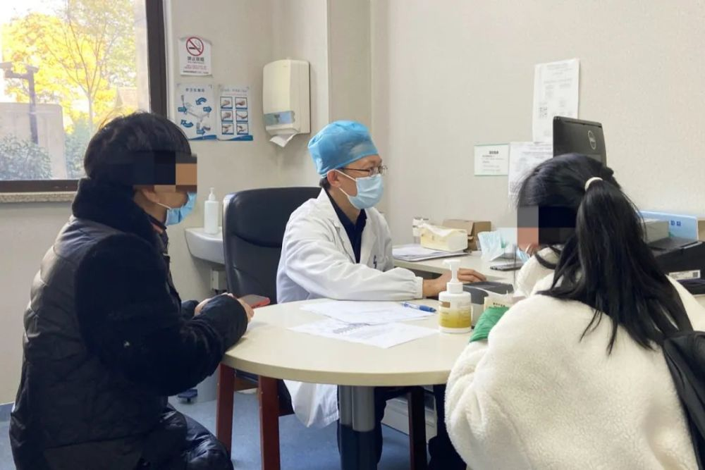
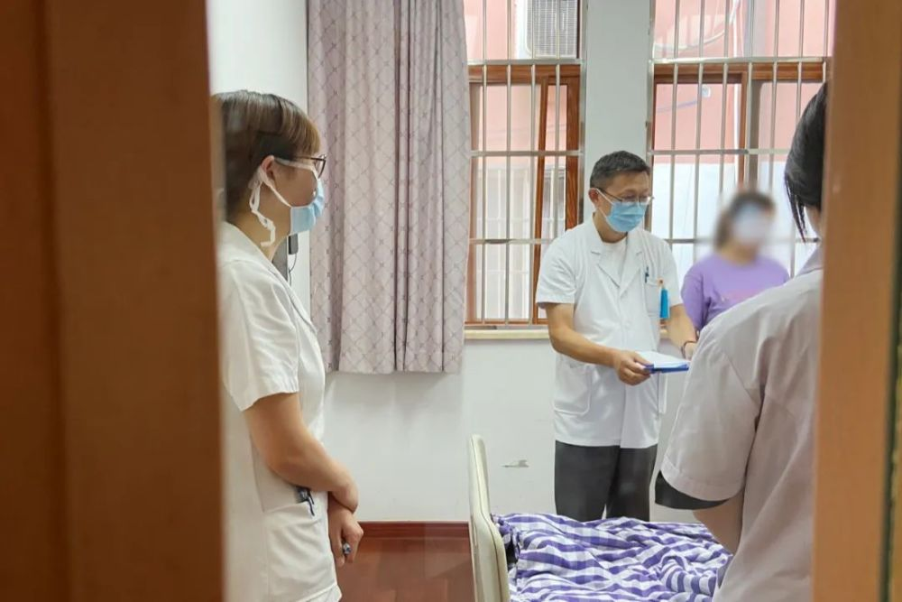
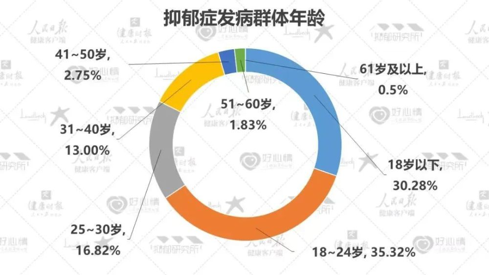
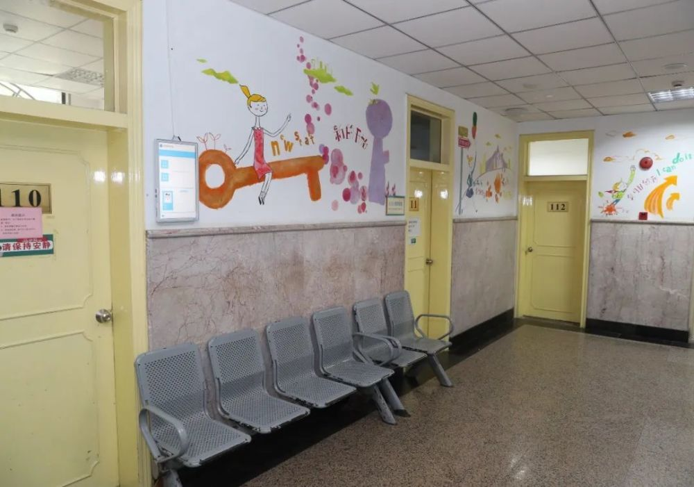
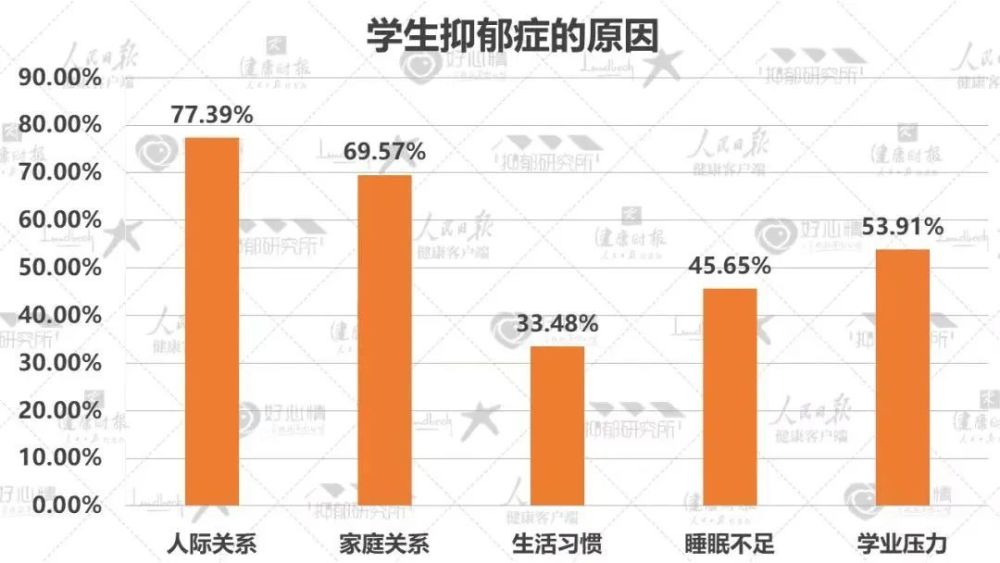

# 抑郁症缘何低龄化？医生感叹：孩子都想自杀了，父母还在想考试的事

_杭州市第七人民医院主任医师谭忠林在抑郁科对青少年做抑郁障碍诊断。受访者供图_

**文丨新京报记者 朱清华**

**编辑丨陈晓舒**

**校对丨李立军**

抑郁症低龄化的趋势似乎正在变得明显。上周，一组青少年抑郁症数据冲上热搜。

杭州第七人民医院（浙江大学医学院附属精神卫生中心）的数据显示，来抑郁科就诊的患者中，小于15岁的就诊人数从2018年3148人次增长到2021年的10613人次，三年增长了三倍多。

这只是一家医院具体的数据，范围更宏大一些的统计，也在上周公布。《中国国民心理健康发展报告（2021～2022）》2月23日发布。报告显示，青少年群体有14.8%存在不同程度的抑郁风险，高于成年群体，需要进行有效干预和及时调整。

抑郁症低龄化可以低到什么程度？北京安定医院梁月竹医生接诊过最小的患者是6岁，青少年心理专家徐凯文接诊的患者中，最小的年龄是10岁。

他们呈现的症状更加多元、易变、难以理解。有人会刻意夸大症状，似乎更不愿意自己的病情迅速好转，有患者会在心理咨询中坦率地告诉徐凯文，“我不想病好”。杭州第七人民医院的主任医生谭忠林说，有的孩子在就诊前一年就曾主动提出看医生，但被家长认为是“矫情”、“作”，直到自伤行为出现。

自行停药的患者不少见。上海精神卫生中心陈俊医生说，在一些家庭看来，似乎只有通过停药才能证明自己不是病人，才能摘除抑郁症患者的帽子。

整体上人们对抑郁症的认知程度有了提升，但是具体到每个细小单元，病耻感仍然围困着很多家庭。梁月竹曾经在出门诊时碰到过一个反穿校服的孩子，“我问他这衣服怎么穿反了呀？他妈说怕周围有人看见他是哪个学校的，怕暴露身份。”

我们采访了北京、上海、杭州三个城市的精神科医生、心理咨询师、心理危机干预专家，试图从具体的案例和数据中去看见，抑郁症在走向低龄化的过程中正在面临的问题。

抑郁门诊“低龄化”

2月22日，杭州市第七人民医院，抑郁障碍病区谭忠林主任一天的门诊，往往从抑郁自评量表开始。

“就像没有两片树叶完全一样，没有两个抑郁症病人是完全一样的。”2月下旬的一天，谭忠林接诊了22位患者，他做了简单的统计，12岁到17岁的有8位，18到25岁的有3位。青少年就诊人数接近门诊量的二分之一。他回忆，这样的趋势大概从五六年前开始。

大多数时候，青少年是在父母陪同下就诊的，医生可以从两个视角去了解症状和日常情况，一些微妙的回答就会出现。比如，一位13岁的男孩平板电脑不离手，也不做寒假作业，被母亲带来了诊室。

谭忠林记得，母亲陈述时，男孩总在笑。谭忠林询问：“量表结果显示正常，你觉得是否符合自己的情况？”男孩看向母亲，反问：“她一直在旁边让我选那些好的，我选不好的就问怎么可能、哪有那么严重。量表结果怎么会不好？”

_‍‍杭州市第七人民医院主任医师谭忠林在抑郁障碍病区查房。受访者供图_

还有的时候分歧在于“时间”。比如一个15岁的女孩，在医生询问她既往情绪出现了多长时间，是否看过医生时，她的回答是，“我一年前就提出来要去看医生，但是被否掉了。”

在父母的叙述里，“最近”两个字频频出现。“最近”有了割伤自己的行为，“最近”在学校里无缘无故地哭，“最近”有点不对劲，实际上在女孩的自我感知中，出现症状的时间久远得多。

自评的时候过分夸大症状，这样的情况也不少见。当父母觉得，孩子是在有意往严重的方向回答时，谭忠林往往会反问，“他这么故意夸大的目的是什么？这代表了他的一种想法一种倾向。是不是一些需求得不到满足？”

北京安定医院是全国第二家专门设立儿童精神科的医院，儿童精神科一共有十几位医生，人手紧缺，很多挂不上儿科号的人甚至会挂到成人科。

儿童精神科的梁月竹主任医师，接诊过最小的企图自杀的患者是6岁。这让梁医生感到震惊。她记得，就诊的时候，6岁的孩子甚至对很多事情还不太懂，但就觉得“活着没意思，别给爸爸妈妈带来麻烦了”。因为孩子在家常常念叨这样的话，家长有些不知所措，带来医院就诊。

问诊的过程和大多数孩子一样。症状也呈现出很多共性，比如情绪低落，兴趣减退、精力下降，甚至有自伤倾向。梁月竹主任谨慎地开出了6岁儿童适用的抗抑郁药物。这位6岁儿童的诊疗结果是“抑郁状态”，最终通过药物治疗缓解了症状。再次达到康复复诊的时候，说到曾经的负面想法，孩子对既往出现的情况有所认识并有些不好意思。

_《2022年国民抑郁症蓝皮书》显示:18岁以下的抑郁症患者占总人数的30%；50%的抑郁症患者为在校学生。图片来源：抑郁研究所_

互联网时代下的青少年抑郁

在上海精神卫生中心，精神科的门诊中大约有超过三分之一的患者是青少年。

陈俊医生擅长难治性抑郁症，在他的门诊当中最小的年纪是初中生。陈俊医生说，近年来的青少年症状呈现新的特点，比如网络暴力，跟网络相关的不良发泄形式，比如非自杀性的自伤。“很多孩子来（门诊），第一个主诉并不是说我情绪抑郁了，或者我情绪很焦虑很紧张，他可能第一个主诉是他做了很冲动、过分的举动。”

他接诊过被网暴的青少年，也接诊过网暴别人的青少年。陈俊说，网暴别人的青少年，在现实中往往没有太多朋友，倾向于网上打游戏，在网络中谩骂别人，说出各种各样难听的语言，有时自己骂得不过瘾，还要召集一群人一起骂。

网暴别人的人，怎么意识到来看精神科？陈俊介绍，很多人往往是影响了正常学习，被学校要求来看病。还有人是在家里出现了过激的态度和行为，被父母带来看病。而网暴别人的根源，往往指向情绪状态。“他的情绪不好，要通过这种方式让自己感觉好一点，让自己感觉凌驾于其他人。”

在梁月竹的诊室里，经常遇到沉迷于玩电脑、玩手机，不上学也不解释的患者，孩子自己本身情绪低落、厌倦生活，干什么都觉得没意思，也给周围的人带来持续的痛苦。梁月竹说，类似的情况，三年来特别多。“沉迷手机是结果，而实际上原因是心理状态发生了变化。”她介绍，很多家长因为孩子沉迷手机来就诊，而实际上这是孩子缓解内心痛苦的一种应对方式，因为无聊，就用玩手机来逃避，消磨大量时间。

精神科医生要做的，是发现沉迷手机背后的心理机制。再结合对症治疗、心理咨询、现实吸引等方法帮助孩子走出来。

长期从事青少年心理健康工作的徐凯文，曾在北京大学心理健康教育与咨询中心担任总督导。他认为互联网时代下抑郁的一个明显特点是，手机战争加剧了亲子关系的冲突。因为情绪出了问题，向手机寻求慰藉，由手机而起的亲子冲突反过来又会加重抑郁情绪。

此外，徐凯文在咨询中观察发现，现在的青少年是网络的原住民，对互联网熟悉，在互联网上容易学到一些精神异常的表现。“所以他的症状也会有表演的色彩或者模仿的色彩，使得症状更加多变多样、难以理解。”

_上海精神卫生中心儿少精神科门诊邀请艺术学院的学生在墙壁上画漫画，希望能让就诊的孩子消除紧张。受访者供图_

困在病耻感里的家庭

抑郁症识别不易。谭忠林说，抑郁有时候仅仅只是一个冒出来的线头，底下可能连着错综复杂的树根。相比起孩子夸大自我症状的同时，父母往往会弱化事态，认为是矫情，是“找事儿”，以自己的感觉代替了孩子的感知。“任何时候如果青少年自己感觉到痛苦，提出来看医生，父母亲恐怕是要支持，因为你不能以你看起来都还好，以这句话来作为理由拒绝，你一天有多少分钟看见他？”

在诊室里，安定医院的梁月竹医生经常听到父母说的话是，“没发现他有什么不对啊。”没有意识的家长，前期通常无法识别孩子的求助，导致就诊不及时。

还有不少人会把得了抑郁症等同于不坚强，软弱；有的父母亲会把孩子得抑郁症归结为自己教育不当，犯了错误。“就像高血压一样，我们不是说父母故意要让他下一代得高血压，我们也不能说他的高血压都是自己作出来的。”

夸大抑郁症，污名化抑郁症，草木皆兵，弱化了抑郁症，则延误时机。抑郁症是多方面因素相互作用的结果，谭忠林认为，正确的看法是意识到抑郁症是一个疾病，是病就要接受系统的治疗，接受治疗过程中的起伏和波动，不能低估治疗难度。

识别之难，对边远地区来说更为明显。根据2019年《柳叶刀·精神病学》，中国儿童精神科医生人数不足500人，且分布不平衡，优质儿童精神科医生大多集中在一二线城市的三甲医院。一些偏远市和县甚至没有一个正规的儿童精神科医生。

锁朋是心理危机干预方面的专家，她给北京的高校、四川的乡镇都做过校园心理危机干预的培训。她举例说，云南高一的一名学生因为胃肠不舒服休学了2年，到18岁需要重新上高一，但他越来越不愿去上学。直到出现自杀的想法，学校和家长才发现可能与心理健康问题相关。

_锁朋在学校做心理危机干预培训，普及心理急救实用技能，参与培训的人员，包括班主任、心理老师、宿管员、校医、安全校长等。受访者供图_

从肠胃不舒服，到走向精神科，这中间经历了漫长的链条。先是医院的消化科，后来是心内科、神经科，最后才来到精神科，从接受抑郁症这一观念，再到坚持吃药、寻求心理咨询，中间每一环节的求助路径，在边远地区可能都会遇到困境。“发现他是抑郁要去看病，有一个观念上的屏障；他走进精神科，可能会遇到专业诊疗上的屏障；心理咨询一个小时几百块，又面临一个经济上的屏障。”

准确识别抑郁症之后，病耻感仍然围困着很多家庭。梁月竹曾经在出门诊时碰到过一个反穿校服的孩子，“我问他这衣服怎么穿反了呀？他妈说怕周围有人看见他是哪个学校的，怕暴露身份。”

病耻感还有一个常见表现是擅自停药。陈俊医生说，有的家长认为，“你看起来挺好的，也工作了，怎么还吃药呢？”在他们看来，只有通过停药才能证明自己不是病人，才能摘除抑郁症患者的帽子。

安定医院的梁月竹医生有着切身的体会。她回忆，有一位患者，治疗得“特别好”，但家长在好转之后把前期的症状归结为青春期叛逆，而不是抑郁障碍。在未经医生知晓的情况下擅自停药，停药之后再次复发则特别严重，出现了伤人毁物的情况，不得已只能住院治疗。有了这次经验之后，孩子家长提高了认识，孩子学会了自我管理，坚持按时服药，最终慢慢康复，一路读书到博士学位。

_《2022年国民抑郁症蓝皮书》显示:77%和69%的学生患者在人际关系和家庭关系中易出现抑郁。图片来源:抑郁研究所_

**药物干预与心理治疗**

抑郁症治疗方式除了药物治疗、物理治疗外，通常还要进行心理治疗。《2022年青少年抑郁功能恢复蓝皮书》显示：91.97%的青少年患者尝试过药物治疗；其次是心理治疗，占比77.95%。

抑郁症是生物学上的疾病，避免不了药物干预。

几位医生都提到，青少年的抑郁症通常会表现出躯体症状。比如说腹痛、头痛，上海精神卫生中心的陈俊医生说，也有的青少年会表现为拒绝上学，大喊大叫甚至是攻击行为，他们更倾向于通过这些有伤害性的行为来缓解内心的难受。除了情绪和身体不舒服之外，还会对认知功能造成影响。比如，无法集中注意力，记忆力下降。

谭忠林曾经遇到很多不了解的人发问，抑郁症是情绪低落，难道会有药物让自己心情好起来吗？“大脑跟情绪密切相关，用药物来治疗心情，就像用药物来治疗高血压一样。”

研究表明，抑郁障碍患者经过完整的抗抑郁药物序贯治疗后，临床痊愈率为67%，但90%以上患者仍有残留症状。比如仍然有睡眠障碍，但是可以上班可以学习。

“可能很多人都有这种误解，觉得看精神科医生就是叫你吃药的。其实不是的，我觉得更精准的定位是，精神科医生帮你做整体评估和治疗方案。”陈俊医生说，开药虽然常见，但背后是一整套严密的身体检查包括验血等环节，而且，对一些外界诱因明晰的患者，心理咨询同样重要。

“你了解一个人生了什么病时，恐怕要先了解这是一个什么样的人生了病。”谭忠林觉得，应当把青少年的病放在他的家庭、他所处的环境、他的经历中去理解。药物治疗对症，心理咨询往往更针对病因，比如学业压力、师生关系、亲子关系，去探究病因背后情绪的来源，给情绪提供疏解的通道。

比如，徐凯文接诊的患者中，最小的年龄是10岁。这位10岁的孩子，最主要的问题是在学校里有攻击性，并且表现出自杀倾向。

为什么一个10岁的孩子会有很强的攻击性，经常打人呢？经过问诊以后徐凯文发现，他的行为是跟父母学习的结果。父母打他，他就用同样的方式去跟别人交流。这次心理干预的结果是让孩子父母意识到，“如果父母不希望他有这样的一些危险性的行为，父母自己需要去调整和改善，控制自己，不能用这种打骂孩子的方式去教育孩子。”达成共识之后，亲子关系开始明显好转。

徐凯文说，患抑郁症的青少年，有时不是自己本身想要来咨询，往往是非自愿个案。这个时候，咨询师能否赢得青少年的信任，是痊愈的关键。比如，有的青少年症状来势汹汹，呈现出严重和危险的信号，但一旦和咨询师建立信任关系，“情况的改善可能是一个非常快速的过程。”反之，则很难取得进步。

_中国国民心理健康发展报告（2021～2022）》2月23日发布。报告显示，青少年群体有14.8%存在不同程度的抑郁风险，高于成年群体，需要进行有效干预和及时调整。图/IC
photo_

徐凯文也总结出青少年抑郁与成年人在心理上的不同之处。青少年的症状往往是用来应对他目前困境的方法，跟成年人相比，他们似乎更不愿意自己的病能迅速好转。“他们甚至于希望保持自己患有某种心理问题，因为这样他就有充分的理由不去上学，也就是说，他因病获益。”还有患者会在问询中坦率地告诉徐凯文，“我不想病好”。

陈俊医生也有同样的感受，在那些父母婚姻出现裂痕的关系里，患抑郁症的青少年倾向于认为，生病会让父母关系缓和，“他会觉得成为一个病人，父母就不会分开了，这样反而会强化他病人的角色。”

在谭忠林的观察里，很多患者的父母在诊室里会抢着说话，互相指责，甚至拍桌子。一个14岁的女孩后来对他说道，“我生了病之后父母的关系好像好了一些。”

徐凯文说，青少年在接受咨询的同时，父母往往也要接受咨询。“实际上我们接触的很多父母认识到自己教育方式是有问题的，所以他们会也会积极地寻求心理咨询的帮助，去调整自己的行为。”

守住自杀防线

锁朋介绍，根据流行病学调查，在中国，抑郁症患者中有10%到15%的人最终有可能死于自杀。中科院心理所祝卓宏教授2月份曾撰文称，在青少年自杀者中，中学生约占51％，主因是“抑郁症”。预防自杀成为一个抑郁症诊疗中的重要议题。

谭忠林跟进时间最长的一个案例，从高二到大学毕业。高二出现症状时，这位男生上课注意力无法集中，反应变慢，跟同学难以沟通，住校期间有明显的失眠，对学校不满，觉得周围的同学太Low，“因为这个学校是他中考发挥不好考进去的”，后期他开始拒绝上学。

就诊的时候父母讲得比他多得多，他似乎已经放弃了，不抱希望。他对自己100个不满意，对周围的人也很挑剔和苛刻。他认为父母的层次太低，觉得自己得抑郁症完全是父母的过错，“因为他们要他好好学习，只有学好了，才有前途，才能够多挣钱，才有好的生活。在他眼里父母属于庸俗的这一类人。”

这位男生接受了住院治疗，住院期间还参加了病房里的团体治疗，了解了其他八个病人的家庭情况。谭忠林问了他一句话，“如果把你跟他们换一下，你愿意换到谁家？”他很认真地想了一下，“我还是不换了。”

但不意味着经过一个疗程的住院治疗便一劳永逸了。谭忠林解释说，青少年抑郁症预后容易转为慢性或复发，和成人类似；60%--90%在1年内会缓解；50%—70%在5年内会再次出现抑郁发作。

在后续波动最严重的时候，这位男生考虑过放弃生命，那时候他已经上大学，站在某个楼顶给咨询师留言后，这次危机被成功化解。

差不多六年时间过去了，这位男生仍然在吃药治疗，心理咨询从最初的每个星期一次，到现在两个月一次，治疗还在继续。他能够接纳现在的工作，边工作边考研。

陈俊接诊过一个高三学生，身体状况糟糕，消极情绪严重，“他不用跑到教室，他只要在离学校近的地方，就很难受。”当陈俊在尽量了解患者的抑郁情绪，希望他能够放松下来时，另一边，父母却在边上不断施压，“医生有什么好办法让他快点好起来，他后天还要去考试。”父母的目标有时好像和“治愈”背道而驰，“其实我们作为医生，很多时候就想直接说，你们的孩子都已经快活不下去了，都要想到自杀了，你还在想明天考试的事。”

当青少年已经流露出自杀风险，该怎么去跟孩子谈？怎么去评估？现实中锁朋的发现是，几乎没有人敢谈。“这是个非常专业的技能，就像心肺复苏一样。”锁朋说，一般人听到孩子自杀的想法，往往不敢直接问，而是反复从自己的角度去劝告，“生命还有很多美好的地方，你现在还这么年轻，你要爱惜生命呀，你不要这样啊。”或者分享自己的经历，“我以前像你这么大也怎么怎么样啊，然后我也走过来了，你要多跑跑步啊。”

这些话语没有错，但常常被证明无效。她培训的内容是，首先要承认事实，体会和接纳他的情绪，并且要主动提问，“我感到你很低落，我非常地担心你，你是在考虑自杀吗？你什么时候开始有的这种想法？”比如有个孩子在天台被这样疏导了一个多小时以后，他主动跟老师说“我饿了，你带我去吃饭”。

锁朋还曾经在四川处理过一次自杀危机事件，一名成绩非常好的高中学生，晚自习时，他在学校自杀，因为抢救及时，顺利脱险。后来，家长和心理老师带着孩子去精神科住院，两个月后出院，在开学返校的过程中，他再次找机会自杀，不幸身亡。事后各个环节的人都在反思，“为什么他自杀我们还是没有防住呢？”

在实际案例中，一些学校难以迅速识别青少年的心理问题，也失去和家长的有效沟通，家长如果没有抑郁症概念认知，会错失治疗时机。在实际诊疗中，精神科医生、心理咨询师往往各司其职，一方不了解另一方的进程和效果，更多的时候只能通过复诊来询问情况。这样一套组合拳可能会呈现组合不好的情况。

值得庆幸的是，近年来，国家出台了多个文件预防青少年抑郁症。2019年，由12个部委联合发布的《健康中国行动——儿童青少年心理健康行动方案（2019—2022年）》明确要求，到2022年底，“基本建成有利于儿童青少年心理健康的社会环境，形成学校、社区、家庭、媒体、医疗卫生机构等联动的心理健康服务模式。2020年国家卫生健康委办公厅发布《探索抑郁症防治特色服务工作方案》，要求“将心理健康教育作为中学、高等院校所有学生的必修课，每学期聘请专业人员进行授课，指导学生科学认识抑郁症，及时寻求专业帮助等”。

一些好的转变正在出现。最近这一年，锁朋每周都会接到两三个校园心理危机干预的培训需求。培训对象中通常会设立一个危机小组，里面涵盖家长代表、宿管、校医、班主任、心理老师、安全校长等等，“只要能够发现学生有问题，能够及时守护的，我们都培训一遍。”比如，她会逐字逐句写下一个剧本，模拟自杀谈话现场，让危机小组的人练习如何守护现场，稳住情绪。

还有一些地方卫健委主动邀请，展开了包括警察、社区、心理咨询机构、精神科医生、班主任、心理老师在内的心理危机干预培训，一个青少年抑郁规范诊疗和预防自杀的社会链条逐渐清晰。

