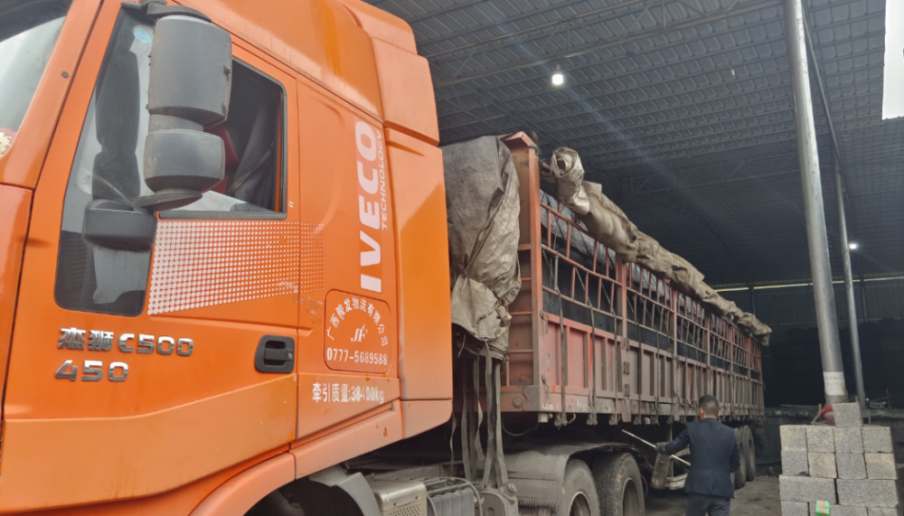

# 水电大省云南再度限电！需警惕四川、湖南、两广地区跟随限电限产

**丰富的水电资源，使得云南凭借低廉的用电成本，吸引一众高耗电行业来此投产。然而近年来，受来水量减少影响，云南地区限电消息不断，显著影响了以电解铝为代表的行业产能释放。**

2月下旬，云南再度传出当地部分行业企业压减用电负荷的消息，为了减少限电影响，已有企业将年度检修计划提前。

**证券时报·e公司记者采访多位行业分析人士了解到，此次云南限电仍受当地来水较少影响，也不排除其他地区跟随限电的可能。目前限电持续时长尚未有时间表，涉及行业产能已有所下调。**

**云南再度限电**

经历过2021年的“能耗双控”、2022年的限电停产，水电大省云南再度传出限电消息。这也是继2022年9月的两轮限电之后，云南地区第三轮大规模限电。

“2022年9月以来限电不断持续，第一轮限电压减产能规模10%，第二轮达到20%，而这一次进一步压缩运行产能，达到40%。”国内一大型铝企人士告诉证券时报·e公司记者，公司在云南的部分生产已依照当地要求关停，目前运行产能仅为总量的60%。

作为电解铝的上游企业，河南一碳素生产企业负责人也表示，上周有好几家云南客户落地了限电要求。如果时间持续较长，肯定对公司阳极销售有很大影响。“去年云南、四川的限电潮，就使得下游电解铝客户产能缩减，碳素用量也显著下降。现在本以为旺季临近，市场需求将向好，谁知云南限电又加码。”他感慨。

_运送碳素的卡车_

上海钢联铝事业部分析师姚馨也向证券时报·e公司记者证实，2月18日云南省电解铝企业已再度接到压减负荷要求，以2022年9月限电压产初期的企业生产及用电情况为基数，将累计压减负荷比例再度扩大。除文山某铝厂暂不要求外，其他铝厂的压减负荷比例扩大至40%~42%不等，目前已按要求于2月27日落实完成。

“
**早在今年春节前后，市场就传出了云南限电的消息，但直至2月下旬才正式落地。目前云南地区接到限电通知的电解铝企业已基本全部落地执行，没有关于持续时间的说法，大概率要等到丰水期或者云南水电情况好转后再有进一步通知。**
”3月2日，阿拉丁电解铝研究员苏延波接受证券时报·e公司记者采访表示。

因云南限电而生产受到影响的不仅是电解铝行业。

据光大期货有色金属分析师刘轶男介绍，近期云南已有多家精炼锌冶炼工厂收到限电通知。虽然还是年初，但很多云南锌冶炼厂已计划把年检提前到3月份进行，以减少限电对全年产量影响。

姚馨也提及，在落实电解铝限负荷要求后，锌及工业硅生产企业也陆续接到限负荷通知，说明云南省电力供应仍维持紧张态势。据Mysteel推演，三四月份西南地区仍存在一定电力供需缺口。

**来水不及预期**

2022年三季度后，云南等多地陆续限电，对包括电解铝在内的众多行业产生显著影响。2023年伊始，云南限电再度加码，主要原因还是来水不及预期所致。

**“去年由于夏季高温，全国用电量较高，多地水库水位下降较快。此后水库水位一直没有得到很好的回补，几大水库水位目前都处于近六年最低水平。若枯水季延长，云南水力发电量或将大幅减少。”刘轶男称，去年西南地区就出现了普遍干旱的情况，今年降雨量更是明显低于往年。**

_图片来源：阿拉丁_

姚馨表示，今年以来，四川南部、云南大部来水偏少八成以上。截至2月28日，四川南部、云南大部、贵州西部、广西西北部等地有中到重度气象干旱。而自2022年下半年开始的降雨偏少情况，导致云南省内各江河电站水位普遍处于低位，导致水力发电占比较大的云南省整体电力供应紧张，电力供需缺口较大。

作为国内的水电大省，云南水电装机规模居全国第二位。目前全国排名前十的水电站中，云南就有七座。2022年云南省发电量为3747.94亿千瓦时，其中水力发电量就达到3038.82亿千瓦时。然而水电“靠天吃饭”的秉性，使得当地电力供应处于不稳定状态，且难以改变。

“干旱或会对电解铝供给形成持续影响，今年不排除后续再次限电的可能。”苏延波认为。

刘轶男也指出，在今年云南各江河电站普遍水位线处于低位、降水量亦不及往年的背景下，当地仍有大批电解铝产能和晶硅产能有上马需求，省内用电需求大概率有增无减。在保障民生用电的前提下，云南近两年大量新增投产的电解铝、工业硅等高能耗项目，无疑在限电调控中首当其冲。

此外，由于云南很多电用于西电东送。一旦云南水电供应不足，恐将压减外送电量，需警惕四川、湖南和两广地区跟随限电限产。

**产能释放受限**

低廉的电价，优惠的招商政策，曾一度让云南成为高耗能行业产能转移的热土。

据上海有色网（SMM）数据，截至2022年9月初，云南省电解铝建成产能达561万吨，运行产能521.8万吨，占全国总运行产能的12.8%。“前期外迁至此的电解铝产能，已达到约260万吨。”姚馨表示。

苏延波认为，对下游生产企业而言，云南地区水电除带来生产成本优势外，还由于水电碳排放较低，符合国际企业对原材料生产过程运用绿色能源的标准，对于中游工业生产企业具有较大吸引力。但近年来云南当地限电限产情况频发，确实会对相关企业赴当地搭建生产线的信心产生影响。

**2022年9月，云铝股份（000807）、神火股份（000933）等上市公司就相继披露了因云南限电生产受限的情况。此后在2022年11月，神火股份公告，受限电等客观因素的影响，决定终止并购云南神火铝业有限公司40%股权。**

在公告的投资者关系活动记录中，神火股份也提及，水电整体上是靠天吃饭，公司和电网也不能控制具体来水量的多少。云南水电供应占到该省电力供应的70%以上，火电很难做到根本性的补充。丰水期和枯水期客观存在，短期内这种情况应该很难发生根本性改变。

上述在云南建厂的铝企人士就称，虽然对比山东、河南等地，云南的电费较低，但是由于近年限电影响，企业开工率持续走低，目前生产已经难有利润。“不仅开工率低，而且在设备启动和关停的过程中还会发生很多费用，整体电耗也比正常运转时要高，所以在云南建厂生产已经不经济了。”他说。

此番云南限电加码，无疑进一步对当地高耗能企业产能释放形成限制，从而对相关行业供给端形成影响。

“
**锌的单吨耗电量虽然不算大，但今年限电落地较快，量也较大。上周云南当地只有2家厂收到压减用电负荷的通知，涉及减产5000吨左右。但本月初就突然有多家工厂相继收到通知，合计减产量已达到1.5万吨。**
”刘轶男介绍，根据SMM统计信息，云南拥有锌冶炼产能105.36万吨/年，占全国产能的16.7%。如果当地限电持续，今年锌的市场供需平衡很可能会逆转。

而对于电解铝行业，苏延波表示，目前本轮限电影响电解铝产能规模在75万吨左右，加上去年限电涉及关停的105万吨产能，整体压减运行产能规模已达到180万吨上下。

**“今年云南限负荷导致当地电解铝再度减产后，国内全年电解铝供需将从过剩转为紧平衡，预计带动电解铝利润水平提升，成本将成为铝价重要支撑。”姚馨认为。**

**市价暂时持稳**

2022年西南多地的限电潮，一度使包括铝、工业硅、钛白粉等产品供应缩减预期升温，价格获有力支撑。而采访中证券时报·e公司记者了解到，本轮云南限电加码带来的供给缩减预期，尚未在相关产品价格端有显著体现。

“目前限电落地的只有云南地区。在全年锌产量预期较好的情况下，目前市场对于限电消息关注度并不高。”刘轶男分析，去年年底至今，国内锌价格持续震荡，维持在2.3万元/吨上下。限电消息未使市场产生价格利多预期，主要是由于今年上游矿量供给充足，且价格偏低，目前锌冶炼厂加工吨盈利可达2000元，处于较好水平，所以市场预计全年锌供给偏宽裕。但如果限电限产持续发生，涉及范围进一步扩大，致使更多冶炼企业无法开工，那市场产量将会有明显下滑，从而提振价格。

在2021年一度高涨至近2.48万元/吨后，电解铝价格也在2022年初随着海外加息预期渐起、经济走弱逻辑渐强等预期下，持续走弱至1.70万元/吨附近，部分高成本电解铝产能出现亏损减产。2022年下半年至2023年一季度，铝价在供需双弱格局下，维持了区间震荡走势。

“虽然电解铝供给端有所收紧，但市场目前还是对库存量有所担忧。随着年初以来补库加快，目前电解铝社会库存已经达到125万吨，较去年年底已增加超过50万吨。”苏延波称，截至2月底，国内电解铝在运行产能达到4000万吨。虽然云南2月下旬正式执行了限产，但也恰逢广西、四川、贵州等地电解铝企业复产。两相叠加下，现阶段国内电解铝供给端尚处于宽松状态，社会库存还在累积。

不过苏延波也表示，虽然目前云南电解铝厂减产对下游影响尚不明显，但还需要关注限电持续时间和影响范围。如果产能收紧程度进一步加深，价格端也会出现相应调整。

姚馨也认为，预计3月云南东部降水较常年同期偏多，重庆大部、贵州北部局部、四川东部局部、西藏西南部降水较常年同期偏多二到五成。但根据Mysteel初步推演，三四月份西南地区在终端消费恢复后，电力需求季节性回升明显，电力供需仍维持一定缺口，限负荷情况仍需持续关注。

责编：彭勃

审校：廖胜超

