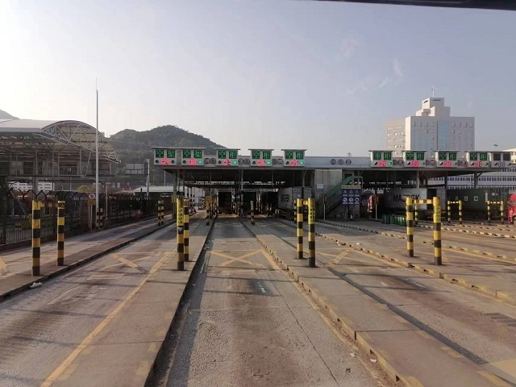
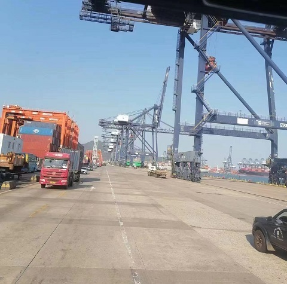

# 港口空箱堆积影响了谁？拖车司机收入减半，他们也在关心外贸抢单

“这几年的行业经历，真是冰火两重天。”

春江水暖鸭先知。拖车业务的冷暖变化，让在深圳盐田港跑运输十余年的刘卫强发出上述感叹。今年春节回来，刘卫强公司的业务还不如往年的三分之一，十多台车也只有两三台车在运作，业务量甚至还不饱和，运力有余。

运输是港口业务的纽带，一头连接着外贸企业，一头连接着港口。刘卫强介绍称，一般情况下，外贸企业的产品要出口，会先找货代公司订舱位，然后联系运输公司打印提柜单、分派拖车去港口提空柜，之后拖车将空柜运回外贸公司工厂或仓库装货，最后再把装有货物的重柜拉回码头，顺利报关后就可以上船前往目的港。

近期相关外贸订单缩减较多，进而导致集装箱供需失衡，一些港口空箱积压，“一柜难求”的情景不再。根据Drewry（德鲁里）发布的最新集装箱设备预测报告，随着消费者需求疲软及供应链拥堵缓解，2023年航运业预计将面临多达500万TEU集装箱过剩问题。

这也直接导致与港口集装箱相关的拖车运输业务量下降，由于拖车司机的薪资往往与运输趟次直接挂钩，一些拖车司机也因此薪资腰斩甚至失业。3月1日，第一财经记者走访盐田港看到，附近不少空拖车停在路边，司机在车上等待着派单。

_3月1日，空箱调运中心
黄琼/摄_

**也有司机卖车转行**

在盐田港已经等待了三天，拖车司机张师傅这周还没接到订单。干这行二十多年的张师傅常年保持与多家运输公司合作，运输公司接单，他负责拉货，从中获取一定提成。

春节回来后，他退了港口附近的出租房，一直住在车上。张师傅向第一财经记者介绍，自己是在珠三角跑短途，以往晚上都可以回出租屋内休息，第二天一早再出车。每月停车费和房租加起来要花费近三千元，但现在行情不好，收入大打折扣，便把出租房退了，“以车为家”。

“这段时间很多同行都卖车转行了，我在这行干了几十年，出去也不知道做什么，再坚持一段时间看看吧。”张师傅说。

刘卫强向第一财经记者介绍，运输公司除了与拖车司机合作外，自己公司也有组建运输团队，在订单火爆时保障有足够的运力。“前两年订单多，一个司机的月薪资不低于1.5万元，但现在有七八千元就很不错了，很多司机年后都还没回来上班。”

_盐田港附近道路上停放着一些拖车
黄琼/摄_

与盐田港相连的深盐路是深南大道的东延线，往常路上来往的大型拖车络绎不绝。3月1日中午，东西走向的深盐路上仅有少许私家车路过，隔一段时间才能看到拖车经过。

2月27日下午15时，刘卫强开车进入盐田国际码头，按照以往，这个时间段正是装卸货物的高峰期，但此时却显得有些“寂静”——以往需排队的出闸口也仅有一条出口有几辆车出入。

_2月28日下午约15时，盐田港出闸口极少拖车进出
受访者供图_

**集装箱为何多了？**

拖车司机的“活”少了，根源还是在于外贸企业手头的“单”也少了。

深圳外贸老板姜先生则告诉第一财经记者，公司在2021年时订单最多，每月平均有20条柜子（40英尺集装箱）的货物发往海外。但是从去年开始，订单量大幅减少，平均每月不到5条柜子。而今年春节以来更甚，至今还未发一次货。姜先生称，身边和自己同规模的老板多数情况类似，都还在寻找订单。

在佛山生产包装礼盒的陈先生今年订单回流压力也颇大。据陈先生介绍，以往产品市场主要集中在欧美地区，现在多数订单已经流失，年后正在海外积极寻找新的市场。迫于生产成本压力，陈先生年前已将其广州的生产条线已搬迁至江西赣州，仅保留了佛山的生产线。

根据中国海关总署的数据，2022年12月的国内出口额同比下降了9.9%，创下2020年2月以来的最大降幅。

外部需求的变动，进一步增加了集装箱的剩余。深圳市口岸办数据显示，今年1月份，深圳海港口岸集装箱吞吐量225万标准箱，当年累计同比减少8.4%。

“多重因素叠加导致目前中国港口空箱堆积。”王国文认为，一是由于欧美市场需求疲软，从去年第四季度开始订单减少，延续至今年年初还未得到缓解；二是跨国公司多元布局供应链，全球制造业向东南亚转移趋势明显；三是疫情期间，大量新箱进入市场。

马士基大中华区箱管负责人向第一财经记者表示，现在整个亚洲与去年相比空箱的保有量都是有大幅的上升。在新冠疫情期间，因供应链拥堵、船舶靠港等待时间增加、提箱延迟等因素造成缺箱，市场上所有的参与者（包括航运物流公司、货代、租箱公司等）都在投资造箱。现在疫情造成的供应链拥堵等原因消退，空箱出现供过于求的状况。

同时，亚洲长期处于贸易顺差，往年航运公司都会按需求将大量空箱持续运回亚洲，今年也不例外。

上述马士基大中华区箱管负责人表示，亚洲属于长期的进出口极度不平衡，主要以出口为主，所以长远来看，航运公司需要将大量空箱持续运回亚洲。而目前全球主要的集装箱（空箱）有很大部分都是回流亚洲，然后依据出口的速度和需求，可能造成空箱堆积的时间会有一定变化。再加上亚洲地区空箱堆存空间大且有成本优势，空箱回流就比较明显。

他认为，目前全球经济增速放缓，很多空箱可能在亚太地区相对来说停留的时间、堆积的数量都会有一定的增加，这个情况在亚洲的各个码头情况都差不多。

_2月28日下午，码头作业景象
受访者供图_

集装箱过剩已经影响到了运价。全球集装箱交易平台Container
xChange发布的《全球集装箱行情月报》显示，在集装箱过剩的情况下，即期运费、合同运费、集装箱价格都出现下降。到2023年1月，从亚洲到美东的即期运价相比去年1月降低了84%，亚洲到美西的运价相比2020年1月降低了11%。

据业内人士介绍，当下从盐田港发网往美国的一条40英尺集装箱运费约1000到2000美元，该运费在2021年高峰期则需要过万美元，现下运费已然跌回疫情前的行情。

《全球集装箱行情月报》监测显示，不仅仅亚洲至美国航线不景气，北欧航运价格也下跌明显。如中国至北欧港口20尺货柜平均提箱费为861美元，40尺高箱平均提箱费为823美元（截止1月）。而2022年1月同一航线上40尺高箱的平均提箱费超过3000美元。

“前两年航运供不应求时，运价上涨，船公司开始增加集装箱；需求到顶后回落，市场供大于求，运价便开始下降，供过于求叠加需求减少，双重作用下导致价格大幅下行。”中国（深圳）综合开发研究院理事、物流与供应链管理研究所所长王国文称，后续不排除运价还会下探，这也迫使行业一些公司或者旧箱面临淘汰。

**等待转机**

暂时的困难来了，躲不是办法，但又要如何扛过这段低谷？为了应对短期订单下降问题，外贸企业已开始行动起来。

上述包装制造老板陈先生今年开始前往东南亚考察。“其实疫情前我们便计划在印尼投资建厂，被耽搁三年后，再加上客户市场也发生了变化，我们更加快了去东南亚建厂的步伐。”陈先生表示，在欧美市场流失的订单很难回来了，现在主要市场是中东和亚洲等地区。

“随着全球贸易格局变化，企业对海外市场的布局也并不一定只盯着欧美市场，应进行多元化布局。”对于今年外贸转机，王国文表示，我们和RCEP区域的贸易量还将持续增加；同时我国作为消费大国，预计对发达国家的进口需求还将有所增加，如进口原材料、生鲜、水果等。

在去年1月1日RCEP区域全面经济伙伴关系协定生效后，商务部也高度重视，会同其他五部门印发了《关于高质量实施RCEP的指导意见》，推动30多个省区市形成实施RCEP的良好经验和创新实践。

对于目前集装箱积压情况，马士基大中华区箱管负责人表示，马士基会尽量去找能够有额外堆存的地方，包括码头、堆场，或者是其他的一些内陆地点，在把空箱堆存到靠近出口市场的同时，也去寻找相对来说时间和空间都比较充足一些的场地。今年还会加快一些旧箱的退出计划，减少一部分保有的箱量。

该负责人认为，目前回流的空箱堆积不会造成供应链瓶颈，反而能为市场回暖需求放大提前做好准备。当然，在接下来的一段时间，对于所有航运公司来说，空箱堆存的成本都将上升。“最终来看，我们还是希望能够有货量的增长，把更多的空箱用出去。”

对于当前外贸形势，相关部门也在积极应对。

3月2日，在国新办举行“权威部门话开局”系列主题新闻发布会上，商务部部长王文涛表示，“今年的形势是比较严峻的，但我们信心更足。今年要稳规模、优结构。先把规模基本盘保住，同时，随着我国产业升级、经济发展、综合实力提升，外贸结构要优化，增强外贸综合竞争力。”

稳规模方面，重点是三项工作：一是稳定政策，通过稳定政策来稳预期。二是稳定市场。三是稳定贸易渠道，利用广交会等传统渠道开展贸易促进活动，同时鼓励企业境外参展，鼓励地方、贸促机构、商协会开展多种形式的贸促活动。

“当前我们还在研究一些政策，这些政策主要来源于市场主体的需求，我们不断听取相关省份以及企业的意见，了解他们面临的困难，将根据这些困难出台符合国际规则的政策，促进外贸发展。”王文涛说。

张师傅也在等待和期待着，等着外贸企业的单子尽快多起来，他们才有更多的活可干，“现在尽管行业没那么景气，但是还想扛一扛。”

