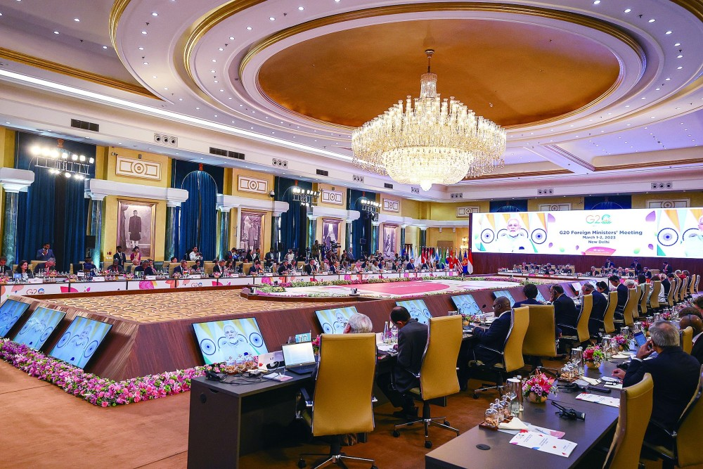

# 联合声明再次流产，中方呼吁寻求最大共识，G20外长会美俄激烈交锋

【环球时报综合报道】“因为各方存在无法调和的分歧，本次会议不能发表联合声明。”3月2日晚，二十国集团（G20）外长会在印度首都新德里落幕，印度外长苏杰生不得不承认了这一现实。据媒体报道，当天举行的闭门会议再次被俄乌冲突问题主导，以美国为首的西方国家外长和俄罗斯外长在会上发生激烈争吵，美西方要求G20施压俄罗斯结束战争，俄方则指责西方国家将G20议程变为一场闹剧。加上上周末举行的G20财长会，印度接任G20主席国后接连举办的两次部长级会议都未能发表联合声明，这让很多人感到沮丧。中国外交部长秦刚2日出席会议，呼吁二十国集团应负起责任，体现担当合作。印度尼赫鲁大学国际关系学院教授斯瓦兰·辛格告诉《环球时报》记者，G20应继续聚焦确保全球宏观经济稳定的初衷，关注迫在眉睫的危机。G20外长会没有达成联合声明，只会进一步削弱
G20 作为世界上最强大、最具代表性的全球治理论坛的潜力。

美西方与俄外长在会上爆发“口水战”

2日上午，印度总理莫迪通过视频在G20外长会发表致辞。他说，本次会议是在全球分歧严重的时刻举行的，“对于如何应对这些分歧，我们都有自己的立场和观点”，“但我们不应让无法解决的问题阻碍我们解决可以解决的问题”，“作为世界主要经济体，我们也对那些不在这个房间里的人负有责任”。莫迪还表示，多边主义目前正经历危机，“最近几年发生的金融危机、气候变化、大流行、恐怖主义和战争都清楚地表明，全球治理失败了”。

英国广播公司（BBC）2日称，包括美国、中国、俄罗斯等主要国家外长都参加了2日的会议。“莫迪罕见地用英语发表讲话，表明希望他的信息得到认真对待。”报道称，从莫迪的讲话中可以明显看出，印度希望利用其担任G20轮值主席国的机会，达成推动其全球雄心并达成帮助全球发展中国家的协议。“但该集团内部在乌克兰战争上的分歧将考验印度外交。”

“华丽的大厅里，外交部长们的座位按照字母顺序排列——这是会议前激烈谈判的结果。”印度《连线》杂志网站2日报道称，布林肯和拉夫罗夫坐在同一排，但之间隔了5个席位。外交部长的发言不对媒体开放。据外交消息人士透露，七国集团成员同意不在拉夫罗夫发言时退场，但他们坚持不在会议结束时与拉夫罗夫一起拍摄“全家福”。

“美国及其盟友在G20会议上与俄罗斯进行口水战”，路透社2日以此为题称，欧美敦促G20继续向俄罗斯施压，以结束乌克兰战争。布林肯在会上指责“俄罗斯对乌克兰发动的战争损害了此次会议”。美方的立场得到盟友的响应。德国外交部长贝尔伯克在会上指责俄罗斯称：“不幸的是，一个G20成员阻止了其他19个成员将所有努力集中在G20成立之初聚焦的问题上。”法国外长要求俄罗斯重返《新削减战略武器条约》。

据塔斯社报道，俄外长拉夫罗夫2日在发言中表示，西方“不知羞耻地埋葬了”联合国秘书长提出的“黑海粮食出口协议”，为俄罗斯农产品出口制造障碍。他说：“我想为某些西方代表团的不恰当行为向轮值主席国印度和其他全球南方国家道歉。某些西方代表团意欲将自身经济政策失败归咎于俄罗斯等其他国家，将二十国集团的议程变为一场闹剧。”

据“今日俄罗斯”（RT）2日报道，拉夫罗夫在会后举行的记者会上表示，西方试图将乌克兰问题摆在首位，造成G20外长会未能就最终文件达成一致。关于联合声明的讨论在几个问题上陷入僵局，其中包括俄方坚持将要求彻查俄罗斯天然气输往欧洲的“北溪”管道被炸事件写入声明，这得到了G20大部分发展中国家的支持。法新社称，拉夫罗夫指责西方国家“不再考虑外交，他们现在只会勒索和威胁其他所有人”。

会后，一位不具名的美国国务院官员对多家媒体放风称，布林肯和拉夫罗夫在会议期间进行了不到10分钟的短暂交谈，美方重申将继续支持乌克兰。这被认为是俄乌冲突去年2月爆发以来，美俄官员最高级别的一对一接触。《纽约时报》称，这一会面“令人意外”。布林肯前一天还称没有计划在新德里与俄外长会面。

俄罗斯外交部发言人扎哈罗娃2日表示，布林肯要求与俄方接触，拉夫罗夫当天与他“走着”进行了交谈，但没有正式会谈。

中国外长呼吁G20负起责任

据中国外交部网站消息，外交部长秦刚2日出席会议表示，面对当前动荡不安的国际形势和层出不穷的全球性挑战，二十国集团应负起责任，体现担当合作，为促进全球发展繁荣作出贡献。要践行真正的多边主义，坚持平等对话、协商一致的合作原则，不能搞强权政治、甚至阵营对抗。要推动全球化健康发展，反对单边主义、保护主义和“脱钩断链”，推动更包容、更普惠、更有韧性的全球发展。会议期间，秦刚还会见了印度、俄罗斯、德国、澳大利亚、巴西等国外长。

布林肯在本次会议期间又指责中国。据法新社报道，他1日对中国发布的《关于政治解决乌克兰危机的中国立场》文件提出质疑，称中方不能“脚踩两条船”，一边对外树立自身维护和平的形象，一边又以各种方式“火上浇油”。路透社称，美国正就“如果中国向俄提供致命性军事援助，则对中国进行制裁”征询盟友的意见。

中国外交部发言人毛宁2日就此表示，美国一直向乌克兰战场输送致命性武器，还四处煽风点火，散布虚假信息，中方坚决反对。美国声称尊重领土主权，却在台湾问题上走边缘、搞突破，违背自身政治承诺，向中国台湾地区出售先进武器；美国说要和平，却在世界各地发动战争，煽动对抗；美国强调要尊重和维护国际秩序，却大搞非法单边制裁，将国内法凌驾于国际法之上；美国说要公平竞争，却滥用国家力量无理打压别国企业，践踏国际贸易规则。

“美国应当做的是反躬自省，停止混淆视听、信口开河、以己度人，切实承担起自身责任，做推动局势缓和，劝和促谈的事，而不是对其他国家指手画脚，说三道四，污蔑抹黑。”毛宁说。

据塔斯社报道，拉夫罗夫2日在记者会上说：“西方国家试图在当前局势下对中国进行威胁、恫吓，不禁令人怀疑其是否失去理智。”

“印度感到沮丧”

2日晚，印度政府发布“主席国总结和成果文件”，总结了本次外长会的内容并指出分歧。苏杰生在会后告诉记者，各方在关于俄乌冲突的措辞上存在分歧，“我们无法调和”，不过与会各国“在大部分问题上”达成了一致，如加强多边主义、促进粮食和能源安全、应对气候变化、反恐等。

“俄罗斯与乌克兰的战争挤占了G20的议程，令印度感到沮丧”，法新社2日称，印度希望利用今年作为东道主的机会，重点关注减轻贫困和气候融资等问题。美国有线电视新闻网（CNN）称，G20会议可以说是印度今年最著名的活动，在国内进行了大力宣传，印有莫迪头像的庞大广告牌遍布全国。印度以其平衡关系的能力而自豪。美国和平研究所南亚问题高级顾问马基表示，虽然印度领导人希望结束俄乌冲突，以维护新德里与华盛顿和莫斯科的关系，但印度对俄乌“没有任何特别的影响力”促使双方达成和解。“分析人士表示，虽然印度对结果感到失望，但他们一开始就处于非常困难的境地。”

【环球时报驻斯里兰卡特约记者 王一同 环球时报记者 陈青青 环球时报特约记者 柳玉鹏】

