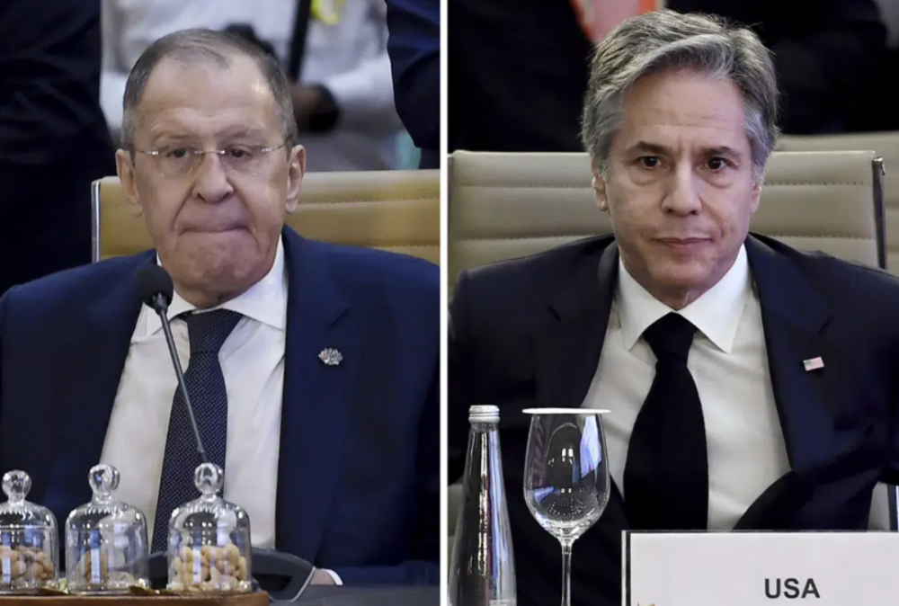
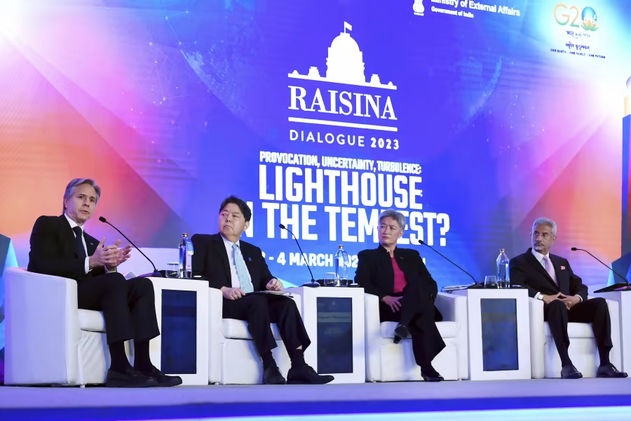
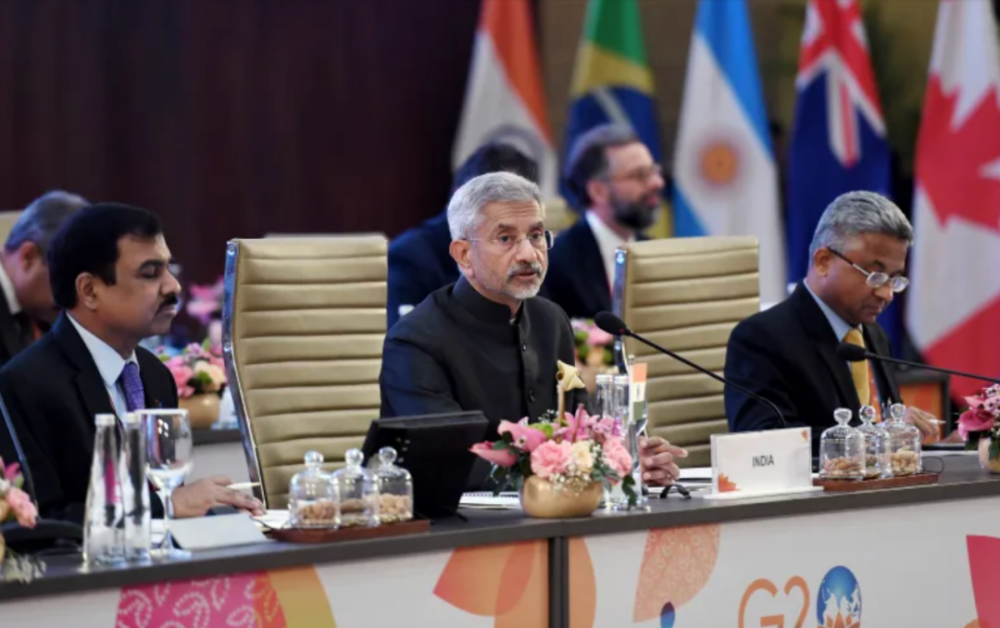

# 被破坏的G20外长会，美国及其盟友不给印度面子

**印度很失望。**

一场本该聚焦多边主义相关议题的会议，被俄乌冲突问题主导。

3月1日，印度迎来接棒G20轮值主席国后的第二场部长级会议——二十国集团（G20）外长会。作为今年9月G20领导人峰会前的重要预备会议之一，本次外长会由来自40个国家以及多个国际组织的代表参加。根据印方议程，这场会议本应就加强多边主义、粮食和能源安全等多个话题展开讨论。

但以美国为首的西方国家与俄方在会上的激烈争吵，美国国务卿布林肯与俄罗斯外长拉夫罗夫火药味十足的十分钟交流，以及最终“流产”的联合声明，都在向外传递着一个信号——这是一场变了味的G20外长会。

而缺席外长会的日本外务大臣林芳正，3日却出现在新德里举行的美日印澳“四方安全对话”机制外长会议上。他的这一举动也引起了外界的关注和猜测……

**美俄会场内激烈交锋**

很长时间以来，G20都专注于全球治理、经济发展等相关议题。但俄乌冲突爆发后，一些国家却将地缘政治引入G20。

在2日的开幕式上，印度总理莫迪通过视频用英文发表致辞，呼吁各方勿忘初衷。

_开幕式上，印度总理莫迪用英文发表视频致辞。图源：BBC_

莫迪认为，全球治理在防止战争和促进国际合作这两个任务上都失败了。“我们在一个全球分歧严重的时刻举行会议，你们的讨论受到地缘政治紧张局势的影响是自然的。但世界期待G20国家能够积极应对在经济发展、抗灾、恐怖主义、金融稳定性、粮食和能源安全等方面的挑战。”他说，“在所有这些领域，G20有潜力达成共识，并取得成果。”

在英国广播公司看来，莫迪罕见地用英文致辞，表明了他希望自己的想法能得到与会各方的认真对待，但G20内部在俄乌冲突问题上的分歧正在考验印度的外交水平。

可“剧情”并没有朝着印度所期盼的方向发展。据外媒透露，美国及其盟友在G20外长会上与俄罗斯进行了激烈交锋。

以美国为首的西方国家联手将矛头对准俄罗斯。布林肯在会上指责俄罗斯采取的对乌特别军事行动破坏了这次会议。德国外交部长贝尔伯克宣称“一个G20成员阻止了其他成员将所有努力集中在G20成立之初所聚焦的问题上”。

而拉夫罗夫则直指，某些西方国家意欲将自身经济政策的失败归咎于俄罗斯等国家，并将G20的议程变为一场闹剧。会后，拉夫罗夫要求美国等西方国家向东道主印度道歉。

_出席G20外长会的俄罗斯外长拉夫罗夫（左）和美国国务卿布林肯。图源：AP_

有美国官员透露，布林肯和拉夫罗夫还在会议间隙，聊了约10分钟。而这短暂的交谈，火药味拉满。

这名官员表示，布林肯向拉夫罗夫提出三点：一是美国会一直支持乌克兰直至冲突结束，二是俄罗斯应改变暂停履行《新削减战略武器条约》的决定，三是俄罗斯应释放在俄被关押的美国公民保罗·韦兰。

而后，俄罗斯外交部发言人扎哈罗娃证实了布林肯与拉夫罗夫的短暂接触。但她指出，这只是短暂交流，而非会谈。“拉夫罗夫外长以自己的方式回复了布林肯‘所有的企图’。”

**日本外相缺席引关注**

除了美俄交锋，日本外相林芳正缺席此次G20外长会也引发外界关注。

对于林芳正无法出席G20外长会，日方给出的理由是其需要参加国会2023年度预算案审议。但日媒透露，林芳正参加国会答辩时，发言仅53秒，且只发言了一次。

但让人感到意外的是，林芳正3日出现在美日印澳“四方安全对话”机制外长会议上。日本共同社报道称，会议结束后，四国外长将发表联合声明。一些日本主流媒体猜测，针对中国的议题将是会议的重点之一。

_林芳正（左二）出现在美日印澳“四方安全对话”机制外长会议上。图源：news4jax_

林芳正的做法引来了印度和日本国内的批评。

印度政府表示，日本作为G7轮值主席国，外相缺席此次外长会令人难以置信，这对日本外交来说是一种损失。印度一名官员称，林芳正缺席将对日本外交产生负面影响，并给人们留下“日本只重视G7的印象”。

日本维新会政调会长音喜多骏表示，不明白日本政府为何做出这种有损国家利益的决定。还有日本网友认为这会激怒印度：“我很好奇在四方机制外长会议上，印度会怎么朝着（日本）咬过来。”

**中方与会呼吁负起责任**

和前不久举行的G20财长和央行行长会议一样，此次G20外长会也没有联合声明。

_印度外长苏杰生在会上发表讲话。图源：aljazeera_

印度外长苏杰生表示，各方在关于俄乌冲突的议题上存在分歧，“我们无法调和”。不过与会各国“在大部分问题上”达成了一致，如加强多边主义、促进粮食和能源安全、应对气候变化、反恐等。

有媒体分析称，G20是印度今年主打的重要活动，印度向来以自己平衡关系的能力而自豪。原本，印度希望利用东道主的机会，呼吁各方关注减轻贫困和气候融资等议题，但俄乌冲突议题挤占了原先计划的议题，这让印度感到沮丧。不过，也有分析人士指出，印度虽对结果失望，但其实他们从一开始就处于困难境地。

尽管此次外长会混杂了分歧和矛盾，但依然不乏支持多边主义和发展合作的坚定声音。

中国外交部长秦刚2日出席会议时表示，面对当前动荡不安的国际形势和层出不穷的全球性挑战，二十国集团应负起责任，体现担当合作，为促进全球发展繁荣作出贡献。要践行真正的多边主义，坚持平等对话、协商一致的合作原则，不能搞强权政治、甚至阵营对抗。要推动全球化健康发展，反对单边主义、保护主义和“脱钩断链”，推动更包容、更普惠、更有韧性的全球发展。

而这也正是世界发展的潮流和广大发展中国家的共同心愿。

**出品 深海区工作室**

**撰稿 深海獭**

**编辑 深海盐**

