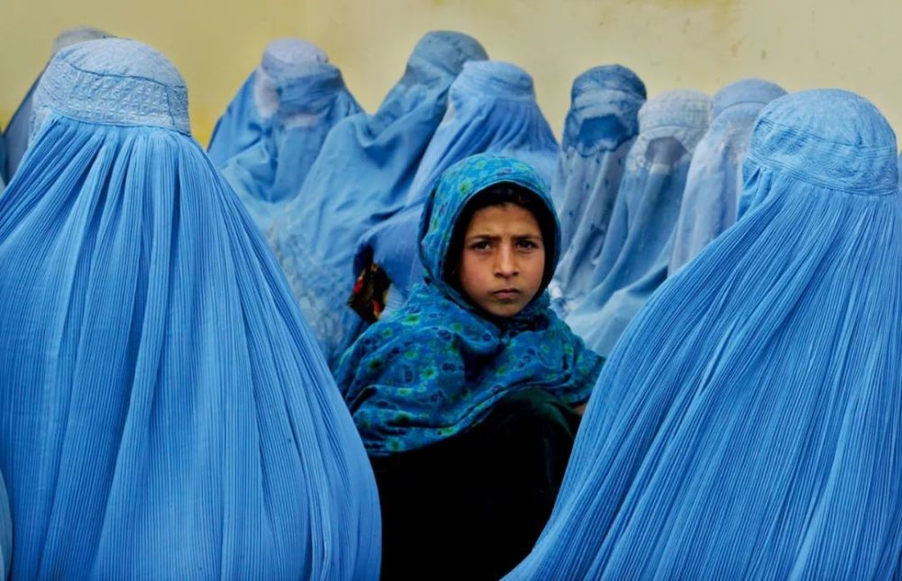
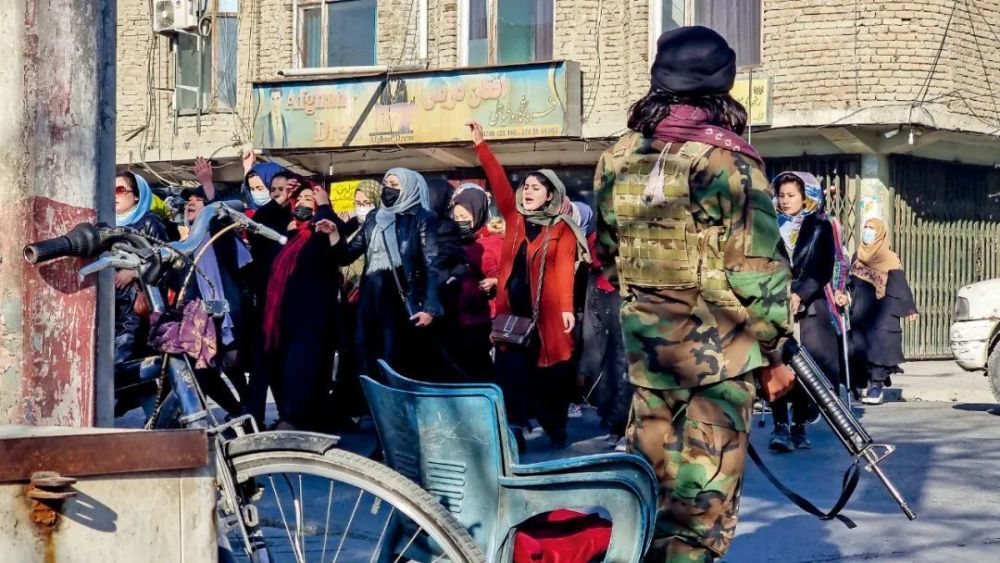

# 被遗忘的阿富汗女学生：无学可上，有家难回

数月来，为躲避塔利班的滋扰和追捕，哈西娜一直在喀布尔秘密地生活。她将社交媒体加密，更换手机号码，远离家人，独自居住在一处安全的住所里。

31岁的哈西娜本是喀布尔科技大学的一名硕士研究生，梦想成为城市规划师。但现在，学业和梦想都支离破碎。一年多前阿富汗塔利班在重掌政权时承诺在伊斯兰教法的框架内保障妇女的权利，但如今看来只是空谈：保护女子免遭暴力的妇女事务部被裁撤，女性就业率下降21％，大学和中学对女性紧闭大门……

为了捍卫自己的权利，哈西娜加入了抗议者的队伍。这些在街头要求与塔利班对话的面孔，清一色是女性。她们控诉的不仅是妇女在阿富汗被日益边缘化的现实，也有在全国弥漫的贫穷与饥饿。

但她们也有着挥之不去的恐惧。“不断有女性被捕或者不知所踪……我也被塔利班记录在案了。现在，大多数抗议者都找了安全的地方躲了起来。”在阿富汗律师法蒂娜（化名）的帮助下，哈西娜通过网络电话告诉《中国新闻周刊》。

_2022年5月，塔利班要求妇女在公共场所穿着罩袍。图/视觉中国_

**“我所有的梦想，都变成了零”**

在走上街头抗议之前，哈西娜是一名专注学业、刻苦努力的大学生。在攻读本科和硕士学位期间，她一边上课一边勤工俭学。

由于父亲失业无法在经济上提供支持，很长时间里，哈西娜做四份家教，一周工作七天，这样每个月能获得300美元的报酬。她经常在天光未亮时起床，六点半赶到学生家里教授数学，然后去学校，上八点钟开始的专业课。傍晚下课后，她继续家教工作。回家后，她学习到深夜。

哈西娜就读的建筑工程管理硕士班，一共有59人，其中9人是女性。2021年8月阿富汗塔利班重新掌权后，大学停课数周，直到高等教育部出台新的规定。大学重新开放后，女性在进入学校前，要接受着装检查，没有正确佩戴头巾者不得入内。为了避免异性之间接触，男学生和女学生的上课时间被错开。按照新规，女学生只能由女教师授课，但由于哈西娜所在的院系没有女教师，所以依然由男教师为她们授课。课堂上，老师与学生只能进行有限的交流，下课后学生也必须立即离开大学。

“我们遵循他们的所有指示，因为我们只是想学习。”哈西娜说，“但他们还是找到借口把我们赶出校园。”

2022年12月20日，哈西娜通过社交媒体得知塔利班禁止女性上大学时，正在家中准备期末考试。她和朋友们去学校核实这个消息，但荷枪实弹的塔利班士兵堵在校门口，将女性拒之门外。

根据塔利班临时政府高等教育部的说法，禁止女性上大学是因为女学生未能遵守性别隔离和着装规定。

整整四天，不知所措的哈西娜以泪洗面。“为了来到这里，我走得很辛苦。但我所付出的一切努力，我所有的梦想，都变成了零。”

哈西娜的求学之路充满坎坷。1996年塔利班第一次掌权，哈西娜的父亲因为曾任人民党军官，被塔利班视为敌人，觉得留在阿富汗已不安全，便携家带口流亡伊朗。哈西娜和姐姐们很快到了上学的年纪，但由于身份限制，她们只能在难民学校接受有限的教育。不过，哈西娜觉得自己是幸运的，因为当时塔利班禁止阿富汗任何年龄段的女性上学，理由是安全状况不佳且没有资金开办女子学校。

自1979年苏阿战争打响后，拥有共同文化纽带和语言传统的伊朗一直是上百万阿富汗流离失所者的避风港。但人数众多的阿富汗难民逐渐成为伊朗的“经济包袱”，受到的限制也越来越多。哈西娜升上小学四年级的那一年，伊朗注销了她们姐妹的难民身份，无法继续学业。“那时候我特别用功。不能上学我很难过，不知道自己犯了什么错。”哈西娜回忆说。为了孩子们能继续接受教育，哈西娜的父母决定返回阿富汗。

彼时距离塔利班政权土崩瓦解已经过去一年。成千上万名女孩重返学校。女性开始和男性一起走入大学校园，进入职场，并在国会和政府中任职。

根据联合国儿童基金会的数据，到2018年，共有超过360万女孩入学，约占当时阿富汗总人口的10％，其中进入小学的超过250万，进入中学的超过100万。接受中学教育的女生人数增加尤为显著，2003年女性入学率为6％，到了2018年这一数据已接近40％。

而根据阿富汗高等教育部的统计，2003年只有1000名女孩参加高考，这一数字在2013年已经跃升至78000人。

阿富汗前女性议员扎基娅·努里向媒体指出，有机会接受教育的女性仍是社会的少数。受极端保守的宗教思想和传统价值观影响，“在大多数地区，甚至在一些大城市，往往是家庭不允许年轻女孩去上学。”

联合国儿童基金会援引2016年至2017年阿富汗生活条件调查报告指出，在塔利班掌权之前，阿富汗有370万失学儿童，其中女童占60％。一些阿富汗家庭认为女孩上学不合适或有风险，或者在她们进入青春期时让她们退出教育。性骚扰威胁、宗教信仰和经济考虑，都是影响女孩接受教育的主要因素。

哈西娜姐妹到世俗学校上学，就在部族中遭遇了强烈反对。他们认为青春期的女孩应该留在家里，以确保她们的纯洁。“很幸运的是，我拥有开明的家人。”顶着压力，哈西娜的父亲继续支持她们上学。不过，由于父亲找不到稳定的工作，从一年级重新念起的哈西娜和姐妹们不得不一边读书一边做零工补贴家用。

哈西娜试图向亲戚们证明，一个女性能做的事远不止做家务。“我放弃了一切娱乐，只为了有更多时间读书。” 她最终考取了大学，并且在2021年继续攻读研究生。

“我希望我的城市是美丽、干净、有秩序的。”
哈西娜的心里装着把贫民窟集中地变成宜居之城的梦想，选择了和建筑工程相关的专业。但现如今，她不知道自己是否能够毕业，更不用说工作了。

“教授试图通过网络课程继续为我们提供教育。但是由于塔利班的警告，这项提议也不了了之。”哈西娜说。在无学可上的这段日子里，扎进手头的几册教科书几乎是她缓解痛苦的唯一手段。她也坦言，无法像以往那般专注，“好像在笼子里，你总是会去想，我的出路在哪里”。

**“面包、教育、工作”**

对于自己的教育权遭到剥夺，哈西娜作出回应：重返喀布尔街头抗议。

20余名年轻女性与哈西娜在大学外一起游行，呼吁塔利班撤销女性大学禁令。一部分人遵循塔利班的规定穿上从头遮盖到脚的罩袍，一部分人只是戴着头巾。

没过多久，一辆尾随在队伍后的汽车就开始鸣笛。紧接着，持枪的塔利班士兵下车冲散了示威的队伍。哈西娜的手机被一名士兵抢走，删除了所有记录集会的视频和照片。一些女性继续高喊口号，几声枪响后，人群中发出一阵惊恐的尖叫。

“他们朝天开枪。”哈西娜回忆说，“有一些女孩被带走，但我设法逃脱了。”

由于连年不断的战乱，阿富汗是世界上最年轻的国家之一，63％的人口年龄在25岁以下，这意味着大多数阿富汗人对塔利班第一次掌权时期的生活是什么样子没有印象。2021年9月，塔利班重掌政权不到一个月后，就开始对女性实施限制性的措施。除了大学被要求实施性别隔离和着装规范，越来越多的城镇传来女性被禁止单独出门、不能上学的消息。内阁之中也没有女性的面孔。这是一个危险的预告。

_2022年12月22日，阿富汗喀布尔，一些妇女上街抗议女性大学教育禁令。图/视觉中国_

抗议活动随之开始在全国出现。由朋友、同学和同事等组成的女性团体利用通讯软件和社交媒体策划抗议活动。她们大多很年轻，以前从未参加过示威，更没有组织经验。

“塔利班已经不是20年前的塔利班，阿富汗妇女也不是20年前的妇女，两者都已经发生了变化。阿富汗妇女知道她们的权利……因此，我们走上街头，表达我们的关切，保护我们的权利。”阿富汗女性权益活动家法西米向《中国新闻周刊》表示。

2021年9月19日，星期天。哈西娜第一次参加和平示威。数十名戴着各色头巾、来自不同民族的阿富汗妇女聚集在市中心，手举标语牌。上面写着“面包、教育、工作”“我们希望政治参与”等口号。塔利班士兵很快出现在现场，挥舞着枪。“他们朝我们大喊大叫，辱骂我们是放荡的女人。”哈西娜回忆说。

示威很快被驱散，但很快又会再次聚集起来。塔利班的回应方式也更加激烈。哈西娜说，抗议中总是有很多人受伤。“有些怀有身孕的女性请求塔利班不要使用暴力。但许多普什图士兵听不懂达利语，依然用枪托重重地打她们。”

在喀布尔，进出市中心的道路上出现了越来越多的检查站。在热门的示威地点，比如市中心人流密集的场所，巡逻的士兵数量也有所增加。哈西娜认为，塔利班也加强了对于社交平台的监控。有时候她们抵达示威地点，塔利班士兵已经先行到场。

抗议者开始使用暗语，比如到某地“逛街”或者“购物”，来交流活动的细节。此外，通讯群组中，就如何隐藏身份以及如何逃跑的讨论也有很多。哈西娜一般会带上墨镜，戴上口罩，并系两条颜色不一样的头巾去“逛街”，方便逃跑时变装。

2022年1月开始，塔利班士兵逮捕了一些激进的女性活动家。进入2月，逮捕的规模扩大。据媒体报道，有时一天之内，就有20余名抗议者以及家人被带走。随着越来越多的同伴消失或被捕，抗议的声量越来越小。为了家人的安全，哈西娜开始独自在一处秘密的地点生活。

与此同时，塔利班在1996年至2001年第一次执政时期实施的压制政策渐渐复活。2022年3月，塔利班没有履行在新学年开始时允许数百万女孩重返中学的承诺；5月，妇女被要求在公共场所穿着罩袍，从头到脚遮盖起来，并且只有在男性监护人的陪同下才能外出旅行；10月，女性被禁止申请新闻学、工程学、经济学、农业和兽医学专业；11月，健身房、公共浴室和公园不再对女性开放。

法西米表示，在某次抗议活动时，她曾与塔利班治安官员交流过妇女上学和工作的问题。那名官员让她写下诉求，承诺会反映给上级领导。“但他们并没有采取任何行动，”法西米说，“塔利班只是想通过告诉我们‘写下你们的要求’，来拖延我们的抗议活动。”

哈西娜说，由于对监视和逮捕的恐惧，她已经很少参与街头的集会。她和伙伴更多的是在室内举行抗议活动，集体穿上覆盖脸部和身体黑色罩袍，通过视频发表诉求，并邀请特定媒体将她们的信息传播到外面的世界。至于为什么穿上黑袍，哈西娜说除了为了隐藏身份，更多是想借黑色表达对阿富汗妇女命运的哀悼。

**“保守派的狼群”**

大学教育禁令出台招致国内和国际社会的广泛批评。但塔利班的领导人似乎并不担心。塔利班临时政府高等教育部代理部长内达·穆罕穆德·纳迪姆在公开采访中表示，“即使他们制裁我们，对我们使用原子弹，或者发动战争，不管他们打算做什么，我们都会实施我们的宗教法律。”

但与以往不同的是，许多伊斯兰宗教界人士也公开批评这项新政。阿富汗宗教学者理事会成员、前共和国政府时期总统宗教事务顾问胡赛尼·哈吉斯坦向《中国新闻周刊》表示，暂停妇女教育和工作的决定让宗教学者感到“震惊和担忧”。哈吉斯坦表示，“没有任何伊斯兰教法禁止妇女在学校或大学接受教育。相反，伊斯兰教法要求人们去研究问题，要求所有的穆斯林，无论是男人还是女人，去寻求知识。”据此，哈吉斯坦指出，塔利班的新政是一项行政命令，而非宗教法令。

阿富汗律师法蒂娜也告诉《中国新闻周刊》，塔利班对女性的限制是“不公正、不符合伊斯兰教和不道德的”。她指出，塔利班施加的限制并非基于对伊斯兰法律的主流解释，而是该组织自己极端保守和僵化的观点。

政策研究机构阿富汗分析师网络的一份报告指出，第一代塔利班成员几乎都是在保守的南方农村长大，童年和青年时期是在宗教学校以及同苏联军队的战斗中度过的。在掌权之前，塔利班高层中很少有人有城市生活的经验。但是今天，有相当多的塔利班高级成员曾经流亡巴基斯坦和卡塔尔，随着他们开始融入当地社会，他们开始发现教育的吸引力，将自己的女儿送到当地的学校和大学。

英国《金融时报》此前报道指出，塔利班内部顽固的宗教保守派和在社会问题上相对温和的塔利班派别之间存在分歧。那些有海外生活经验的塔利班成员意识到，女性教育对塔利班在国内取得合法性和在国际上得到承认都很重要。重新接管阿富汗后，一些塔利班指挥官将他们的女儿带回国内，继续接受教育。在教育禁令出台后，许多人感到震惊并在社交媒体上发出批评。

位于喀布尔的阿富汗美国大学的讲师、活动家巴希尔向媒体表示，那些承诺为女性提供教育的人从未拥有真正的权力。相反，极端保守派一直主导着决策，“阿富汗被扔进了保守派的狼群”。

“塔利班近期的行动源于一种二分法，认为赋予女性思想和权利与伊斯兰教是不可调和的，”巴希尔说，“在过去的20年里，他们建立了一种印象，即在女性权利方面取得的所有进展都是西方的议程，是为了使社会自由化。因此，现在他们正在对其进行打击并扭转所造成的所有损害。”

“现在阿富汗很少有男人和我们站在一起。”哈西娜说，尽管男性之中也不乏反对塔利班对女性实施限制的人，但他们很少对女性的行动表示支持。她解释说，塔利班也给男性带来了巨大的压力。如果一些女性因抗议被捕，麻烦也会延伸至她们的男性亲属。

战争与和平研究所联合创始人、前阿富汗国防部副部长塔米姆·阿西曾向媒体表示，阿富汗男人遭受了40年的战争，暴力和杀戮的记忆让他们非常害怕站出来。“如果一些女性提出抗议，他们就会找到她们的丈夫、父亲、兄弟并逮捕他们。”
有长期从事保障女性权利工作的国际组织人士也指出，塔利班借此“将所有男性变成他们侵犯人权的共犯，每个男人都成为家中女性的狱卒”。

自加入女性抗议力量，哈西娜面对的就不只是塔利班的压力，部族和家庭内部也有许多牵绊。部族中的男性常常斥责哈西娜惹事生非，“说我是一个妓女”。丈夫的父母也愤怒于她抛头露面，令周围人陷入危险，要求解除婚约。而担心女儿婚姻受阻，一向支持哈西娜的父亲也开始阻止她参加示威活动。

尽管如此，哈西娜还是会秘密地去参加集会，这份意志大概来自她对教育的信仰：“教育留下的东西是不可磨灭的。只有教育可以解决国家（阿富汗）的问题。”

令哈西娜庆幸的是，丈夫依然坚定地站在她身边，支持她为自己的权利而抗争。在与哈西娜成为恋人之前，这位28岁的男性是她多年的好友。大约一年前，他在大学获得建筑工程学位。但在经济凋敝和人口大规模失业的阿富汗，他一直找不到对口的工作。

2023年1月，哈西娜和丈夫排除万难举行了婚礼。她穿着朋友借给她的中袖蓬裙婚纱，头发烫成波浪卷绾在脑后，日常佩戴的头巾也换成了白纱。宽敞的礼堂里播放着一首来自伊朗的民谣，节奏欢快而轻柔，但音量很微弱，因为非宗教音乐也是塔利班所禁止的。和着节奏，哈希娜的家人和女性朋友自在地跳着舞。但哈西娜提供的照片上，丈夫的神情看起来有些落寞，他的家人没有到场参加婚礼。

哈西娜至今仍然独自一人住在秘密的避难所，一周只与丈夫见上一面。由于工作和教育的前景都十分渺茫，婚姻也不被祝福，两人正在考虑离开阿富汗。但边境的隔离墙越垒越高，出路不知在何方。

记者：陈佳琳

