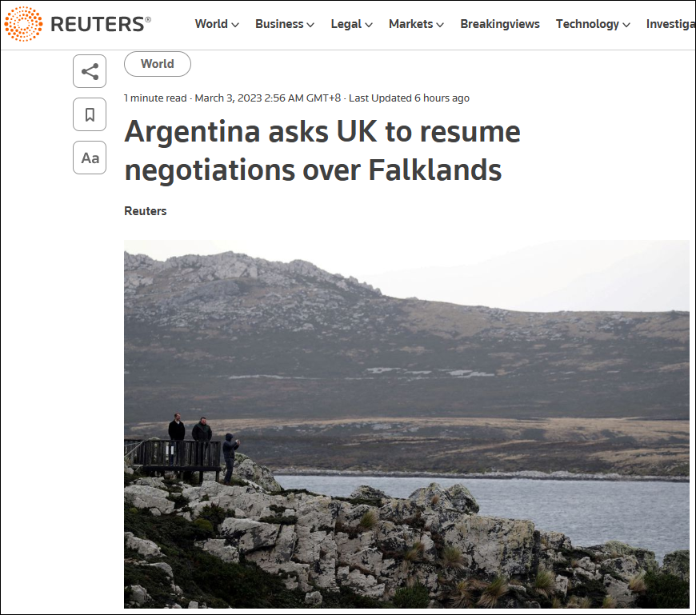
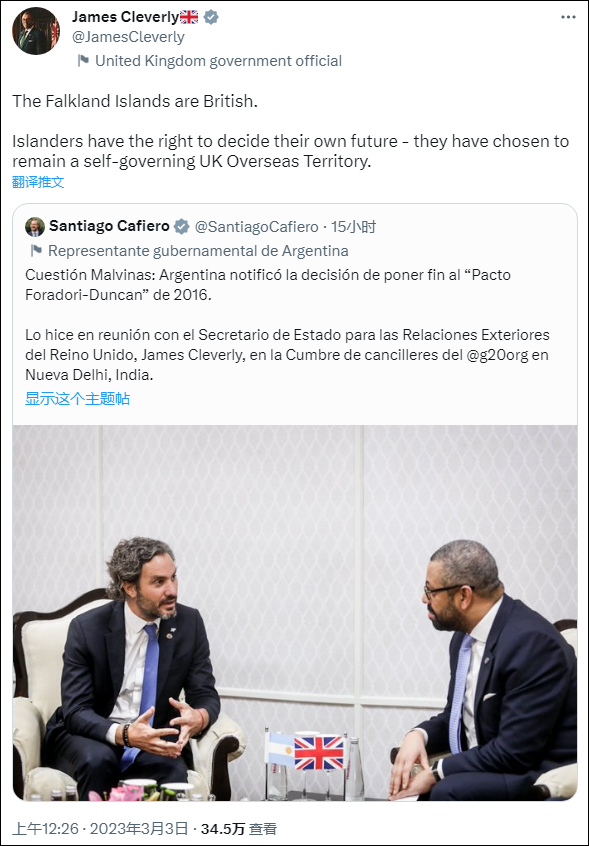
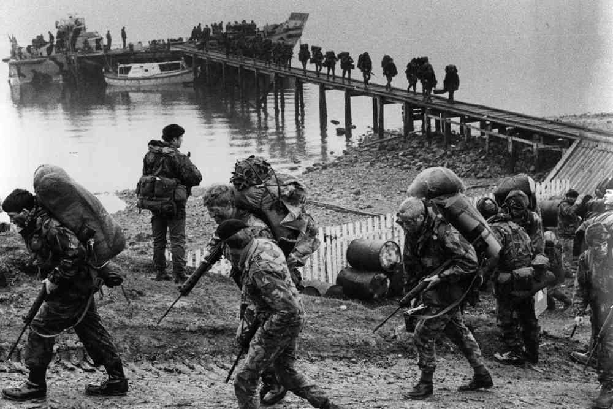
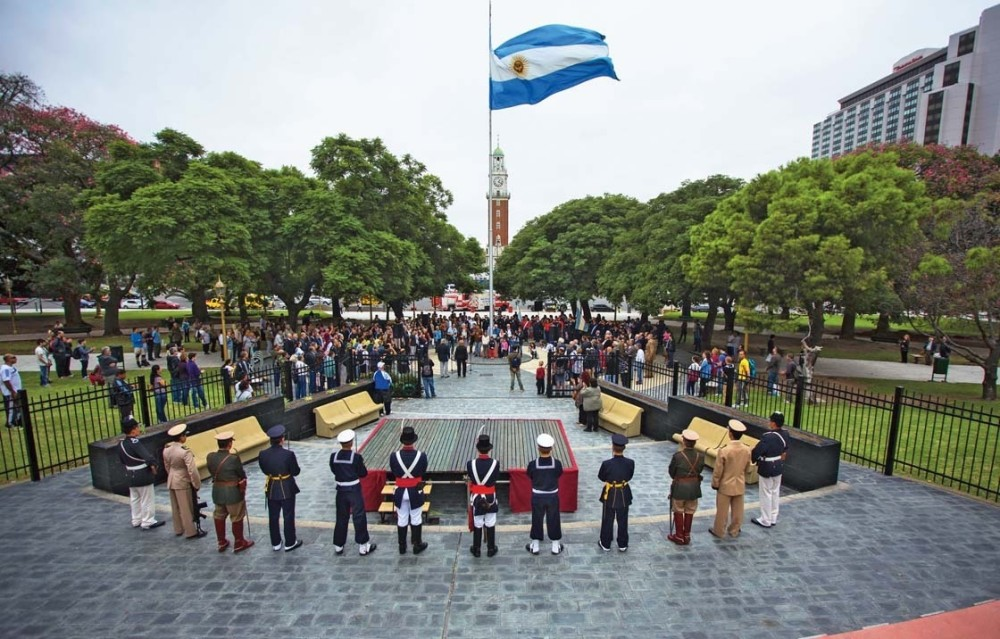

# 阿根廷外交部长当面通知英国外交大臣：重启马岛主权谈判

【文/观察者网
熊超然】据路透社当地时间3月2日报道，阿根廷外交部当天表示，阿根廷政府再次要求英国政府重启有关马尔维纳斯群岛（马岛，英国称“福克兰群岛”）主权的谈判。

报道称，此次恢复谈判这一要求，是阿根廷长期以来对马岛提出主权诉求的最新举动，其中也涉及到1982年的马岛战争。

_路透社报道截图_

同日，阿根廷外交部长圣地亚哥·卡菲罗（Santiago
Cafiero）发布推特称，他在印度新德里参加二十国集团（G20）外长会时，已当面通知英国外交大臣詹姆斯·克莱弗利（James
Cleverly），阿根廷决定终止两国签署的“福拉多里-邓肯协议”（Foradori-Duncan Pact）。

对此，克莱弗利转发了卡菲罗的推文，并写道：“‘福克兰群岛’属于英国，岛民有权决定自己的未来——他们选择（该岛）继续成为英国海外自治领土。”

_卡菲罗和克莱弗利推特截图_

马尔维纳斯群岛，200年来一直是阿根廷和英国之间领土争端的对象。1982年4月，阿根廷与英国因马岛主权归属问题爆发战争，战争以英国胜利告终。然而，阿根廷一直没有放弃对马岛主权的要求，英国则拒绝与阿根廷进行谈判。

去年4月，正值马岛战争发生40周年，阿根廷外长卡菲罗曾在英国《卫报》发文呼吁阿英两国通过谈判解决争端。他说，假装争端不存在或争端不会对双边关系造成障碍的想法“很幼稚”。

关于马岛问题，中国常驻联合国副代表耿爽大使去年6月曾在联大非殖特委会上发言强调，在21世纪的今天，西方殖民者为所欲为的日子已经一去不复返了。中国在马岛问题上的立场是一贯的，坚定支持阿根廷对马岛主权的正当要求。

去年也是中阿建交50周年，去年2月6日，两国发布“关于深化中阿全面战略伙伴关系的联合声明”。声明第四条载明，阿方重申坚持一个中国原则，中方重申支持阿方在马尔维纳斯群岛问题上完全行使主权的要求，以及根据联合国相关决议，尽快重启谈判以期和平解决争端。

_马岛战争 资料图_

事实上在2016年，阿根廷和英国签订了“福拉多里-邓肯协议”（Foradori-Duncan
Pact），这是自1999年以来，双方关于南大西洋和马岛问题的第一份正面声明，同意在未来几个月内努力取消对马岛的石油、天然气产业、航运和渔业的限制，双方也同意在马岛与第三国之间建立进一步的空中联系。

不过，该协议在阿根廷也引发了不少争议。这项协议被阿根廷反对党抨击为“可耻的”，在此之前，阿根廷坚决反对英国在南大西洋勘探资源，也强烈反对任何从第三国飞往马岛的新航班。

阿根廷前马岛事务部长丹尼尔·费尔姆斯（Daniel Filmus）痛批，“福拉多里-
邓肯协议”是针对国家利益，特别是对马岛行使主权的主张上“最有害的事件之一”。他说，该协议对英国的利益作出让步，允许英国在该地区开发阿根廷的自然资源，并降低阿根廷对马岛的主权主张。

此外，英国前欧洲和美洲事务部长阿伦·邓肯（Alan
Duncan）2021年发表自传时曾单方面揭露，2016年9月12日，他与时任英国驻阿根廷大使马克·肯特（Mark
Kent）在英国大使馆会见阿根廷时任外交部副部长卡洛斯·福拉多里（Carlos Foradori），为讨论后来签订的“福拉多里-邓肯协议”。

当晚，大家在英国大使馆内的酒窖边喝酒边讨论，并在次日凌晨握手同意了协议大纲。在谈判后的第二天，福拉多里打电话给肯特，承认他昨晚喝醉了，不记得自己承认了什么，肯特则提醒他所同意的内容，并称“谈判仍在正轨上”。此后，尽管福拉多里否认邓肯自传中的描述，但他陷入了谈判时“喝醉”的争议，并受到调查，甚至该协议也被阿根廷国内被冠上了“醉酒协议”的名号。

_2014年4月2日，阿根廷军方代表在位于布宜诺斯艾利斯的马岛战争阵亡将士纪念广场举行纪念仪式。图自新华网_

信息工程大学讲师周默草曾分析指出，英阿双方围绕马岛主权争端的外交和军事博弈持久不断，反映出该岛对于双方不可估量的战略价值。新的时局背景下，新的战略变量也正在出现。

马岛扼守沟通大西洋和太平洋的重要海上通道麦哲伦海峡、德雷克海峡、合恩角等，向西可威慑南美大陆，向南可控守南极半岛，是南大西洋地区的军事桥头堡。马岛附近海域渔业资源可观，并蕴藏有丰富的石油和天然气资源。其中石油储量高达600亿桶，相当于英国北海油田的石油总储量，可谓南大西洋地区的资源宝库。

对于英国而言，马岛的战略价值早已超越单纯的军事防御功能，日益成为其散播殖民主义遗毒、维护其在南大西洋地区所谓“海外领土”、保障其南极参与的重要手段。对于阿根廷而言，寻求恢复对马岛行使主权既是民心所向，也是历届政府艰巨持久的政治使命。在可预见的将来，双方围绕马岛主权归属“拼外交”、“秀肌肉”的博弈将长期持续。

**本文系观察者网独家稿件，未经授权，不得转载。**

