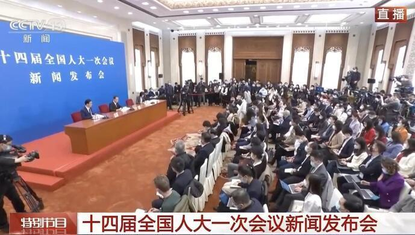

# 中国外交会不会越来越有攻击性？面对外媒提问，人大发言人这样回应

**解放日报·上观新闻记者 朱珉迕 吴頔 王闲乐 胡幸阳 邬林桦 周程祎**

3月4日12时，十四届全国人大一次会议举行新闻发布会，大会发言人王超就大会议程和人大工作相关问题回答中外记者提问。

亚洲新闻台（CNA）记者提问：去年中国全国人大公布了《对外关系法（草案）》，其中包括中国在必要时可以采取反制和限制措施。考虑到中国面临的外部挑战，包括涉及美国的挑战，上述措施对中国的外交政策意味着什么？中国外交是否会越来越具有攻击性？

王超表示，一些国家出于私利，频频以不符合国际法的方式，对外国实体和个人进行肆意打压，这种做法和霸凌行径被国际社会普遍批评为“长臂管辖”。中方一贯坚决反对这种做法，针对那些对华无理打压遏制、粗暴干涉中国内政的行径，中国出台《反外国制裁法》《阻断外国法律与措施不当域外适用办法》《不可靠实体清单规定》等予以反制。

他说，作为涉外领域的基础性法律，有必要对反制和限制措施作出原则性的规定：中国的核心利益不容损害，主权和领土完整不容侵犯，对于损害中国主权安全发展利益的行为，侵犯中国公民合法权益的行为，我们在法律中作出相关规定，予以坚决反制，是正当和必要的。

他强调，在全面建设社会主义现代化国家新征程中，中国实行改革开放的决心和意志是坚定不移的。全国人大及其常委会高度重视维护国家主权安全发展利益方面的法治建设，同样高度重视扩大对外开放方面的法治建设。

“中国始终恪守国际法基本原则和国际关系基本准则，坚持维护世界和平，促进共同发展，致力于推动构建人类命运共同体，在和平共处五项原则基础上同各国发展友好合作。”他说。

