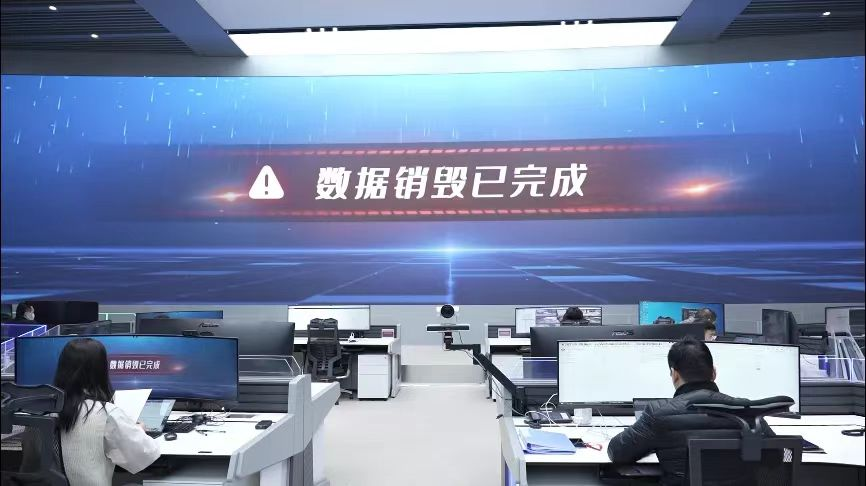

# 人大代表建议彻底删除涉疫个人数据，你怎么看？

3月2日，江苏省无锡市举行涉疫个人数据销毁仪式，首批销毁数据10亿条。据“平安无锡”消息，为确保数据彻底销毁、无法还原，还邀请了第三方审计和公证处参与工作。

无锡同时宣布，门铃码、疫查通、货运通行证等“数字防疫”四十多项应用，也于当天陆续下线。

_无锡市涉疫个人数据销毁仪式。图片来源：平安无锡_

过去3年来，作为疫情防控的重要工具之一，健康码在日常生活中出现的频率相当高，其收集的信息包括个人的身份证号、人脸信息、行踪轨迹、健康证明等敏感数据。

由于健康码以各地自建为主，缺乏统一标准，因此当健康码下线后，这些数据是择时退场，还是转型为便民服务，成为备受关注的话题。

全国人大代表、德力西集团董事局主席胡成中接受中国新闻周刊采访时表示，广大群众对健康码的忧虑主要涉及赋码规则的不透明，以及健康码的数据安全问题。

他建议，在应急管理制度中增补健康码相关内容，明确其启用、停用的条件和权限，明确赋码规则，全国各级各类健康码数据均应限时梳理并彻底删除。

**争议中的涉疫个人数据**

其实早在疫情防控政策调整之前，关于健康码数据的后续处理问题，一直存在争议。

健康码作为数字技术的重要发明，于疫情防控期间，在核酸筛查、流调溯源、外防输入性疫情、风险区域划分、流行病学调查等领域曾扮演重要角色。

相关数据显示，我国已有近9亿人申领健康码，使用次数超600亿次。

但由于健康码以各地自建为主，不少地方健康码与公交、社保、支付系统打通，在实现行程追踪、精准防控的同时，也引发了对个人信息进一步被掌控的担忧。

这些信息一旦使用不当，就可能造成个人信息的泄露，并对公众生活造成影响。

“健康码的终端呈现，只是一个二维码，但其背后的数据来源却无所不包，涵盖通讯、行程、就医、消费等方方面面的公民隐私。”胡成中认为，群众并不知道这些数据是实时比对只形成一个结果，还是会汇总储存到哪个部门，也不知道这些数据最终会被哪些单位共享，什么人有权调取。

尤其是随着疫情防控平稳进入“乙类乙管”常态化防控阶段，健康码逐渐退出历史舞台，胡成中认为健康码是紧急状态下的非常之举，建议在国务院应急管理制度中增补健康码相关内容，明确其启用、停用的条件和权限，明确赋码规则，并认为全国各级各类健康码数据均应限时梳理并彻底删除。

据“平安无锡”信息，无锡此次销毁涉疫个人数据，一是体现了依法执政理念，依法依规删除目的已经实现的数据；二是保护了公民隐私，防止数字时代公民个人信息被盗用或滥用；三是防止了数据泄露，通过数据彻底销毁减少数据泄露的可能性；四是节约了存储空间，进一步提高存储效率。同时，表示将确保数据无法被恢复。

公开报道显示，这并不是第一次有地方主动销毁涉疫个人数据。2月14日，广东省健康码“粤康码”发布服务公告称，抗原自测、老幼助查、健康申报、电子证照、防疫工作台服务将于2023年2月16日11时起停止服务。

公告明确，停止相关服务后，“粤康码”将按照有关法律法规规定，彻底删除、销毁服务相关所有数据，切实保障个人信息安全。

**转型还是退场？**

关于健康码以及涉疫数据的未来去向，人民智库此前的一份问卷调查结果显示，有37.6%的被调查用户认为“健康码”应该拓展使用场景。

一些城市也曾透露意向，希望借助健康码的庞大用户基础打造移动端的便民便企服务。

大数据协同安全技术国家工程研究中心副主任钟力向中国新闻周刊表示，数字经济时代，数据销毁可能并不是最佳的选择，数据作为生产要素，应该充分激活其价值，且现在信息技术为涉疫数据的存储、安全保护和分析利用提供了强大的技术基础。

“涉疫相关数据对各级政府来说是一笔宝贵财富，里面不但有成功知识和经验，也有失误教训，涉及精准管控、生活物资保障、民众出行和应急处置等方方面面。”他说。

钟力谈到，人类从出现开始，就与病毒和细菌一直相伴，据统计每隔百年全球就会发生一次大瘟疫。3年多的涉疫数据应该沉淀下来，从宏观到微观、高位到低位的数据都应该有，提供给专门的研究机构进行深入的分析，用于提升防疫相关能力水平，作为以后防疫的决策支持资料，同时也可能会用于人类生产生活的其他方面。

中关村工信二维码技术研究院院长张超对中国新闻周刊说，因为疫情过于突然，健康码设计之初机制并不完善，“如果机制设计好，它在起到流调作用的同时，还能确保个人信息安全。”他说，“这里还有一个问题，当时各地自建健康码，标准不统一。”他认为，这为后期的统一管理增添了难度。

但同时，张超认为3年积累下来，健康码包含大量流调数据，有一定研究价值。“我们不知道下次疫情什么时候来，除了数据本身的科研价值，也可以通过这批数据样本研究制定未来应急防控的长效机制。”

不过，从法律上来看，是否能将这批数据系统转型为市政服务，目前并没有明确的法律依据。北京合川律师事务所高级合伙人马维国告诉中国新闻周刊，《个人信息保护法》第二章第三节有国家机关处理个人信息的特别规定，尚缺乏相关细节规定。

从个人信息保护角度来看，马维国认为，销毁个人数据的方式，能够从源头解决个人信息被泄露或者被滥用的情况，“将该类信息转为其他公共服务使用，虽然能够最大限度地利用公民个人信息提高政务水平，但还是存在一定泄露风险”。

对此，一些专家表示担忧，由于各地存在不同数据库，这批数据是否能得到妥善处理，如何确定处理过程中没有被备份？

**如何保障个人数据安全**

北京合川律师事务所杨阳律师介绍，过去各地健康码的运行主要依靠《中华人民共和国传染病防治法》《中华人民共和国突发事件应对法》《中华人民共和国网络安全法》和《突发公共卫生事件应急条例》等法律法规，以及《关于依托全国一体化政务服务平台加快推进“健康通行码”跨地区互通互认的通知》《关于加强和规范疫情防控码管理便利人员出行使用的通知》等政策性文件规范健康码管理权限和数据使用。

他认为，如果未来这批数据要另作他用，那么如何使用、用作何用、有什么样的使用门槛、什么级别的机关有权使用或者授权使用，则需要国家出台个人信息保护法的相关实施条例或实施细则，从而完善该方面的法律依据，真正做到有法可依。

由于目前各地关于健康码个人数据是否留存还没有统一意见，钟力认为，这批数据无论是否留存，其留存的前提是切实解决数据安全和隐私保护问题，防止发生数据窃取、数据泄露、数据滥用和不合规等安全事件。

他说，涉疫数据安全需在三个方面进行保障：一是存储涉疫数据的大数据平台的安全，应支持数据全生命周期安全保护；二是做好涉疫数据相关数据处理活动的合规监管与安全监测，防止数据泄露、滥用和被攻击窃取等安全事件；三是安全管控涉疫数据的开发利用和流通共享，对原始数据需严格保护、严控使用，并采用隐私计算技术来支撑，更多的是提供去标识化、匿名化和静态脱敏的涉疫数据。

在他看来，如果最终这批数据要与其他政务数据相连接，要做好数据的分类分级等安全治理工作，确定要开放的涉疫数据集对象及其类型、级别，控制好数据集规模，防止因数据规模过大而呈现出重要数据的特征，实现数据的分类分级保护。

此外，钟力认为，可以根据使用对象提供不同规模、不同层次的数据，对政府授权研究机构、普通高校科研院所、民企和民间机构等单位，分别准备原始数据、去标识化数据、匿名化数据、脱敏数据等不同的数据集。

作者：陈淑莲

