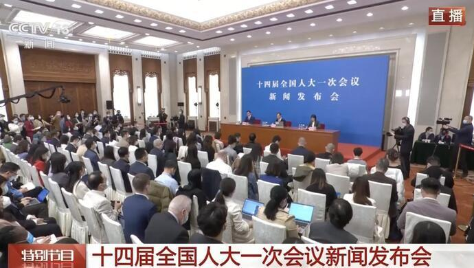

# 全国人大发言人王超：现行宪法发挥了六个“有力”重大作用

**解放日报·上观新闻记者 朱珉迕 吴頔 王闲乐 胡幸阳 邬林桦 周程祎**

3月4日12时，十四届全国人大一次会议举行新闻发布会，大会发言人王超就大会议程和人大工作相关问题回答中外记者提问。

有记者提问：2022年是我国现行宪法公布实施的40周年。过去40年宪法发挥了哪些重大作用？新时代10年我国在大力弘扬宪法精神、推动宪法全面实施方面有哪些部署工作成效？

王超表示，现行宪法发挥的重大作用，可以用六个“有力”来概括。40年的实践充分证明，现行宪法有力坚持了中国共产党的领导，有力保障人民当家作主，有力促进改革开放和社会主义现代化建设，有力推动了社会主义法治国家建设，有力促进了人权事业发展，有力维护了国家统一、民族团结的社会和谐稳定。

2018年，全国人大通过宪法修正案，确定习近平新时代中国特色社会主义思想在国家政治和社会生活中的指导地位。我们进一步完善以宪法为核心的中国特色社会主义法律体系，使宪法在国家各项事业和各方面工作中得以贯彻体现。

我们设立了国家宪法制度，实行了宪法宣誓制度，实施了特赦制度。对遇到的新情况新问题，根据宪法精神和有关法律原则，作出创制性规定，及时妥善处理。

我们按照全面发挥宪法在立法中核心地位功能的要求，推进立法过程中的合宪性审查工作，创制性运用宪法制度和宪法规定，应对治国理政中遇到的重大风险挑战。我们对宪法有关外国投资、计划生育等规定的含义提出了解释性意见。

去年12月，现行宪法公布实行40周年之际，习近平总书记发表重要文章，全国人大及其常委会将全面贯彻落实党的二十大精神，深入学习贯彻习近平总书记关于宪法的重要论述精神，坚定不移走中国特色社会主义法治道路，谱写新时代中国宪法实践的新篇章。

