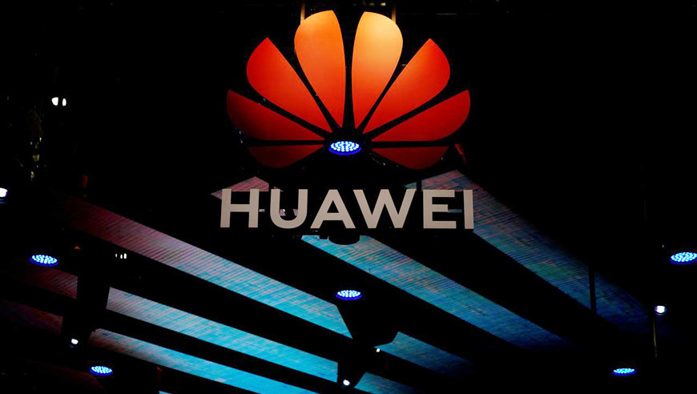

# 华为被传或分拆消费电子业务部门 相关资产走荣耀老路？

本报记者 贾丽

有业内消息称，华为内部或考虑拆分消费者业务（CBG），华为今年可能减少在手机终端业务上的投入，并将一些业务研发团队拆分到荣耀，但实施细则还在讨论阶段。

对此，华为内部人士对《证券日报》记者表示，“目前，消费者业务（目前已更名为终端业务）是华为发力企业级市场的重要着力点。华为消费者业务大规模分拆的可能性不大。”荣耀方面对该消息不置可否。

在芯片受限之后，华为消费者业务营收规模缩水近半。不过，华为并未就此放弃这一业务板块。去年4月20日，华为常务董事、终端业务CEO余承东宣布华为将“消费者业务”更名为“终端业务”，正式全面进军商用终端市场。如今近一年时间过去了，在越发收紧的政策环境下，华为的消费电子业务如何在巨大压力中前行，也备受关注。

余承东彼时说，过去十年，华为聚焦消费电子，现在不仅面对消费者产品，还要面向企业、行业等市场。华为将基于硬件和软件两大生态，进一步丰富商用笔记本、台式机与显示器、平板、智慧选件、智慧屏、穿戴等产品品类，重点为政府和教育、医疗、制造、交通、金融、能源等六大行业提供商用办公解决方案。同时，华为正在逐步实现鸿蒙、欧拉系统对这一生态产品的全渗透。

北京前沿金融监管科技研究院特聘研究员马超接受《证券日报》记者采访时表示，通过多年布局，华为建立了相对健全的消费电子产业链，而目前加速拓展的健康军团、显示军团和元宇宙军团的相关业务均与消费者业务相关，且建立在其之上。如若剥离消费者业务，则华为产品链就会不完整。同时，鸿蒙、欧拉两大核心操作系统也需要消费者业务带来量的积累，才能产生质变。另外，目前，华为也有进军游戏、数字货币产业的计划，消费者业务一旦剥离，这两大未来业务增长点也将受阻，代价太大。不过，不排除华为会将部分围绕芯片终端等领域的研发及技术板块分离出去。”

“在高端芯片受限的情况下，华为消费者业务开启向商用终端领域的转型之路，经过近一年的布局，已初见成效。对于手机芯片，华为仍在努力突破。”华为内部人士称。

不过，在中国本土化管理资深管理专家周锡冰看来，分拆部分受限业务可以降低对华为在终端及芯片市场的研发、供应链的影响，从而保持相关板块业务的韧性。同时，此举有望实现相关资产独立上市或融资，从而获取一定现金流。

华为2020年11月份曾将旗下品牌荣耀资产出售。此后，荣耀便走上了独立发展之路，并一度位居国内手机市场出货量前三的位置。

周锡冰认为，对于华为而言，其在消费者业务上也不会轻易进行完全剥离，或会选择保留核心业务的战略，并以方案提供商的角色加速攻占企业级市场。但也要看到，目前手机芯片大多采用7nm以下额工艺制程，部分高端手机迭代到了4nm，而国产企业在先进制程工艺领域的量产还在突破中。华为目前可做的除了对智能终端等受限较为严重的部分业务板块进行切割，也只有努力进行研发。半导体产业的国产化已经无路可退，产业链必须协同努力，打造一条纯自主可控的供应链。

（编辑 才山丹）

