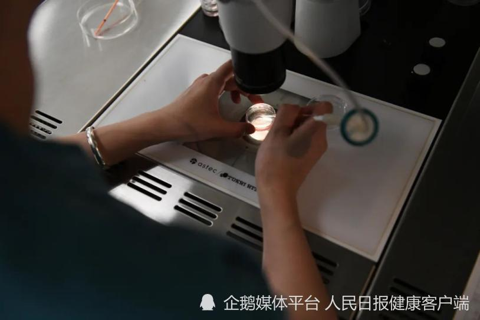

# 夫妻“唤醒”冷冻13年胚胎顺利产子，专家：建议冷冻期限不超过5年

**人民日报健康客户端 赵苑旨**

3月3日，据武汉大学人民医院消息，2009年一对夫妇在武汉大学人民医院生殖医学中心通过试管婴儿技术产下一子后，时隔13年，在专家团队的帮助下，“唤醒”了冷冻13年的胚胎，并顺利怀孕产子，且两个孩子属于同一批胚胎，从医学角度来看，他们算是一对相差13岁的双胞胎兄弟。

武汉大学人民医院生殖医学中心主任医师李爱斌表示，理论上，冷冻胚胎的储存期限是无限期的。但由于长期冻存可能带来生育风险，以及社会伦理问题，中国专家共识建议冷冻保存期限一般不超过5年。对于已经储存了冷冻胚胎且有生育计划的夫妻，建议尽早做好规划并咨询专家，别让冷冻胚胎在液氮罐中一直“沉睡不醒”。

**冷冻胚胎13年后被“唤醒”**

2009年，31岁的唐女士婚后3年一直尝试怀孕均未成功。夫妻俩慕名来到武汉大学人民医院生殖医学中心，希望借助辅助生殖技术受孕。接诊的李爱斌为夫妻双方制定了个体化的“促排卵—体外受精—胚胎移植”方案。

_胚胎师将“唤醒”的胚胎置于培养箱中培养。医院供图_

随后，专家团队为夫妻俩成功培育出一批共5个胚胎。经过三天的体外培育，2枚发育良好的胚胎被顺利移植到唐女士宫腔内。不久，超声检查确认唐女士怀孕成功，而剩余的3枚胚胎被存放在零下196℃的液氮罐中冷冻了起来，以备不时之需。

怀孕约8周后，为确保孕期安全，依照唐女士及家人的意愿，专家团队为她实施减胎手术，在宫内保留了一个胚胎。2011年9月，历经十月怀胎后，唐女士产下一个健康活泼的男婴。

**专家：单纯为了推迟生育去冷冻卵子或胚胎，并非明智之选**

随着国家相继出台二孩、三孩政策，唐女士又有要“二宝”的想法。然而自己和丈夫都已年过40岁，精子卵子质量大不如前。如果自然怀孕的话，生下来的孩子会不会有风险？而13年前冷冻的胚胎，一直在每年如期缴纳冷冻费用，这3个冷冻胚胎还能不能用？

李爱斌表示，胚胎冷冻一般采取的方法是玻璃化冷冻法，先用冷冻保护剂置换胚胎细胞内的水分。胚胎在冷冻的过程中，从生理温度急速降温到-196℃，胚胎细胞内外液体瞬间冻结成玻璃化固体状态，从而使胚胎处于“沉睡”状态。此时其代谢几乎完全处于静止状态，等需要解冻的时候再被“唤醒”。

“存储时间长短对胚胎的发育潜能及健康状况，并没有显著的影响。而在后代安全性方面，目前国内外对冷冻胚胎的随访研究表明，冷冻移植的胚胎生长发育和健康状况与新鲜胚胎并无明显差异。”

听取了医生的讲解并征求大宝的意见后，唐女士和丈夫决定，尝试用当年冷冻的胚胎，再添一个宝宝。

2022年5月，李爱斌带领团队，再次为唐女士开启“造人计划”，并根据她的身体状况制定了个性化的助孕方案。在唐女士怀孕38周+4天时，在武汉大学人民医院接受了剖宫产手术，顺利生下一个健康活泼的男婴。

_显微镜下试管婴儿技术操作。受访者供图_

“虽然兄弟俩相差整整12岁，但他们是2009年同一时间取卵受精的，属于同一批胚胎。从医学角度来看，他们也算是双胞胎兄弟。”李爱斌表示。

李爱斌提示，胚胎冷冻、卵子冷冻也并非一劳永逸。女性的生育黄金年龄在23-30周岁之间。女性35岁之后卵巢功能会逐渐退化，再加上高龄孕妇对自身及胎儿的生育风险影响，优生在很大程度上会大打折扣。如果单纯为了推迟生育去冷冻卵子或胚胎，并非明智之选。

