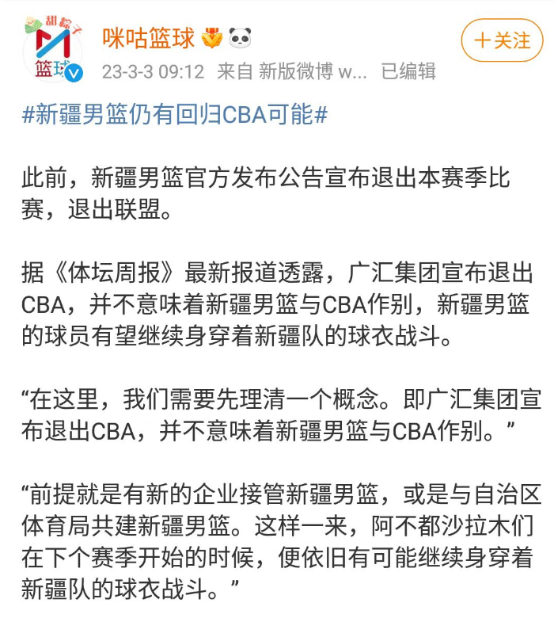

# 新疆男篮或重返CBA，新疆体育局寻找企业接手，下赛季卷土重来！

新疆男篮退出CBA不仅让很多球迷惋惜，更让新疆球迷伤心。从《体坛周报》的消息来看，在新疆男篮退出CBA后，篮协会让周琦本赛季就重返CBA，加盟一支中下游球队保持状态，这样的话新疆男篮的退出就实在太冤了。至于新疆男篮还能否重返CBA，目前还无法确定。不过从一些媒体的分析来看，新疆男篮还是有重返CBA的可能性的。国内知名媒体《体坛周报》就认为，新疆男篮重返CBA的可能性非常大。

在新疆男篮能否重返CBA这件事上，球迷首先需要捋清楚一点，那就是广汇集团本赛季是能够代表新疆男篮的，因为它是新疆男篮的投资方。不过在广汇集团宣布退出CBA后，新疆男篮这支球队依旧存在。按照新疆男篮的退赛声明，球队会将全部资产捐赠给新疆维吾尔自治区。也就是说，在广汇集团退出后，新疆体育局就成为了新疆男篮这支球队的拥有者。如果新疆体育局能够找到新疆的其他企业接手新疆男篮的话，新疆男篮是完全能够重返CBA的，只不过相当于换了一个投资方而已。

其实在CBA联赛中，球队的股权变更时有发生，比如山东男篮，山东西王在2021年夏天退出后，山东高速重新接手了球队，就是出现了股权变更的情况。现在新疆男篮的情况和山东男篮差不多，只要新疆体育局重新找个新疆男篮的企业接手新疆男篮就可以了。而据新疆媒体透露，此次体育总局和篮协前往乌鲁木齐协调，在广汇集团坚决退出后，也向新疆体育局表达过这个想法，并不想让新疆男篮这支球队彻底退出CBA。而新疆体育局方面也有这个意思，表示等球队各方面稳定下来后，就会着手操作这件事了。

虽然养一支CBA球队花费不菲，不过新疆地区的大企业还是很多的，仅在A股上市的公司就有几十家，其中肯定会有企业对投资篮球有兴趣的，为新疆男篮重新找个投资方的难度并不是很大。从时间上来看，新疆男篮如果真的能够重返CBA，基本上也要等到下个赛季了。而如果新疆男篮真的能够重返CBA联赛的话，无论是篮协还是CBA公司肯定都会大开绿灯的。从目前的消息来看，新疆男篮下赛季卷土重来的希望还是比较大的！

