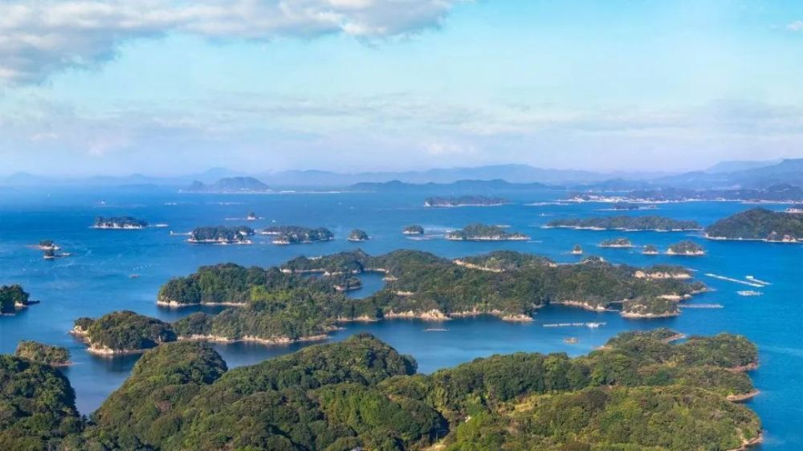

# 日本突然声称多出7000余小岛，专家：今后与邻国纷争可能更多！

【环球时报驻日本特约记者 蒋丰 环球时报记者
樊巍】去年夏天，日本前首相野田佳彦在日本众议院发表演讲时问听众：“日本有多少个岛屿？”会场中一时竟无人应答，于是《环球时报》驻日本特约记者小声说了句：“有6000多个。”野田佳彦听到很兴奋地表示：“对，对，我们日本有6000多个岛屿，我也是当首相的时候才搞清楚的。”然而，日本国土地理院日前公布的最新岛屿数量竟然是14125个！这个数字比日本海上保安厅在1987年公布的6852个岛屿多出了一倍多。

**岛屿的意义是水域权利**

“日本刚刚发现了7000个岛屿，”美国有线电视新闻网（CNN）3月2日报道说，日本重新清点了自己的岛屿，发现比上一次清点时多了7000多个。

《日本经济新闻》3月1日称，1987年公布的数字，是日本海上保安厅以1比25000比例尺的海图为标准，人工筛选出了周长在100米以上的岛屿。而本次测量，是日本国土地理院基于航空照片和卫星图像的电子国土基本图，使用电脑自动计算出来的。负责该项目的政府官员解释说，由于测量技术的发展，包括航空照片分辨率的提高，使得岛屿数量多了一倍。即便这样，日本国土地理院还在2月28日对NHK电视台的记者表示，人工填海造地的岛屿、湖心岛和河中沙洲还不包括在这个数字内。该机构同时强调，这个统计结果对日本的领土或领海面积“没有影响”，日本“国界线上的岛屿”数量也没有变化。

美国知名科技博客网站Gizmodo3月3日称，过去35年内的火山爆发也是促成日本新岛屿形成的原因。文章同时认为，日本的岛屿数量具有“国际意义”，因为岛屿可以“准确描述日本以及其他国家在该地区水域内的权利”。

**冲之鸟礁果然被算上了**

日本海洋问题专家山田吉彦2日对日本《新潮周刊》表示，“长期以来，人们都知道包括小沙洲在内，日本有10万多个岛屿。如今，随着卫星测量技术的发展，准确识别离岛并不困难，岛屿的数量增加到1.4万多个，其中应该包括日本最南端的冲之鸟。”

果然，在日本南端国界线上的冲之鸟礁被日本“双标”了，据《读卖新闻》透露：“尽管‘冲之鸟’周长不足100米，这次也被计算在内了。”

根据《联合国海洋法公约》，岛屿是四面环水、在高潮时高于水面的、自然形成的陆地区域。但是，不能维持人类居住或本身经济生活的岩礁，不应有专属经济区或大陆架。

相比之下，日本国土地理院对岛屿的定义，就没强调“能维持人类居住”这一条。中国中日关系史学会副会长刘江永3日对《环球时报》记者说，日本现在采用卫星技术或是其他高科技测量技术，这就使得对岛屿的测量结果会更为精确一些。但是日方声称的这些新增加“岛屿”是否符合《联合国海洋法公约》对于岛屿的界定，是否能够要求专属经济区或者大陆架还值得商榷。

刘江永认为，日本声称新发现的这些“岛屿”可能有一部分是无人居住的“岛屿”，甚至根本不具备人类居住的条件，例如没有淡水。这样就不能给这些“岛屿”划定专属经济区或大陆架。

**“日本今后与邻国的纷争很可能会更多”**

至于重新统计的岛屿数量做何使用，日本国土地理院称，“今后会用在政府统计和学校教科书上。”

不过，3月2日发行的《新潮周刊》指出，日本是出于防务目的开始重新调查岛屿数量的。起因是2021年12月，自民党参议院议员有村治子在参议院全体会议上指出，冲绳县政府官网列出的县内岛屿数量为160个，而日本政府根据海上保安厅的调查列出的岛屿是363个。“冲绳县承认的岛屿数量与政府掌握的岛屿数量之间存在差异，不仅会阻碍离岛的防卫，也不利于对捕鱼权的保护。岸田首相难道不认为政府有必要就岛屿数量给出一个统一的数字吗？”

CNN在报道日本突然多出7000多个小岛时，特别列出了日本跟俄罗斯、中国、韩国的诸多岛屿主权争议。有日本网友戏称，“萨哈林岛（库页岛）是不是也包括在内？”“竹岛（韩国称独岛）有被计算进去吗？那也是日本的岛屿啊。”

“岛屿涉及海洋权益，不管日本是怎么测出了这么多岛屿，但既然宣布拥有这么多岛屿，很可能今后日本与周边国家的领土纷争会更多。”北京大学海洋战略研究中心主任胡波3日在接受《环球时报》记者采访时指出，日本声称一下子多出7000多个“岛屿”，“这很难从技术方面去合理解释”。

