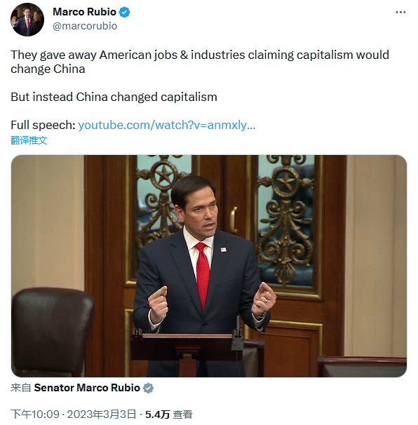
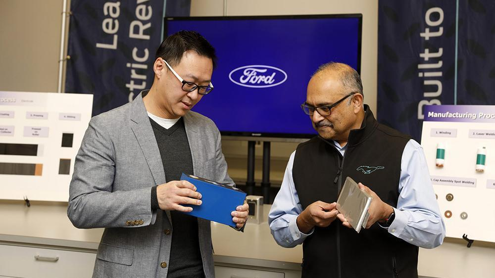

# 美国反华议员：资本主义没有改变中国，中国却改变了资本主义

（观察者网讯）当地时间3月3日，美国反华议员、共和党佛罗里达州联邦参议员马尔科·卢比奥（Marco
Rubio）在个人推特上发布了自己在参议院发表讲话的视频。

卢比奥表示，本世纪初美国支持中国加入世贸组织（WTO），是因为他们本以为资本主义可以改变中国，但如今看来反倒是中国改变了资本主义。

说这话，当然不是这位知名的“反华急先锋”突然转性了，而是他攻击中国，渲染炒作所谓“中国威胁论”的又一套说辞：“中国人确实富裕起来了，但他们没有花钱买我们的东西，而是拿这笔钱去买中国制造的产品”，还厚颜无耻称“中国以美国为代价，牺牲美国的利益，实现了快速崛起”。

通览卢比奥的这篇演讲稿，他口中的美国形象堪称是好一朵楚楚可怜的“盛世小白花”，在与中国这二十多年的经贸合作中“损失惨重”。

按他的说法，美国本世纪初主张和中国贸易往来的核心论点是，他们本以为资本主义可以改变中国，让中国人像他们一样“吃汉堡喝可乐”，拥有共同的价值观和长期目标。于是他们让数以百万计的美国工作岗位、重要产业和工厂涌入中国。

话锋一转，卢比奥开始污蔑抹黑称中国在这一过程中“逼迫”入驻的美国企业和中企合作，“窃取”美企的商业机密，待学会美企所做的事情就将其“逐出”市场，自己一家独大，恶意将两国正常的经贸合作描述成“教会徒弟饿死师傅”。

他说，“我们从中国购买太阳能电池板。谁发明的太阳能电池板？是我们。中国现在在电动汽车的电池生产方面处于世界领先地位，这东西也是我们发明的。”

卢比奥声称，“抢了美国人工作”的中国人因此变得富裕起来，但没有如他们预期那样购买美国产品，而是拿这笔钱去买中国制造的产品。这样造成的结果是，美国工厂关闭了，美国人失去了工作。

他无端指责称中国牺牲了美国的利益，以美国为代价实现了历史性的快速崛起，“美国工人岗位的消失和中国中产阶级的崛起，它们发生的时间和规模几乎是相同的。”

卢比奥还提到，发展至今，美国企业和消费者严重依赖来自中国的廉价产品，从食品到药品再到先进技术都离不开中国的供应链。他煞有其事地说道，“这意味着美国很脆弱，很容易被勒索、胁迫。”

“资本主义没有改变中国，而是中国改变了资本主义。”胡说八道了一通，卢比奥得出这么一个结论。

在讲话结尾处，卢比奥宣称要在“美国优先”的基础上重新调整经济政策，全球贸易协议的签订标准必须首先是对美国有利，“我们签订贸易协定的目标不是做对全球经济有利的事情，而是做对我们有利的事情。”

卢比奥这番谬论之荒诞，从不久前他跳脚抵制美国福特汽车公司和中国新能源企业宁德时代的新合作就可见一二。

2月14日，全球动力电池龙头宁德时代和福特汽车达成协议，福特将会出资35亿美元（约合人民币240亿元）在美国密歇根州新建一座磷酸铁锂电池工厂，通过一家子公司100%持有股权，而宁德时代将会提供技术帮助和专利许可支持。

卢比奥当时气急败坏地表示，此次合作“只会加深美国对中国电池技术的依赖”，并且要求拜登政府审查福特与宁德时代在协议中的技术转让条款。

他甚至分别写信给美国财政部长、能源部长和交通部长，呼吁美国外国投资委员会（CFIUS）立即审查这份合作协议。在信中，卢比奥还要求拜登政府不对此次交易提供税收抵免和其他资金支持，以避免直接或间接地让中国企业获益。

但事实上，这一中美企业合作的新项目绝非什么幌子，福特公司自己都表示，该项目将创造2500个新的就业岗位，还能帮助加强美国国内制造业和供应链，并减少碳排放，可谓是一举三得。

美国能源部长詹妮弗·格兰霍姆也在社交平台上写道，“将先进的制造能力从海外引进到美国，有助于提升我们的竞争力。这能够刺激我们的经济，并创造更多的高薪就业机会。”

对此，中国外交部发言人汪文斌曾在例行记者会上表示，中美企业间开展正常经贸合作不应当被政治化，敦促美方个别人摒弃意识形态偏见，停止泛化国家安全概念无理打压别国企业，为中国企业在美投资经营提供开放、公平、公正、非歧视性的环境。

**本文系观察者网独家稿件，未经授权，不得转载。**

