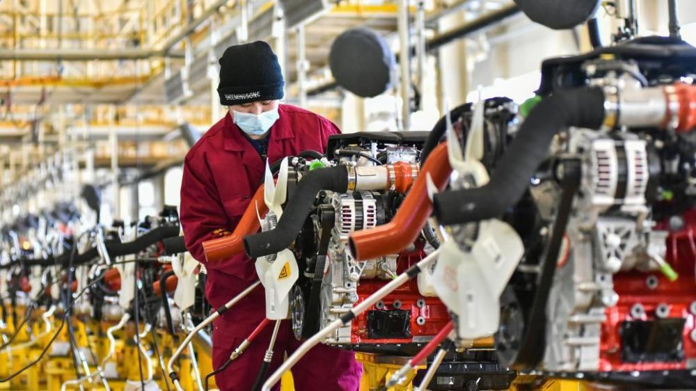

# GDP去年增长3％、今年目标5％左右，意味着什么

3月5日上午，十四届全国人大一次会议在人民大会堂开幕。李克强总理代表国务院作政府工作报告，报告提出：“今年发展主要预期目标是：国内生产总值增长5%左右。”

今年是全面贯彻落实党的二十大精神的开局之年，是实施“十四五”规划承上启下的关键之年，做好经济社会发展各项工作意义重大。在这种背景中，社会各界都高度关注今年国内生产总值的预期增长目标是多少？如今答案揭晓，自然备受瞩目。

先来看去年的成绩单。2022年，我国国内生产总值增长3%。尽管低于增长5.5%左右的预期目标，但是结合实情，不难深知殊为不易、尤为难得。过去一年，国际环境风高浪急，新冠疫情反复延宕，我国经济社会发展遭遇多重超预期因素的冲击。在这种背景中，国内生产总值增长仍取得了3%的成绩，再一次强势印证了我国经济韧性强、潜力大、活力足，长期向好的基本面没有改变，成绩不仅拿得出手，更为今年经济的进一步回升向好夯实了信心、打下了基础。

不妨跟发达国家作一简单比较。3%的增速，快于美国的2.1%、德国的1.9%、法国的2.6%等主要经济体经济增速。可以说，过去一年，我们在极端困难的条件下实现了疫情要防住、经济要稳住、发展要安全的目标。

去年增长3%，今年目标5%左右，意味着什么？意味着我国经济预期持续向好。从3%到5%，增速提高两个百分点，这是经过科学研判，结合国情、世情而拟定的目标。

去年12月召开的中央经济工作会议提出：“我国经济韧性强、潜力大、活力足，各项政策效果持续显现，明年经济运行有望总体回升。”事实上，去年年底，我国经济运行已经企稳，今年年初更是出现了显著回升。继续拓展经济回升态势，实现国内生产总值增长5%左右的目标，是完全有希望的。

当然，我们追求一定的经济增长速度，并非要陷入“GDP崇拜”之中，而是为了促进高质量发展，更好保障和改善民生。比如，保持一定的经济增速，才能提供更多的就业岗位。有就业才有收入，群众生活才有奔头，社会财富才会源源不断增长。

还要看到，5%左右的预期目标，是要在高基数上实现中高速增长。中央一再强调，我们要实现质的有效提升和量的合理增长。换言之，设定这一预期目标，有利于实现高质量发展。高质量发展是全面建设社会主义现代化国家的首要任务，5%左右的增速目标不仅体现了发展，更体现了高质量发展。

事非经过不知难。5%左右的预期目标不会是唾手可得，也不可能一蹴而就。唯有展现奋发有为的精神状态，激发“时时放心不下”的责任意识，不断克服发展中遇到的难题，不断取得新的发展成效，才能稳健实现预期目标，让14亿多中国人共享更多发展成果，过上更美好的生活。

