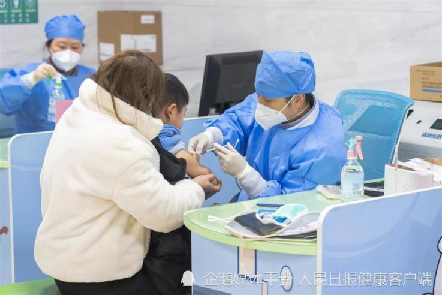

# 一周报告108起流感疫情，为何今年流感比往年同期都高？

**人民日报健康客户端 记者孔天骄**

根据国家流感中心流感最新周报监测数据显示，2023年第7周南、北方省份流感病毒检测阳性率继续上升，一周共报告108起流感疫情，其中94起为A（H1N1）pdm09，6起为A（H3N2），4起为A型（亚型未显示），4起为流感混合感染。

人民日报健康客户端记者发现，相比于同期，
**2022年第七周内共报告了3起流感暴发疫情；2021年第7周，全国未报告流感样病例暴发疫情；2020年第7周，全国报告流感样病例暴发疫情3起。今年的流感相比于前几年同期都大幅增加**
。

_湖北武汉东西湖社区医院疫苗接种。东西湖区融媒体中心图_

为何今年的流感数目较多？北京市疾控中心传染病地方病控制所所长张代涛接受北京日报采访时提到：“今年情况较为特殊。
**既往3年流感流行强度较低，人群感染率低的同时，人群的免疫水平也较低。伴随着全市大中小学生开学，人群流动性增加，聚集活动频繁，流感疫情活动强度也出现了明显的上升**
。”

“新冠三年期间，大家都养成了戴口罩，进行个人防护的良好习惯，既往3年，流感整体感染情况较低，人群感染率低的同时，人体对流感病毒的免疫力较低。口罩脱掉之后，流感病毒开始进行传播，这时身体里对流感病毒没有很强的抵抗力，就比较容易出现大范围的流行。”3月1日，中华预防医学会感染性疾病分会常委兼秘书长、中山大学附属第三医院感染科主任林炳亮告诉人民日报健康客户端记者。

每年流感都会发生，只是范围大小的问题。林炳亮表示，“ **并不是说感染新冠后抵抗力降低，**
而是在整个防控过程中，我们戴了口罩之后，就极少有机会接触到流感病毒，如果没有接触到流感病毒，人们针对流感病毒的免疫力就减弱了。”

对于流感不用太过担心，对于流感有很好的药物，更有效、更快的控制流感病毒。林炳亮提醒，“相关部门应该做好对新冠、流感叠加感染的监测和监控。此外，在流感制时，在一些密集或比较封闭比较容易出现病毒传播的空间，尤其是一些弱势人群，比如小孩或免疫功能较低的老人，要做好个人防护。”

