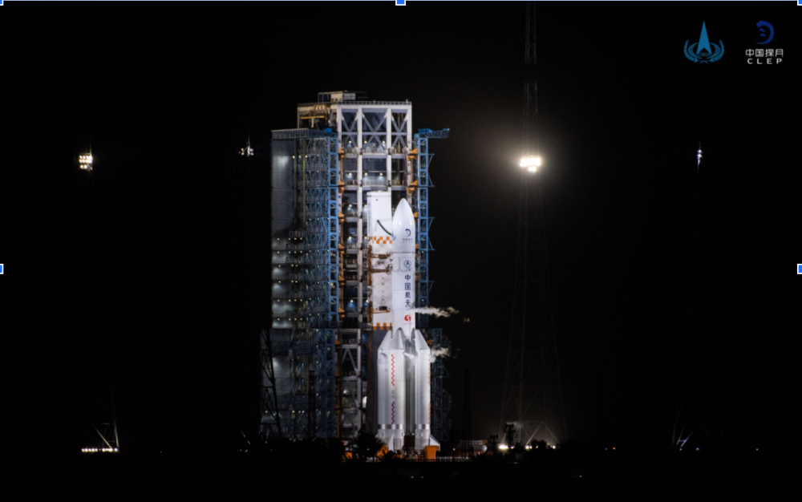
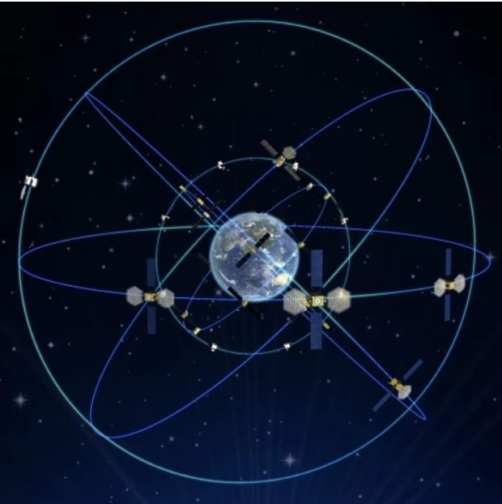
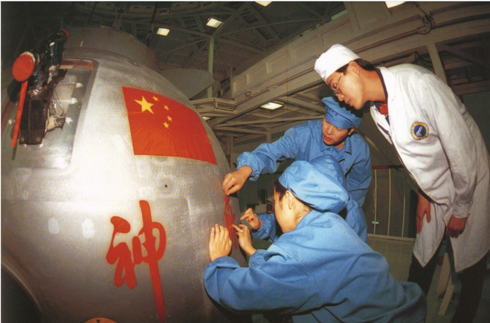
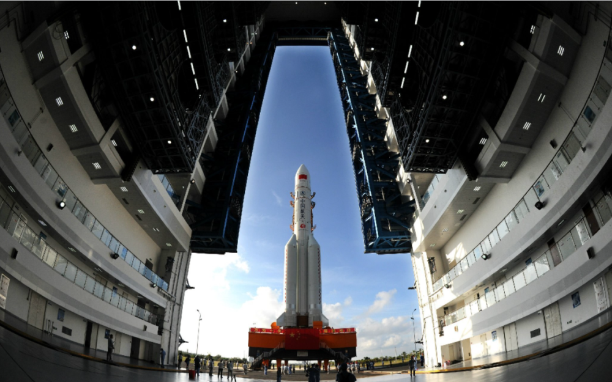
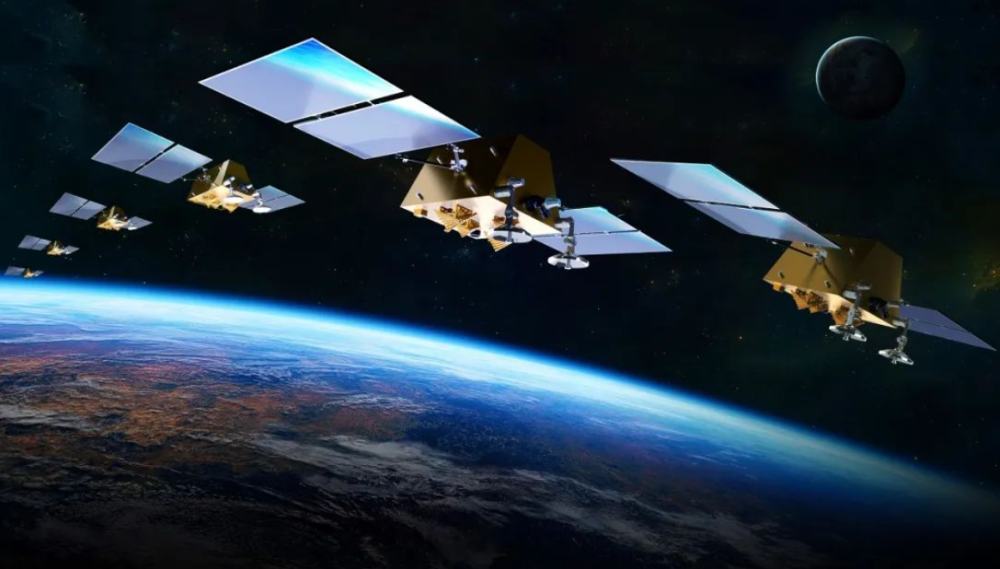
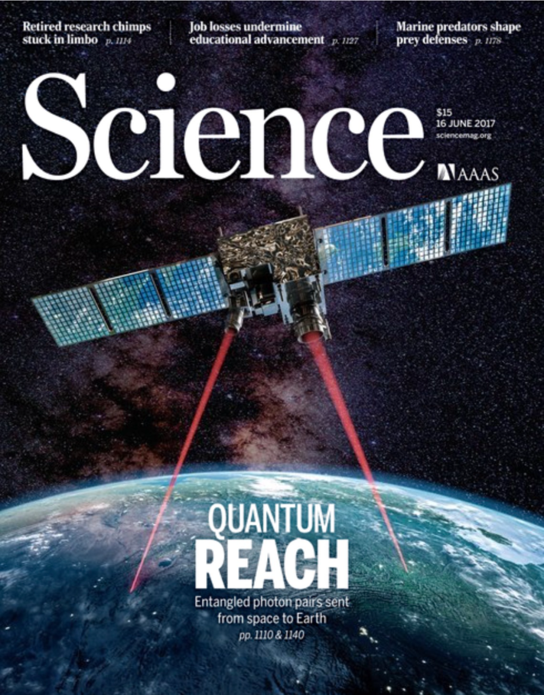

# 筑箭、造星、建空间站，中国航天取得了哪些重大突破？｜两会唠科

_“两会唠科”特别策划重点讲述中国科技名片，本期聚焦21世纪中国航天的飞速发展和辉煌成就。_

**编者按：**

航天历来是两会关注焦点，今年也不例外。

日前，全国政协委员、中国航天科工二院院长宋晓明接受采访时指出“加快实现高水平科技自立自强，是在新的历史起点向更高水平迈进的必然趋势和内在要求。”

此外，还有代表委员建议通过自主培养卓越工程师，解决“卡脖子”问题；关注商业航天高质量发展；搭建通导遥一体化卫星数据应用服务平台。

中国航天的发展离不开每一位航天人的努力和推动，离不开一代又一代的航天人接续奋斗。今天我们来回顾，过去近70年，中国人在太空，书写了哪些传奇。

**文 / 朱林崎教授 国际宇航联卫星商业应用专委会亚太办主任**

从女娲补天、夸父逐日、嫦娥奔月的神话传说，到万户飞天的舍身探索，中华民族对太空的好奇与向往延续了数千年。

新中国航天事业创建于1956年，开启了太空探索的坚实一步。

进入21世纪，《2000中国的航天》白皮书，首次向世人系统地阐述了中国航天发展的宗旨、原则和重点。特别是明确提出统筹规划、协调发展空间技术、空间应用与空间科学三个领域。由此，中国航天事业逐步走上全面、协调发展的“快车道”。经过二十多年的跨越发展，中国航天奋楫笃行，将千年的浪漫铸成现实：“天宫”空间站全面建成，古人想象的“天上宫阙”成为中国人自己的太空家园；中国月球探测“嫦娥工程”历经17载，“绕、落、回”三步走圆满收官，演绎了“嫦娥奔月”的浪漫；“天问一号”探测器成功在火星上留下中国印记，回答两千多年前诗人屈原在《天问》中向苍天发出的提问；“羲和”“夸父”双星“逐日”，将远古神话化为现实，中国步入“探日”时代。

中国航天人就这样逐梦不息，在星辰大海书写了一个又一个传奇 **。**
当前，中国航天立足新发展阶段，贯彻新发展理念，构建新发展格局，按照高质量发展要求，推动空间科学、空间技术、空间应用全面发展，开启了全面建设航天强国新征程。

_图为嫦娥五号发射
来源：国家航天局_

**01**

**十年磨一“箭”，扶摇直上九重天**

**“长征”火箭系列实现新跨越**

火箭的运载能力有多大，航天的舞台就有多大。
**进入21世纪，为持续增强我国运载火箭的可靠性和高密度发射能力，“长征”运载火箭开启新征程，加速了以新一代无毒、无污染、高性能“长征”系列运载火箭的开发。**

2000年～2001年，为新一代运载火箭配套的主动力发动机，即120吨级推力的液氧/煤油发动机和50吨级推力的氢氧发动机正式立项，开始了工程研制工作。

2006年，新一代运载火箭工程正式立项，十年磨一“箭”。2016年，中国新一代大型运载火箭"长征五号"成功首飞，实现中国液体运载火箭直径从3.35米到5米的跨越，大幅提升“长征”系列运载能力，低轨运载能力达到25吨级，高轨运载能力达到14吨级，使我国的火箭运载能力提高了2倍多，火箭整体性能和总体技术达到国际先进水平，成为中国航天进入更大舞台的擎天之柱。2015年以后，应用了120吨级液氧煤油发动机的新一代小型运载火箭“长征六号”、新一代中型运载火箭“长征七号”相继投入应用，使我国长征系列运载火箭实现了升级。

截止2022年底，长征系列运载火箭总发射次数突破458次，其中2016年～2022年，长征系列运载火箭发射次数达236次，占长征系列50余年发射总和的一半以上。

**目前，长征五号、六号、七号、八号、十一号等运载火箭，形成完备的大、中、小型火箭型谱，覆盖高、中、低地球轨道，运载能力达到世界一流水平。**

展望未来，航天人十年铸“箭”，将为新时代的“长征”之路抢得先机。

**02**

**“巡天遥看一千河”**

**我国空间基础设施卫星跃居全球第二**

21世纪初，在我国初步形成四个卫星系列的基础上，经过20多年的研发，卫星遥感、卫星通信、卫星导航三大体系不断完善，形成了“风云”“海洋”“资源”“高分”“遥感”“天绘”等对地观测卫星系列和“环境与灾害监测预报小卫星星座”、“亚太”“中星”“天通”“
天链一号”等系列通信和数据中继卫星系统，以及“北斗”卫星导航定位系统。

_图为北斗系统运行示意图
来源 北斗网_

三大体系共同构建起多功能和多轨道的、由多种卫星系统组成的国家空间基础设施。 **我国目前在轨稳定运行的空间基础设施卫星有300多颗，跃居世界第二位。**

随着我国空间基础设施不断完善，卫星应用业务服务能力显著增强，航天创造更加美好生活。

以2017年～2021年为例，卫星遥感对100余次国内重特大自然灾害开展应急监测，为国内数万家各类用户和全球100多个国家提供服务，累计分发数据超亿景。卫星通信广播累计为国内农村及边远地区的1.4亿多户家庭提供直播卫星电视服务。北斗导航为超过700万辆道路运营车辆提供安全保障服务，为超过4万艘海洋渔船提供定位和短报文通信服务等。

未来我国将持续完善国家空间基础设施，加快提升泛在通联、精准时空、全维感知的空间信息服务能力，进一步开创卫星应用新格局。

**03**

**“天上宫阙，今夕知何年”**

**中国载人航天迈入空间站时代**

1992年9月21日，中央决策实施载人航天工程，并确定了我国载人航天“三步走”的发展战略。这是中国航天史上迄今为止规模最大、系统最复杂、技术难度最高的工程。

_图为1994年初，中国自主制造的载人飞船定名“神舟” 来源：国家航天局_

**第一步：载人飞船阶段。**
这一阶段实施了4次无人飞行任务，以及神舟五号、神舟六号载人飞行任务。突破和掌握了载人天地往返技术。2003年10月，神舟五号飞船载着航天员杨利伟飞上太空，使中国成为继苏、美后，第三个将人类送上太空的国家。2005年10月，神舟六号搭载两名航天员首次成功进行多人多天太空飞行试验，标志着中国载人航天工程“三步走”发展战略“第一步”收官。

**第二步：空间实验室阶段。**
这一阶段实施了神舟七号至神舟十一号共5次载人飞行任务，长征七号运载火箭首飞任务，天宫一号、天宫二号空间实验室飞行任务和天舟一号货运飞船飞行任务。突破和掌握了出舱活动技术和自动/手动控制交会对接技术，建立了真正意义上的空间实验室，为建造中国空间站做了技术储备。

**第三步：空间站建设阶段。**
这一阶段分为关键技术验证和在轨建造两个部分实施。2020年5月至2022年4月成功实施了6次飞行任务，全面突破了空间站建造的关键技术，包括航天员长期在轨驻留的生活和工作保障技术、再生式环境控制和生命保障技术、机械臂辅助舱段转位技术等。2022年5月～11月开始实施在轨建造工作，先后成功完成5次飞行任务，空间站天和核心舱、问天实验舱和梦天实验舱三舱“T”字基本构型在轨组装完成，“天宫”空间站全面建成，载人航天工程“三步走”战略圆满收官。

**30年来，我国载人航天事业从无到有，实现了从搭载一人到多人升空、从舱内作业到太空行走、从短期遨游到中期驻留再到长期“出差”的历史性跨越。**

可以预见，以我国载人航天为代表的标志性成就，将使人类探索太空的脚步更稳更远。

**04**

**“嫦娥”逐月、“天问”探火**

**深空探测不断创造新高度**

我国在月球探测、火星探测强者并存的赛道上行稳致远，步步登高，不断创造我国深空探测的新高度。

2004年，我国正式开展月球探测工程，命名为“嫦娥工程”。并将探测任务形象地概括为“绕落回”三步曲。

第 **一步“绕”：** 2007年10月24日，嫦娥一号卫星成功发射，实现“精确变轨，成功绕月”的预定目标。
**这是继人造地球卫星、载人航天飞行取得成功之后中国航天事业发展的又一座里程碑** 。

**第二步“落”：**
2010年～2019年，先后成功发射了嫦娥二号、三号、四号探测器，突破和掌握了地外天体软着陆等关键技术。2019年1月3日，嫦娥四号探测器在中继星“鹊桥”的帮助下成功踏足月球背面，对这块“处女地”展开了人类的第一次探索。

**第三步“回”：**
2014年11月，通过嫦娥五号的“探路先锋”，完成了地球轨道以外航天器再入大气层的返回验证任务，掌握了航天器以接近第二宇宙速度再入返回的关键技术。2020年11月嫦娥五号探测器成功发射升空，并实现中国首次地外天体采样返回，将1731克月球样品成功带回地球，标志着探月工程“绕、落、回”三步走圆满收官。

_图为嫦娥五号着陆器和上升器组合体着陆后全景相机环拍成像
来源：国家航天局_

我国首次火星探测任务于2013年全面启动论证，2016年1月批准立项，其亮点是全球首次一步实现“绕、着、巡”。

2020年7月～2021年5月，先后完成了“天问一号”火星探测器发射升空、与火星交会、进入环绕火星轨道、着陆火星表面，以及“祝融号”火星车开展巡视探测等任务。
**“天问一号”探火任务的圆满完成，标志着中国航天实现从地月系到行星际探测的跨越。**

未来将继续实施月球探测工程、行星探测工程，完成近地小行星采样和主带彗星探测，完成火星采样返回、木星系探测，以及太阳系边际探测等。

**05**

**织就“天罗地网”，“天路”硬核护航**

**新时代的航天发射和测控通信能力持续增强**

进入21世纪，为满足高密度、多样化航天发射需求，满足深空测控通信需求，我国陆续开展了发射场和测控通信能力的建设。

目前，我国酒泉、太原、西昌发射场适应性改造全面完成，文昌航天发射场进入业务化应用阶段，基本建成沿海内陆相结合、高低纬度相结合、各种射向范围相结合的航天发射格局，能够满足载人飞船、空间站舱段、深空探测器及各类卫星的高密度、多样化发射需求。海上发射平台投入使用，填补了中国海上发射火箭的空白。

_图为文昌发射场
来源：央广军事_

航天测控通信能力实现由地月空间向行星际空间跨越，天基测控能力持续增强。圆满完成了载人航天、探月、探火等为代表的航天测控任务。商业卫星测控站网也得到加快发展。

未来将进一步建设和完善航天发射场系统，满足各类发射需求；持续增强深空测控通信网，保障月球、火星等深空探测任务实施。

**06**

**“潮平岸阔催人进，风正扬帆正当时”**

**商业航天发展进入“快车道”**

上世纪90年代初，长征三号火箭将“亚洲一号”卫星送入预定轨道，标志着中国航天开启国际商业航天活动。

进入21世纪， **特别是2015年以后，在国家政策支持和社会资本的广泛参与下，涌现出一大批新兴商业航天企业，产业体系和市场体系初步形成。**
我国商业航天发展进入了“快车道”，商业航天逐步成为加快航天强国建设的重要力量。

商业发射服务能力不断壮大。以2022年为例，我国实施了20余次商业发射服务，航天科技集团、航天科工集团、中科宇航、星河动力等各类机构均有商业火箭发射。近年来，面向商业发射服务的运载火箭不断涌现，长征十一号、长征六号、快舟一号甲、快舟十一号、捷龙一号、捷龙三号、双曲线一号、谷神星一号、力箭一号等运载火箭成功实施发射任务，成为传统火箭入轨能力的有力补充。面向商业应用的卫星研制、部署与服务能力不断取得突破，卫星应用场景进一步拓展。

_图为银河航天低轨卫星互联网星座概念图 来源：银河航天_

例如，天启卫星组网提供全球物联网数据传输等服务；银河航天试验星座进行低轨卫星互联网、天地一体网络等技术验证；九天微星开拓海洋物联网等应用。中国四维“高景”星座提供0.5米高分辨率商业卫星遥感服务，其新一代商业遥感卫星系统完成第一阶段建设；吉林一号星座、珠海一号星座为用户提供多种遥感数据和产品服务；吉利星座开始部署，服务于推动天地一体化高精时空信息系统建设，为车路协同应用提供高精度位置服务；微厘空间低轨卫星导航增强系统推进在轨验证。

商业航天基础设施建设持续推进，山东海阳东方航天港已具备年产20发固体运载火箭总装测试能力和海上发射支持保障能力。中国首个商业航天发射场于2022年7月在海南文昌开工建设。

未来我国商业航天力量有望在培育发展太空旅游、太空生物制药、空间碎片清除服务等太空经济新业态方面发挥更大作用。

**07**

**“天高地迥，觉宇宙之无穷”**

**空间科学成果亮点纷呈**

我国空间科学发展主要通过载人航天工程、月球与深空探测工程和“空间科学先导专项”推动。进入21世纪，我国空间探测技术与手段的进步，为空间科学研究与发现提供了有力手段，研究水平显著提升。

在空间天文方面，“悟空”号暗物质粒子探测卫星、“慧眼”硬X射线调制望远镜卫星、“羲和号”太阳探测科学技术试验卫星分别对宇宙射线、宇宙磁场和黑洞等测量与观测提供重要手段。夸父一号先进天基太阳天文台卫星成功发射，填补了中国太阳探测专用卫星的空白。

在月球与行星科学方面，依托月球探测工程，在月球地质和月表结构分析等方面取得重大成果，首次在月球发现新矿物“嫦娥石”。依托行星探测工程，深化人类对火星地质演化认知。

在空间地球科学方面，“张衡一号”电磁监测试验卫星获取了全球地磁场和电离层原位数据，构建了全球地磁场参考模型。全球二氧化碳监测科学实验卫星获取了全球高精度二氧化碳分布图。

在空间基础物理方面，利用“墨子”号量子科学实验卫星，开展千公里级星地量子纠缠分发和隐形传态实验等。

在空间环境下的科学实验方面，利用“神舟”系列飞船、“天宫二号”空间实验室、“实践十号”卫星等，在生命科学、微重力、材料制备等领域，取得了一批有国际影响力的空间科学研究成果。

_图为量子物理研究成果登上《科学》杂志
来源：中科大_

未来将围绕极端宇宙、时空涟漪、日地全景、宜居行星等科学主题，借助各类天基探测与实验平台，持续开展空间科学研究，催生更多原创性科学成果。

**08 结束语**

征途漫漫，中国航天砥砺前行。长征、神舟、天宫、北斗、风云、鹊桥、嫦娥、祝融、悟空、慧眼、羲和、夸父等一系列浪漫名词，搭起了沟通古与今、天与地的桥梁。

信心满满，中国航天面向未来，开启全面建设航天强国新征程。

中国航天人叩问苍穹的脚步永不停歇，在星辰大海书写新的传奇。

