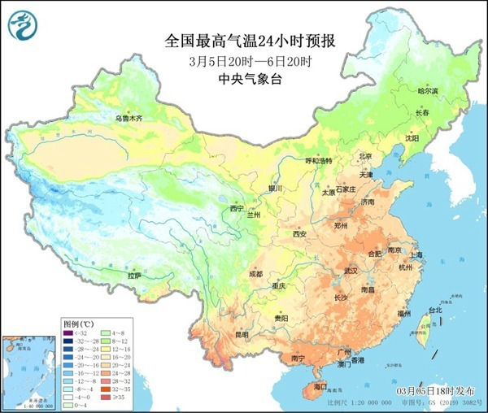

# 罕见暖热下周迎最高点，强冷空气也将登场或达寒潮级别

今日午后，中东部又有大片区域刷新今年来气温新高，截至今天16时，哈尔滨、长春、沈阳、呼和浩特、太原、银川、西宁、济南、郑州、合肥、武汉、南京、长沙、南昌、成都等。

**15个省会级大城市气温创今年来新高**

其中合肥为今年首次超过25℃，哈尔滨气温高达12.7℃，首次突破10℃，预计大回暖趋势将延续至3月上旬末，10日前后气温将升至近期最高点，尤其黄淮周边一带还将逼近甚至挑战，3月上旬同期最暖纪录。

预计10日，济南最高气温可能达到29~30℃，如超过30℃，这将是济南有气象记录以来3月上旬最暖一天，从今天晚上最新城市预报来看，下周，济南福州最高度可能达到29℃，郑州则直接达到30℃。

此外，石家庄9日预报最高气温29℃，也将是有气象记录来当地3月上旬最热一天，是否超过30℃仍未可知，同时，一股实力强劲的冷空气已可预见。

_△11日的气温预报就已能看出北方气温突然大幅下降了_

中央气象台中期预报显示，9日至12日，将有一股强冷空气自西向东侵袭我国，西北、华北部分地区将有沙尘天气，南方地区将出现较大范围降雨过程，西北及中东部部分地区气温下降幅度可达10~16℃，由于前期大幅偏暖制造极大降温空间。

**预计这股强冷空气或可达寒潮级别**

3月上旬偏暖少雨的天气格局将彻底扭转，11日至12日影响到中东部大部并造成气温急速下跌，多地的累计降温幅度可以超过15℃甚至20℃，气温短短两天内将由异常偏高转为偏低水平，提醒大家千万注意及时增添衣物。

除了带来强降温，冷空气也将带来大范围雨雪天气，预计10—12日，新疆北部、内蒙古东北部，及东北地区东部和北部有小到中雨雪，四川盆地、黄淮、江汉、江淮，江南、华南北部及贵州、云南东部等地，有小到中雨部分地区有大雨。

来源 中国天气网

编辑 高珊珊

流程编辑 刘伟利

