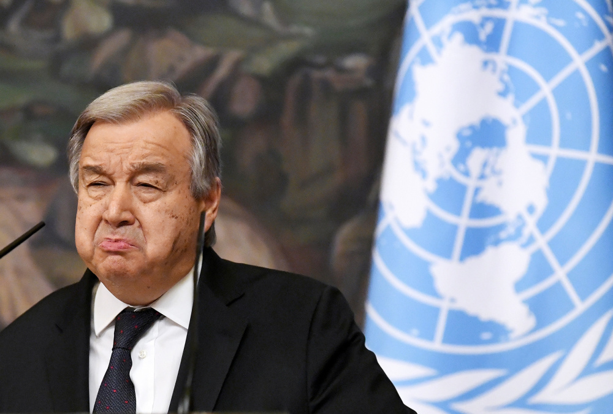

# 联合国秘书长抨击富裕国家与能源巨头，还敦促富国每年援助5000亿美元

每经编辑：毕陆名

据央视新闻3月5日消息，当地时间3月4日，联合国最不发达国家峰会在卡塔尔首都多哈举行，联合国秘书长古特雷斯以及来自全球46个最不发达国家的领导人或代表与会。

另据澎湃新闻4日报道，当地时间3月4日， **古特雷斯抨击世界上的富裕国家和能源巨头以“掠夺性”利率和高企的燃油价格来遏制贫穷国家。**

富裕国家应每年援助5000亿美元

据央视新闻5日报道，当地时间3月4日，联合国最不发达国家峰会在卡塔尔首都多哈举行，联合国秘书长古特雷斯以及来自全球46个最不发达国家的领导人或代表与会。
**联合国秘书长古特雷斯在峰会致辞中敦促富裕国家每年提供5000亿美元，援助“陷入恶性循环”的最不发达国家，帮助它们促进经济发展、提高教育和医疗水平。**

_联合国秘书长古特雷斯图片来源：视觉中国_

古特雷斯还批评发达国家主导的全球金融体系只关注自身利益，不仅没有推动最不发达国家的发展，反而通过掠夺性的借贷成本加剧了全球财富不均现象，导致最不发达国家深陷债务危机。

另据澎湃新闻3月4日报道，阿富汗和缅甸这两个LDC国家因为其政府未能得到联合国成员国的承认，没有出席在多哈举行的会议。没有任何世界主要经济体的领导人出席该会。

在峰会开幕式上，古特雷斯直接抨击了强国对待穷国的方式。“（LDC国家）资源匮乏、负债累累，并且仍在与不平等应对疫情的历史性不公正作斗争，经济发展充满挑战。”最不发达国家长期以来一直抱怨他们没有得到应有的疫苗分配份额，而这些疫苗主要集中在欧洲和北美地区。

古特雷斯指出，LDC国家在应对富裕国家造成的气候灾难，这是一笔巨额支出，而收到的财政援助“只是九牛一毛”。同时，“化石燃料巨头正在攫取巨额利润，而LDC国家内数百万人却无法维持生计。”古特雷斯表示，这些最贫穷的国家在“数字革命”中被抛在了后面，而乌克兰战争只增加了他们需要为食品和燃料支付的价格。

大多数发达国家未兑现援助承诺

据央视新闻3月4日报道，当地时间3月4日，联合国最不发达国家峰会在卡塔尔首都多哈举行，联合国秘书长古特雷斯在峰会开幕式上致辞。

他表示，最不发达国家人口占全球总人口的八分之一，部分国家陷入了资源匮乏、负债累累的困境，使得经济发展步履维艰。而大多数发达国家没有兑现将其国民总收入的0.15%至0.20%作为官方援助，提供给最不发达国家的承诺。

3月5日至9日，多哈将举办第五次联合国最不发达国家问题会议，会议主题为“从无穷潜力到繁荣发展”。

最不发达国家是指经联合国认定的社会、经济发展水平以及人类发展指数最低的国家。截至2023年3月，全球共有46个国家被联合国列为最不发达国家，其中33个位于非洲。

联合国最不发达国家问题会议每十年召开一次，第四次会议于2011年在土耳其伊斯坦布尔举行。会议期间通过的《伊斯坦布尔行动计划》中，发达国家承诺自2011年起的未来十年，将其国民总收入的0.15%至0.20%作为官方援助提供给最不发达国家。

每日经济新闻综合央视新闻、澎湃新闻

每日经济新闻

