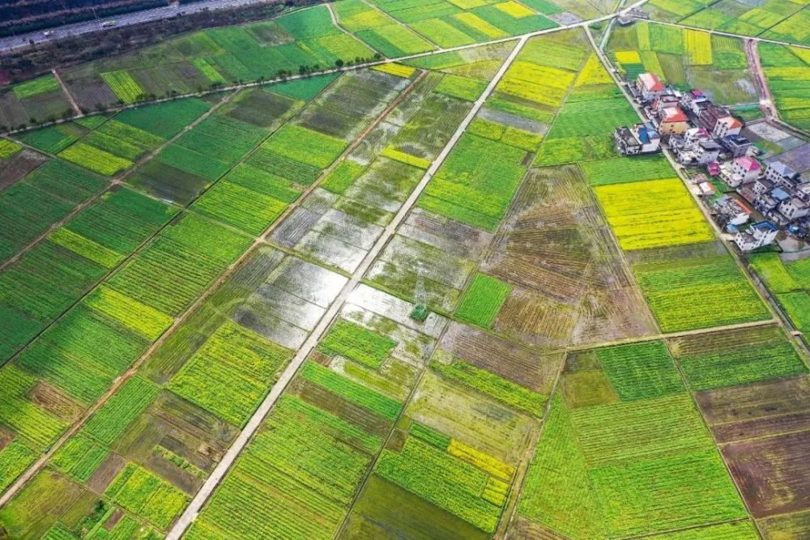
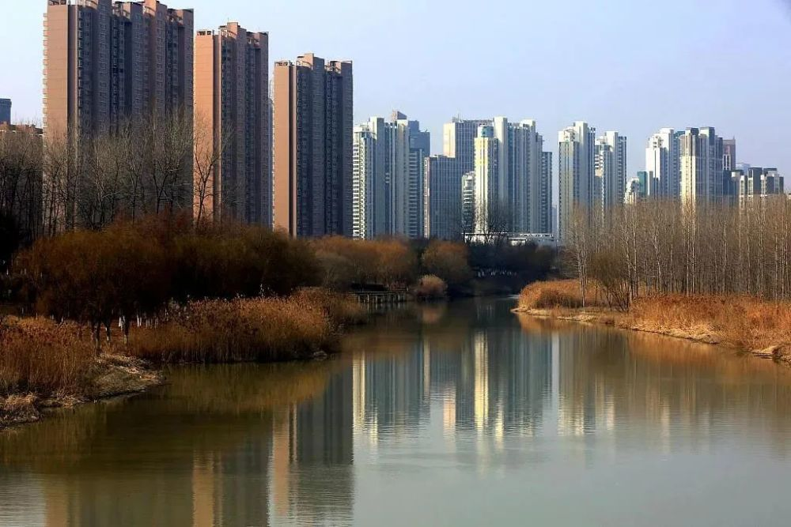

# 速读政府工作报告

5日上午，十四届全国人大一次会议在人民大会堂开幕，国务院总理李克强向大会作政府工作报告。

**过去一年主要工作成绩回顾**

2022年是党和国家历史上极为重要的一年，我国发展取得来之极为不易的新成就。

■ 全年国内生产总值增长3%。

■ 城镇新增就业1206万人。

■ 居民消费价格上涨2%。

■ 粮食产量1.37万亿斤，增产74亿斤。

■ 新增减税降费超过1万亿元，缓税缓费7500多亿元。

■ 免除经济困难高校毕业生2022年国家助学贷款利息并允许延期还本。

■ 就业形势总体保持稳定，经济增长正在企稳向上。

**过去五年主要工作成就回顾**

■ 国内生产总值增加到121万亿元，五年年均增长5.2%。

■ 城镇新增就业年均1270多万人。

■ 全社会研发经费投入强度从2.1%提高到2.5%以上。

■ 高速铁路运营里程从2.5万公里增加到4.2万公里，新建改建农村公路125万公里。

■ 货物进出口总额年均增长8.6%，突破40万亿元、连续多年居世界首位。

■ 基本养老保险参保人数增加1.4亿、覆盖10.5亿人。

■ 成功举办了简约、安全、精彩的北京冬奥会、冬残奥会。

■ 新冠疫情防控取得重大决定性胜利。

■ 城乡居民医保人均财政补助标准从450元提高到610元。

■ 推行药品和医用耗材集中带量采购，降低费用负担超过4000亿元。

■ 实施三孩生育政策及配套支持措施。

**2023年发展主要预期目标**

**及重点工作建议**

■ 国内生产总值增长5%左右。

■ 城镇新增就业1200万人左右，城镇调查失业率5.5%左右。

■ 居民消费价格涨幅3%左右。

■ 居民收入增长与经济增长基本同步。

■ 进出口促稳提质，国际收支基本平衡。

■ 粮食产量保持在1.3万亿斤以上。

■ 单位国内生产总值能耗和主要污染物排放量继续下降。

■ 把恢复和扩大消费摆在优先位置。

■ 多渠道增加城乡居民收入。

■ 推动外资标志性项目落地建设。

■ 有效防范化解优质头部房企风险，改善资产负债状况，防止无序扩张，促进房地产业平稳发展。

■ 支持刚性和改善性住房需求，解决好新市民、青年人等住房问题。

■ 大力发展职业教育，推进高等教育创新。

■ 推动优质医疗资源扩容下沉和区域均衡布局。

监制/李浙 制片人/王兴栋

主编/柴婧 史萌

编辑/战星岑 校对/高少卓

