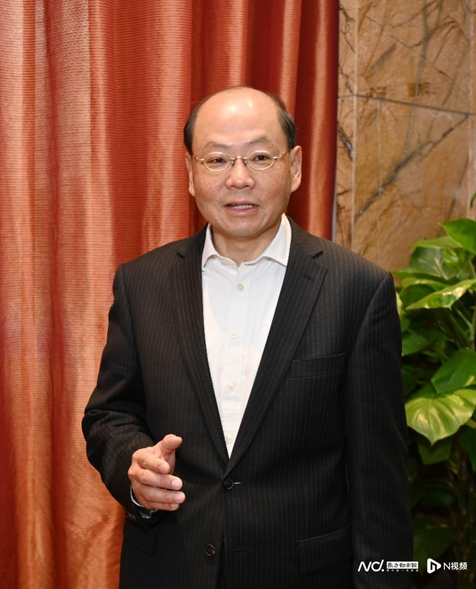
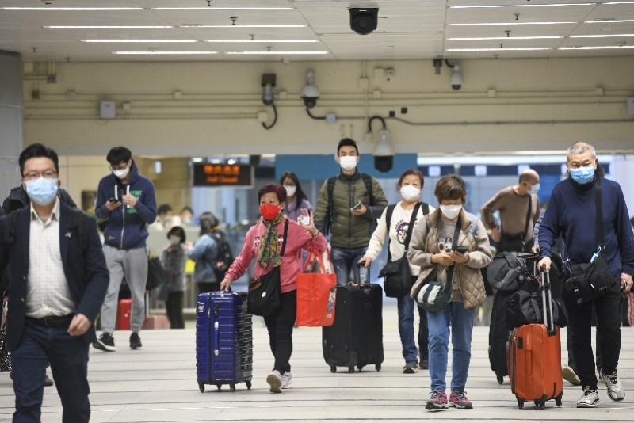

# 香港警务处原处长：蔡天凤一案为极个别恶性案件，香港总体治安良好

近期，香港发生蔡天凤被谋杀一案，引发两地舆论高度关注。2023年全国两会之际，全国政协委员、国家禁毒委副主任、香港警务处原处长曾伟雄对南都记者作出回应，该案件为极个别恶性刑事犯罪案件，香港总体治安良好，“罪案率低于全球绝大部分地区。”

过去五年政协履职期间，曾伟雄一直心系两地，始终扮演着沟通香港与内地之间的“桥梁”角色，今年他依旧关注香港的未来，尤其是香港的青年人如何共享时代发展机遇。

经历疫情的冲击之后，如今的香港发生了什么变化？香港要如何融入国家发展大局，在粤港澳大湾区建设的过程中，两地又要如何真正实现融合发展？近期，南方都市报独家专访曾伟雄，他对上述问题给出了答案。

_全国政协委员、国家禁毒委副主任、香港警务处原处长曾伟雄。_

**谈香港现状**

**香港治安稳定，恶性案件是个别现象**

**南都：近期，香港蔡天凤被谋杀一案引起舆论高度关注，有公众会对香港的治安产生怀疑？**

**曾伟雄：**
这起案件大家都很关注，是恶性刑事犯罪，犯案的手法令人震惊，有人继而对治安产生担忧，我们非常理解，但我必须指出，香港总体治安情况还是非常好的。

举一个例子，我们叫罪案率，计算每10万人口之中的犯案总数来衡量一个地区的治安状况，香港的罪案率比全球大多数地区要低，去年每10万人口之中的犯案总数是900多人。

我还是警务处处长的时候就有一个心愿，希望香港的罪案率能下降到1000以下，我在任期内做到了，至今依然维持在1000以下，这也证明香港的治安环境良好。

**南都：香港去年9月率先改变了防疫政策，目前香港完全走出疫情阴霾了吗？**

**曾伟雄：**
疫情对香港的影响非常大，香港市民也非常期待防疫转向，目前已经全面放开，受到广大市民的欢迎。但香港要完全恢复，回到之前繁荣的状态，还需要一段时间。

举个例子，香港大巴已经停了三年，重新启动需要过程，很多游客很久没来香港，要让他们重新有来香港旅游的想法也需要时间。但是我有信心，香港可以全面恢复，但是要多给一点时间。

**南都：内地公众也很关注，香港国安法实施之后，给香港的发展带来什么变化？**

**曾伟雄：** 香港国安法非常有针对性，主要是治理危害国家的问题，很多人都说，有了国安法以后，香港由乱及治，这是无可争论的。

**谈政协委员履职**

**当好“桥梁”初心未变，推动两地凝聚共识**

**南都：据说每年来北京开会前，会有许多人对您说要当好内地和香港的“桥梁”，具体如何发挥“桥梁”的作用？**

**曾伟雄：**
过去五年作为全国政协委员，除了参政议政以外，我更多考虑的是如何推动香港和内地凝聚共识，促进香港和内地加强沟通交流合作。从我个人而言，“桥梁”的角色一直没有变，但内涵可能有所改变。

举个例子，在改革开放初期，如果香港是提供资金和技术，那么内地更多是提供劳动力跟土地，现在发展格局已经产生了根本性改变，香港是国际金融中心，但是内地与以往相比，已经有了翻天覆地的变化，所以香港和内地一定要各自发挥所长、取长补短。近年来，国家提出建设粤港澳大湾区，香港一定要主动融入内地，实现融合发展，最终才能达到1+1大于2的效果。

**南都：今年带来什么提案？**

**曾伟雄：**
我今年依然关注香港如何融入国家发展大局。香港作为一个成熟的经济体，如果依然只想单方面谋求发展，有明显的局限性，香港经济要发展，必须融入国家发展大局，才能再次迈上高峰。

我们常说，两地要融合发展，不仅仅是经济的融合，也是社会、政治的融合，我们要特别关注这一点。

以前我们父辈那一代，很多人从内地迁到香港，仍然有很多亲友在内地，但对新一代香港青年人而言，这种香港和内地之间的亲缘纽带已经不复存在，我们需要重新考虑研究两地往来的基础，所以我会特别关注如何推动香港的青年人参与融入国家发展，这也是我未来的提案中将持续关注的重点。

_2月6日，在罗湖口岸，从香港到深圳的首批旅客跨越连接深港两地的大桥。当日，内地与港澳人员往来全面恢复。深圳皇岗、罗湖、莲塘等口岸陆续全面“开闸”，内地与香港间陆路口岸全面恢复通行。
新华社发_

**谈两地融合发展**

**香港要融入内地关键是人要流动，亟须打破制度壁垒**

**南都：失去亲缘纽带之后，香港的青年人要如何与祖国建立连接？**

**曾伟雄：**
怎么让中华文化根植于香港社会，是目前需要高度重视的工作。中华文化博大精深，饮茶也好、音乐也好、画作也好，要潜移默化地让香港新一代年轻人受到文化的熏陶和影响，这非常关键。

他们需要接触、认识、体悟中华文化，青年人也要真正了解中国，了解国家最新发展现状。就像华侨一样，他们远在海外，一代又一代人在国外生活，但对中华文化依然有认同感。

**南都：香港也在鼓励青年人至内地就业生活，但也有网友反映，两地在企业制度、企业薪酬、企业文化上存在诸多差异，很多青年人意愿不强。**

**曾伟雄：**
这是一个非常关键的问题，也是两地在融合过程中必须面对的问题。要实现融合发展，最关键的是要让人流动起来。无论就业也好、创业也好、求学也好，港澳地区的年轻人要回到国内自由流动。目前因为制度上的差异仍有种种壁垒，如何把这些壁垒打破非常重要。

比如资历认证，我以前做过调研，香港和内地实现彼此之间的资历互认仍然局限在特殊的几个行业，未来能不能进一步打破行业壁垒？再比如内地和香港存在薪金差异，不仅是薪金本身，也有税率、税收上的差异，这也是一个问题。

**南都：您提到薪金之间的差异，据我所知，两地薪酬差异较大，短时间内很难解决这一问题。**

**曾伟雄：** 香港的青年人应该意识到，香港的未来离不开国家的未来，它必须融入国家发展，青年人必须改变观念，这是必经之路。

我们的年轻人不仅要抱有愿意到内地工作的心态，也需要抱有愿意到内地生活的心态。如果你在内地挣钱在内地生活，可能收入就不太会成为一个问题。但如果还是要两地往返回到香港生活，可能就会很艰难。除了就业，还有创业、求学，我们遇到困难是必经的过程，但我相信随着两地逐渐融合发展，在经历这些“阵痛”之后，最终能解决这些难题，香港的年轻人能真正愿意留在内地发展和生活。

**谈禁毒形势**

**国内吸毒人员持续减少，呼吁消除对涉毒人员的歧视**

**南都** ： **您是国家禁毒委副主任，怎么看待近年的禁毒形势？**

**曾伟雄：**
首先我必须强调禁毒工作永远在路上，不能有所松懈。全球的毒品问题正不断恶化，我们面临的风险越来越多。但我很高兴地告诉大家，在我参与国家禁毒治理工作的这几年里，从2019年至今，国内的毒品问题正在持续改善。

举一个例子，我2019年刚参与禁毒工作的时候，中国的吸毒人员是240多万，到今天已经下降至不足150万，中国的禁毒工作取得了非常傲人的成绩。相反，全球吸毒人员的数据在不断上升，全球大概80亿人口，吸毒人员约3亿，这个比例和中国的数据相比，相差甚远。

**南都：吸毒人员回归社会始终是一个难题，香港的戒毒康复工作做得很好，有哪些可供借鉴的经验？**

**曾伟雄：**
吸毒是需要处理的违法行为，这是社会共识，但吸毒人员也是受害者，香港在戒毒康复方面有一套非常成熟的经验，也取得了一定的成绩。我经常会到一线了解情况，内地的工作也在不断改善，很多地方在开展戒毒康复工作时，除了保证他们不会重新吸毒之外，还会确保他们学会一门技能，可以回到社会重新就业。社会对吸毒人员的确带有一些歧视，很多地方也通过一些激励手段，为吸毒人员安排职业技能训练，介绍他们到一些企业工作，这些做法都非常值得鼓励。

消除对吸毒人员的歧视，政府和志愿团体都在不断努力，希望国家也能通过推广经验，让社会不再对吸毒人员带有歧视的眼光，让他们真正能够翻开人生新的一页。

南都两会报道组出品

策划：程姝雯 潘珊菊 蒋琳

统筹：梁建忠

采写：南都记者 蒋小天 宋承翰 实习生 尚咲

