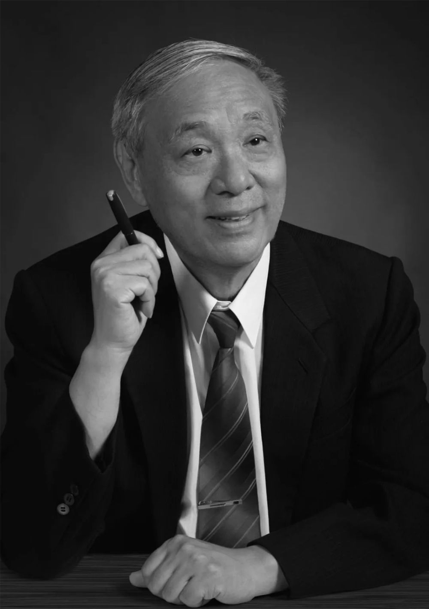

# “中国预警机之父”王小谟院士逝世，享年84岁

据中国电子科技集团有限公司微信公众号“中国电科”3月6日消息，中国共产党的优秀党员，久经考验的共产主义忠诚战士，我国著名雷达专家，预警机事业的开拓者和奠基人，国家最高科学技术奖获得者，中国工程院院士，中央直接联系的高级专家，原电子工业部第38研究所所长，原中国电子工业总公司军工局局长，原信息产业部电子科学研究院常务副院长，工业和信息化部电子科技委原副主任，中国电子科技集团有限公司科技委原副主任王小谟同志，因病医治无效，于2023年3月6日14时06分在北京逝世，享年84岁。

王小谟同志遗体告别仪式定于2023年3月12日10时在北京八宝山殡仪馆东礼堂举行。

谨此讣告。

王小谟同志治丧办公室

2023年3月6日

**王小谟院士生平**

斯人逝去，草木含悲；国士陨落，山河俱哀。

王小谟院士的一生是热爱祖国、追求真理的一生，是为推动我国防空雷达迈向国际先进水平努力奋斗的一生，是为建立和完善我国预警机装备体系不懈奋斗的一生。王小谟院士的逝世是我国军工电子与国防战线的巨大损失，是我国空基信息化武器装备建设的巨大损失！

1938年11月12日，王小谟出生于上海金山一个爱国军官家庭。抗日战争期间，尚在幼年的王小谟跟随父亲辗转后方，坚持抗日。抗日战争胜利后，王小谟随家人返回上海，就读于上海虹口小学。解放战争胜利前夕，王小谟同家人奔赴解放区，移居北京。

1956年，王小谟考入北京工业学院（今北京理工大学）无线电工程系。1961年，王小谟以八木天线为主要研究内容的毕业设计获北京工业学院毕业设计一等奖；同年，他被分配到位于南京的国防部第十研究院第14研究所。

在14所期间，王小谟在总体室工作，参加了408雷达的研制，并担任了583三坐标雷达专业组副组长，参与了国内研制583雷达可行性方案研究和初步工程设计。“文化大革命”期间，王小谟受到冲击，583三坐标雷达被迫中断，王小谟被调离原技术岗位，被安排到14所计算机房当机房管理员。王小谟没有因此自怨自艾，而是把握管理计算机的机会，深入研究和掌握了计算机的原理与运用，这使得王小谟成为我国较早掌握计算机技术的专家，并为日后他在主持研制383雷达时率先采用自动化技术打下了坚实基础。

1969年，响应国家“三线”建设号召，按照14所“成建制分迁”方式新建雷达研究基地的部署，王小谟投身到了深藏在黔西南大山中的第38研究所的草创中，住在四面透风的油毡茅棚里，不仅食物匮乏，甚至连吃水都有困难，以王小谟为代表的一批科研人员就在这样的艰苦条件下，开启了筚路蓝缕、披荆斩棘的创业时代。

1969年12月底，王小谟被任命为38所总体室的临时负责人；1972年，王小谟被任命为国产第一部三坐标雷达——383的总设计师，13年磨一剑，克服地处“三线”、科研条件和生活条件都极端闭塞和艰苦的不利条件，于1984年4月完成设计定型。383雷达的研制成功，不仅填补了国产三坐标雷达的装备空白，也使得三坐标雷达成为我国雷达设计研制的一个新领域，更对实现我国国土防空网从概略引导向精确引导的转变，作出了重大贡献。1985年，383雷达项目荣获国家科学技术进步一等奖。1987年，王小谟作为全国14名有突出贡献的中青年科学家之一，受到邓小平同志的亲切接见。

1985年12月，王小谟被任命为38所所长。1988年底，38所调整迁建终于正式启动，38所整体迁建安徽合肥。

在调整迁建过程中，王小谟率领38所干部职工一方面稳妥完成了千头万绪的迁建任务，另一方面又全力保证科研生产不受影响。按照王小谟发展出口装备创汇的思路，38所自主研制生产了JY-9、384等先进雷达，成功开拓了国际市场，不仅解决了38所迁建合肥资金匮乏的问题，完成了38所的“二次创业”，更创造了中国雷达出口的新奇迹。1995年，JY-9雷达荣获国家科学技术进步一等奖。

1992年2月，王小谟被任命为中国电子工业总公司军工局局长，时年54岁的王小谟由此开启了预警机装备的论证与研制之路，推动实现了我国国土防空网从地面向空中的飞跃，更是推动实现了我国从国土防空向攻防兼备的重大转型。

1992年，我国正式启动与国外先进国家的合作研制；1993年6月，王小谟调任电子科学研究院常务副院长，并出任中方负责人。研制过程中，王小谟创造性提出背负式、大圆盘、三面有源相控阵雷达的新型预警机方案，同时力排众议，坚持同步安排国内配套研制，使得我国在较短时间内掌握了相控阵雷达收发组件、大型天线罩和系统软件等重大关键技术，从而将预警机发展的主动权掌握在自己手里。

2000年7月，在西方大国的阻挠和施压下，外方选择单方面撕毁合作合同，我国预警机装备发展面临何去何从的关键时刻。王小谟坚持自主研制，大力推动国内立项。时任国家主席江泽民同志作出重要批示：“研制部门一定要争口气，否则总是要被人卡脖子！”造出中国人自己的“争气机”，就是以王小谟为代表的广大科研人员为之舍命奋斗、协同攻关的事业和信念。

在空警-2000、空警-200两型预警机成功立项后，王小谟提出了研制出口型预警机的设想，并于2002年1月起，开始了出口型预警机方案的论证，并亲任总设计师。2008年，我国同国外用户正式签署ZDK03预警机的研制合同。出口型预警机的研制成功，为我国预警机基于国产飞机平台实现“小平台、大预警”的跨越提供了重要的技术基础，也标志着我国成为世界上第四个能够出口预警机的国家。

2013年，王小谟荣获2012年度国家最高科学技术奖。作为获奖代表在国家科学技术奖励大会上发言时，王小谟表示：“我只是一名普通的科技工作者，在党和国家的支持下，做成了点儿事。这事离开团队的力量是绝对无法做到的。荣获国家最高科学技术奖是一种无上的光荣，这份殊荣不仅属于我个人，更属于整个团队，属于这个伟大时代所有爱国奉献的知识分子。”

2022年5月17日，已83岁高龄的王小谟院士再次出征，瞄准攻关网络信息体系建设的机遇与挑战，领衔成立了王小谟空基技术实验室。

生于战乱贫弱的旧中国，长于换了人间的新中国，奋斗于春潮澎湃、活力竞放的改革开放，求索不止、鞠躬尽瘁于新时代，历经中国从站起来、到富起来、再到强起来的伟大历史进程，王小谟院士主持研制成功我国第一部自动化三坐标雷达，成功研制我国第一部中低空兼顾的低空雷达，系统谋划和推进我国预警机事业的发展，设计提出了我国预警机技术发展路线图和预警机装备发展体系，为我国预警机研制彻底打破国际封锁、实现完全自主发展、赶超国际先进水平作出了无可取代的重要贡献，为我国雷达和预警机装备的发展屹立起一座座不朽的丰碑！

我们深切缅怀王小谟院士，就是要学习王小谟院士信念坚定、敢于斗争的共产党员品格。

我们深切缅怀王小谟院士，就是要学习王小谟院士自立自强、百折不挠的科学家精神。

我们深切缅怀王小谟院士，就是要学习王小谟院士守正创新、敢为人先的改革者担当。

哀哉复哀哉，国士一朝驾鹤去；壮哉并伟哉，精神长存浩乾坤。对王小谟院士的最好纪念和缅怀就是学习他的坚定品格意志和宝贵精神，加快实现高水平科技自立自强，为全面建成社会主义现代化强国，以中国式现代化推进中华民族伟大复兴提供强大科技支撑。让我们紧密团结在以习近平同志为核心的党中央周围，贯彻落实党的二十大精神，踔厉奋发、勇毅前行，不断谱写强国强军事业发展新篇章。

