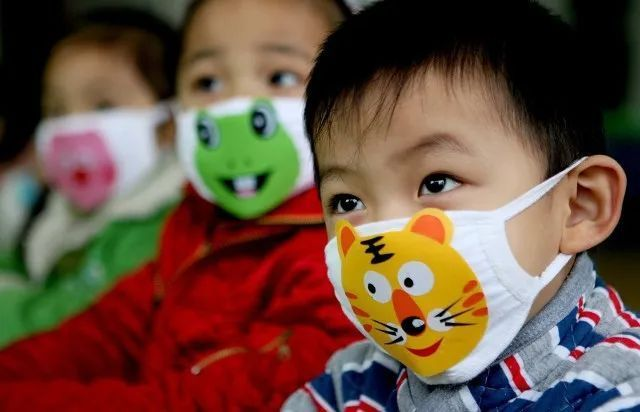

# “甲流”凶猛：持续五周上升，全国哨点医院流感阳性率超过新冠

**来源丨** 21新健康（Healthnews21）原创作品

**作者/季媛媛**

**编辑/徐旭**

**图片/图虫**

春暖花开，万物复苏，流感病毒卷土重来。近期，我国南北多地进入季节性流感高发期，其中多地甲流疫情流行，不仅导致学校停课，而且还给医院就诊带来压力。

据中国国家流感中心发布监测的数据显示， **2023年第8周南方省份哨点医院报告的ILI%为3.9%，高于前一周水平(1.8%)**
，高于2020~2022年同期水平(3.7%、2.2%和3.1%)。
**2023年第8周，北方省份哨点医院报告的ILI%为4.4%，高于前一周水平(1.9%)**
，与2020年同期持平(4.4%)，高于2021~2022年同期水平(1.6%和1.9%)。

此外，据上述监测数据显示，
**全国哨点医院流感样病例流感病毒阳性率持续五周上升，已在2023年第8周达到25.1%，而同期流感样病例新冠病毒阳性率却仅有5.1%。值得注意的是，这也是连续两周流感样病例中流感病毒阳性率超过新冠病毒阳性率。**

为何今年甲流如此集中？对此，上海嘉会国际医院儿科医师姜茜对21世纪经济报道表示，今年甲流感觉更集中，基本上是因为校内感染、群体性的，也就是说一个班级或者是一个学校里有了流感病例，可能周围接触过的孩子会迅速被感染，门诊经常遇到一个学校来好几个孩子，基本上都是甲流。

“还有一个可能的原因就是之前3年小孩子没有太接触外面的环境，本身免疫系统没有经过磨练、不是很强。所以可能导致这次暴发也更明显一些。”姜茜说。

**常见传染病春季易传播**

流感是流行性感冒的简称，是由季节性流感病毒引起的急性呼吸道传染病。目前，引起流感季节性流行的病毒是甲型流感病毒中的H1N1、H3N2亚型和乙型流感病毒中的Victoria和Yamagata系，而近期国内新闻报道中出现的多为“甲流”。

上海嘉会国际医院儿科副主任医师朱艳对21世纪经济报道介绍，其实无论哪种流感病毒，都主要通过空气中的飞沫、人与人之间的接触或与被污染物品的接触传播，并且都具有极强的传染性。幼儿园、学校都是人员集中的场所，有限的教室空间、学生间玩耍接触频繁，都极易造成病原的传播。
**一旦没有及时采取控制措施，容易造成聚集性疫情。因此每到开学季，往往也是传染病高发期，家长、学校、小朋友们都不能松懈。**

“流感的潜伏期很短，通常只有1-3天，是一种快速传播、快速暴发的疾病。流感常见的临床表现有发热、全身酸痛、流涕、咽痛、干咳等。小婴儿可能表现为高烧、烦躁、哭闹增加、吃奶减少。流感重症病例可能出现肺炎、呼吸困难、脑炎、惊厥、休克等多种并发症，严重甚至可能危及生命。这对本身有原发疾病的孩子来说可能是一个比较大的挑战。”朱艳说。

_上海某儿科医院急诊大厅患者及家属聚集
来源：21世纪经济报道记者 季媛媛/摄_

流感的活跃，也使得国内流感确诊患儿病例数不断增加。来自上海的李莉（化名）在接受21世纪经济报道记者采访时介绍，上周（2月27日-3月3日）儿子所在的幼儿园中班好多学生都因为发烧、咳嗽、流鼻涕、呕吐、拉肚子等症状请假。“我儿子周五精神还挺好，周日就开始出现发烧、咳嗽、流鼻涕的症状，只能也被迫请假在家休息。在孩子刚刚请假后，班级老师也在班级群里发布通知说，班上一天就有5个孩子确诊甲流，一定要引起重视。”李莉说。

李莉发现，前去医院就诊的孩子比较多，整个急诊大厅挤满了人。

在就诊时，主治医生也告诉李莉，
**作为儿科医院，最近是甲流患者接诊的高峰期，一天内前来就诊的患者就有1000位，为了保证更多患者实现有药可用，医院也对药物的使用予以限量处理。**
“现在医院要求，一个患者一次只能开三盒奥司他韦，之前最多的时候可以一次开具五盒奥司他韦。”上述主治医生说，在每个冬春季，儿童患流感的概率是最高的，如果在学校，突然发现有很多孩子同时发生了发烧、类似感冒的症状，就一定要意识到流感可能来了。这时候，一定要及时去就诊，采取相应的防控措施。

**不可忽视的疫苗接种**

流感不是“小病”，或可致命。

根据临床调研数据显示，流感会使感染肺炎的风险增加100倍，心血管疾病患者死于流感并发症的风险是普通人的10倍，并且流感可能是压倒糖尿病患者的最后一根稻草，让糖尿病患者严重发病的风险增加6倍。

因此，如何加强防护成为一大关键。而从目前的临床共识来看，对于婴幼儿、托幼及学校等重点场所人群、老年人等，接种流感疫苗可以降低严重并发症的风险，接种流感疫苗也被认为是预防流感最有效的手段。

朱艳也指出， **儿童通常是流感发病率最高的群体，并且很多小朋友对自身症状无法准确描述，在病情出现变化时容易延误治疗时机。**
接种流感疫苗是预防和控制流感最有效的措施，可以同时降低接种者感染流感的风险并减轻流感症状。除了儿童群体，家庭中的老人、孕妇、慢性病患者和医院工作人员也是易受病毒攻击的对象，我们也推荐这些人群优先接种流感疫苗。我们现在可选择的流感四价疫苗，其中就包含甲流H1N1、H3N2亚型和乙流Victoria、Yamagata系病毒抗原。

另据21世纪经济报道记者梳理，目前我国的流感疫苗主要有灭活疫苗和减毒活疫苗两大类。当人体接种灭活疫苗或减毒活疫苗后，免疫系统被激活，生产出针对疫苗抗原的抗体，并产生免疫记忆。通常，接种流感疫苗后，需要大约2-4周才能产生具有保护水平的抗体。在此之后，当流感病毒入侵机体的时候，就会被毫不留情的“消灭”。

如何选择流感疫苗？不管哪一种疫苗，都只是涵盖了最有可能“四处横行”的几种毒株，不可能防住所有的流感病毒。三价疫苗和四价疫苗没有所谓的“高低级”之分，其质量都是合格的，而且都是根据世卫组织的最新推荐生产。当前在中国流行的流感病毒，B(Victoria)
系占绝对优势，三价和四价疫苗都包含这个毒株，所以疫苗价数不是问题，问题是要及时接种、提高疫苗接种率。

中国疾控中心免疫规划中心主任医师余文周曾对21世纪经济报道记者表示，对于流感疫苗的选择，可从以下几个方面考量：

第一，流感疫苗的“保护力”。根据WHO官网公布的流感监测数据计算，2021年9月27日至12月26日，我国流感疫苗覆盖主要流行毒株（BV系毒株）比例为：三价99.10%
，四价99.11%。这意味着，公众在当前流感季，不管接种哪个价数的流感疫苗，均可以获得相当的免疫保护。

第二，流感疫苗适用人群的广泛性。对于3岁以内的婴幼儿、孕妇等特殊人群，需要注意选择适合自身接种的疫苗，目前只有进口品牌三价灭活流感疫苗适用于6月龄及以上的所有人群。

第三，流感疫苗的性价比。在三价灭活流感疫苗和四价灭活流感疫苗“保护力”无显著差别的情况下，可选择性价比更高的疫苗，全家老小都接种则可省下一笔开销。

“流感流行正当时，整个流感季都可接种流感疫苗，确保及时获得免疫保护。”余文周提醒道。

**如何做好自我防护？**

据智慧芽数据库显示，在流感疫苗领域，迄今为止全球已公开的专利申请量为5627件。从技术申请国家（或组织）来看，申请量排名1-5位的为：美国、中国、瑞士、日本、英国。其中美国申请量约1700多件，中国申请量为372件。从时间维度来看相关专利申请趋势，从2004年开始，专利（或专利申请）的数量呈现出明显的增量趋势，并在2017年达到历史最高水平。

此外，华兴证券报告显示，中国人口流感接种率将每年提升1%，由2020年的3.6%稳步提升至2025年的8.6%；2020
年三价流感疫苗平均价格为80元，四价流感疫苗平均价格为150元，价格每年上涨3%。根据华兴证券的测算，中国流感疫苗市场将由2020年的64亿元增长至2025年的197亿元，CAGR为25%。

但尽管如此，从目前情况来看，
**我国每年全人群流感疫苗接种率仅有2-3%，而发达国家的成人流感疫苗接种率一般都在50%以上，这意味着在我国的群体免疫屏障难以形成。**

这也被认为是造成今年流感在校园频发的重要原因。 **有研究显示，B型流感病毒容易在5-15岁的儿童群体中传播。**
2011-2019年中国B型流感的年龄分布呈双峰，2个系的病毒均在5~15岁组阳性率最高，10岁为峰值；B/Victoria系病毒在25~35岁组为次高峰。

_上海某儿科医院急诊大厅患者及家属聚集
来源：21世纪经济报道记者 季媛媛/摄_

其实，流感本身并不太可怕。在健康儿童群体中，流感通常呈现急性自限性。但对易感群体来说，流感可导致其他较为严重的并发症，比如中耳炎、肺炎、脑炎、急性细菌感染、中枢神经并发症等，罕见情况下甚至可能威胁生命，需要及时住院治疗。

朱艳特别提醒道，如果家里小朋友出现类流感症状，请让其居家休息，谨慎观察，如果病情出现加重趋势，一定要尽快前往医院就诊，在医生的指导下使用抗流感病毒药物，降低重症风险。同时，就诊时患者及陪护人员也要注意戴好口罩，避免交叉感染。

“开学季也意味着春季传染病高峰来袭。除了流感外，各地疾控中心还列举出了其他常见春季传染病，包括新冠、猩红热、手足口病、病毒性腹泻等。建议大家在合理接种疫苗的情况下，做好日常个人卫生、不特意去人员密集的娱乐性场所、出门在外戴好口罩、并保持合理的饮食和作息。努力打好身体基础，不仅可以帮助我们抵御疾病困扰，也能让我们在学习、生活中更加得心应手。”朱艳说。

