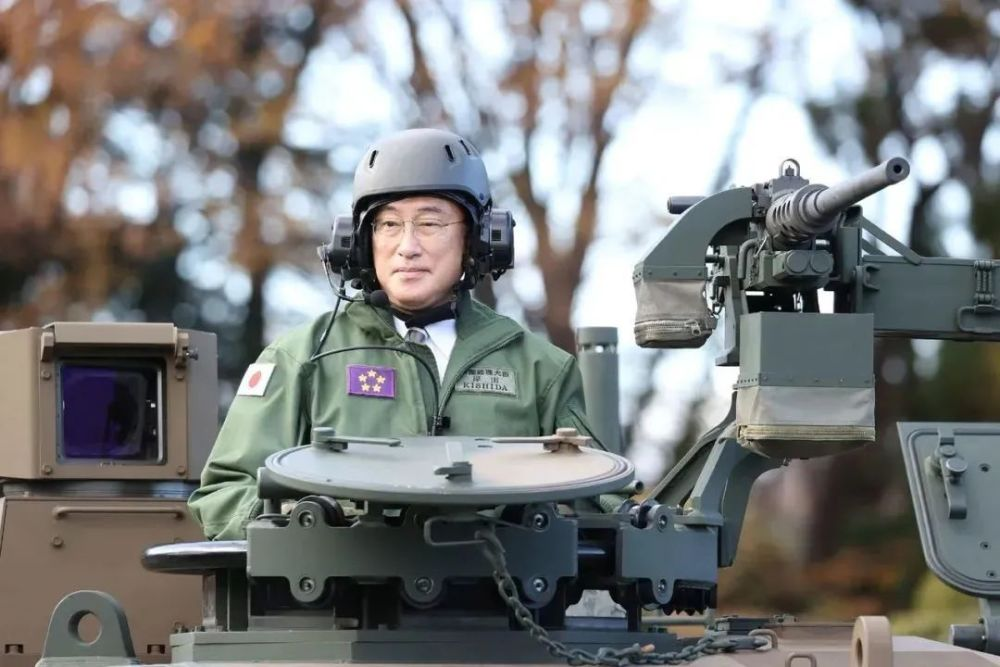
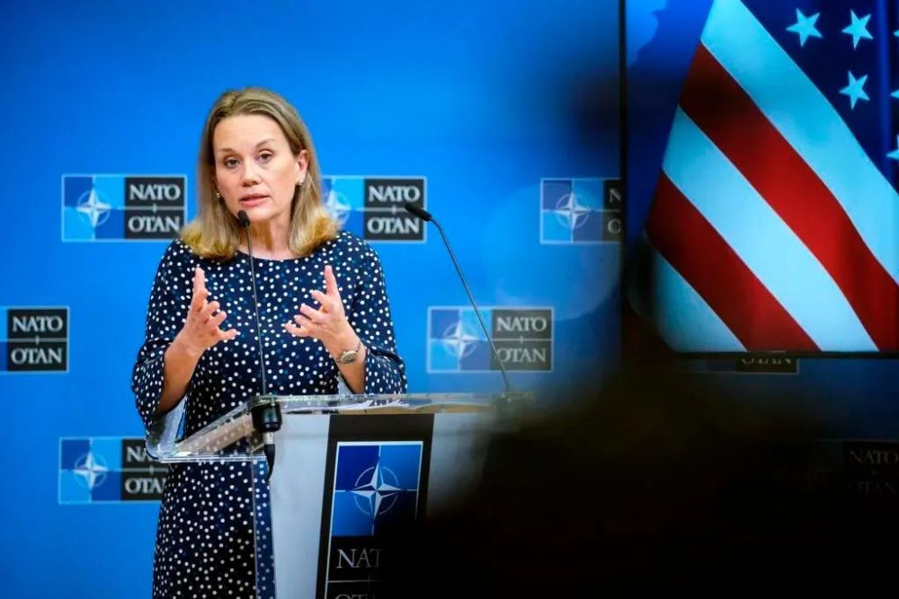

# 中国军费增长7.2％，算高还是低？

作为全球第二大经济体，中国的GDP总量早已超过美国的GDP的一半了吧？可中国的军费长期且至今仍未达到美国军费的25%。

**文 | 海上客**

据新华社报道，今年中国国防预算约为15537亿元人民币，同比增长7.2%，增幅比去年上调0.1%，这是中国国防预算连续8年保持个位数增长。

对此，有人说高了，有人说低了。

那么，这一增幅，算高还是低呢？

**1**

说高的，当然有。譬如一个韩国网友竟然在社交媒体发出“灵魂拷问”：“中国人总是声称爱好和平，但为什么中国军费开支居世界第二？”在获悉中国军费开支将继续增长的时候，估计他又得睡不着了。

_韩国网友发文
图：社交媒体截屏_

此人发帖后，立即被人怼。一名西班牙网友直接回他——

“那是为了让你美国爸爸也爱好和平”。

这两天，这个一问一答的帖子截屏在国内社交媒体也得到了广泛传播。

_西班牙网友回帖_

**显然，可能身在东亚的韩国网友，这是受到了不少西方媒体的渲染，甚至炒作所谓的中国发出的“战争威胁”。而西班牙网友却能算出一笔清晰的账。**

先看西方媒体的炒作。今年以来，美联社、英国《卫报》等都曾言说诸如“中国增加军费，是为潜在的战争做好准备”云云。

但西班牙网友算得很明白——不用多算账，单算美国作为全球军费世界第一的国度，且一国军费相当于世界排名第二至第九的总和，就能明白，到底谁在“为潜在的战争做好准备”，甚至时不时来一场真实的战争！

这还不算驻韩驻日等地美军，还要驻在国花钱来养。譬如韩国，最该头疼的难道不是韩国纳税人得掏钱支付驻韩美军军费吗？

**2**

不妨算一算中国军费同比上涨7.2%是个什么概念！确实，这一上涨，看上去比预期国内生产总值（GDP）上涨5%要高一些。但——

日本今年国防预算开支增长26.3%；

德国增长17%；

印度增长13%。

还有美国的增长数据更吓人。美国预计军费增长10%。但这可是美国啊，其2022年军费为7400亿美元。其10%的增长量，比许多国家的军费总和还要高！

反正这几家的军费增长比例都超过中国！

**再看中国军费在GDP占比，持续在1.5%以下。而根据瑞典斯德哥尔摩国际和平研究所的数据，美国、印度、英国等国家占GDP比都高于2%，远超中国。**

_日本共同社报道，日首相岸田文雄2022年下达指示，要求在未来五年内将国防开支增加一倍，达到国内生产总值（GDP）的2%或更多_

据《日本经济新闻》2月15日报道，北约即将就2025年以后的国防开支目标展开讨论，有意见主张将目前国防开支占国内生产总值（GDP）2%的标准提高到2.5%。

即将卸任的北约秘书长、颇有些战争贩子腔调的斯托尔滕贝格直言，占GDP的2%的国防预算，连下限都不太够了，必须继续增加预算。

美国驻北约代表朱莉安娜·史密斯更是半带威胁地对北约的欧洲成员称，要锁死军费占比GDP的2.5%，将之当作永久目标。

_朱莉安娜·史密斯_

如果以北约的标准来衡量，显然，中国的军费标准不是高了，而是远远不够。

当然，中国不是北约。尽管北大西洋公约组织号称是个防御性的军事组织，但目前地球人应该大多知道他们曾干了什么、正在干什么、还想干什么！

在乌克兰危机中，持续向冲突一方提供致命性武器，同时通过不同渠道怂恿乌克兰方面要“战斗到最后一个人”。

有人会说，难道俄罗斯“入侵”一个邻国，朋友们不该持续支持乌克兰“抗战”吗？问题在于在不久前的慕尼黑安全会议上，就连西方都有人披露，2022年4月，俄乌一度接近通过谈判解决问题，背后是美国破坏了谈判。

哪怕抛开北约持续军援乌克兰是否正义之问这一问题，单单看北约的军费开支，以及北约峰会鼓捣日本、韩国这样与北大西洋完全不沾边的国家与会，只是为了北约持续插手东亚事务，就能看出北约提升军费在GDP中的占比，是来者不善的。

**3**

作为全球第二大经济体，中国的GDP总量早已超过美国的GDP的一半了吧？可中国的军费长期且至今仍未达到美国军费的25%。而这还是在中国遭遇战略安全形势变得不如往年那么好、国家尚未完全统一的背景下。这还有人来指摘中国军费开支过大？

_海军辽宁舰某中队少校政治教导员朱悦萌（左）_

海叔不得不提——

3月5日，全国人大代表、海军辽宁舰某中队少校政治教导员朱悦萌所说，“舰艏行处是长城”“国家利益所至，海军航迹必达”。

开放的中国，日益强大的中国，人民解放军所承担的任务，当然不再是仅仅保卫包括台湾岛在内的领土主权不受侵犯，更会走出去维护国家利益，维护世界和平。

在世界范围内，中国的和平正义之师当然也是受到许多朋友的理解与肯定的。譬如获得联合国“和平荣誉勋章”。

_当地时间2022年10月9日，在联合国阿卜耶伊临时安全部队超级营地中国营区，联阿安全部队授予中国第二批赴阿卜耶伊维和直升机分队86名官兵联合国“和平荣誉勋章”_

最近，有一段视频很能说明问题。德国前联邦议院议长诺伯特·拉默特在与纳米比亚总统哈格·根哥布会面时，抱怨纳米比亚的中国人太多，威胁到当地人的生存。

根哥布直接反驳：“亲爱的先生，您在说些什么？这似乎是欧洲的问题，而不是我们的问题，您觉得我们很可怜吗？但是我从来没有见过中国人来到纳米比亚后会捣乱，可是德国人会。”

中国对世界各地的人们是一种威胁，还是一种希望，似乎，根哥布已经道出了问题的实质。

回到中国军费增长本身，总感觉，目前的这个增长速度，既不高也不低，刚刚好！

