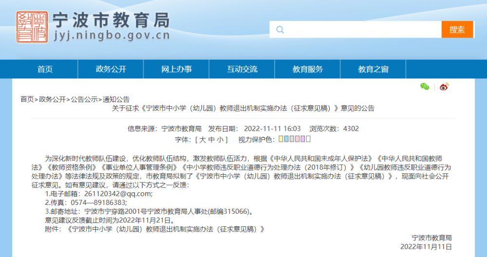
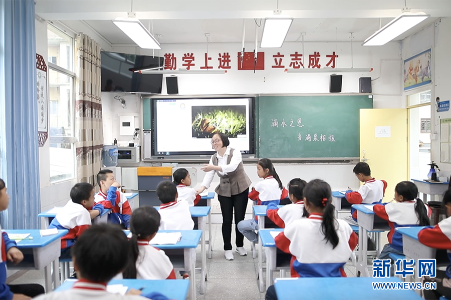

# 中小学“教师退出机制”来临，时代不再容许教师“躺平”

【文/观察者网专栏作者 雷望红】

**中小学也开始实行“教师退出机制”**

几年前，高校中广泛兴起的“非升即走”制度曾引发过较大争议。批评者认为“非升即走”制度是对高校青年教师的压榨，过大的考核压力不利于刚毕业的青年博士们专心从事科研工作。

尽管争议不断，但是这一项制度在诸多高校尤其是双一流高校中持续执行了下来，在一定程度上倒逼了青年教师积极科研，也确实有一些青年学者在这一压力下脱颖而出。一些高校还将进一步深化改革，通过评聘分离制度激活在编教师队伍，打破部分教师教学科研“躺平”的状态。

没成想，中小学校也渐渐刮起了教师队伍改革（整顿）之风，部分地区开始实行中小学“教师退出机制”。

去年11月份，宁波市教育局发布了关于《宁波市中小学（幼儿园）教师退出机制实施办法（征求意见稿）》意见的公告，拟对未能聘任上岗、考核不合格、违反师德或因其他原因等不能胜任（坚持）教学岗位工作的教师，予以退出。教师退出渠道包括待岗、转岗、离岗退养、解聘。

意见发布之后在网络上引发网友讨论和较大恐慌。而宁波之后，又有北京提出要建立中小学教师退出机制。

实际上，“中小学退出机制”早在几年前就已经有地区在实践：

笔者2017年在南京某区县调研时，该地教育局就已在着手推动“县管校聘”制度，其中就涉及到“中小学退出机制”；

2021年湖南某县开展了中小学“县管校聘”的改革试点，2022年在全县全面推开教师竞聘工作，对于不符合相关要求或违反相关规定的教师进行解聘或“不予聘用”；

2022年6月，南京市江北新区也印发了《南京江北新区关于义务教育学校教师“区管校聘”管理体制改革的实施意见》，同样提到要“探索以转变岗位、待岗培训、解聘为主要途径的教师退出机制”。

**“教师退出”不单指解聘**

中小学“教师退出机制”提出后，引发了一些人的恐慌，认为这是要打破中小学公办教师的“铁饭碗”。其实大可不必恐慌。

“教师退出机制”包含两个层面的“退出”：

一是退出所在岗位，即转岗、待岗、离岗退养等。

这种类型的退出，主要是针对因主客观原因不适合待在原岗位的教师进行岗位调整。比如，将年龄偏大、精力不济的教师调到非教学岗位；对教学态度不端正、教学能力不足的老师实行待岗培训处理，待培训合格之后重新上岗；对患有重大疾病需要休养的教师，实施离岗退养政策。

二是退出教师队伍，即解聘。

这种类型的退出，性质要严重些，主要是将不合格的教师清除出教师队伍，收回其编制。比如严重违反师德师风的教师、常年“吃空饷”的教师、“私招乱聘”的不合格教师等，都可能是被清退解聘的对象。

不过，不论从教师队伍稳定性的角度考虑，还是从实际教学管理需要考虑，大规模清退教师是不可能的，两种类型的“退出”中，前者的数量要比后者的数量多，真正退出教师队伍的教师必然是极少数。

_资料图来源：新华网_

**为解决两个“老大难”问题**

“教师退出机制”的提出，从微观层面来讲，主要在于教育系统要解决学校教师管理中的两个“老大难”问题。

其中一个问题是“教师调动难”。

此调动非调任之意，而是学校在完成相关工作时，学校管理层难以调动拥有编制的公办教师配合完成工作。

在实行免费义务教育之后，学校的人事调配权、财务支配权被上收至教育局，在针对教师的日常管理中，校长的权力极小，难以调动公办教师配合工作。对于普通教师而言，做与不做一个样，做好做坏一个样。

在中小学校，教师内部分化严重，教师之间“忙闲不均”的现象较为突出：有的教师忙得忙死，但是也不乏有的教师较闲；“忙”与“闲”取决于教师的责任心、对领导的认同度，以及晋升的动力等因素。

笔者曾关注过中小学校教师负担过重的问题，教师负担过重的压力主要由校领导、中层干部和班主任承担，如果有老师想要躺平也没有人管得了。

在湖北某乡镇中心小学调研时访谈过一位副校长，副校长向笔者吐槽：学校中有几位年轻女教师嫁到了县城条件不错的家庭，教师工作于她们而言就如同副业一般，她们不指望在学校能有多大发展，不愿意承担学校的发展责任，有课时就踩着高跟鞋、穿着漂亮衣服来学校溜达一圈，上完课就离开学校了。学校对教师没有约束手段，校长副校长都拿她们没有办法。这些具有不良示范作用的老师调动不了，其他老师也不积极支持学校工作，很多工作不得不靠副校长自己加班加点完成。

有些乡村学校的校长反映一些年轻教师不得已进入到教师队伍，但是并不热爱教育事业，不认真负责，他们想管管不动，不想要又推不掉。还有些学校难以调动中老年教师，部分教师依靠自身丰富的经验和深厚的资历，在外参与或开办培训班，有的老教师长年不在岗吃“空饷”等，都在一定程度上影响了教师调动和学校发展。

另一个问题是“编制配置的结构性失衡”。

如果把县域内的学校分为三类，分别为城区学校、乡镇学校和农村学校。城区学校的教师编制是严重缺编，乡镇学校存在一定程度的结构性超编，农村学校的结构性超编问题极为严重。

乡村学校出现超编，容易理解，核心原因是因为学生数量减少，但是学科教师配置要齐全，学生少教师多，所以就出现了结构性超编。

城区学校严重缺编，则是因为县域教育城镇化的发展，大量乡村教师通过借调或考试的方式进城，一方面城区学校的编制名额有限，一些进城的教师人在城区学校，但编制仍留在乡村学校，另一方面也存在着一些依靠关系进城的教师或缺乏责任感的教师占着编制不干活，学校拿他们没办法的情况，从而导致了城区学校面临着双重矛盾，即“人多编少”和“教师人数多但干事教师少”。

由于存在结构性缺编的困境，一些学校通过聘请代课教师弥补编制教师不足的问题。代课教师承担任务重，比如很多学校的编制教师不愿意担任中层干部或班主任，就由代课教师来承担，但因财务制度限制，代课教师的待遇远低于编内教师。这点早已引发了代课教师的不满，代课教师为此上访的问题已经出现。这也意味着，城乡教师的配置依靠过去的人员调动和编制配置，已经难以为继、不可持续。

_资料图来源：新华网_

从宏观环境来看，当前全国就业市场不景气，考教资成为继考公务员之后又一热门选择。有人统计过，从2016年至2021年，教资笔试报名人数从260万增长到超过1000万，从以前鄙视当老师，到教师编制重新成为“香饽饽”，反映了整个就业环境和就业群体心态的变化。当越来越多的人愿意从事教师职业，国家对于教师的要求也会相应地水涨船高。

此外，教育环境也变得愈加复杂，教育目标、家校关系、师生关系、政校关系、学生心态、教学管理任务量等都发生了变化，这要求教师不得不努力提升自身的能力和水平以适应时代的变化。当越来越多的人参与到教师职业的竞争，有越来越多优秀者愿意进入到教师行业，而时代对教师的要求又不断提高时，部分编内教师试图继续“躺平”不再可能。

因此，实施“教师退出机制”，打破“编制保护”，赋予学校和教育局一定的权力，通过制造流动和制造危机，激活教师队伍，拒绝教师躺平，重新为城乡学校配备合理的教师队伍，是此次改革的重要目的。

**实行时需注意三点**

“教师退出机制”是教育综合改革的一部分，但是“教师退出”不是目的，目的是要激活教师队伍，对教师队伍进行优化配置。一些地区借助“县管校聘”、教师竞聘制度等推动提升教师素质，其中的杀手锏就是“教师退出机制”。

动一动教师队伍是有必要的，职业危机所释放出的压力在一定程度上可以推动进步，但是仍然有一些问题值得注意。

一是“教师退出机制”的具体设计要把握尺度、保留温度。

教育工作是一项纯粹的事业，具体的教育管理工作又是极为复杂的，在复杂的教育管理中，一些教师可能因非主观意愿触碰红线，但本意是好的，学校和教育管理部门要把握好尺度，保留温度，适度惩戒，重在“治病救人”。

尽管教师队伍中不乏浑水摸鱼者、师风不正者、占位不为者，但是大多数教师是积极向上、认真负责的。在“教师退出机制”的标准设计上，需要科学地评价教师付出，客观公平地识别和筛选出需退出的教师，更重要的是要有效地进行校师匹配，将作用发挥不明显的教师放置在更为合适的岗位上。

二是“退出”手段使用要妥当，退出数量和频率不宜过于频繁。

“退出”是一种威慑手段和调整方式，不能将此本体化，即不能频繁使用“退出”手段。一些地区计划每年进行“教师竞聘”，重新调配教师队伍、培训落聘教师、清除不合格教师，但是调配不能过于频繁，否则会动摇军心。

对于教师而言，积极开展教育工作需要相对稳定的环境，适度的制度流动是必要的。如果每年都进行教师竞聘，教师们缺乏安全感，工作难以安心，会在一定程度上影响教师工作的主体性和积极性。此外，每年竞聘对县里而言既是一个负担，也可能因工作复杂而难以持续下去，因此建议不宜频繁使用“退出”手段。

三是“教师退出机制”在制度设计和制度实施中要注重公平性，避免不当使用造成的误伤，同时要规避策略性地假公济私。

由于教师竞聘、“教师退出机制”关涉到全县所有教师的切身利益，能否顺利被聘用，是否被“退出”，是否会有人借助“退出机制”进行策略性转岗和责任推卸等问题，都需要进行周全考虑。

此项制度的出台，客观上滋生了权力分配空间和私利谋取空间，在制度设计和制度实施过程中需要注重维护制度的公平性。一旦出现政策执行不公，就可能影响到政策的持续性、公信力和有效性。有的地区利用纪委监督和畅通的信访渠道进行监控，且取得了一定的效果。

**本文系观察者网独家稿件，文章内容纯属作者个人观点，不代表平台观点，未经授权，不得转载，否则将追究法律责任。**

