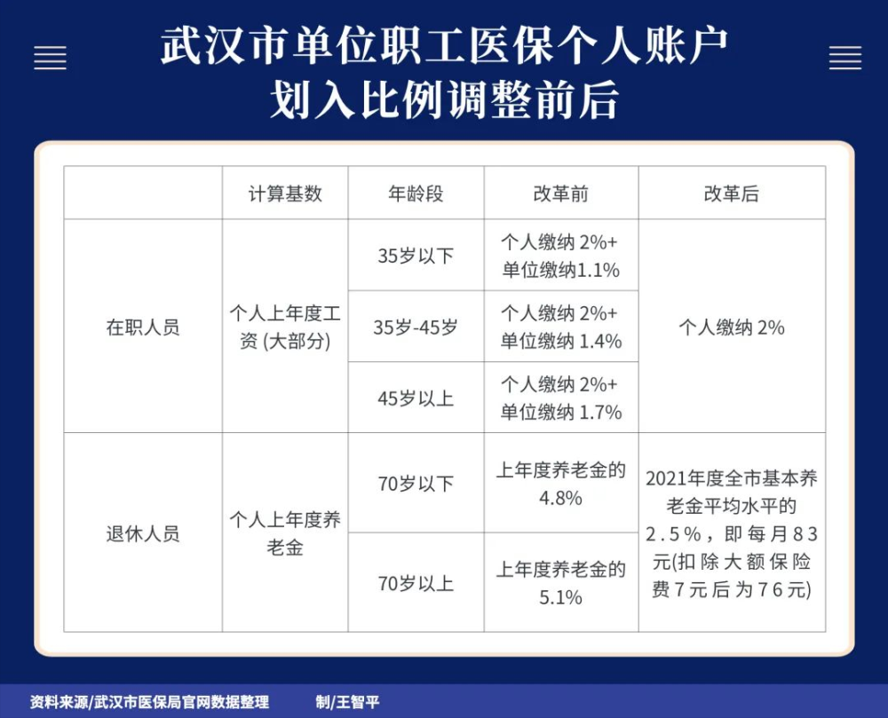
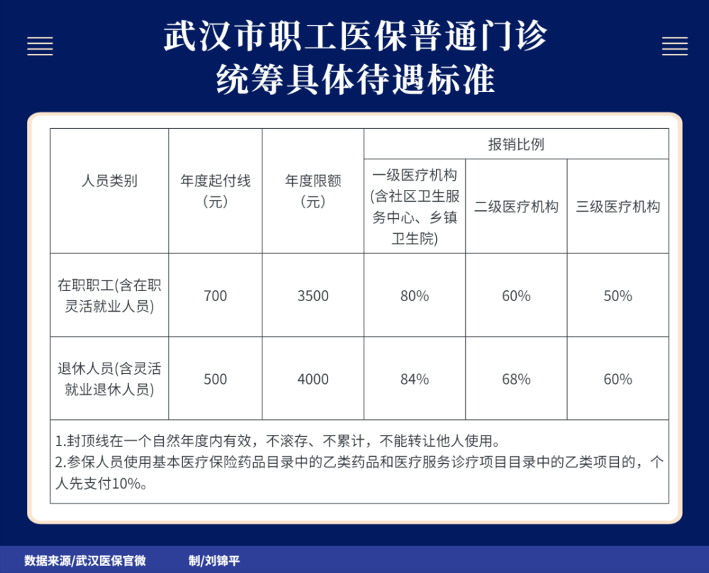

# 医保个人账户“缩水”，牵动的不止一本账

**文/辛颖 乔佳慧**

**编/王小**

_到武汉协和医院门诊就医患者 摄/辛颖_

酝酿多年的医保个人账户改革，2023年2月初，在中部重镇武汉落地时被推上热搜，也让这场牵动全国3.5亿职工利益的再分配，更为清晰地摊开。

这次改革的重点是单位医保缴费的30%不再计入医保个人账户，这意味着每人的账户每月汇入的钱少了约一半。那30%的钱，被全部被计入新增的门诊统筹基金，大意就是谁有病谁用，以降低部分患者“因病致贫”的风险。

自1998年中国职工医保制度建立起，就由统筹账户和个人账户构成。个人账户里的钱，可用在定点医院、药店的自付费用；而统筹账户资金，则用于支付住院费用，由医保和医院直接结算。

20年来，虽多次提及改革，但改革的大幕到2021年4月国务院办公厅发布《关于建立健全职工基本医疗保险门诊共济保障机制的指导意见》才拉开，要求各统筹地区推进落实，可设置三年左右的过渡期。

到2023年各地已陆续启动医保个账新政。
**即便在新政制定过程中，多位学者建议直接全部取消个人账户，考虑到对“既得利益”的触动阻力，国家医保局最终谨慎地选择了这种方案——先减少一半。**

多年延续的返款到个人账户，已成为公众一个固定的心理账户，突然将这项权益置换到门诊看病，公众长期形成的心理账户产生震动，即便是那些将会因新政明显受益的老年、慢性病患者也感觉自己遭受了损失。

学者眼中一项完美的政策，在自上而下落地时却遭遇各种“水土不服”，几乎让武汉这个千万人口的城市管理运转方式都在经历一场大考。

**“如同医保门诊统筹改革的落地，不是依靠医保一个部门就能推动的，中国医疗体系的诸多问题，都需要更高层次的规划和统筹。”**
武汉大学公共卫生学院副教授王全说。

受益者的担心

2月1日，武汉市正式实施职工医保门诊共济。因为听力下降、视力老花，史国一直使用数字按键的老年手机，对新政策的调整，他是断断续续用老同事的智能手机看的网络消息。

“去年就听说要扣钱，我当时想肯定是骗人的。”史国了解最新政策后，诉求就是“改回去”，不用门诊报销，按原来一样发钱就行。

2022年，武汉市基本医疗保险参保人数1096.65万人，减去此前公布的城乡居民参保人数463.04万人。据此估算，武汉职工医保的参保人数在500万水平。

改革后，武汉市医保局数据显示， **武汉职工医保的个人账户年均减少1373元，退休人员个人账户年均减少1992元。**

钱一下就少了三分之二。67岁的史国医保卡中，每个月原来会打入232元，新政落地后要减少到76元。“吃亏了”，史国手里夹上了一支烟，开始把这些天新学习的数据“组织”到一起。

“这些钱我平时都用在药店买药，刚改完的时候（2月初），说药店不能报销。现在（2月中旬）说药店能报销了，也只报50%，有的报销30%，有的不能报销。而且要500元以上才能报销，大医院要700元，我连这个起付线都达不到。”史国告诉《财经》记者。

史国自己的账本虽有诸多错处，但仔细核对下来，多年没去医院看过病的他确实是“损失”了。

患有高血压的史国，原来不能享受医保对慢病患者的门诊报销，因为这个政策只覆盖部分重症患者，所以他一直是在药店买药，每个月30多元，一年将近400元。

长期用药的副作用，史国每年还要犯上三次胃病，每次发病后至少要吃五周三盒药，每盒约50元，一个疗程不到160元。“如果不是得太厉害扛不住了，我都不会吃胃药的。”史国的眼睛发炎了也不去医院看，偶尔吃一点消炎药，选最便宜的乙酰螺旋霉素，4元一盒。

林林总总算下来，史国每年买药花费约900元。他没有算清楚的账是，他其实已经达到武汉门诊报销的起付线了。

按照湖北省统一要求，
**门诊统筹的起付线标准，退休人员不高于上年度平均工资的0.8%，就业人员不能高于1%。按照2021年武汉市就业人员平均工资98483元计算，起付线的上限前者是780元，后者是980元。**

武汉市医保局在设定起付线时，已经考虑过要让大多数人能够享受到新待遇。因此，退休人员的一年看门诊累计的起付线设定在500元。

根据2021年武汉市医院门诊费用发生额测算，退休职工能有124万人享受报销，占比达94.3%。而在职员工的测算数据是，只有56.4%的人就诊达到起付线，覆盖到193万人。

只不过，对很少去医院的史国来说，
**扣除退休人员报销起付线500元，即便按照最高的报销比例84%计算，他常规买药能报销约336元，是否会享受更多待遇是未知数，但他一年的个人账户里已经确定要减少1872元。**

让史国更担心的是，要想在医院看病来补回“损失”，意味着花更多的钱。退休的胡斐就遇到了这样的困惑，因为心脏不舒服，在新政执行后已经去三甲医院看过两次病了，花了760多元，还没有享受报销。

“第一次就花了680多元，做了一个胸透和一个肺功能的检查，我以为可以报销了，结果人家说这里面有自费的项目，还没到起付线，但也没有说哪个是自费的项目。”胡斐带着检查的片子换了一家医院，医生开了85.52元的药，结算单显示还是没能享受到报销福利。

不仅是老年人，
**即便是年轻人，也少有人能摸清楚医院的各类服务项目、药品哪些可医保报销，哪些是自费，这些通常只在医院发票上详细显示，需要患者单独索要，所以大多患者并不知道哪次门诊看病能累计到医保的“门槛费”。**

相比之下，一位68岁的武汉脑梗患者在当地一家三级医院门诊看病，花费了7150元。在新政前，这笔钱要完全自费。如按照现在门诊统筹报销，减去“门槛费”500元，按三级医院60%的报销比例，这一次看病他即可报销3990元，而他仅拿出个人账户年入的1404元放到了统筹门诊账户。

“大部分老年人即使是短期来看，也是会从这次改革中受益的。”华中师范大学劳动与社会保障系副教授王超群在调取某个城市约500万职工个人账户数据后，发现在60岁以上、70岁以上和80岁以上的参保职工中，50%以上参保人的个人账户余额分别低于730元、325元和162元。

如果参照武汉市的退休员工个账情况，这意味着即便是相对“健康”的60岁人群，也有大部分人，每年个人医保账户都要花2000多元。

王超群对《财经》记者分析， **年龄越大，个人账户的结余金额越低，看几次病就用完了。依靠个人账户，不能解决老年人尤其是高龄老年人的门诊就医和购药需求。**

这也是为什么此次没有像很多改革政策一样选择“老人老办法、新人新办法”。王超群解释，这次改革真正要解决的就是老龄化社会后，老年人普通门诊看病保障低的问题。

全城动员的推行

从2月初，武汉的社区工作人员主动上门为老人做新政策的宣讲，还发布在抖音、小红书、快手这些大家常用的平台上。医院、药店在显眼的位置也张贴了海报，不少还专设咨询台。

“政策上写的都是医保能报销多少。为了让患者更好理解，我们都把这个数字转换一下，直接告诉老人，你要出多少钱。”一家武汉定点药店的工作人员告诉《财经》记者。

其实，这一新规从征求意见稿发布，已过三个年头。最近不仅武汉，四川、黑龙江、西安等多地医保部门，也开始密集发声解释改革带来的利弊。

然而， **改革的阻力还是“如约而至”。在多位学者看来，此前的宣传工作不足，是导致大家有情绪的原因之一。**

“地方官员觉得那是国家推行的政策，就把那个标准答案在网上一贴，可退休的老人哪会看什么网？”一位医保政策研究者对《财经》记者直言。

这次改革触动的还有灵活就业人员，如武汉在职灵活就业人员的“个人账户”被完全取消了，这笔钱原来叫做门诊和购药补助。“我心里一万个不愿意。”武汉一位59岁的出租车司机就是以灵活就业形式参保的。因为平时很少去医院，也不吃药，这位司机说自己个人账户上还有4000多元，在他看来就是，“交了这么多年的钱，马上要退休了，连钱都不给我了”。他没有看懂对钱去向的解释。

此次武汉新政中公务员和普通职工无差别。一位当地知情人士说，熟悉的公务员都扣了4000元，而门诊统筹的封顶线才3500元，意味着他们在这次改革中，是绝对的利益损失者。但官方并未详细公开公务员缴费待遇情况，含糊的回应，导致在2月中下旬《财经》记者采访过程中，不少市民仍然认为公务员被特殊对待。

一位武汉药店经营者表示，
**“并不完全是宣传没做到位，其实在2021年国家发布文件的时候，我们就按照要求大规模宣传了一波，但是没有动到每个人的钱的时候，没人真的在乎你在宣传啥。”**

不久前，医保牵头紧急出台一系列配套措施，地方政府希望能借此增加公众改革利益获得感。自2023年2月13日起，武汉市连续扩增5000多家药店纳入医保门诊统筹，报销待遇与二级医疗机构比例相同，以解决患者去医院就医不易的问题。

2月15日，国家医保局印发的《关于进一步做好定点零售药店纳入门诊统筹管理的通知》要求：加快医保电子处方中心落地应用，实现定点医疗机构电子处方顺畅流转到定点零售药店。

可是四天后，2月19日上午，一位药店负责人还是在焦急地等待武汉市医保局的答复，他的药店已经被纳入医保门诊统筹快一周了，患者可以拿着处方来买药，药店直接和医保结算。可是，
**“什么样的处方是合规的，外地的行不行？如果患者拿来的是医院违规开的处方，最后会不会处罚药店？药监说电子处方合规，为什么现在医保局说不行？”**
他期待更为细致的方案下发。

为什么别人的待遇更好？

尽管知道新政的益处，武汉居民方可依然不满，因为她还弄清楚了南京市的调整水平，“门诊不仅没有起付线，报销上限也比我们高很多”，方可希望能有更好的待遇。

网络上不乏将武汉与南京、广州等城市医保门诊统筹待遇对比的情况。武汉科技大学金融证券研究所所长董登新分析，中国医保现在大多为县市统筹，国家医保局要求门诊报销比例不低于50％。报销比例若要进一步提高，取决于地方财政实力、医保统筹基金积累情况。

《财经》记者整理对比部分与武汉同为副省级城市的门诊统筹改革方案发现，造成武汉居民与其他地区对比后心理落差的原因有：
**一、武汉原本的个人账户水平待遇较高；二、改革后武汉门诊统筹的起付线和封顶线不低；三、武汉是此前没有实行过门诊统筹的城市之一。**

更重要的是，有人担心，改革和待遇差异是因为医保统筹基金的钱不够用了。

医保待遇是以收定支、收支平衡为原则，就是筹资水平确定待遇支付水平。同样是副省级城市，南京所在的江苏省医保基金“富裕”情况在全国都属前列。中国社科院经济研究所公共经济学研究室主任王震的研究显示，2020年，全国医保基金累计结余排名前五位的省份分别是上海、广东、浙江、江苏、四川，这五省份的结余款就占到了全国总结余的48.3％。

而武汉市的基金运转压力确实相对较大。《湖北省基本医疗保险制度研究》一书中介绍，2015年全省有16个统筹地区职工医保统筹基金当期赤字。

武汉有着一定的历史负担。 **一位当地政策研究者分析，这次改革暴露的问题就是中央和地方财权与事权不匹配。**
“武汉是老工业基地，现在这些退休员工有相当部分是当年的国企员工，职业生涯创造的税收和财富大多以利税上交给中央，现在到了养老的时候，医疗费用的压力留在地方了。国企员工数量多的地方，应加大中央对地方财政转移支付的力度，缓解地方财政的压力。”

《财经》记者也从多方获悉， **在2020年武汉新冠疫情的影响后，中央财政的支援款项已达武汉市医保账户，大有弥补。**

近年来，武汉市医保也积极采取一系列措施“开源节流”。据《武汉晚报》报道，“武汉市职工医保缴费比例和全国其他同类城市差别不大，但部分单位长期不据实缴费，武汉市在职职工按社平工资60%保底缴费的数量巨大，缴费基数普遍偏低。”

上述武汉药店经营者对《财经》记者坦言，一直没有按照实际工资缴费，而是按照最低标准为自己的员工缴医保，“这已经很高了，每年都在涨”。

即便医保统筹基金并不算宽裕，之前武汉市多年维持了较高的医保个人账户划拨比例。此次改革下，湖北省确定退休人员个账划入标准按2021年基本养老金平均水平的2.5%，这也使武汉市退休人员的账户缩水更为明显。

况且，武汉采取的是一步到位方案。相比之下，长春、青岛、南京都采取小步多次的渐进方式。如长春对退休人员分两次调整，2023年1月起调至111元，2024年1月再调至78元；青岛虽然已经执行新方案，但退休人员从2024年才开始调整。

一位地方医保部门人士认为， **“一次减少三分之一，可能是一个比较容易被公众接受的值，而现在一下子只剩三分之一，确实会有较大的心理冲击。”**

一场拖了20年的改革

武汉全市60%以上的个人账户沉淀资金趴在年轻和健康群体的账户中，退休和患病群体的个人账户，则结存不够用，门诊自费负担较重。

个账改革要做一次权益置换。按照政策制定者的思路，让个人账户中一笔原本就应该承担公众医疗保障负担的钱，发挥应有的作用。

中国的个人账户，最初借鉴的是新加坡的中央公积金制度。彼时遇到了一个和今天的个账改革类似的难题，因为交“保费”的好处，不是每一个人立刻就能看见，所以参保意愿低。为激励公众参保的个人账户就此诞生。

中国劳动和社会保障科学研究院医疗保障研究室主任王宗凡分析，当年的个账好处是，
**首先，让职工交上去的保费能看得见，而且自己账户的钱，就得精打细算地花，避免“没事就跑医院”，制约医疗需求过度释放；第二个人账户实行积累制，资金归个人使用，年轻时候存了钱，年老的时候不至于没钱看病。**

然而，这些使命已逐步消失。在医保覆盖率达到95%的今天，不再需要参保激励作用，进入老龄化社会的中国面临的最大困境是门诊看病负担重，而大量资金却沉睡在“个人账户”，如此降低了保险本身的风险共济能力。

“国际上，几乎没有国家可以依靠个人账户的模式，解决医疗保障问题。新加坡的制度有其优越之处，但对一个14亿人口的大国来说，难以直接套用一个城市国家的医保制度。”王宗凡说，“其实从制度设计之初就知道，个人账户是没有办法化解全民医疗风险的。”

为什么用了20多年，现在才开始推进个人账户改革？

“最大的难点就是，已经存在的个人账户，对每个人来说就是既得利益，很难再触动。”王宗凡介绍，
**真的生病花钱的时候，大家都希望有更高的保障水平，不生病的时候，并不想把自己个人账户的钱，统筹给别人用。这就是制约。**

其实，这项改革一直在缓慢推动。早在2010年，《社会保险法》修订中提到，“基本养老保险实行社会统筹与个人账户相结合”，而在基本医疗保险中，未提及医保个人账户。此举被视为对职工医保个人账户进行改革的苗头。

2018年国家医保局成立后，按下了改革的“快进键”，这也源于随着医保基金监管技术的进步，解决了此前地方试点中暴露的一些问题，如门诊统筹基金被滥用，而导致统筹基金亏损。

“因就医频率高，门诊服务的医保管控在全球都是一个难题，技术提升是一个保障，但后续如何管理好门诊统筹，也是对各地医保能力的考验。”王宗凡说。

更大的挑战在医院

方可想要原来的政策，还有一个原因是，如果要花那么多钱看病，不如去住院。武汉市三级医院住院报销政策，退休人员起付线是800元，报销比例88.8%，比在门诊看病报销比例高。

方可因为患有胃病，现在需要一年一次定期复查做胃镜，“虽然不是每次做胃镜都要住院，但只要住院了，我就把身体都检查一下，肝胆肾啥的全查一遍”。另一位武汉市民也介绍，自己退休的母亲不是经常生病，但每年都要去住一次院，“调一下”。

**多位受访武汉老人都表示，已经习惯了“小病自己买药，大病去住院检查”的模式。**
过去十年，中国职工医保的住院率从2012年的14%到2021年的17.7%。而从其他主要发达经济体来看，住院率一般都维持在10%左右，很少有国家和地区的住院率超过12%。

门诊共济的推出在一定程度上能够缓解居高不下的住院率。一位地方医保人士估算，老年人去医院大概有30%是必须住院的，有70%是非必须的，有了门诊统筹，未来会将很多小问题拦截在门诊了。

王震此前公开介绍，武汉职工医保住院率在2019年一度达到24.32%，直到医保支付改革后，下降为2021年的16.94%。相比之下，北京建立起门诊统筹后成效显著，2017年北京职工住院率仅8.6%，远低于全国18.4%的平均水平。

为了配合此次改革，武汉所有医保定点医院推出了免挂号费门诊，专为方便慢病患者开药报销。如武汉协和医院，将一间中医科诊室改造成便民免费挂号门诊，每天的号源早早就挂满了。

“从便民和合规的层面，医院都必须要积极改变，应对新形势。”陕西山阳县卫健局原副局长徐毓才分析，
**建立门诊统筹后，提出长处方要求的患者会增多，都是需要医院适应调整的。**

在武汉市中心医院的便民门诊，每天也有100多位患者专门来开药，一位老人带着三个吃空的药盒来开药，但是只买到了一种药，另外两种要拿着处方到药店买，医生提供了一个月的处方单。

“现在领导通知的是最长可以开一个月的药。”一位门诊医生表示，并不清楚什么情况可以开三个月的长处方。

武汉市社区卫生服务中心的一位医生介绍，“在和我们签订家庭医生之后，如果病情较重、行动不便等情况，是可以开三个月的长处方的。”

“医院对处方外流没有动力，现在不能以药养医，但靠什么养医还是个问题。”一位湖北的医生对《财经》记者分析。

**任何一项改革都是一次利益的再分配，需面临的风险也是对政策执行者的考验。一位深度参与此次改革的业内人士在征求意见稿发布前感叹，“走出这一步，就没有回头路了”。**

（文中史国、胡斐、方可为化名，实习生热依拉木·艾尼瓦尔、徐璟奕、高诗然对此文亦有贡献）

