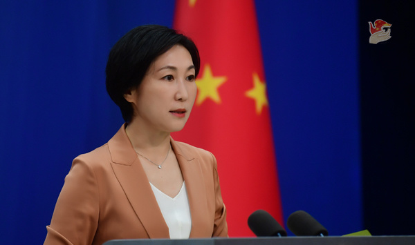

# 外交部：日方强推福岛核污染水排海，绝不是负责任国家行为

北京日报客户端 | 记者 刘柳

3月6日，外交部发言人毛宁主持例行记者会。

北京日报客户端记者提问，据报道，3日，日本首相岸田文雄称，日方将于今年春季到夏季将福岛核污染水排放入海，他还称，为实现福岛重建，这一时间无法推迟。5日，日本媒体报道称，日本东京电力公司对福岛第一核电站1号机组反应堆安全壳内部的调查结果显示，来自熔融核燃料的碎片，当年未全部清理干净，且都检测到了强烈的核辐射。中方对此有何评论？

_图源：外交部_

毛宁表示，中方注意到有关报道，对此严重关切。日本政府无视本国民众和国际社会的强烈关切，一意孤行，强推福岛核污染水排海，违背国际法义务，危害海洋环境和公众健康，这绝不是负责任国家行为。

毛宁强调，日本囤积的核污染水高达130余万吨，如果向海洋排放可能持续30年之久，而核污染水中含有60多种放射性核素，这些放射性核素在排海10年后将蔓延至全球海域，将给全球的海洋环境和人类健康造成不可预测的危害。中国、韩国、朝鲜、俄罗斯等日本的邻国以及太平洋岛国都多次对日本核污染水排海计划表达关切和坚决反对。

毛宁指出，根据一般国际法和联合国海洋法公约，日方有义务采取措施避免环境污染，确保危险最小化，与可能受影响的国家充分协商，确保信息透明并开展国际合作。我们再次敦促日方正视各方合理关切，切实履行自身义务，与利益攸关方及有关国际机构充分协商，以科学、公开、透明、安全的方式处置核污染水，包括研究排海以外的处置方案，严格接受国际监督，保护好人类赖以生存的唯一星球。

