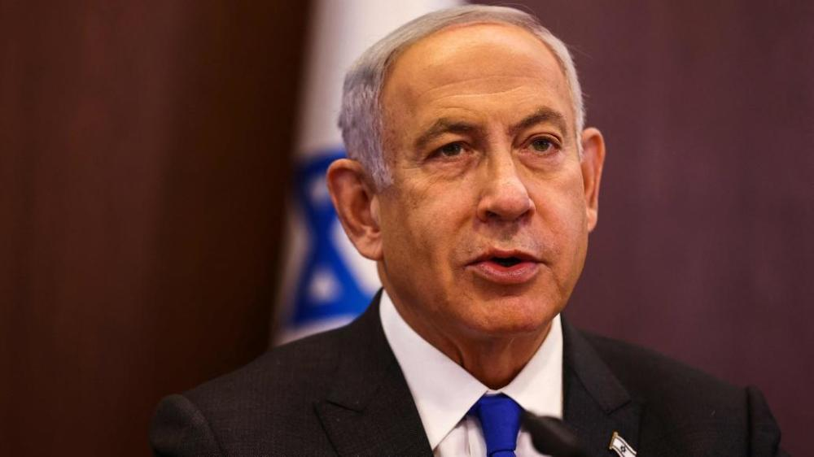
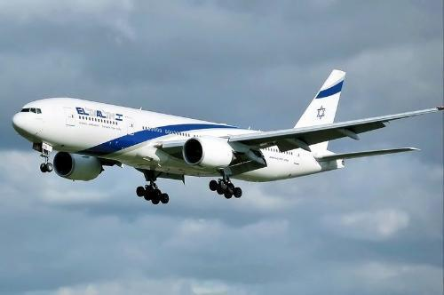

# 外媒：疑因抵制司法改革，以色列航空公司飞行员拒载总理出访

_以色列总理内塔尼亚胡
视觉中国 图_

当地时间3月5日，以色列总理内塔尼亚胡的出访行程遇到插曲，该国国家航空公司飞行员拒绝搭载总理出访，局面一时陷入尴尬。

据《以色列时报》3月6日报道，内塔尼亚胡原定于3月10日出访意大利，但以色列国家航空公司全体飞行员拒绝执行该任务。报道称，飞行员们拒绝执飞是因为抵制内塔尼亚胡的司法改革。

_以色列国家航空公司客机_

去年，内塔尼亚胡在重新掌权后强推司法改革，以加强政府影响力，削弱最高法院权力。此举引发以色列民众的强烈反对，担忧将削弱民主制度。

在抵制行动发生后，以色列交通运输部部长美里·雷杰（Miri
Rege）回应称，她将向其他航空公司进行招标，而以色列国家航空公司将面临惩罚措施。她还指出国家航空公司的生存依赖于政府提供的贷款和担保。

几小时后，以色列国家航空公司CEO迪娜·本·塔尔·加南西亚（Dina Ben Tal
Ganancia）随即表示已找到合适的飞行员。她强调不会允许任何抵制行为的发生。“搭载总理进行外交出访是我们的荣幸，国家航空将一如既往地执行任务。”

航空公司否认了飞行员短缺是因为政治原因。报道称内塔尼亚胡坚持乘坐波音777，而这种大型客机缺少相应的合格驾驶员，其他同型号航班也受到了影响。

