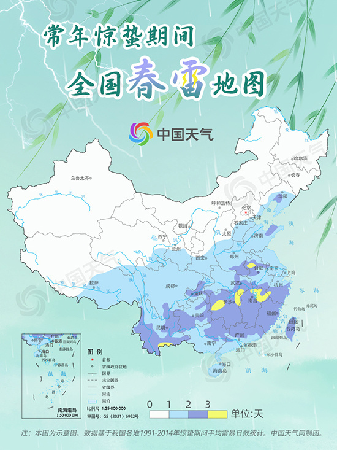

# 惊蛰时节万物沐春 全国春雷地图看哪里雷声隆隆

3月6日，我国迎来惊蛰节气。“微雨众卉新，一雷惊蛰始。”此时，天气大步回暖，万物生机盎然，一声春雷似报春的喇叭，惊醒蛰伏冬眠的动物，唤醒沉睡已久的春天。罕见暖热本周迎最高点，强冷空气也将登场或达寒潮级别。

**万物沐春！看哪里雷声隆隆**

“二月节，万物出乎震，震为雷，故曰惊蛰。是蛰虫惊而出走矣。”《月令七十二候集解》中认为，惊蛰时节雷鸣惊醒了百虫。不过，我国各地春雷始鸣时间早晚各不相同，常年惊蛰节气期间，春雷的影响范围主要在南方地区，北方大部地区还未迎初雷，“惊蛰始雷”不适用于我国所有地区。

常年惊蛰期间，江南大部、云南大部、贵州南部、重庆中部、华南北部等地雷响频繁，平均雷暴日数在2天以上，湖南、江西的部分地区可超过3天；最符合“惊蛰始雷”的是长江流域，合肥、福州、广州、南京、杭州、上海等不少地方都在此时节迎来初雷。

而在北方大部地区，此时还鲜有雷鸣，二十四节气发源地黄河流域，雷声一般在3月末甚至更晚时才出现。

**气温大幅回升 罕见暖热迎最高点**

5日午后，中东部又有大片区域刷新今年来气温新高。截至5日16时，哈尔滨、长春、沈阳、呼和浩特、太原、银川、西宁、济南、郑州、合肥、武汉、南京、长沙、南昌、成都等15个省会级大城市气温创今年来新高。

其中合肥为今年首次超过25℃，哈尔滨气温高达12.7℃首次突破10℃，而哈尔滨常年3月上旬最高气温还不到0℃。

预计大回暖趋势将延续至3月上旬末，10日前后气温将升至近期最高点，尤其黄淮周边一带还将逼近甚至挑战，3月上旬同期最暖纪录。

但是，一股实力强劲的冷空气已可预见，即将给这暖到异常的气温泼盆“冷水”降温。

中央气象台中期预报显示，9-12日将有一股强冷空气自西向东侵袭我国，西北、华北部分地区将有沙尘天气，南方地区将出现较大范围降雨过程，西北及中东部部分地区气温下降幅度可达10~16℃，由于前期大幅偏暖制造极大降温空间，预计这股强冷空气或可达寒潮级别，3月上旬偏暖少雨的天气格局将彻底扭转。

消息来源：中国天气网、@中央气象台

编辑：唐文培

责编：周尚斗

审核：冯飞

