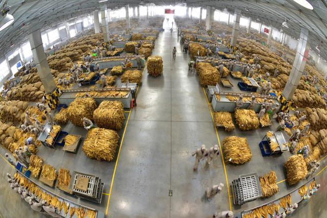

# 烟草行业去年实现工商税利总额超1.4万亿元，创历史新高

_图为云南中烟工业有限责任公司红塔烟草（集团）玉溪卷烟厂复烤一车间原料精选作业现场。资料图_

记者3月6日从国家烟草专卖局获悉，2022年烟草行业实现工商税利总额14413亿元，同比增长6.12%；实现财政总额14416亿元，同比增长15.86%。

国家烟草专卖局表示，税利总额和财政总额均创历史新高，完成了中央关于特定专营机构上缴近年结存利润的任务。

（来源：新华社）

