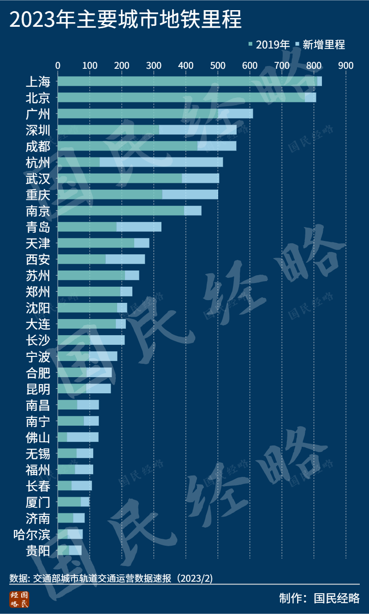
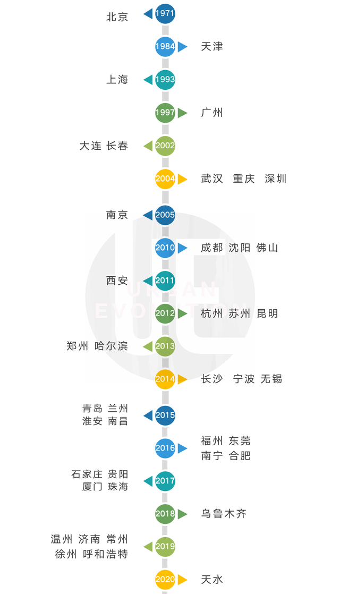
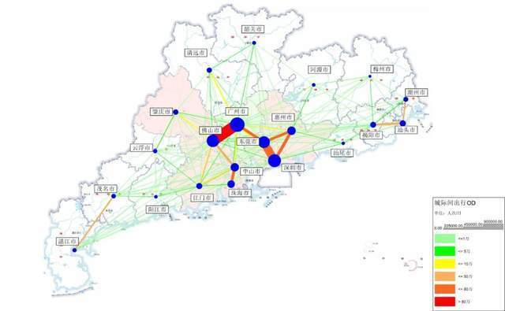
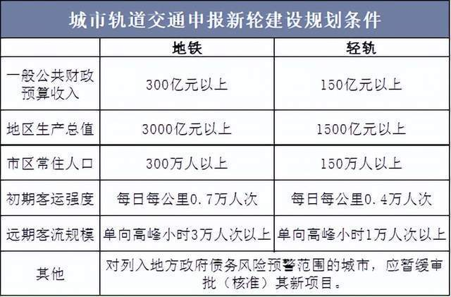
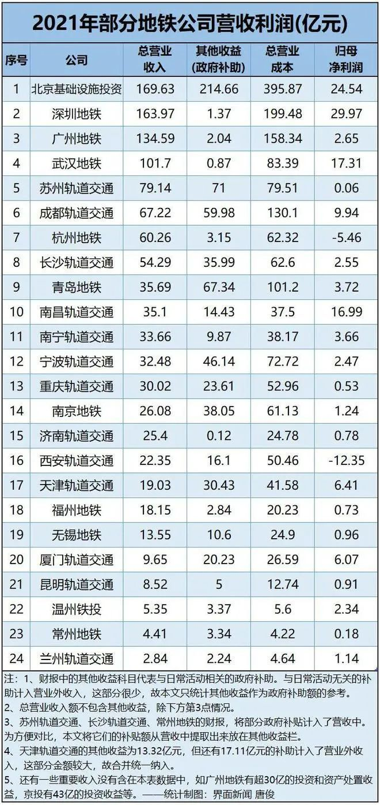

# 这些城市，正在疯狂建地铁

**文|凯风**

地铁一响，黄金万两。

**01**

中国地铁，正在进入500公里时代。

截至2023年初，我国已有 **52个城市** （包含县级市）开通城市轨道交通，运营里程近万公里，其中30多个城市开通了地铁。

日前， **深圳、杭州、武汉、重庆** 先后官宣轨道交通里程突破500公里，成为继 **上海、北京、广州、成都** 之后的新晋
**“地铁500公里俱乐部”** 成员。

与前一年相比， **深圳反超成都** ，重回第四城； **杭州赶超武汉、南京** ，实现历史性跨越；而 **重庆赶超南京** ，跻身500公里俱乐部。

要知道，全球轨道交通里程超过500公里的城市，屈指可数。

当然，这里的轨道交通是就广义而言的，既包括传统的地铁，也有市域快轨、有轨电车、APM等。

疯狂建地铁的，不只是一线和强二线城市。

过去几年，随着地铁建设突飞猛进，以南通、太原、洛阳、芜湖、绍兴为代表的二三线城市，纷纷 **告别没有地铁的历史** 。

_主要城市轨道交通开通时间 图源：城市进化论_

一些因人口或财政不达标而被拒之门外的三四线城市，在都市圈一体化的发展潮流下，得以搭上大城市 **“跨城地铁”** 的顺风车。

面向未来，北上广深以及成都，有望迈过1000公里大关，而武汉、郑州、西安、长沙都有望跻身500公里俱乐部。

**02**

地铁，又开始挤了。

日前，北京、上海、广州单日地铁客流量集体重回千万大关，逼近历史最高客流量。

**地铁客流走势，** 被视为 **后疫情时代经济社会恢复** 的重要参考指标之一。

事实上，地铁客流，不只是经济恢复的见证，也是城市经济、商贸、消费、旅游等繁荣程度的参考。

相比于总里程或总客流量，更具可比性的当属 **客流强度** ，即单位公里每天的客流人次。

这是 **2023年初主要城市客流强度** ：

虽然地铁城市多达50个之多，但 **客流强度破1万人次/公里日的** 只有广州、深圳、西安、北京、上海、长沙、成都7个。

这背后，北上广深多以通勤人群为主，折射的是经济及产业的繁荣程度；西安、长沙、成都作为旅游大城，高客流强度背后不乏文旅强劲复苏的助力。

根据国家标准，新建地铁期客运强度分别不低于每日每公里0.7万人次，以此为标准，还有 **超过一半城市客流强度不达标。**

毕竟，与去年不同，如今已经没有疫情因素的扰动，客流强度是否达标，足以看出经济、产业以及地铁建设的发达程度。

当然，一些城市正处于大规模地铁建设周期，已开通的线路较少， **尚未联络成网，** 难以形成规模效应。

而部分城市出于城市开发的需要，优先将线路 **向郊区蔓延** ，但由于人口规模不足，由此导致客流强度远远低于预期。

如果未来地铁连线成网，这一现象或许将会有所改观。

**03**

过去几年，哪些城市地铁在狂飙突进？

2019年至今，地铁里程增加最多或增长最猛的城市当属 **杭州、深圳、佛山** 。

**杭州，得益于亚运会开启的大基建。**

每一次盛会，都是城市基建狂飙突进之时，2010年的广州如此，2020年代的杭州也是如此。

过去几年，杭州地铁里程从130多公里跃升到500公里以上，翻了近3倍，跻身第一梯队。

**深圳则是后发追赶的典型。**

作为一线城市，深圳与北上广在城市交通领域存在明显差距，这几年正在全面加速追赶。

不过，一个 **面积只有2000平方公里** 的地方，地铁里程却能与7倍于自身的成都相提并论，密度之高可见一斑。

**佛山，则是借力都市圈发展的典型。**

广佛是全国最成熟的都市圈，两地城市边界正在趋于消失，几乎已经连成一体，跨市通行人次，位居全国之首。

_广东各地市跨市通行客流_

目前， **广佛之间已有3条地铁直接连通。**
根据规划，到2035年，广州将构建总规模达到53条、总长2029公里的轨道交通网络，其中广佛之间的通道多达18条。

未来，这些城市的地铁里程还会继续跃进。

**04**

地铁建设，正在悄然收紧。

据《中国经营报》报道，“十四五”期间，有关部门将进一步细化城轨审批条件， **规定开通运营三年后客流不达标的，不能上报新一轮建设规划。**

这意味着，如果一些城市客流强度迟迟难以提升，那么未来地铁扩容之路可能会就此搁浅。

事实上，在此之前，有关部门应多次收紧地铁建设门槛， **大多数二三线城市被拒之门外。**

根据2018年发布的新规，地铁建设要满足 **GDP3000亿元以上、市区人口300万以上、地方一般预算收入300亿以上** 等三大硬性指标。

此外，拟建地铁、轻轨线路初期不低于每日每公里0.7万人次、0.4万人次，远期客流规模需达到单向高峰小时3万人次以上、1万人次以上。

从客流强度，到GDP、人口和财政， **地铁建设门槛为何越来越越高？**

这是出于 **防范债务压力** 的考虑。

毕竟，地铁建设造价不菲，动辄每公里数亿元乃至更高，但作为公共交通，地铁票价不可能随行就市，如果没有充足的客流作为前提，地铁恐怕会陷入连年亏损的境地。

虽说财政补贴是地铁运营的常态，但不是每个城市都有充沛的财力作为支援，一些地方连公交运营都无法保障，遑论成本数百倍于公交的地铁？

根据界面新闻统计，在纳入统计的24个城市中，扣除政府补贴， **有19个城市的地铁处于亏损状态。**

即使是盈利的地方，依靠也不只是地铁票务本身，而是附着于其上的地产开发业务、物业运营收益。

问题在于，又有多少城市拥有北上广深一样的人口规模和人口密度，没有足够庞大的客流，地铁的规模效应和边际成本递减效应就无从体现。

**05**

为什么都在疯狂建地铁？

且不说地铁关乎“门面“，是否开通地铁，一度被视为城市是否发达的外在标志，这种论点在当下仍旧不乏市场。

抛开面子之说， **地铁之所以备受推崇，原因在于其带来的巨大乘数效应。**

在短期，地铁建设，不仅本身就能通过 **固定资产投资** 拉动经济，从而成了稳增长的利器，还能带动 **周边土地价值倍数级的提升**
，经由房地产再次为经济增长提供支撑。

就中长期而言，地铁一旦连线成网，无疑将带动人口、产业、商业、资源在城市乃至都市圈、城市群内部的重配。

置于都市圈的层面，跨市跨省地铁的存在，有助于打破行政边界，将不同区域连成一体， **中心城市更可借此进行软性扩容，而三四线城市得以“曲线救国”。**

一些城市已经走在前列。除了 **广佛地铁** 无缝对接之外， **上海与苏州地铁** 实现互通，武汉鄂州、杭州绍兴、南京马鞍山地铁也在连成一体……

在不远的将来， **北京** 地铁有望向位于河北廊坊的北三县延伸， **深圳** 地铁有望将东莞、惠州拓展， **长沙** 地铁向长株潭都市圈蔓延……

这正是大都市圈时代三四线城市的重要机遇所在。

