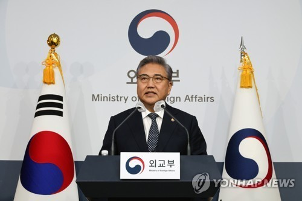
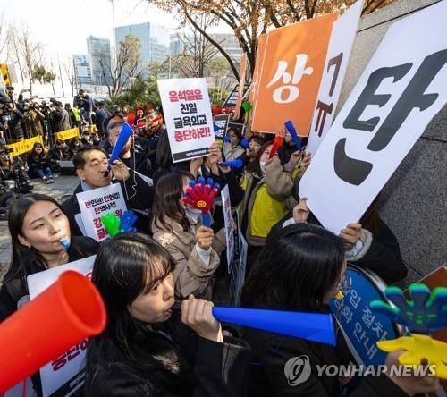

# 韩国公布二战劳工问题赔偿方案 在野党领袖：韩国外交史上最大的耻辱

（观察者网讯）据韩联社3月6日消息，韩国政府6日宣布，将由韩方基金会代为赔偿二战时期日本强征韩籍劳工的损失。报道称，由于被韩国最高法院判处赔偿的日方被告企业不参加筹资，这一方案能否解决到位受到质疑，部分受害劳工也表示强烈反对。

据韩国《中央日报》6日报道，韩国在野党共同民主党领导人李在明当日迅速发声抨击，称其为“外交史上最大的耻辱和污点”，并谴责“尹锡悦政府最终选择了背叛历史正义的道路”。一些进步活动人士则将该方案比作1910年日本吞并朝鲜。

_韩联社报道截图_

**韩国公布二战劳工问题赔偿方案：韩企“代赔”受害者**

3月5日，《读卖新闻》曾引述消息人士的话表示，日韩两国正在解决因二战期间强征韩籍劳工问题引发的争端，作为协商方案的内容，韩国将撤回在世贸组织的上诉，日本政府则取消对韩国关键半导体材料的出口限制。

随后，韩国外交部长官朴振6日在韩外交部举行“关于强征劳工案大法院判决的政府立场发布会”上，正式公布了韩国政府在征求国内各界意见和与日方谈判的基础上形成的第三方代赔方案。朴振表示，为了救济、援助受害劳工及遗属，韩国行政安全部下属日帝强制征工受害者支援基金会将出面代为支付2018年法院终审判决的赔偿金及拖欠利息。朴振解释说，目前压案未判的强征劳工对日索赔诉讼若终审判决原告胜诉，也将由韩方基金会向原告们如数支付赔偿金及拖欠利息。

_日帝强制征工受害者支援基金会
图源：韩媒News 1网站_

朴振还说，赔偿金将由民间自发捐赠等方法募集，今后将进一步拓宽基金会主要业务的资金来源。基金会已于1月修改章程，将“赔偿日本帝国主义强制劳务输出受害者及遗属的损失”纳入业务范围。据悉，首批赔偿金将由浦项制铁集团等1965年《韩日请求权协定》的约16家受益韩企自发捐赠。

2018年韩国最高法院终审判决胜诉的受害者共有15人，分别是日本制铁劳工、广岛三菱重工劳工和名古屋三菱的勤劳挺身队成员。另有等待韩国最高法院终审判决的9宗劳工索赔诉讼，以及在韩国已诉未判的多宗索赔诉讼。

_3月6日，在韩国外交部办公大楼，韩国外交部长官朴振正式公布第三方代赔方案
图源：韩联社_

据韩联社报道，对于坊间批评韩日谈判结果不保证日企参与赔偿，沦为“半拉子”工程，朴振称，让日本对历史问题重新谢罪并不是真本事，更重要的是让日本一以贯之认真履行以往表明反省道歉的官方谈话。朴振用水杯打比方说，现在杯里的水已经过半，今后如果日本拿出诚意，有望越来越满。韩日商界正在酝酿自发出钱出力，促进韩日两国面向未来发展关系。在他看来，日本政府也不反对民间企业自发参与筹款。

对有关韩国政府没有充分聆听受害方意见的质疑，朴振称，我们将继续当面向每一位受害者说明立场，征得理解。朴振还说，“许多遗属表示支持韩国政府的构想，也有不少遗属表明了希望尽早解决问题的意见。”

另外，就记者质疑韩国总统府施压促韩外交部尽早解决问题一事，朴振称，站在维护韩国国家利益的立场上看，韩国外交部和总统府是共同进退的同一个团队。

朴振还表示，为铭记劳工们被强征的苦楚和伤痛，并让未来一代继往开来，将积极支持受害者纪念事业，做实做大相关教育、调查、研究项目。朴振说，希望韩日两国共同努力，争取发展性地继承1998年10月发表的《21世纪韩日新伙伴关系共同宣言》（又称韩日共同宣言或金大中-
小渊惠三联合声明），克服不幸的历史，基于和解与睦邻友好的精神，发展面向未来的韩日关系。

朴振称，韩国最高法院判处索赔胜诉后，日本对韩国实施出口管制，韩国政府则通知终止《韩日军事情报保护协定》，此后新冠疫情爆发中断人员往来使韩日关系僵局被放任自流。近来朝鲜半岛、地区及国际局势异常严峻，韩国希望与共享市场经济、法治、人权等普世价值的最近邻邦日本一道，为两国的共同利益和地区及世界的和平繁荣而努力。

**日本“给予肯定”，允许日企自愿向韩国基金会捐款**

据日本朝日电视台6日报道，日本首相岸田文雄当天晚些时候就韩方公布二战劳工问题赔偿方案表示，“该措施旨在将日韩关系恢复至健全状态，日本政府对此表示赞赏”。岸田还补充称，“韩国是重要邻国，应该在应对各种各样国际问题时进行合作”，“有必要根据当前战略环境进一步加强日韩以及日美韩的战略合作”。

据日本广播协会6日报道，日本外相林芳正则称：“这是让日韩关系重返健康之举，给予肯定”。就韩方要求日方采取
"真诚的措施"一事，他表示，"日本政府从整体上继承了历届日本内阁关于历史承认的立场，包括1998年10月发表的《日韩共同宣言》"。

林芳正同时表示，对于日本公司自愿向韩国政府下属的基金会捐款，"政府不会采取任何特别的立场"，报道称，这实际上表示了允许的态度。

至于对韩出口管制强化措施，林芳正说："这是与'征用'问题分开讨论的。 我们正在寻求适当的措施，包括暂停由韩国发起的在WTO（世界贸易组织）的争端解决程序"。

日本内阁官房长官松野博一说：“在去年11月的日韩首脑会晤中，我们重申同意尽快解决悬而未决的问题，而且我们在外交当局之间继续进行了沟通。我们将与韩国政府保持密切沟通，以便在外交关系正常化以来建立的友好和合作关系的基础上，恢复和进一步发展两国的健康关系"。

关于日韩首脑会晤的日程，他回应称，“未来的外交日程尚未确定”。

此外，美国总统拜登当地时间5日发表声明，就韩国政府公布原被征劳工诉讼问题解决措施一事给予肯定，称“这将成为美国最紧密盟友相互合作的划时代的新篇章”。

_3月5日，象征二战时期被日强征韩籍劳工的铜像设在首尔龙山站广场。图自韩联社_

**韩在野党领袖：韩国外交史最大耻辱**

据韩国《中央日报》报道，韩国在野党共同民主党领导人李在明当日迅速发声抨击，称其为“外交史上最大的耻辱和污点”，并称“尹锡悦政府最终选择了背叛历史正义的道路”。

据报道，李在明表示，“政府当天发表了强征劳工赔偿方案，不是用日本战犯企业，而是用我国企业准备的财源进行赔偿，日本的道歉也只是重复现有谈话的水平”，“此举是对要求日方真诚道歉和赔偿的受害者的践踏和二次伤害，也是违背最高法院判决的暴行。”

李在明质问，“这个政府究竟是哪个国家的政府？”
他警告说：“韩国国民绝不会容忍这种屈辱的赔偿案”，并称“辜负民心意味着最终无法逃避审判”。他还表示，“共同民主党绝不会坐视任何为日本的战争罪行提供免罪符的企图，将与国民一起强力对抗。”

另据韩联社报道，该方案公布后，韩国公民团体聚集在首尔市中心的外交部大楼外，要求撤回该提案。

报道称，来自包括韩国工会联合会（KCTU）、韩国正义与纪念日本军事性奴役问题委员会和历史真相与正义中心在内的611个民间和劳工组织联盟的活动人士表示，他们不能接受任何没有相关日本公司的道歉和直接赔偿的解决强迫劳动争端的方案。进步活动人士朴锡恩（Park
Seok-un）在集会上说，“尹锡悦政府践踏了人民依法享有的权利，推动了亲日谈判，为日本公司开脱罪责。”

据报道，一些进步活动人士将该方案比作1910年日本吞并朝鲜，而另一些人则称其为明显的历史倒退。

_3月6日，反对该方案的韩国活动人士在首尔市中心的外交部大楼外举行抗议集会。图源：韩联社_

**日本将启动解除对韩出口管制强化措施的磋商**

据日本共同网报道，日本政府6日宣布将启动面向解除从2019年持续至今的对韩出口管制强化措施的双边磋商。

另据韩联社报道，韩国产业部贸易安全政策官姜甘赞6日在有关韩日限贸问题的记者会上表示，韩日两国决定在进行出口限制相关磋商期间暂停世界贸易组织（WTO）争端解决程序。

他表示，韩日两国政府为将两国出口贸易恢复至2019年7月之前的状态，决定迅速开展相关的双边磋商，并暂停世贸组织争端解决程序。据悉，日本政府将为此将举办韩日出口管理政策对话会议。

姜甘赞强调，这并非取消世贸组织争端解决程序，只是暂时中断。据报道，两国此前也曾中断过世贸组织争端解决程序。

据观察者网此前报道，2018年，韩国最高法院判处日本制铁（原新日铁住金）和三菱重工业公司向二战时期被强征劳工支付赔偿；日本则根据1965年签订的《日韩请求权协定》，主张被告企业没有赔偿责任，并拒绝道歉，日韩关系恶化。2019年7月，日本限制对韩出口高纯度氟化氢，这种用于蚀刻晶圆半导体关键材料，日本产能大约占全球产能的70%。同年8月，日本又把韩国踢出出口管理优待对象国。韩国随后宣布采取“应对措施”，并将此事告上世贸组织。

多位日本政府相关人士表示，尽管日本将对韩出口限制归因于“安全保障”方面的原因，但分析人士认为这是为了报复韩国在劳工问题上判决。

根据日本政府官员的说法，如果韩国在劳工问题上提出可以接受的处理方案，这将为解决两国争端铺平道路。此前，日本坚持要求在解除对韩出口限制前，韩国应当先行撤回在世贸组织的诉讼；但韩国方面认为，撤回诉讼应该与解除限制同步进行。

**本文系观察者网独家稿件，未经授权，不得转载。**

